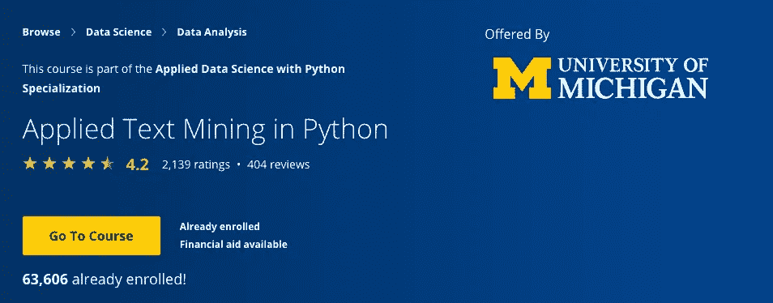

# Python 中的应用文本挖掘|密歇根大学

> 原文：<https://towardsdatascience.com/a-thorough-review-of-applied-text-mining-in-python-by-university-of-michigan-8a666725a0dc?source=collection_archive---------23----------------------->

## 包括本课程涵盖的知识，本课程的优点和缺点。

这不仅是一次复习，也是我自己学完这门课程后的一次学习总结。

# 获得本课程的证书后，你可以带什么回家

## 文本挖掘简介

*   涵盖的技术技能:python list、string.split()、string.lower()、s.startwith(t)、s.endwith(t)、t in s、s.isupper()、s.islower()、s.istitle()、s.isalpha()、s.isdigit()、s.isalnum()
*   其他字符串操作:比如:s.splitlines()、s.joint()、s.strip()、s.rstrip()、s.find()、s.rfind()、s.replace(u，v)
*   处理文本句子
*   将句子拆分成单词，将单词拆分成字符
*   寻找独特的单词
*   处理文档中的文本

## 正则表达式

*   如何用 python 写正则表达式:元字符:字符匹配，字符符号，重复
*   日期的正则表达式
*   什么是正则表达式？
*   正则表达式元字符
*   构建用于标识日期的正则表达式。

## 英语和 ASCII

*   文本的多样性
*   ASCII 和其他字符编码
*   在 UTF 处理文本-8

## 基础自然语言处理

*   nltk 的基本用法:如何使用 nltk 删除停用词，探索 NLTK 文本数据的功能。
*   规范化和词干化
*   词汇化
*   标记化
*   句子分割
*   词性标注提供了对句子中词类/类型的深入了解
*   分析语法结构有助于获得意思
*   这两项任务都很困难；语言歧义甚至增加了难度
*   更好的模型可以通过监督训练来学习
*   NLTK 为培训提供工具和数据

## 文本分类

*   文本分类的例子:主题识别、垃圾邮件检测、情感分析、拼写纠正
*   监督分类:二元分类、多类分类(当有两个以上可能的类时)、多标签分类(当数据实例可以有两个或两个以上标签时)。
*   使用 Sklearn 的朴素贝叶斯分类器
*   使用 Sklearn 的 SVM 分类器
*   Scikit-learn 中的型号选择
*   NLTK 中的监督文本分类
*   使用 NLTK 的 naive Bayes 分类器
*   使用 NLTK 的 SklearnClassifier

## 朴素贝叶斯和支持向量机(附案例研究)

*   朴素贝叶斯是一种概率模型，之所以命名为朴素贝叶斯，是因为它假定给定类标签的特征是相互独立的
*   支持向量机往往是最准确的分类器，尤其是在高维数据中
*   强大的理论基础
*   仅处理数字特征:将分类特征转换为数字特征，规范化
*   难以解释的超平面

## 从文本中识别特征

*   文本特征的类型:单词、单词的特征、句子中单词的词性、二元模型、三元模型、n 元模型

## 主题建模和 LDA

*   什么是主题建模
*   在 Python 中使用潜在狄利克雷分配(LDA)
*   LDA 是一种广泛用于建模大型文本语料库的生成模型
*   LDA 也可以用作文本分类和其他任务的特征选择技术

## 语义文本相似度

*   语义相似性的应用:将相似的词组合成语义概念，文本蕴涵，释义
*   使用 WordNet 的语义相似度
*   路径相似性，链接相似性，分布相似性:上下文
*   寻找单词和文本之间的相似性并不容易
*   WordNet 是单词间语义关系的有用资源
*   存在许多相似性函数
*   对于许多这样的任务，NLTK 是一个有用的包

## 信息提取

*   信息抽取对于自然语言理解和理解文本数据非常重要
*   命名实体识别是解决许多高级 NLP 任务的关键构件
*   命名实体识别系统广泛应用了本课程中讨论的监督机器学习和文本挖掘技术

## 本课程的优点:

我想说，这门课程几乎涵盖了所有必要的知识和应用的文本挖掘的人谁想要应用文本挖掘到现实世界；正如这个课程的名字所暗示的，它是为想要申请的人准备的。

此外，它还包含了课堂幻灯片中的 sudo 代码和课程中的好作业。对我来说，边做边学永远是最好的学习和记忆方法，如果不练习，我会在几天内忘记我所学的东西。

## 这门课程的缺点是:

如果我一定要说这门课不好的话，我会说它太基础了，没有涵盖 NLP 中的任何高级知识和技能，甚至没有简单介绍神经网络中的 NLP。从我的角度来看，教师可以介绍关于 NLP 任务的迁移学习，或者 NLP 中的其他高级技术，如果学生想探索更多，可以提供一些参考。

另一件事是，这门课程教授多分类器的用法，但只详细教授朴素贝叶斯，根据我的经验，朴素贝叶斯分类器通常性能很差，而**随机森林分类器**总是有很好的性能，但讲座甚至没有提到它，这是不恰当的，因为这门课程是应用文本挖掘；或者也许这个球场是太多年前设计的，**它需要更新**。

总的来说，我会给一个 4-4.5 之间的分数，也许 4.25 是合适的。

但是如果你是文本挖掘的新手，这个课程对你来说值 5 星。

如果你想在 Coursera 上上这门课之前浏览一下这门课，可以在我的 GitHub 中找到这门课的 [git repo。](https://github.com/lipengyuan1994/Data-Science-Learning-Repository)