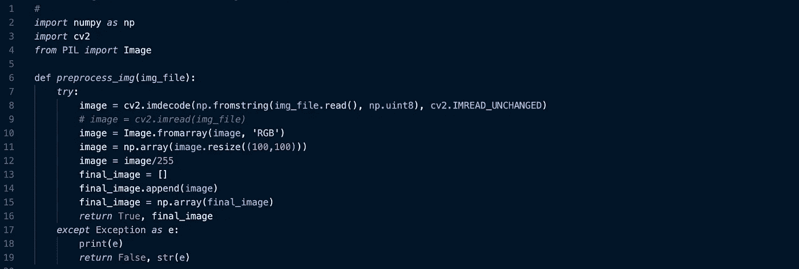

# 部署机器学习模型的一千种方法——人工智能

> 原文：<https://towardsdatascience.com/a-thousand-ways-to-deploy-machine-learning-models-part-1-652b59ab92ae?source=collection_archive---------26----------------------->

“如果不部署到生产中，机器学习模型有什么用？”——匿名


Image from [Pluralsight](https://www.pluralsight.com/courses/tensorflow-aws-azure-gcp-deploying-models)

您在构建令人敬畏的 99%精确的机器学习模型方面做了大量工作，但是大部分时间您的工作都是在没有部署的情况下完成的。大多数时候，我们的模型会与现有的网络应用、移动应用或其他系统集成。那么，我们如何实现这一目标呢？

我说一千，我想我只有几个。我猜你会在通过前两三关之前找到适合你的。或者你认为还有更多？一定要让我知道，让我们看看是否能得到一千😄。

让我们开始，我们如何部署机器学习模型或与其他系统集成？

# 1.通过人工授精

这包括通过应用编程接口(A.P.I)使您的模型可访问。

首先，我将部署一个由 [Rising Odegua](https://medium.com/u/10cf0dba197a?source=post_page-----652b59ab92ae--------------------------------) 构建的深度学习模型来对疟疾细胞进行分类。该笔记本可在此找到-[https://github . com/risen w/Disease _ classifier/blob/master/model _ training _ files _ and _ output/notebooks/疟疾-cells-classification-DSN-海报. ipynb](https://github.com/risenW/Disease_classifier/blob/master/model_training_files_and_output/notebooks/malaria-cells-classification-dsn-poster.ipynb)

然后我还将部署一个由[阿米努·伊斯雷尔](https://medium.com/u/985e503f2ec5?source=post_page-----652b59ab92ae--------------------------------)构建的简单的尼日利亚电影评论分类器模型。该笔记本可在此处找到—[https://github . com/AminuIsrael/NLP-movie-review-model/blob/master/main . ipynb](https://github.com/AminuIsrael/NLP-movie-review-model/blob/master/main.ipynb)

## 通过 A.P.I 部署深度学习模式

在构建和测试您的深度学习模型之后，下一步要做的就是保存您的模型。这可以简单地通过添加这一行代码来完成

```
cnn_model.save('model_name.h5')
```

您可以将保存的模型移动到您的 A.P.I 代码可以访问的文件夹中。我将使用 Flask 进行部署，但是可以使用 Django、Starlette 或任何其他 python 框架。这是我的文件夹结构-


来到我们的 A.P.I 文件夹(由 Flask 提供动力)，您首先要做的是安装需求。我在 requirements.txt 中保存了需求


您可以简单地通过在您的终端中运行它来安装这些需求

> pip install -r requirements.txt


Import required packages

正如我们在将图像传递给神经网络进行训练之前对其进行预处理一样，我们也将对通过 A.P.I 端点采集的所有输入图像进行预处理。

在第 8 行，我们通过 A.P.I 端点将图像收集转换为一个数组。你会注意到你在一个标准上所做的有一点点不同，这仅仅是因为 [Flask 的数据存储](https://werkzeug.palletsprojects.com/en/0.15.x/datastructures/#werkzeug.datastructures.FileStorage)。使用第 9 行的代码在 Django 这样的框架上也可以做到这一点，或者从机器上的一个路径加载。



从第 10–15 行我们得到了图像的 RBG 版本，将图像的大小调整为 100x100，并将图像转换为 numpy 数组。我们还将我们的图像缩放到范围[0，1]，如果没有错误发生，返回一个包含 *True* 的元组和一个包含我们图像的数组。


上面的图像显示了执行魔术的功能。

第 26 行仅仅意味着当调用“classify”端点时，将执行函数“classify_malaria_cells”。

在第 29 行，我们检查请求是否包含图像文件。然后，我们使用创建的辅助函数对图像进行预处理。

可以使用加载保存的模型

```
*from* keras.models *import* load_model# *OR*# *from tensorflow.keras.models import load_model*malaria_model = load_model(MODEL_PATH)
```

从第 34 行到第 39 行，我们加载了保存的模型，执行预测以确定图像的类别，并获得预测的准确度分数。在第 40 行，来自模型的结果被保存在一个 *python* *字典*中，该字典将在第 60 行作为 JSON 响应被发送回来。

我们以下面的话结束我们的 A.P.I:

```
*if* __name__ == “__main__”:flask_app.run(port=8080, debug=False, threaded=False)
```

这样，我们成功地构建了我们的人工智能，并准备好部署到任何云平台。

## 部署到谷歌云

1.  创建一个谷歌云账户—[https://cloud.google.com/](https://cloud.google.com/)
2.  创建一个新的谷歌云平台项目。您可以在这里按照步骤[进行](https://cloud.google.com/appengine/docs/standard/python3/building-app/creating-gcp-project)
3.  在您的终端中找到这个 flask 项目的根目录并运行:`gcloud app deploy`

**我还添加了一个 ***Procfile*** 用于部署到 [Heroku](https://www.heroku.com/) ，只需按照这里[的步骤](https://devcenter.heroku.com/articles/getting-started-with-python)进行部署即可。

## 通过人工智能部署机器学习模型

这与深度学习模型几乎相同。然而，在这里保存您的模型是完全不同的。你可以保存你的模型，使用—

```
import pickleFILENAME = 'filename.pkl'pickle.dump(trained_model, open(FILENAME, 'wb'))
```

或者

```
import joblibFILENAME = 'filename.joblib'joblib.dump(trained_model, FILENAME)
```

建议使用 **joblib** 来保存模型，而不要使用 **pickle** ，因为它在内部带有大型 numpy 数组的对象上效率更高。

正如我们对深度学习模型所做的那样，将您的模型保存在 Flask A.P.I 代码可访问的文件夹中。这是我的文件结构的样子


File structure for movie review A.P.I using Flask

我们这里的要求有点不同。


Requirements for running the Flask A.P.I for movie review

您可以简单地通过在您的终端中再次运行来安装这些需求。

> pip 安装-r 要求. txt

接下来，我们将导入所需的模块并初始化一些变量。


import required modules


Helper function for tokenization

在上面的 helper 函数中，我们将句子拆分成单词，删除了从第 10 行的 pickled 文件中加载的停用词。在第 18 行，一个[哈希矢量器](https://scikit-learn.org/stable/modules/generated/sklearn.feature_extraction.text.HashingVectorizer.html)被用来将单词标记成一个矩阵。这是一个 *scipy.sparse* *矩阵的输出。*


我们的影评将采用文本格式。在第 24 行，我们检查所需的表单数据是否已经发送，然后我们给第 25 行的表单数据分配一个变量名。在第 28 行，我们用 **pickle** 打开并加载了我们的电影评论分类器(你可以用 **joblib** 实现同样的功能)。在第 29–36 行，我们将矢量化的电影评论传递到我们的电影评论分类器进行预测，计算预测概率得分，并创建 python 字典来传递我们的预测结果。然后输出在第 47 行作为 JSON 响应发送回来。

我们已经成功建立了一个电影评论分类 A.P.I，并准备部署到任何云平台。我还添加了一个配置文件，用于部署到[谷歌云](https://cloud.google.com/)和 [Heroku](https://www.heroku.com/) 。

这些都是通过人工智能进行的模型部署。您可以在这里归档本文中使用的代码—[https://github.com/Emmarex/AThousandWaysToDeployModels](https://github.com/Emmarex/AThousandWaysToDeployModels)

在我的下一篇文章中，我将分享如何使用 TensorFlow Lite 将机器学习模型部署到应用程序中。

感谢阅读👍