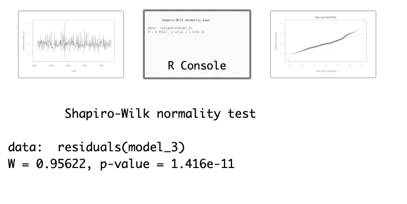

# 利用 SARIMA 模型预测伊利湖的时间序列

> 原文：<https://towardsdatascience.com/a-time-series-analysis-of-lake-erie-from-1921-to-1970-using-a-sarima-model-b79698df4762?source=collection_archive---------33----------------------->

## 数据科学:时间序列

## 模型选择、比较、诊断和预测的管道


Photo by [Nick Saxby](https://unsplash.com/@nicksaxby?utm_source=unsplash&utm_medium=referral&utm_content=creditCopyText) on [Unsplash](https://unsplash.com/s/photos/erie?utm_source=unsplash&utm_medium=referral&utm_content=creditCopyText)

## **执行摘要:**

*   构建了一个**季节性** **自回归综合移动平均** ( **SARIMA** )模型来追踪五十年来伊利湖的月水位。
*   提供了使用以下技术选择时间序列模型的管道:频谱分析、差分、AIC、PACF 和各种稳健性检查。
*   在与真实数据交叉验证后，该模型准确地预测了结果。


Photo by [Aron Visuals](https://unsplash.com/@aronvisuals?utm_source=unsplash&utm_medium=referral&utm_content=creditCopyText) on [Unsplash](https://unsplash.com/s/photos/time-series?utm_source=unsplash&utm_medium=referral&utm_content=creditCopyText)

与其他类型的统计模型不同，时间序列模型假设相关的观察值，并以一种有意义的方式论证昨天对今天的影响。在这篇文章中，我训练了一个 SARIMA 模型来预测伊利湖每月的水位。我将介绍整个流程，解释要做什么以及为什么要这样做。

1.  **加载、清理和转换数据集**

```
#load the raw dataset
mydata<-read.csv(“monthly-lake-erie-levels-1921–19.csv”)
mydata_new<-mydata[-601,]#remove the last blank row
Lake_Erie_Levels_ts<-ts(mydata_new$Monthly.Lake.Erie.Levels.1921…1970,frequency = 12,start=c(1921,1))#turn into a TS model
# Plot the Dependent Variable
plot(Lake_Erie_Levels_ts,xlab=”Date”,ylab=”Levels”,
 main=”Figure 1: Monthly Lake Erie Levels from 1921 to 1970")
```


作为经验法则，我们应该关注原始数据的异常值、趋势、季节性和明显的不连续性。

从**图 1** 来看，数据点在一定范围内上下移动，暗示恒定方差。

平均值沿着水平线(时间)每 12 个滞后有规律地移动，表明一个循环模式。我们将进行光谱分析来确定确切的季节性。

没有明显的间断。

**2。初步准备:数据分割并检查季节性和平稳性**

让我们把数据分成两组:训练和测试。

```
#We train a model using 90% of the data, aka. 1921.01–1965.12
training = window(Lake_Erie_Levels_ts,start=c(1921,1), end=c(1965,12))
#10% for the test set, aka. 1966.1-1970.12
test = window(Lake_Erie_Levels_ts,start=c(1966,1), end=c(1970,12))#test: 1966.1–1970.12; 10% as the test
```

让我们应用光谱分析来确定季节性。

```
install.packages(“TSA”)
require(TSA)
periodogram(Lake_Erie_Levels_ts);abline(h=0);axis(1,at=0.084)
```


光谱分析显示周期为 1/0.084 ≈11.9，非常接近 12。

我们决定季节性是 12，这是有意义的，因为我们有月度数据。

```
library(tseries, quietly = T)
adf.test(training)

	Augmented Dickey-Fuller Test

data:  training
Dickey-Fuller = -2.0622, Lag order = 8, p-value = 0.552
alternative hypothesis: stationary
```

为了测试平稳性，我们进行了一个扩展的 Dickey-Fuller 测试。

事实证明，数据不是静止的。

所以，让我们用差分来使数据稳定。从第一个差异开始:

```
training_diff1 <- diff(training,1)
ts.plot(training_diff1,ylab= expression(paste(nable,y)))
var(training_diff1)
adf.test(training_diff1)
```


太好了！数据集现在是静止的。随着时间的推移，平均值稳定下来，只有几个显著的峰值。

打安全牌，让我们检查一下是否有必要进行二次差分。

```
training_diff2 <- diff(training,2)
var(training_diff2)
adf.test(training_diff2)
```


在第二次差分后，模型仍然是稳定的，但方差增加，这表明过度差分。

**3。模型构建和选择**

```
library(PerformanceAnalytics)
chart.ACFplus(training_diff1, maxlag = 84, elementcolor = “black”)
```


为了确定滞后之间的潜在关系，我们在第一次差分后绘制 ACF 和 PACF 图。

这两幅图显示了强烈的季节性因素，因为 ACF 会定期死亡。换句话说，我们需要包括季节性因素。

```
training_diff1_seasonal12<-diff(training_diff1,12)
plot.ts(training_diff1_seasonal12)
chart.ACFplus(training_diff1_seasonal12, maxlag = 84, elementcolor = “gray”)
```


它在 1940 年前后变得稳定，只有几个峰值。

基于 ACF 和 PACF 模式，我们初步提出了以下季节性模型:

> *1。ACF 在滞后 1 后截止& PACF 拖尾→ SMA(1)，或者 P=0，Q=1。
> 2。在滞后 12 处的 ACF 峰值& PACF 随季节滞后在 12、24、36 和其他处指数衰减→ SMA(1)，或 P=0 和 Q=1。
> 3。ACF 和 PACF 都有季节性滞后→ SARMA(3，1)，或者 P=3，Q=1*

非季节性车型:

> 1.PACF 在滞后 1 → AR(1)后截止，或者 p=1，q=0
> 2。PACF 在滞后 1 之后切断& ACF 在滞后 1 之后切断→ p=q=1
> 3。PACF 在滞后 3 之后切断& ACF 在滞后 1 之后切断→ p=3，q=1

总的来说，我们列出了以下 6 款包含季节性和非季节性成分的潜在车型:

1.  模型 1: SARIMA(1，1，0)*(0，1，1)12
2.  模型 2: SARIMA(1，1，1)*(0，1，1)12
3.  模型 3: SARIMA(3，1，1)*(0，1，1)12
4.  模型 4: SARIMA(1，1，0)*(3，1，1)12
5.  模型 5: SARIMA(1，1，1)*(3，1，1)12
6.  模型 6:萨里玛(3，1，1)*(3，1，1)12

**4。型号对比**

```
########### use auto.arima to find the best model automatically
library(forecast)
model_auto= auto.arima(training, stepwise=FALSE, approximation=FALSE)#**this function takes a lot of time to run!!!!** summary(model_auto)#ARIMA(1,1,2)(2,0,0)[12] with AIC=670.27 AICc=670.45 BIC=695.31###### auto selection 
model_auto_1= auto.arima(training)
summary(model_auto_1)# ARIMA(1,1,0)(2,0,0)[12] with AIC=672.23 AICc=672.31 BIC=688.91
```

内置函数( **auto.arima** )生成一个模型作为参考点，与手动选择的模型进行比较。

```
model_1 = arima(training, order = c(1,1,0),seasonal = list(order=c(0,1,1),period =12));model_1#AIC=553.74
model_2 = arima(training, order = c(1,1,1),seasonal = list(order=c(0,1,1),period =12));model_2#AIC=555.48
model_3 = arima(training, order = c(3,1,1),seasonal = list(order=c(0,1,1),period =12));model_3#AIC=548.71model_4 = arima(training, order = c(1,1,0),seasonal = list(order=c(3,1,1),period =12));model_4#AIC=556.94
model_5 = arima(training, order = c(2,1,1),seasonal = list(order=c(3,1,1),period =12));model_6#AIC=558.24
model_6 = arima(training, order = c(3,1,0),seasonal = list(order=c(3,1,1),period =12));model_7#AIC=553.14
```

我们运行这六个函数并获得 AIC 结果。模型 3 似乎是赢家，这与 ACF/PACF 提出的结果一致。

**5。型号诊断**

```
ts.plot(residuals(model_3))# a few spikes observed.
# normality check
shapiro.test(residuals(model_3))
qqnorm(residuals(model_3));qqline(residuals(model_3),col =”blue”)#skewed to the right as can be seen from the distribution that a few data points stand above the abline.
```



根据夏皮罗-维尔克正态性检验和 Q-Q 图，残差不是正态分布的。

```
chart.ACFplus(residuals(model_3), maxlag = 48, elementcolor = “gray”)
```


从 ACF 和 PACF 图来看，大多数残差点都落在 95%的置信区间内，只有几个显著的峰值。残差遵循白噪声模式。

```
Box.test(residuals(model_3),lag=22,type = c(“Ljung-Box”),fitdf=4) Box-Ljung test

data:  residuals(model_3)
X-squared = 23.657, df = 18, p-value = 0.1666
```

残差在通过 Ljung-Box 检验后通过线性相关性检验。

```
#install.packages(“GeneCycle”)
library(“GeneCycle”)
fisher.g.test(residuals(model_3))[1] 0.436583
```

经过费希尔检验后，残差服从高斯白噪声分布。

**6。预测**

```
mypred <- predict(model_3, n.ahead=120)
Upper_tr = mypred$pred + 1.96*mypred$se
Lower_tr = mypred$pred — 1.96*mypred$se
ts.plot(training, xlab=”Year”,ylab=”Level”,main = “Forecast”)
lines(Upper_tr,lty=2,col=”gray”)
lines(Lower_tr,lty=2,col=”gray”)
points(mypred$pred,col=”blue”)
lines(test,col=”red”)#plot test data
```


灰色虚线是 95%的置信区间，红色线是真实的数据输入。所有预测点(蓝色)都落在 95%的置信区间内，并与真实数据紧密一致。

一个极好的预测！

我希望你们已经学到了一些关于时间序列的新知识。这种类型的模型对于研究涉及时间和空间的问题非常有帮助。

查看我的其他帖子。

1.  **机器学习:**

*   [分类罕见事件](/classifying-rare-events-using-five-machine-learning-techniques-fab464573233?source=friends_link&sk=f015318a6eb37b81a33b5dc004ee4be3)
*   [基因表达如何与白血病类型相关利用主成分分析和系统聚类](/how-gene-expression-related-to-leukemia-type-using-pca-and-hierarchical-clustering-c8561303853a?source=friends_link&sk=6af4bc01baf5ee591f025ac157d4e863)

**2。数据科学:**

*   [项目评估](/a-data-scientists-journey-into-program-evaluation-78cffa5b2ccc?source=friends_link&sk=3a514afe4132455b65d7fafc0e340087)
*   实验与因果推断:[双向因果](/the-chicken-or-the-egg-experiments-can-help-determine-two-way-causality-723a06c37db7?source=friends_link&sk=bf81920d68b1f3a31a713e01cde63688)，[为什么要实验？](/why-do-we-do-and-how-can-we-benefit-from-experimental-studies-a3bbdab313fe?source=friends_link&sk=e4dd9618d2d4f94cc222ecf20cb9ff61)、[陷阱](/experiments-can-be-dangerous-if-you-fall-into-these-pitfalls-c9851848f3ee?source=friends_link&sk=928c62169bb0a768c7a124fc82d6a5fc)、[因果关系 vs 相关性](/the-turf-war-between-causality-and-correlation-in-data-science-which-one-is-more-important-9256f609ab92?source=friends_link&sk=10169c40b1a6077758385525f22f405d)

**3。关于生活:**

*   [内向者如何社交](https://medium.com/the-ascent/introverts-network-c6ead5bd698b?source=friends_link&sk=f69a2127420c08d62118be5da20746b7)

[](http://www.linkedin.com/in/leihuaye)[](https://twitter.com/leihua_ye)

Photo by [Alexa Gaul](https://unsplash.com/@lexigee?utm_source=unsplash&utm_medium=referral&utm_content=creditCopyText) on [Unsplash](https://unsplash.com/s/photos/time-series?utm_source=unsplash&utm_medium=referral&utm_content=creditCopyText)