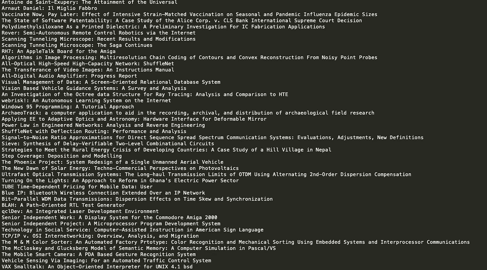
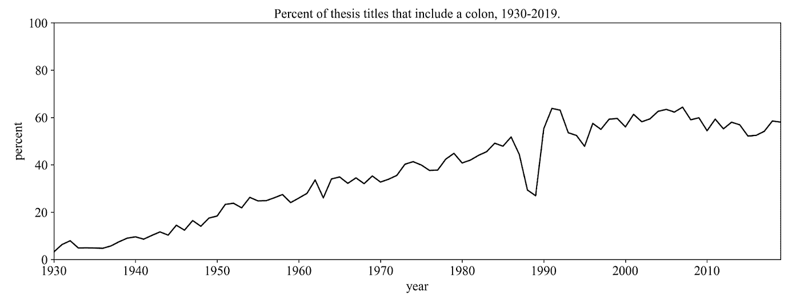
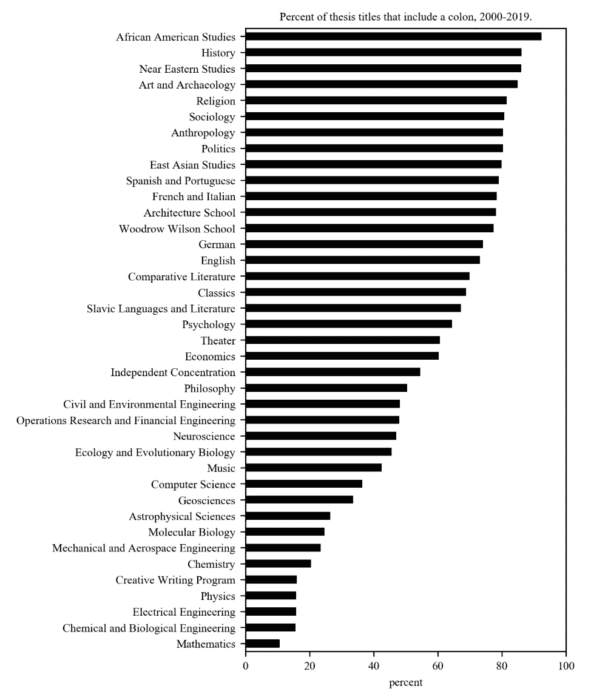

# 老生常谈:半数普林斯顿论文在标题中使用冒号。

> 原文：<https://towardsdatascience.com/a-tired-clich%C3%A9-half-of-princeton-theses-use-a-colon-in-their-title-a099735a9150?source=collection_archive---------29----------------------->

## 在一些部门，这个数字高达 85%。

几乎每个普林斯顿的毕业生——从参议员特德·克鲁兹到最高法院大法官埃琳娜·卡根，从女演员波姬·小丝到美联储杰罗姆·鲍威尔主席——都写过毕业论文。所有这些毕业生还使用了困扰近一半普林斯顿论文的有名无实的习语:冒号。

*   Cruz '92 —“剪去天使的翅膀:美国宪法第九和第十修正案背后的历史和理论”
*   卡根 81 —“走向最后的冲突:纽约市的社会主义，1900-1933”
*   希尔兹 87 —“成长:从天真到经验:路易·马勒电影中的青春期前/青春期之旅，‘漂亮宝贝’和‘拉科姆·吕西安’”
*   鲍威尔 1975—“南非:变革的力量”

普林斯顿大学的论文数据库列出了近 7 万个题目，从 1926 年第一次建立高年级论文到今年 6 月毕业的高年级学生。我们可以使用这个庞大的数据集来发现名义上的殖民性(是的，实际上有一个术语)是如何开始的。

在整个数据库中，带有冒号的论文标题的数量是 43 %,但是随着时间的推移，这个数字急剧增加。这种趋势慢慢地建立了人气，直到 20 世纪 80 年代后趋于平稳。

在 1987 年和 1990 年之间有一个大的下降，但是在数据中似乎没有任何明显的原因。院系之间没有重大变化，入学人数也没有大幅增加。我联系了辛西娅·爱迪生，她是普林斯顿大学的校友(也是结肠使用者)，在 1989 年写了论文。她说这是第一年所有的论文都是通过文字处理器而不是打字机来完成的。她认为，可能在学生使用的键盘上更难找到冒号，就像在现代键盘上找到外国字符一样——很难，但并非不可能。

Note: For clarity, “Romance Languages and Literatures” was combined with “French and Italian”, “East Asian Studies Program” was combined with “East Asian Studies”, and “Global Health and Health Policy Program” was combined with “Woodrow Wilson School”.

撇开后勤因素不谈，学术部门之间有很大的分歧。与人文学科相比，STEM 字段包含冒号的可能性要小得多。数学最低，为 10.6%，非洲裔美国人研究最高，为 92.3%。

然而，应该注意的是，一些学位的论文很少(非洲裔美国人研究是一个新项目，只有 13 篇，斯拉夫语言和文学只有 61 篇)，因此更容易成为离群值。由于从 2000 年到 2019 年，超过 1700 篇论文在历史系下存档，我们应该更有信心，其中 86.1%的论文使用了挂名冒号来表征该学科。

冒号使用率最低的非词干类是音乐，占 42.5%。使用冒号最多的专业是心理学，占 64.4%。

一些前辈使用了多个冒号(例如“颜色:从装饰到大气:重新定义颜色在当代建筑中的作用。”)的记录？2003 年英语系的一篇 7 个冒号的论文题目“the:杂项:杂集:of:20 世纪:先锋-前卫:诗人。Pages.and.Books”。然而，像这样的例子并不常见，超过一个冒号的论文占数据库的比例不到 0.5%。

在所有包含冒号的三万个标题中，最常见的是在冒号前找到三个单词，在冒号后找到六个单词。

这对于学术界整体来说能说明什么？虽然这个数据库仅限于一所大学的原始论文，但这些数字与学术期刊上的数据高度相关也不是不可能的(分析是可能的，但数据集不太干净)。重要的是要考虑到普林斯顿的高年级学生正在有效地扮演一个学者的角色。他们可能会模仿，甚至夸大他们所阅读的文学作品中的趋势。

20 世纪 80 年代，教育、心理学和文学批评领域也进行了类似的分析。这项研究的作者赞扬了习语的多产使用，认为它的受欢迎程度表明了“学术事业的渐进复杂性”将近 40 年后，我们还能提出同样的论点吗？

*有问题吗？评论？联系我，查看更多项目在* [*我的网站*](http://www.kmcelwee.com) *。*