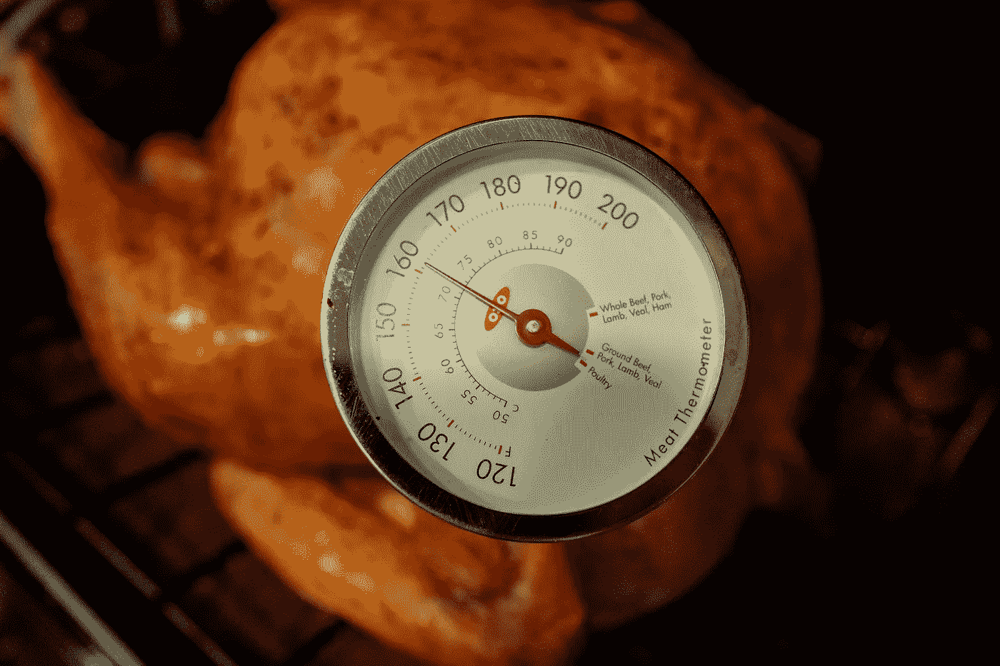
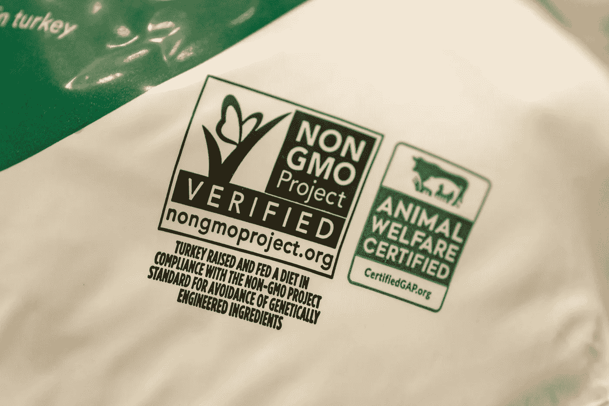
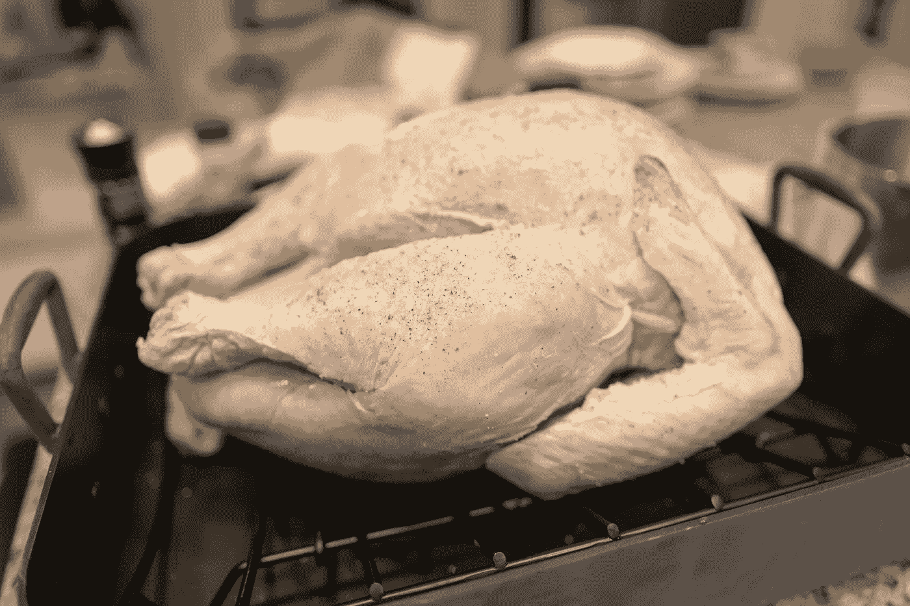
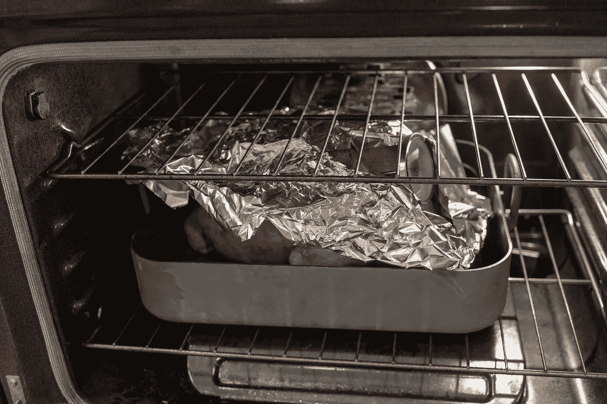
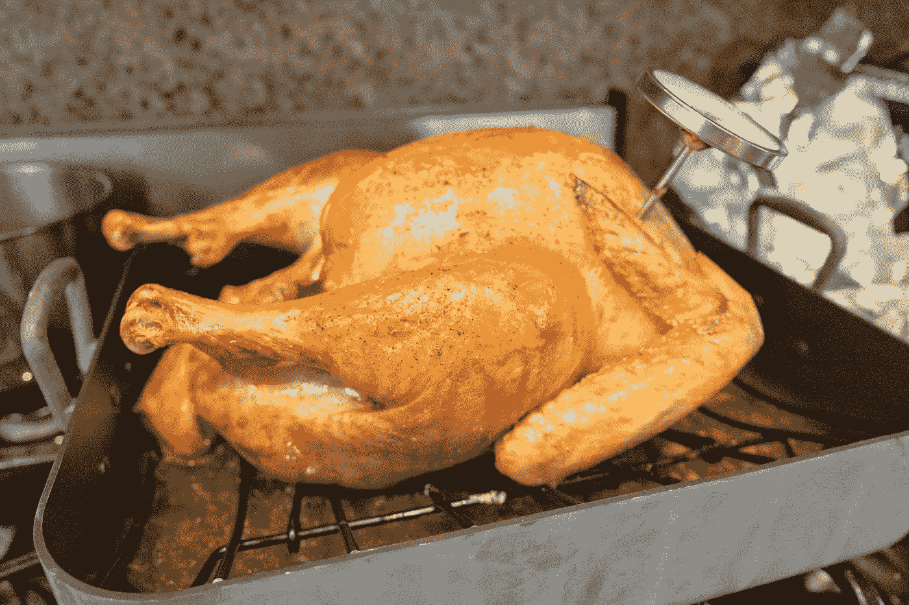
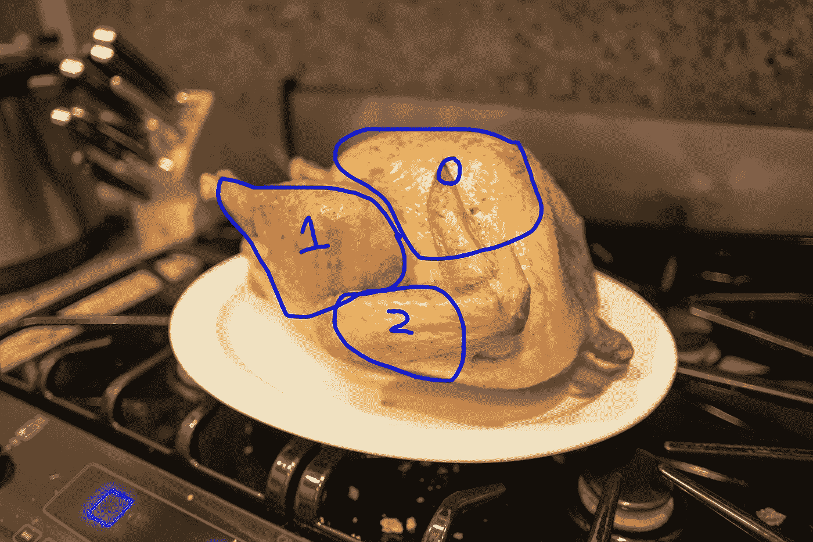
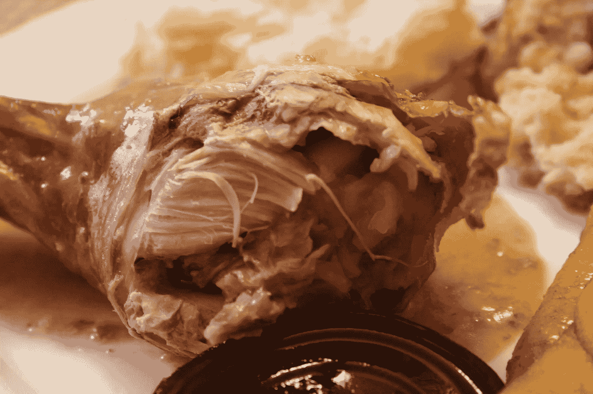

# 极客的火鸡算法

> 原文：<https://towardsdatascience.com/a-turkey-algorithm-for-geeks-f2bfda10d3f2?source=collection_archive---------26----------------------->

## 正常人称之为“配方”



Credit: Gado Images

勇敢地自愿烹饪今年的感恩节火鸡(或者被拉去做)？感觉被 YouTube 上接二连三的美食博客和美食网络剪辑淹没了吗？

不要！烹饪就是设计一套预先确定的步骤，并按照这些步骤进行测量，根据对当前条件的评估决定不同的行动。

简而言之，这是一种算法(尽管它是用死动物和火而不是 R 实现的)。你对算法很在行！

这是给你的感恩节火鸡的。让我们开始吧。

## 基本原理

感恩节火鸡有一些依赖。确保你先把这些准备好。你需要一个烤箱，一个烤盘，铝箔，一把锋利的刀和一个烤箱安全肉类温度计。亚马逊是你的朋友，当地的 Safeway 也是。至于平底锅，便宜的铝制的就可以了。理想情况下，你既要平底锅，又要能把火鸡从底部抬高一点的东西，比如铁丝架。

接下来，你需要火鸡本身。如果你在感恩节前一天读到这篇文章，你可能已经太迟了。由于在如此紧迫的时间内将如此多的死鸟运送给如此多的人的经济原因，大多数感恩节火鸡都是冷冻的。



A Whole Foods turkey. Credit: Gado Images

它们是巨大的鸟类——解冻一只需要几天。所以，要么买一个已经解冻的(称为新鲜的)，要么买一个冷冻的，让它在冰箱里放几天。

想知道体重吗？一般人一次吃大约 1/2 磅肉。但是火鸡并不是 100%高效的——它们的大部分物质都是不可食用的部分，比如骨头。所以，把你想要的可食用的肉的质量加倍。对于 7-10 个人来说，选择 15-20 磅的鸟。

还有，记得拿那个肉类温度计。有些人认为他们可以通过外表来判断火鸡熟了没有。他们是傻瓜，他们的客人会感染沙门氏菌。测量，测量，测量！

## 实例化

在早上，从你想要的服务时间开始向后计划。平均来说，每磅火鸡需要 20 分钟来烹饪。所以把你火鸡的重量乘以 20，除以 60，然后从你想要的服务时间中减去这个数字(你用的是 24 小时制，对吗？).那就是你想要开始的时候——也许增加一个小时的缓冲时间。

拿出你的烤盘，打开你的火鸡。出于某种原因，火鸡供应商把火鸡的内脏放在一个小塑料袋里，他们把这个塑料袋放在火鸡里面，可爱地称之为“内脏”，而不是“火鸡内脏小袋”。把这个拔出来。

## 执行

把你的火鸡胸肉放在烤盘里，最好放在小架子上。请参见下图，了解正确的方向。将烤箱温度设置为 176 摄氏度(不，我不会为你转换温度)。当它发出哔哔声时，把火鸡放进锅里。设置一个 30 分钟的计时器。



This side up. Credit: Gado Images.

你的目标是将火鸡的内部温度从起点提高到至少 71 摄氏度(好吧，为了安全起见，我将把这个温度转换为 160 华氏度)。这有几个原因。

第一，你想使火鸡肌肉中的蛋白质变性。生肉难以接受地难以咀嚼，因为肌肉纤维是完整的。使它们变性会使它们变得柔韧，更容易咀嚼。本质上，你是在上菜前使用外部热源来消化火鸡(你不应该用这种语言向你的客人描述它。)

此外，170 华氏度足以杀死大多数细菌。家禽是肮脏的——你的生火鸡上有足够多的沙门氏菌、大肠杆菌和其他有害物质，足以让最大胆的生物黑客感到紧张。这也带来了另一个问题。每次接触生火鸡后都要洗手，还要清洗餐具和表面。交叉污染会毁了你的一天。

现在，你进入了一个 While 循环。每 30 分钟，打开烤箱检查一下火鸡。最初，你只是想确保它没有燃烧。在 i == 1 (1 小时)时，拿起你的肉温度计，把它插入火鸡胸部的厚部位。温度应该会立即下降。把它放在那里，然后把整个东西放回烤箱。

每隔 30 分钟，检查一下火鸡的温度。它应该会随着时间的推移而上升。

## 排除故障

当你的火鸡在烹饪时，你会注意到表皮开始变成棕色。这是由于美拉德褐变反应，这种反应从火鸡皮肤中的糖和氨基酸中释放出美味的芳香物质。你希望这一切发生。Maillards =风味。

然而，你不想要的是从邮件地址到碳化(阅读:燃烧)。原始形态的碳不好吃。

一旦你的火鸡变成漂亮的金棕色，用铝箔包起来。



Radiation blocking foil. Credit: Gado Images.

为什么？烤箱有三种方式将热量传递给里面的东西:**对流、辐射和传导**。

对流是热量从烤箱里的热空气传递给你的鸟。它很温和，你希望整个烹饪过程都是这样。

辐射有点不一样；这是热量从烤箱的热金属壁传递到里面的火鸡。很好，但比对流更严酷。任其发展下去，会烧死你的鸟。

用铝箔覆盖火鸡可以反射烤箱壁散发的热量，同时还能让暖空气对流发挥它的魔力。它可以让你的火鸡烹饪，没有碳化皮肤的风险。

哦，还有传导？那是热量从热金属表面直接传递到火鸡本身。还记得你希望包括的那个钢丝架吗？它将火鸡从热烤盘上提起，通过减少与热金属接触的表面积，几乎切断了过程的传导。

如果你闻到烧焦的味道，火鸡的汁液可能会滴落到平底锅上，并立即碳化。往锅里倒一点水，降低表面温度，防止这种情况发生。

## 评估和停止条件

每次检查时，你应该看到火鸡的内部温度上升。当温度达到至少 160 华氏度时，你的火鸡就做好了！



Maillards complete. Credit: Gado Images.

请记住，烹饪是指数型的-内部温度在开始时会缓慢上升，然后在接近尾声时迅速上升。当温度接近临界点时，你可能需要每 10 分钟检查一次。

当你达到 160 华氏度时，拿出温度计，在火鸡的其他几个地方刺一下。火鸡身体上的肌肉分布并不均匀——一些部位的肉比其他部位多，你要确保你不是从一个薄的部位开始测量的。如果一切都是 160F+，你很好。我喜欢烹饪到 170 华氏度，只是为了确保整个事情最终超过 160 华氏度。

将火鸡从烤箱中取出，转移到一个浅盘中，并将温度计留在里面。它现在可以在你等待你的客人时一直坐着，通常是一个小时或更长时间。监控内部温度，确保温度不会低于 140 华氏度——如果温度低于 140 华氏度，就有细菌重新繁殖的风险。如果需要，你可以把它放回温度较低(170 华氏度)的烤箱里保温。

## 生产:肌红蛋白还是没有？

现在有趣的部分来了——雕鸟。如果你够大胆的话，你可以在桌边做，或者提前切。确保你有一把锋利的刀叉。

鸟类被分为六个主要象限——两个乳房、两条腿和两个翅膀。



0 = breast, 1 = leg, 2 = wing. Credit: Gado Images.

从胸部开始。他们在鸟的顶端。你的目标是切下胸部，直到胸骨。把你的叉子放进去，稳住鸟，切下鸟一边的皮和肉。在另一边重复。

现在，你要切除两条腿。抓住鸡腿(你在 ren 集市上吃的那部分)，把腿从鸟身上拉开一点。找到切肉的部位，然后切掉，直到腿可以自由活动。那里有一个关节，一旦你把它切开，这条腿就会自由了。小心点！

腿被进一步分成两个子部分——鸡腿和大腿。以错误的方式弯曲鸡腿，然后切开连接大腿的关节。理想情况下，你会得到两块分开的好肉。



The drumstick, served up. Credit: Gado Images.

最后，找到鸟前面的翅膀，并遵循你用于腿的相同功能。你的火鸡切好了！

不要在这里关注完美——你正在肢解一只鸟，这是整个过程中最原始、最原始的方面。如果你的客人正看着别处(或者在他们离开后)，你也可以直接用手将肉块撕下来，这通常比花式刀切更容易。

大多数人会问他们的客人想要黑肉还是白肉。不同之处在于肉中脂肪的含量，以及它所含的肌红蛋白的含量。肌红蛋白含有血红素，用于向活跃的肌肉输送氧气。深色的肉在腿部——这是火鸡用来站立的部位，所以它们含有缓慢收缩的肌肉、大量的肌红蛋白(产生深色)和脂肪。

白色的肉(火鸡的)在胸部，是快速收缩的肌肉，几乎没有脂肪和肌红蛋白。它与翅膀相连——因为火鸡不会飞，所以它们不经常使用翅膀，肌红蛋白也不是必需的。顺便说一句，鸭子都是深色肉，因为它们用翅膀来飞，因此它们的肌肉中都含有肌红蛋白。

## 整个过程

唷，那有很多单词——如果更简单的话，这里是用伪 Python 写的。

```
from Store import cooking_pan, aluminum_foil, oven_safe_thermometer, sharp_knife, wire_rackassert(oven)from Store import turkeyturkey_weight = num_guests * 1 if turkey == frozen:
   defrost_days = 3
   refrigerate(turkey, defrost_days)start_time = serve_time - ((turkey_weight * 20) / 60)i = 0
sleep_time = 30while(internal_temperature < 160):
    checkInternalTemperature(turkey) if (i > 1 and skin_color > golden_brown):
        coverWithFoil(turkey) if burning_smell == True:
        addWater(cooking_pan) i++ if internal_temperature > 140:
        sleep_time = 10 sleep(sleep_time)#Sanity check
i = 0
while (i < 5):
    checkInternalTemperature(turkey)
    i++sleep(60)carve(turkey)
```

## 盘问

恭喜你，你做了第一只火鸡！

让我们都感谢我们所爱的人，感谢那只鸟，感谢那顿饭，感谢让我们来到这里的算法。

现在，如果你在回复中问得非常好，我也可以分享一个简单的算法！