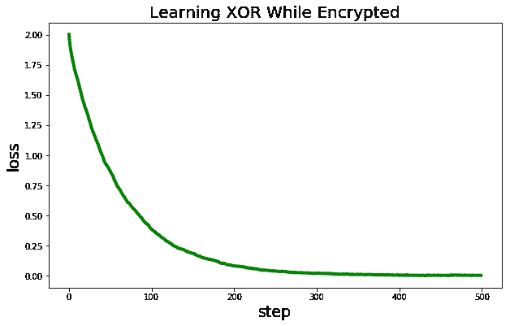

# PyTorch 中以隐私为中心的深度学习教程介绍

> 原文：<https://towardsdatascience.com/a-tutorial-introduction-to-privacy-centric-deep-learning-in-pytorch-b95768566cd6?source=collection_archive---------29----------------------->

## *安全多方计算和同态加密增加了计算开销，但结果非常值得！数据隐私和模型参数安全通过巧妙的加密方案相互保护。*

# 数据的重要性

随着机器学习继续以巨大的方式影响我们的社会，经常是模型成为头条新闻，但如果问任何数据科学家或机器学习工程师他们花了大部分时间做什么，答案很可能是数据。

为机器和深度学习模型寻找、标记、增加和渲染数据是机器学习从业者技能的关键部分，也是让产品“正常工作”的诀窍的基础(至少在自动化浪潮[赶上自动化机器](https://www.kdnuggets.com/2015/05/data-scientists-automated-2025.html)之前是如此，比如谷歌的 [AutoML](https://cloud.google.com/automl/docs/) )。

事实上，如果没有大型训练数据集来匹配，大模型就不值得拥有数百万个参数。吴恩达喜欢在他的讲座中使用的一个有点著名的概念图说明了模型性能、模型大小和数据可用性之间的关系。

在任意单位中，图形看起来像这样:


其中在小数据集上训练的大模型通常表现不如适当小的网络，反之亦然。

大型高质量数据集的可用性是利用最先进的模型和[计算能力](https://www.exxactcorp.com/Deep-Learning-Solutions)的必要条件。

鉴于数据对现代经济的重要性，这导致一些人将数据称为“新黄金”或“新石油”。2013 年，大约在数据闸门开始打开的时候，[一些人估计](https://www.sciencedaily.com/releases/2013/05/130522085217.htm)世界上有记录的数据在短短两年内增加了 10 倍。准确的数字很难确定，但尽管我们不一定期望数据两年增长 1000%的情况会无限期持续下去，但毫无疑问，高质量训练数据集的数量现在比以往任何时候都多。

但这种数据洪流带来了一些意想不到的负面后果，随着该领域的成熟，数据所有权和隐私的实践和监管方式必然会适应。

# 隐私呢？

虽然在很大程度上，人们对公开分享数据以换取很少回报的做法感到惊讶，但日益增长的意识以及不断扩大的数据泄露和公然不当行为清单正开始在公众和监管层面改变这种情况。

大数据巨头脸书最近几年丑闻不断，而谷歌最近因违反新的欧洲数据保护法而被罚款。人们和组织越来越意识到数据和机器智能影响我们生活方方面面的方式，并准备更加认真地对待隐私和数据安全。

# 联合学习

此外，现代机器学习管道中的主要瓶颈通常是通信带宽，而不是计算能力。

例如，对于医院来说，将每一次计算机断层扫描上传到中央服务器进行实时模型更新是不现实的，还有许多其他用例更适合在现场或以分布式方式进行学习。

回到上面的例子，出于隐私和带宽的考虑，医院每天上传许多 TB 的敏感医疗数据用于集中培训可能是不现实的。然而，共享模型的训练经验可能仍然是有益的，因此更新的参数(或它们的梯度)可以在不同的站点上累积，以提高模型的所有实例的性能。这被称为联合学习。

[联邦学习](https://ai.googleblog.com/2017/04/federated-learning-collaborative.html)广泛应用于 ML 流水线，也可用于大数据集上的分布式学习。

但是在处理私有和特权数据时，如何才能保证其安全性呢？我们可以盲目地信任所有相关方，这在过去可能是普遍可以接受的，但是我们也可以通过共享密码运行数据，并采用所谓的安全多方计算(SMPC)

# 安全多方计算和同态加密

安全多方计算(SMPC)是处理数据的任何协议，它不依赖于向所有方公开数据。

这可以简单到在本地(未加密)数据上执行本地训练，然后加密梯度以上传。

另一种方法是使用同态加密(又名 HE)方案，其中加密的数据仍然支持数学运算，如加法和乘法。使用上述加密的梯度可以在被传送给拥有模型和用于解密组合梯度的私钥的任何人之前被加在一起。

或者，使用正确的 he 方案，可以对加密数据训练加密模型，产生只有在解密后才有用的加密预测。这种方法的重要结果是，有价值的模型的安全性可以同时得到维护。

让我们用一些代码来建立我们的理解。

我们将从一个简单的 SMPC 方法开始，只依赖 Python 的 numpy。

然后，我们将使用一个名为 PySyft 的开源加密深度学习库来教授一个小型网络异或函数，这是一个经典而臭名昭著的非线性函数示例。

在下面的例子中，我们将看到 SMPC 如何将数据分成几份，同时保留将加密变量添加到其他加密变量以及将加密变量与明文值相乘的能力。

```
import numpy as np # demonstrate secure multiparty computation Q = 501337 def encrypt(x): share_a = np.random.randint(0,Q) share_b = np.random.randint(0,Q) share_c = (x - share_a - share_b) % Q return (share_a, share_b, share_c) def decrypt(*shares): return sum(shares) % Q def add(x, y): z = [] assert (len(x) == len(y)), "each variable must consist of the same number of shares!" for ii in range(len(x)): z.append((x[ii] + y[ii]) % Q) return z def product(x, w): # w is a plaintext value, z = [] for ii in range(len(x)): z.append((x[ii] * w) % Q) return z # encrypt variables var1 = encrypt(2) var2 = encrypt(5) # get sum my_sum = add(var1,var2) # print results print(my_sum) print(decrypt(*my_sum)) print(decrypt(*my_sum[0:2]))
```

正如我们在上面看到的，在对加密变量求和之后，我们得到了一个看起来像三个随机整数的结果。

这些整数是加密的部分，我们可以使用 decrypt()将它们转换成明文结果。上面要注意的重要事情是，如果我们试图只访问两个共享来“解密”结果，我们会得到无意义的结果。访问不完整份额的任何一方都无法破译数据的含义。

上面的例子支持加密数据的加法和与明文操作数的乘法。深度学习神经网络主要由加法、乘法和激活函数组成，我们刚刚展示了前两个可以相对容易地完成，而无需放弃对底层数据的控制。

这对于线性回归等简单的统计学习模型来说已经足够了，但是为了利用神经网络根据[通用逼近定理](https://en.wikipedia.org/w/index.php?search=universal+approximation+theory&title=Special%3ASearch&fulltext=Search)拟合任意数据函数的能力，我们需要引入非线性。这是像 [PySyft](https://github.com/OpenMined/PySyft) 这样以隐私为中心的深度学习库的主要发展领域，使用泰勒展开级数等聪明的技巧来近似常见的激活函数。

还可以通过复杂的随机变换将非线性问题简化为线性问题，这种方法被称为[水库计算](https://en.wikipedia.org/wiki/Reservoir_computing)。这就是我们在下一个例子中要做的。

# 使用 PySyft 的 PyTorch 示例

为了运行这部分教程，我们将探索如何使用 PyTorch，更具体地说是 PySyft。但是首先，您需要了解运行下面的演示所需的系统/资源要求。

*   Ubuntu 18.04
*   Docker v 18.xx
*   Anaconda(我们更喜欢并推荐 anaconda docker 图像)
*   至少 2 个 CPU 内核(最好是 4 个或更多)
*   8 GB 内存，(你也许可以用 4 GB 内存)
*   30 GB 磁盘空间(50gb 更好)

***重要提示:*** *我们* ***高度*** *由于本次练习需要大量的 DL/ML/Math 包，建议使用 Docker 进行以下实验。PySyft 是高度实验性的，这些脚本在 PyTorch v0.3.1 中是稳定的，我们只是想提前了解一下。请使用 Docker 来避免可能的依赖问题。*

# 步骤 1)启动官方的 Anaconda Docker 容器

```
sudo docker run -it -p 8888:8888 -v ~/demo:/demo2 continuumio/anaconda bash
```

# 步骤 2)下载 bash 文件，并将其放在本地机器上的 demo 文件夹中(不是容器)。

[下载脚本](https://s3-us-west-1.amazonaws.com/stepimagesprod/share_file/PySyftDemo.zip)

*注意:您可以将下面的源代码复制并保存在“源代码”部分，而不是下载 zip 文件。*

# 步骤 3)在 Anaconda 容器中，运行 bash 文件。

导航到**' bash encrypted _ reservoir _ pysyft _ demo . sh '**所在的文件夹，对于此示例，只需输入以下内容:

```
cd demo2
```

运行 bash 文件

```
bash encrypted_reservoir_pysyft_demo.sh
```

*注意:运行 bash 文件可能需要几分钟，创建整个培训环境，下载所有依赖项，安装所有必需的包，此外，它还会获取脚本的源代码(见下文)并执行培训脚本。*

如果您想再次运行该脚本，您需要使用以下命令进入 PySyft conda 环境:

```
conda activate pysyft_demo
```

现在，通过输入以下内容运行演示(再次):

```
python encrypted_reservoir_demo.py
```

您应该会看到如下输出:

```
Encrypting variables 2 and 5 as var1 and var2 Performing encrypted addition... Multiparty result from add(var1,var2): [463355, 2676, 35313] Decrypted result: 7 Decrypted partial result: 466031 Begin training encrypted reservoir... loss at step 0: 2.000e+00 loss at step 50: 1.059e+00 loss at step 100: 5.590e-01 loss at step 150: 3.290e-01 loss at step 200: 1.800e-01 predictions: [ 0 1 1 0 [syft.core.frameworks.torch.tensor.ByteTensor of size 4x1] ] targets: 0 1 1 0 [syft.core.frameworks.torch.tensor.FloatTensor of size 4x1]
```

# 视频教程

# 脚本的源代码

现在，如果您想自己做更多的实验，请随意修改下面的源代码。

```
#!/usr/bin/env bash # download this script and run by typing 'bash encrypted_reservoir_pysyft_demo.sh' from the command line while in the same directory # create a new environment with PyTorch 0.3 conda create -n pysyft_demo pytorch=0.3 torchvision matplotlib pip -c pytorch -y source activate pysyft_demo # clone PySyft and checkout the required commit git clone [https://github.com/OpenMined/PySyft.git](https://github.com/OpenMined/PySyft.git) cd PySyft git checkout 1f8387a7b22406945482332c8171cb4994a3cfe8 # install requirements, install PySyft, and test pip install -r requirements.txt python setup.py install # run demo learning XOR with an encrypted reservoir cd ../ # write out the python demo file echo "import numpy as np import syft as sy hook = sy.TorchHook() import numpy as np import matplotlib.pyplot as plt # demonstrate secure multiparty computation display_figs = False Q = 501337 def encrypt(x): share_a = np.random.randint(0,Q) share_b = np.random.randint(0,Q) share_c = (x - share_a - share_b) % Q return (share_a, share_b, share_c) def decrypt(*shares): return sum(shares) % Q def add(x, y): z = [] assert (len(x) == len(y)), 'each variable must consist of the same number of shares!' for ii in range(len(x)): z.append((x[ii] + y[ii]) % Q) return z def product(x, w): # w is a plaintext value, z = [] for ii in range(len(x)): z.append((x[ii] * w) % Q) return z if __name__ == '__main__': # encrypt variables print('Encrypting variables 2 and 5 as var1 and var2') var1 = encrypt(2) var2 = encrypt(5) # get sum print('Performing encrypted addition...') my_sum = add(var1,var2) # print results print('Multiparty result from add(var1,var2):\n\t\t\t\t',my_sum) print('Decrypted result:\n\t\t\t\t',decrypt(*my_sum)) print('Decrypted partial result:\n\t\t\t\t',decrypt(*my_sum[0:2])) bob = sy.VirtualWorker(id='bob') alice = sy.VirtualWorker(id='alice') # Create our dataset: an XOR truth table x = np.array([[0.,0],[0,1],[1,0],[1,1]],'float') y = np.array([[0],[1],[1],[0]],'float') # use a reservoir transformation to achieve non-linearity in the model res_size = 256 my_transform = np.random.randn(2,res_size) x_2 = np.matmul(x,my_transform) # apply relu non_linearity x_2[x_2<0] = 0\. # convert data and targets to Syft tensors data = sy.FloatTensor(x_2) #[[0,0],[0,1],[1,0],[ 1,1]]) target = sy.FloatTensor(y) #[[0],[1],[1],[0]]) # init model (just a matrix for linear regression) model = sy.zeros(res_size,1) # encrypt and share the data, targets, and model data = data.fix_precision().share(alice, bob) target = target.fix_precision().share(alice, bob) model = model.fix_precision().share(alice, bob) # train the model learning_rate = 1e-3 J = [] print('\nBegin training encrypted reservoir...') for i in range(250): pred = data.mm(model) grad = pred - target update = data.transpose(0,1).mm(grad) model = model - update * learning_rate loss = grad.get().decode().abs().sum() J.append(loss) if(i % 50 == 0): print('loss at step %i: %.3e'%(i,loss)) got_pred = pred.get() got_target = target.get() if(display_figs): # display training results plt.figure(figsize=(10,6)) plt.plot(J,'g',lw=4) plt.xlabel('step',fontsize=19) plt.ylabel('loss',fontsize=19) plt.title('Learning XOR While Encrypted',fontsize=20) plt.show() # print decrypted predictions and targets (decision boundary of predictions at 0.5) print('predictions: \n',[got_pred.decode()>0.5]) print('targets: \n',got_target.decode())" >> encrypted_reservoir_demo.py python encrypted_reservoir_demo.py
```



# 外卖

在本文中，我们了解到保护模型和数据的隐私和安全是可能的。

这是一个活跃而有益的研究领域，随着机器学习和数据在我们社会中的作用不断成熟，它只会变得更加重要。

以隐私为中心的深度和机器学习是一项值得添加到您的技能组合中的技能，随着监管、消费者和商业压力都明智地转向良好的数据实践，它将经历越来越多的需求。

这也是企业值得开发的能力，因为有价值的模型可以得到保护。

最后，同态加密和安全计算是我们可以用来实现世界敏感问题的道德解决方案的工具。

这种方式的深度学习仍然有很大的计算成本，通常比传统模型至少慢一个数量级。上面训练 XOR 的例子就说明了这一点:训练数据集实际上只有 12 位数据，包括目标值，与现代深度学习任务相去甚远。

这使得在 GPU 和其他专用硬件上加速 HE 算法成为一个活跃的开发领域。同态加密库正处于开发的早期阶段，以充分利用[现代 GPU](https://www.exxactcorp.com/Deep-Learning-Solutions)，很像几年前深度学习库的状态。

这创造了一个站在前沿的机会，并影响这个领域的走向。一个名为 [cuHE](https://eprint.iacr.org/2015/818.pdf) 的加速加密库已经宣称在各种加密任务上的速度比以前的实现提高了 12 到 50 倍。

未来，对于 GPU 制造商来说，通过改进对加密原语的硬件支持来迎合对良好数据实践的需求将是有意义的，就像张量核和为响应深度学习需求而开发的精度降低的功能一样。

深度学习友好的库，如 [PySyft](https://github.com/OpenMined/PySyft) (构建于 PyTorch 之上)和 [tf-encrypted](https://github.com/mortendahl/tf-encrypted) (构建于 TensorFlow 之上)，或 [PySEAL](https://medium.com/bioquest/pyseal-homomorphic-encryption-in-a-user-friendly-python-package-51dd6cb0411c) (微软简单加密算法库的 python 端口)正在开发用户和开发者的活跃社区。

同态加密、安全多方计算和其他隐私保护方案肯定会成为未来机器学习从业者的必要技能，现在是参与其中的最佳时机。

当你准备好开始时，请阅读克雷格·金特里关于全同态加密的论文的介绍。

然后，当你准备好学习更多内容时，找一个 GPU，开始研究来自 [tf-encrypted](https://github.com/mortendahl/tf-encrypted/tree/master/examples) 和 [PySyft](https://github.com/OpenMined/PySyft/tree/master/examples/tutorials) 的例子。

(227361, 106917, 167163) (44123, 289723, 167588) (165513, 231191, 104745) (478016, 430732, 94038) (312810, 257243, 432742) (19638, 239579, 242152) (235418, 28417, 237603) (410735, 485411, 106638) (115624, 38923, 346889) (500014, 163171, 339603) (169683, 396997, 436115) (108180, 449757, 444849) (225167, 471257, 306366) (47789, 254175, 199478) (179954, 40895, 280598) (357183, 274943, 370651) !

*原载于 2019 年 4 月 8 日*[*blog.exxactcorp.com*](https://blog.exxactcorp.com/a-tutorial-introduction-to-privacy-centric-deep-learning/)*。*