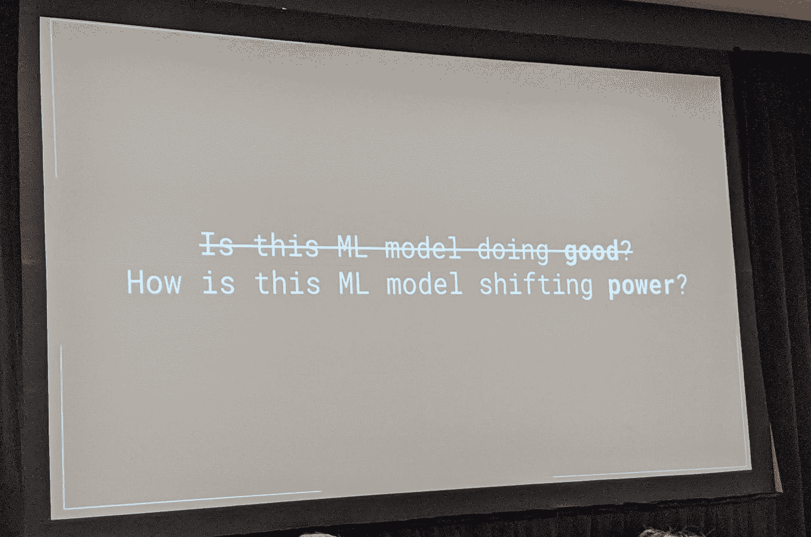
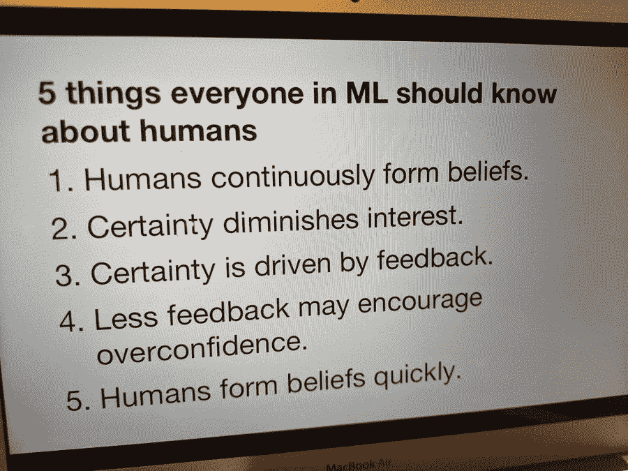
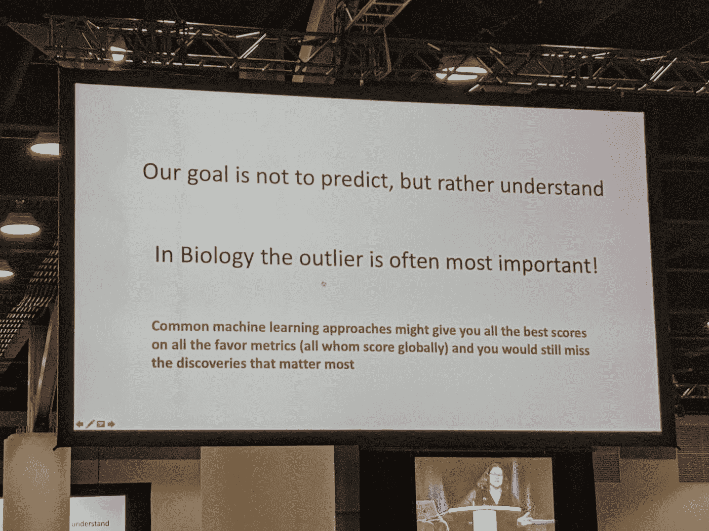
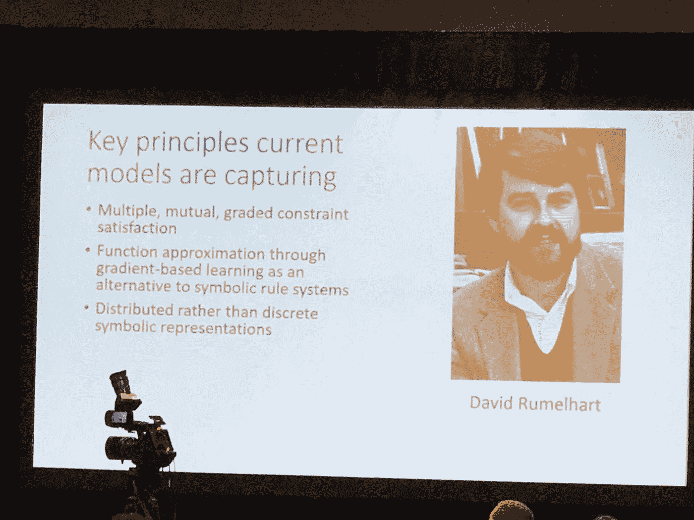
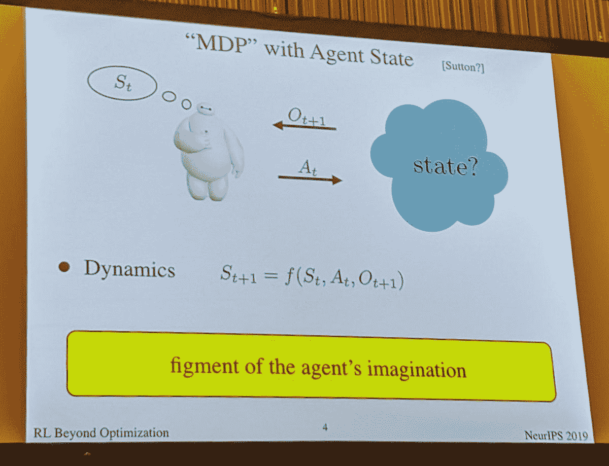
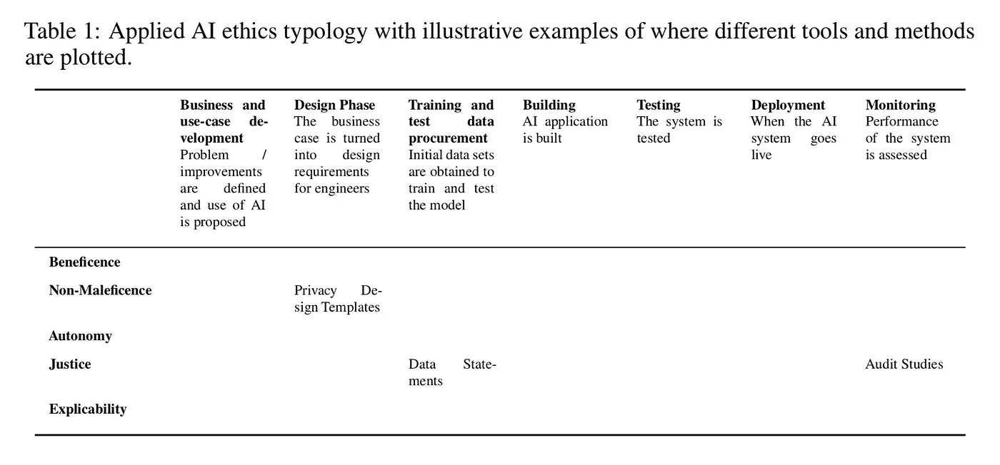

# 人工智能伦理学工具、方法和研究的类型学

> 原文：<https://towardsdatascience.com/a-typology-of-ai-ethics-tools-methods-and-research-cacdea134503?source=collection_archive---------32----------------------->

## 我们如何将原则转化为实践？

2019 年 12 月，举行了第 33 次 NeurIPS。NeurIPS 是传统上在加拿大温哥华组织的关于神经信息处理系统的年度会议。我建议在 Twitter 上浏览讨论内容，阅读报纸，或者观看一些会议视频。在这篇文章中，我将看一些断章取义的引用图片，然后谈论名为*将原则转化为实践的人工智能伦理工具、方法和研究的类型学的论文*。这篇论文赢得了 NeurIPS 的“社会公益”跟踪，所以检查一下可能会很有趣。不过，如果以后有机会，我很想尽可能多地看看这一类别的提交材料。

## NeurIPS 上的幻灯片和引文

在我开始总结前面提到的文章之前，我认为在 Twitter 上公开发布一些不同幻灯片的图片会很有趣也很容易。

Presentation by [@riakall](https://twitter.com/riakall) — phd studying AI/ML at stanford, thinking about the concepts inside machine learning models + dreaming up more radical ai // posted by [@math_rachel](https://twitter.com/math_rachel)

欢迎来到报价之地:

Posted by — [@raghavgoyal14](https://twitter.com/raghavgoyal14)

更多引用:

Posted by — [@celestekidd](https://twitter.com/celestekidd)

更多的引用:

Posted by — [@math_rachel](https://twitter.com/math_rachel)

Quotes from 1984 — posted by [@JIALIN_LU_1996](https://twitter.com/JIALIN_LU_1996)

Photo by — [@IanOsband](https://twitter.com/IanOsband)

然而，在会议上当然不仅仅是引用。然而，我想把重点放在这篇关于“社会公益”的论文上。

## 人工智能伦理学工具、方法和研究的类型学

本文由英国牛津大学牛津互联网研究所的 Jessica Morley 和 Luciano Floridi 撰写。这是与来自英国 Digital Catapult 的利比·金赛和阿娜特·艾尔哈拉共同撰写的。

简而言之，它提出:“……愿望和可行性之间，原则和实践之间存在差距。”因此，我们需要了解在流程的不同部分，开发人员可以使用哪些工具。

> 目标是绘制类型学，这可能有助于务实的开发人员在人工智能开发管道的每个阶段“应用伦理”。

然而，这也是一个信号，可能表明需要进一步研究的领域。他们发现存在一种:*“…应用人工智能伦理领域的努力分布不均衡，已确定的工具的成熟度(广泛使用的准备程度)大多较低。”*

根据这篇论文，这种方法受到 Saltz 和 Dewar (2019)的启发，他们提出了一个框架，旨在帮助数据科学家在项目的每个阶段考虑伦理问题。这是用“伦理原则”的网格和“人工智能应用生命周期”的阶段来完成的。

在最近的一次不同主题的审查中，确定了 84 份伦理人工智能文件。这些是根据论文主题“定义”伦理上一致的人工智能

(a)有益于并尊重人民和环境(*)；
(b)健壮安全( ***无害***)；
(c)尊重人的价值( ***自治***)；
(d)公平( ***正义***)；以及
(e)可解释、可问责、可理解( ***可解释*** )。因此，这些是在类型学中使用的原则。*

*这七个阶段是*

1.  **业务和用例开发，**
2.  **设计阶段，**
3.  **培训和测试数据采购，**
4.  **建筑，**
5.  **测试，**
6.  **部署*和*
7.  **监控*。*

*在这篇论文中，共有 425 个来源提供了对这个问题的答案的实践或理论贡献:“如何开发一个伦理的算法系统。”被审查。*

*完全填充的类型可以在:
[http://tinyurl.com/appliedAIethics](http://tinyurl.com/appliedAIethics)找到*

*^The above contains a wealth of information that I would recommend you to check out.*

*他们在论文中有一个应用人工智能伦理类型的表格，其中有不同工具和方法的示例。*

**

*他们论文宣称**三个相互关联的发现**:*

1.  **对‘可解释性’的过度依赖。“最明显的观察结果是，工具和方法的可用性在类型学中的分布并不均匀，无论是就伦理原则而言，还是就应用程序生命周期的阶段而言。最明显的“倾斜”是对事后“解释”的倾斜，在测试阶段寻求满足可解释性原则的个人有最大范围的工具和方法可供选择。”**
2.  *****强调需要‘保护’个人胜过集体*** *。“下一个值得注意的观察是，被调查的可用工具中，很少有提供有意义的方法来评估和响应人工智能算法中涉及的数据处理对个人的影响，更不用说对整个社会的影响了。”***
3.  *****缺乏可用性*** 。绝大多数分类工具和方法不可操作，因为它们对如何在实践中使用它们几乎没有帮助。即使有开源代码库，可用的文档通常也是有限的，而且使用时需要的技能水平也很高。**

**这篇论文的既定目标是给人工智能开发者一个当前可用工具的快照，以鼓励道德人工智能从原则到实践的进展，并向整个“道德人工智能”社区发出明确的信号，在那里需要进一步的工作。**

> **“社会和有道德的人工智能社区需要培养建设性的耐心，因为在“如何”满足“什么”的问题上，这种进展不会很快，而且在这一过程中肯定会出现错误。只有接受这一点，社会才能积极地抓住人工智能带来的机遇，同时保持对要避免的潜在成本的警惕。”**

**我希望你喜欢这个简短的总结，但是我当然会建议你阅读原文。我提供的信息只是为了鼓励你继续阅读。**

**这里是#500daysofAI，您正在阅读第 196 条。500 天来，我每天都写一篇关于人工智能或与之相关的新文章。**