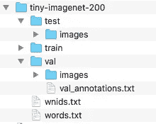
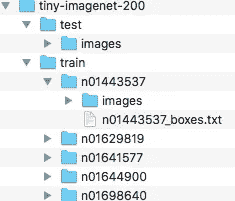
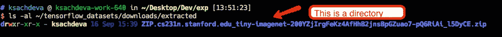

# 下载、提取、处理和使用数据集的统一方法

> 原文：<https://towardsdatascience.com/a-unified-method-for-downloading-extracting-processing-using-datasets-7482a3b27aff?source=collection_archive---------11----------------------->


Photo by [Oskars Sylwan](https://unsplash.com/@oskarssylwan?utm_source=unsplash&utm_medium=referral&utm_content=creditCopyText) on [Unsplash](https://unsplash.com/search/photos/organized?utm_source=unsplash&utm_medium=referral&utm_content=creditCopyText)

任何机器学习练习的第一个相当多的步骤都是关于数据集的。从哪里以及如何下载它们？编写脚本来组织和/或改变下载的档案、目录、数据库和数十种其他格式，使它们成为对手头项目有意义的东西。最后，一旦准备好数据，就开发管道将数据(或者更确切地说，我应该说是特征)馈送到正在训练的神经网络和/或机器学习算法。

就构建管道而言，tensorflow core 已经使用`[tf.data](https://www.tensorflow.org/api_docs/python/tf/data/Dataset)`模块提供了一个优秀的抽象。这个模块的核心是`tf.data.Dataset`类，它抽象出输入特性的底层来源。根据要素的大小，您可以使用简单的 numpy 数组，或者如果数据集很大，您可以使用`tfrecords`作为基于文件的底层存储。`tfrecords`根据您指定的特性模式，最终将您的特性样本存储为 protobufs。也就是说，你真的不需要担心`tfrecords`如何在内部存储数据。有趣的是，由于`tf.data.Dataset`提供的抽象，您可以在输入管道上应用相同的操作集。下面是一个简单的代码片段，显示了管道-

```
d = tf.data.TFRecordDataset(input_files)
d = d.shard(num_workers, worker_index)
d = d.repeat(num_epochs)
d = d.shuffle(shuffle_buffer_size)
d = d.map(parser_fn, num_parallel_calls=num_map_threads)assert(isinstance(d, tf.data.Dataset))
```

虽然`tf.data.Dataset`是一个很好的抽象& `tfrecords`是一个很好的存储格式，但它仍然没有解决围绕下载、提取和准备数据的一致方法的问题。通常，与数据集下载、提取和转换相关的脚本/代码与用于培训和评估的主要管道是分开的，因此带来了挑战。其中一些列在下面-

*   脚本的数量在某种程度上与数据集的数量成比例。在我的个人项目中，每个数据集至少有 4 个脚本(其中有主/入口点)(在他们使用的可重用模块之上)，只是为了准备可处理的特性。
*   开发人员必须担心文件路径的健全性检查、正确读取图像(在 python 生态系统中，有多个包仅用于读取图像，甚至单个项目最终会使用其中的许多包)等。希望您能够理解，随着项目的增长，不同技能的开发人员对库和方法的偏好也会增加。
*   在培训和评估期间，在准备`tfrecords`时使用的特性规范与编写`parser_fn`用于映射时使用的特性规范之间要断开。

可扩展和可维护的软件工程项目的一个关键组成部分是解决任务的一致性。这里的任务是获取和准备数据集。这篇文章是关于介绍来自 https://github.com/tensorflow/datasets`tensorflow_datasets(``tensorflow`生态系统的一个包，它为上面列出的挑战提供了有希望的解决方案。

`tensorflow_datasets`是由谷歌的开发者发起的一个项目，然而它是由社区驱动的，并吸引了来自机器学习社区的大量贡献。

第一眼看到`tensorflow_datasets`会给你一个印象，这个包是关于各种数据集的集合，虽然它是正确的，但我感兴趣的部分是，为了支持各种数据集(音频、图像、视频、二进制等)，他们必须开发一个强大的基础，提供足够的抽象，以消除对平凡和重复任务的需求，同时保持用户代码足够灵活，以处理数据集的特殊性。

下面是显示用法的列表:

```
import tensorflow as tf
import tensorflow_datasets as tfds

# tfds works in both Eager and Graph modes
tf.enable_eager_execution()

# See available datasets
print(tfds.list_builders())

# Load a given dataset by name, along with the DatasetInfo
data, info = tfds.load("mnist", with_info=True)
train_data, test_data = data['train'], data['test']
assert isinstance(train_data, tf.data.Dataset)
assert info.features['label'].num_classes == 10
assert info.splits['train'].num_examples == 60000

# You can also access a builder directly
builder = tfds.builder("mnist")
assert builder.info.splits['train'].num_examples == 60000
builder.download_and_prepare()
datasets = builder.as_dataset()
```

显而易见的是，这种方法提供了获得数据集的统一方法，而不考虑它们的类型。

这里需要特别注意的一个方法是`download_and_prepare`。这个方法实际上最终调用了数据集特定的实现(本例中为 MNIST ),下载、提取和准备`tfrecords`的逻辑就驻留在这个实现中。原始数据、原始数据和准备好的数据所在的位置也可以通过将参数传递给`download_and_prepare`来配置。

也可以下载数据(因为有时可能需要身份验证和授权)，然后提供数据的路径。换句话说，它足够灵活，可以满足大多数场景。繁重的下载和准备任务只发生一次，对于后续的使用，它跳过了昂贵的操作。

`tensorflow_datasets`的文档确实不错。它们不仅为使用提供了很好的指导，也为人们如何向他们的集合贡献新的数据集提供了很好的指导。

本文的其余部分将借助一个具体的例子来说明如何将这个框架用于您自己的私有数据集。

在这个例子中，我将使用`tiny-imagenet`数据集。该示例的完整源代码可在[https://github.com/ksachdeva/tiny-imagenet-tfds](https://github.com/ksachdeva/tiny-imagenet-tfds)获得。您也可以使用 pip 将这个包安装到您自己的项目/笔记本/colab 中:

```
pip install git+https://github.com/ksachdeva/tiny-imagenet-tfds.git
```

> 我很可能会将此数据集贡献给 tensorflow_datasets 集合，这样它将作为其中的一部分可用，但源存储库将始终作为构建私有数据集支持的参考

我们先来看看用法:

```
import os
import numpy as np
import tensorflow as tf

import tensorflow_datasets as tfds
from tiny_imagenet import TinyImagenetDataset

# optional
tf.compat.v1.enable_eager_execution()

tiny_imagenet_builder = TinyImagenetDataset()

tiny_imagenet_builder.download_and_prepare()

train_dataset = tiny_imagenet_builder.as_dataset(split="train")
validation_dataset = tiny_imagenet_builder.as_dataset(split="validation")

assert(isinstance(train_dataset, tf.data.Dataset))
assert(isinstance(validation_dataset, tf.data.Dataset))

for a_train_example in train_dataset.take(5):
    image, label, id = a_train_example["image"], a_train_example["label"], a_train_example["id"]
    print(f"Image Shape - {image.shape}")
    print(f"Label - {label.numpy()}")
    print(f"Id - {id.numpy()}")

# print info about the data
print(tiny_imagenet_builder.info)
```

我希望您能从上面的代码片段中了解到，它或多或少与前面显示的 MNIST 示例相同，下载、准备和特性模式的细节被隐藏起来了。

# 微型图像网

Tiny Imagenet 是 Imagenet 数据集的缩小版。这个数据集是由斯坦福的人们为他们的课程[http://cs231n.stanford.edu/](http://cs231n.stanford.edu/)创建的。

应该清楚的是，使用 tiny-imagenet-tfds 包并不要求您知道如何下载和准备数据集，但是因为我将向您展示如何开发实现，所以了解这个数据集是如何组织的非常重要。

以下是提取 zip 文件时数据集的样子。



## 特征

*   200 个图像类别
*   100，000 幅图像的训练数据集
*   10，000 幅图像的验证数据集
*   10，000 幅图像的测试数据集。
*   所有图片尺寸均为 64×64。
*   wnids.txt 包含类名列表(nXXXXXX)
*   words.txt 包含与类名相关联的友好名称[在本练习中我们不打算使用]
*   val_annotations.txt 包含图像列表。对于每个图像，都有一个相应的列提供相关联的标签(即来自 wnids.txt 的标签)
*   train 文件夹包含每个类的文件夹，在该文件夹中有一个名为 images 的目录，其中包含该类的 500 个 jpeg 文件。train 中的每个类都有 nXX_boxes.txt，它包含关于图像的边界框信息。在本练习中，我们不打算处理边界框信息。

# tfds . core . generatorbasedbuilder

在`tensorflow_datasets`中实现各种数据集的主要工具就是这个类。顾名思义，它希望您**生成**数据集的示例，并将其写入`tfrecords`中。

`tensorflow_datasets`期望你实现一个从`tfds.core.GeneratorBasedBuilder`继承的类，并实现三个方法——`_info`、`_split_generators`和`_generate_examples`。

`_info`方法是您将要返回关于数据集的元数据的地方。这里有一个片段展示了它在 tiny-imagenet 中的应用。

从`_info`返回的`tfds.core.DatasetInfo`最重要的元素是**特征**的规范。如果你已经熟悉`tfrecords`，你会注意到它与你习惯看到的不同。事实上,`tensorflow_datasets`提供了一些高效的包装器来构建大大简化了很多事情的特性。在这个例子中，我使用的是`tfds.features.Image`，而如果我手动构建`tfrecords`，我将不得不使用多个字段，例如一个用于存储原始数据，一个用于形状，另一个用于图像格式等。最重要的是，我必须从我的脚本中读取图像。正如您稍后将在 _ **generate_examples** 函数的实现中看到的，我们不需要做任何事情。

我也很欣赏 DatasetInfo 有描述和引用字段的事实。这些元数据字段对于生成文档也很方便&更重要的是对人们首先创建数据集的辛勤工作的认可。

下一个要实现的方法是`_split_generators`，它在很多方面都是这个实现的主力。

该方法中的第一行，即`extracted_path = dl_manager.extract(dl_manager.download(_URL))`，是负责下载和提取的那一行。本例中的`_URL`指向[http://cs231n.stanford.edu/tiny-imagenet-200.zip.](http://cs231n.stanford.edu/tiny-imagenet-200.zip.)返回值，即`extracted_path`包含解压后的路径。这是我困惑和问题的第一个来源。当我调用`download_and_prepare`时，它会向我显示下载的进度条，但当我查看位置时，它会是这样的



如上图所示，下载和解压 zip 文件的默认路径是`~/tensorflow_datasets/downloads/extracted`。现在，由于目录以扩展名`.zip`结尾，我认为它是一个文件，解压缩失败。最后花了 15 分钟试图找出问题所在，最后注意到这是一个目录。

但是如果数据集被分成许多 zip/tar/rar/gz 文件会怎么样呢？…不要担心！，你被覆盖了。可以将字典作为参数，在这种情况下返回值将是包含相应值的字典。下面的清单显示了该用例的一个示例

```
def _split_generators(self, dl_manager):
  # Equivalent to dl_manager.extract(dl_manager.download(urls))
  dl_paths = dl_manager.download_and_extract({
      'foo': 'https://example.com/foo.zip',
      'bar': 'https://example.com/bar.zip',
  })
  dl_paths['foo'], dl_paths['bar']
```

我将这个方法称为我的实现中的主力，因为这是我读取元数据文件(wnidx.txt、val_annotations.txt 等)和构建包含各种类的图像列表的字典并为这些类分配数字标签的地方。

请注意，tiny-imagenet 中的训练和验证数据的组织是不同的，因此我有两种不同的方法来处理信息，但是我将它们合并为相同的字典格式。实现细节可以在—[https://github . com/ksachdeva/tiny-imagenet-tfds/blob/master/tiny _ imagenet/_ imagenet . py](https://github.com/ksachdeva/tiny-imagenet-tfds/blob/master/tiny_imagenet/_imagenet.py)查看

在`_split_generators`中，有趣的代码语句是我返回各种拆分生成器的返回值。代码应该足够清晰，不言自明。唯一需要注意的部分是`tfds.core.SplitGenerator`的`gen_kwargs`键。本质上，你传递的这个字段的值将作为`_generate_examples`的参数传递。

> 现在，你要实现这么多数据集类，当发出`download_and_prepare`时，你会得到一个错误通知，说它找不到`checksum`文件。这是第二步，花了我一点时间，大部分时间我花在这个问题上，而不是实现整个包。

事情是这样的。对于您下载的每个远程存档文件(在本例中为[http://cs231n.stanford.edu/tiny-imagenet-200.zip](http://cs231n.stanford.edu/tiny-imagenet-200.zip.))，您需要提供校验和信息。校验和信息将存储在扩展名为`.txt`的文件中。因为我们正在开发自己的 python 包(即不在`tensorflow_datasets`中)，所以你还需要告诉`tensorflow_datasets`包含校验和的文件所在的目录。以下是你需要添加到你的模块中的内容，以便完成这个任务-

```
checksum_dir = os.path.join(os.path.dirname(__file__),'url_checksums/')checksum_dir = os.path.normpath(checksum_dir)tfds.download.add_checksums_dir(checksum_dir)
```

另一个方面是校验和文件的名称应该是什么？经过一段时间的反复试验，我发现它应该和你的类名同名，但是有蛇形的大小写，也就是说，对于`TinyImagenetDataset`，你应该把你的文件命名为`tiny_imagenet_dataset.txt`。这部分在他们的指南中不是很清楚，至少我在任何地方都找不到它，我必须自己想办法。

这项工作还没有完成；您从哪里获得校验和本身呢？手动计算？幸运的是，这个框架会有所帮助。你所需要做的就是，当你第一次从一个使用你的数据集类的测试/例子中调用`download_and_prepare`时，你应该传递下面的参数

```
dl_config = tfds.download.DownloadConfig(register_checksums=True)
download_and_prepare(download_config=dl_config))
```

现在，您将看到下载成功，没有任何校验和错误，并且您的校验和文件(在本例中为 tiny_imagenet_dataset.txt)将有一个条目。从这一点开始，您可以删除 download_config 参数。

现在该看`_generate_examples`了。

从代码中可以看出，这是一个生成函数`yielding`的两个返回值。第一个是键，它是将在`tfrecords`中写入的样本的唯一标识符，第二个是对应于您在`_info`方法中指定的模式的字典。正如我前面提到的，你不再需要读取图像文件，而是简单地提供图像文件的路径，`tensorflow_datasets`会确保读取它并将其嵌入到`tfrecords`中

# 打包您的实现(可选)

如果您正在构建私有数据集，那么它很可能只是存储库中的一个 python 包。但是，如果您在您的组织中共享它，并且拥有某种 python 包存储库，您可能需要构建一个 wheel 文件。

这里没有关于构建 python pip 包的具体内容，除了您希望确保在最终的构建中包含校验和文件。

你可以看看[https://github . com/ksachdeva/tiny-imagenet-tfds/blob/master/setup . py](https://github.com/ksachdeva/tiny-imagenet-tfds/blob/master/setup.py)如何做的例子。

# 结束语

根据我到目前为止使用`tensorflow_datasets`的经验，它确实实现了为日常和重复性任务提供必要的抽象和支持的目标，同时提供了处理各种数据集的灵活性。还可以很容易地添加对您可能不想公开的数据集和驻留在`tensorflow_datasets`之外的数据集的支持。

希望您发现`tensorflow_datasets`在您的项目中的效用，并且这篇文章可以帮助您实现。