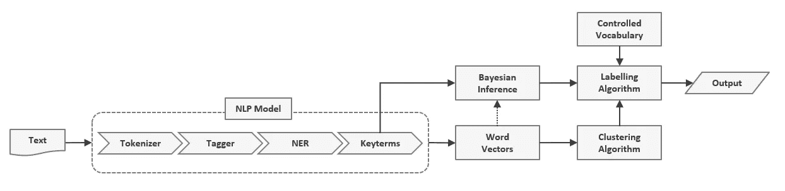
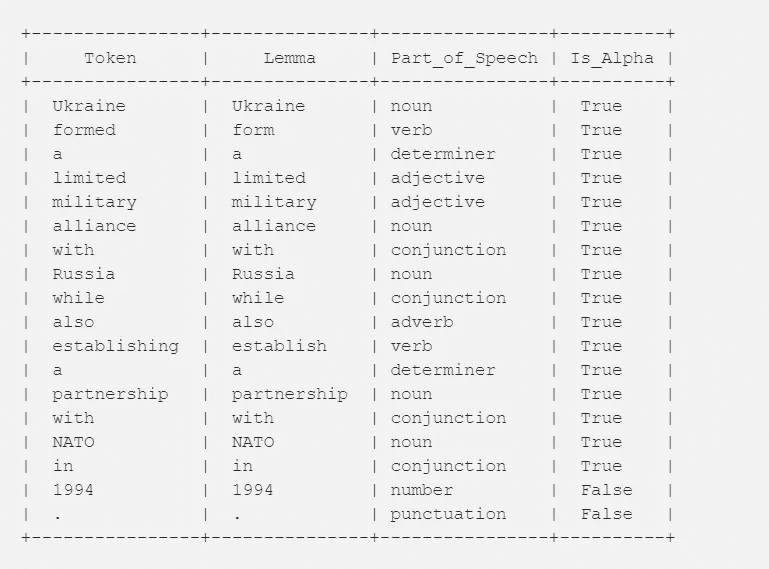
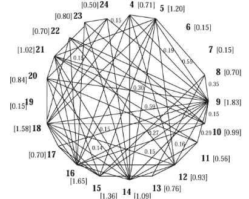
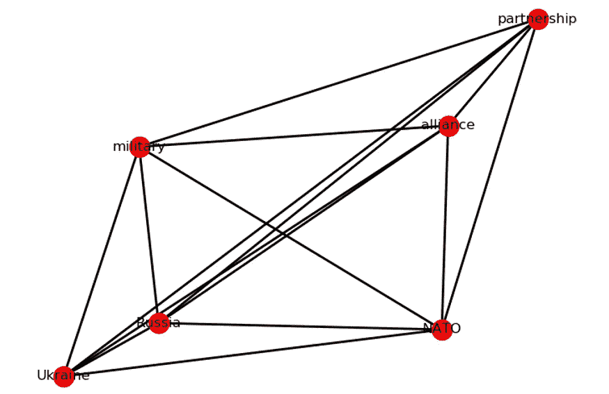
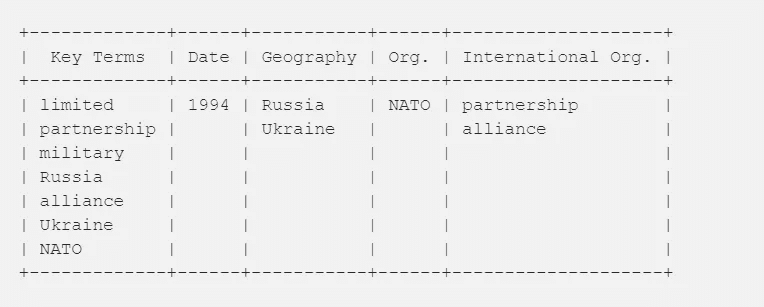

# 一种通用的文本挖掘体系结构

> 原文：<https://towardsdatascience.com/a-unified-model-for-text-mining-2085054f6072?source=collection_archive---------15----------------------->

## 通过自然语言处理使独立于领域的信息抽取成为可能


Source: [Rene Magritte](https://www.renemagritte.org/golconda.jsp)

自然语言处理是**人工智能**领域中一个令人兴奋的新兴领域。语言学和机器学习算法的重大发展使得计算机处理和分析大量自然语言数据所需的子任务变得可行。研究表明，计算机能够完成被认为只有人类才能完成的任务。

更广泛的 NLP 任务，如**信息提取** (IE)，需要在考虑灵活性的基础上安排子任务。与大多数 IE 系统相比，所讨论的体系结构具有两个重要的优点，即它是通用的和独立于领域的。



General Architecture of the Information Extraction System

# **初始自然语言处理模型**

文本数据的初始处理需要一系列步骤来为我们的模型提供经过处理的输入。文本首先被**标记化**或分割成单词、标点符号等。

```
Example text:
Ukraine formed a limited military alliance with Russia while also establishing a partnership with NATO in 1994.Tokenized Text:
[Ukraine, formed, a, limited, military, alliance, with, Russia, while, also, establishing, a, partnership, with, NATO, in, 1994, .]
```

每个单词都标记有形态、语法和字母数字特征。诸如词干、语法依赖标签、开始和结束索引等附加功能可能适用于您的用例。



机器学习模型使用统计推断，通过分析典型现实世界文档的大型语料库来自动确定形态和句法特征。这些统计推断与手工编码的试探法一起使用，以获得最佳结果。

命名实体识别(NER)模型将选择术语放入预定义的桶中:个人、组织、事件、地点等。

```
+------+-----------+--------------+
| Date | Geography | Organization |
+------+-----------+--------------+
| 1994 | Russia    | NATO         |
|      | Ukraine   |              |
+------+-----------+--------------+
```

这些术语不与每个集合的元素列表进行比较，ML 技术如此成功的部分原因是它们发现了缺乏可解释性但在实践中有效的统计模式。

依赖于领域的字典查找方法需要日常维护，因为随着时间的推移，集合中的元素增加/减少，并且不考虑上下文。

## 关键词提取

使用 [**TextRank**](http://web.eecs.umich.edu/~mihalcea/papers/mihalcea.emnlp04.pdf) 提取关键词；基于图的排名模型。

简而言之，我们构建了一个图，其中文本中不同的名词、动词和形容词充当一个顶点。如果词汇单元共现(在一个固定的单词窗口内一起出现)，则创建边。



对单词进行排序:将所有顶点初始化为 1，收集其每个入站连接的影响，迭代直到收敛，并归一化得分。

```
+-------------+----------+
|   Keyterm   | TextRank |
+-------------+----------+
| limited     |     0.17 |
| partnership |     0.17 |
| military    |     0.16 |
| Russia      |     0.16 |
| alliance    |     0.16 |
| Ukraine     |     0.09 |
| NATO        |     0.09 |
+-------------+----------+
```

# 词向量

通过使用预训练的**单词向量**，系统变得与领域无关；其中感兴趣的单词被映射到实数的向量。 [**手套单词嵌入**](https://nlp.stanford.edu/pubs/glove.pdf) 通过从大型语料库聚集全局单词-单词共现矩阵来创建。手套向量之间的余弦距离方便地指示语义相似性。



# 使聚集

在许多可用的聚类方法中，重叠划分聚类是优选的，因为它允许一个词同时适合多个类别。使用这种方法的直觉是，自然语言中的类别之间经常存在模糊性。

```
cluster_1 = [partnership, alliance]
```

## 标记集群

将从受控的单词和短语词汇表中选择聚类标签。从关键术语上下文向量的贝叶斯推断比朴素余弦相似性更有可能产生准确的标签。

```
+----------------------------+
| International_Organisation |
+----------------------------+
| partnership                |
| alliance                   |
+----------------------------+
```

# 下游任务

提取的信息可以用于许多下游任务，包括文本摘要、事件提取、概念映射和关系提取。



如果你有兴趣学习更多关于 NLP 的知识，我强烈推荐你阅读[自然语言工具包(NLTK)书籍](https://www.nltk.org/book/)。