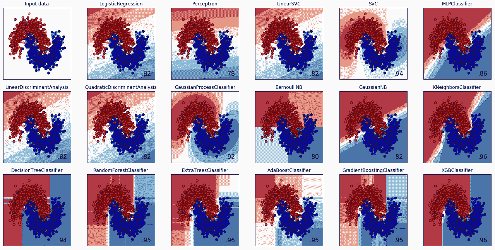

# 机器学习模型的旋风之旅

> 原文：<https://towardsdatascience.com/a-whirlwind-tour-of-machine-learning-models-e3574e6f2586?source=collection_archive---------18----------------------->

深入探讨不同的机器学习模型以及何时应该使用它们！

在第一部分“选择机器学习模型”中，我们谈到了选择完美的机器学习模型的艺术和科学。

在第二部分中，我们深入探讨了你可以训练的不同机器学习模型，以及你何时应该使用它们！

一般来说，基于树的模型在 Kaggle 竞赛中表现最好。其他型号是组装的绝佳选择。对于计算机视觉挑战，CNN 胜过一切。对于自然语言处理，LSTMs 或 GRUs 是您的最佳选择！

也就是说，下面是可供尝试的模型的非详尽清单，以及每个模型的一些上下文。

# 回归

## 回归→线性回归→普通线性回归

**优势**

*   很好地捕获数据集中的线性关系
*   如果您有几个明确定义的变量，并且需要一个简单的预测模型，那么这个方法非常有效
*   快速的训练速度和预测速度
*   在小数据集上表现良好
*   可解释的结果，易于解释
*   当新数据进来时，容易更新模型
*   不需要调整参数(下面的正则化线性模型需要调整正则化参数)
*   不需要特征缩放(下面的正则化线性模型需要特征缩放)
*   如果数据集包含冗余要素，线性回归可能会不稳定

**缺点**

*   不适用于非线性数据
*   预测准确度低
*   可能会过度拟合(见下面的正则化模型来抵消这一点)
*   无法很好地将信号与噪声分开——在使用前剔除不相关的特征
*   不了解数据集中的要素交互

## 回归→线性回归→套索、脊、弹性网回归

**优点**

*   这些模型是带有正则化的线性回归
*   帮助抵消过度拟合
*   这些模型更容易概括，因为它们更简单
*   当我们只关心少数几个特性时，它们工作得很好

**缺点**

*   需要功能缩放
*   需要调整正则化参数

## 回归→回归树→决策树

**优点**

*   快速的训练速度和预测速度
*   很好地捕捉数据集中的非线性关系
*   了解数据集中的要素交互
*   当数据集有异常值时非常有用
*   非常适合在数据集中查找最重要的要素
*   不需要功能缩放
*   合理的解释结果，易于解释

**缺点**

*   预测准确度低
*   需要一些参数调整
*   在小数据集上表现不佳
*   没有很好地分离信号和噪声
*   当新数据进来时，不容易更新模型
*   实践中很少使用，请使用集合树
*   可以过度装配(见下面的套装模型)

## 回归→回归树→集成

**优点**

*   整理来自多个树的预测
*   高预测准确性——在实践中非常有效
*   Kaggle 竞赛中的首选算法
*   当数据集有异常值时非常有用
*   很好地捕捉数据集中的非线性关系
*   非常适合在数据集中查找最重要的要素
*   分离信号和噪声
*   不需要功能缩放
*   在高维数据上表现出色

**缺点**

*   训练速度较慢
*   预测速度快
*   不容易解释或者说明
*   当新数据进来时，不容易更新模型
*   需要一些参数调整—更难调整
*   在小数据集上表现不佳

## 回归→深度学习

**优势**

*   高预测准确性——在实践中非常有效
*   捕捉数据中非常复杂的潜在模式
*   对大数据集和高维数据都很有效
*   当新数据进来时，容易更新模型
*   网络的隐藏层显著降低了对特征工程的需求
*   是计算机视觉、机器翻译、情感分析和语音识别任务的最新技术

**缺点**

*   非常长的训练速度
*   需要巨大的计算能力
*   需要功能缩放
*   不容易解释或诠释结果
*   需要大量的训练数据，因为它学习大量的参数
*   在非图像、非文本、非语音任务方面优于 Boosting 算法
*   非常灵活，带有许多不同的架构构建模块，因此需要专业知识来设计架构

## 回归→ K 个最近邻(基于距离)

**优点**

*   训练速度快
*   不需要太多的参数调整
*   可解释的结果，易于解释
*   适用于小型数据集(<100k training set)

**缺点**

*   预测准确度低
*   在小数据集上表现不佳
*   需要选择一个合适的距离函数
*   需要功能缩放才能正常工作
*   预测速度随着数据集的大小而增长
*   无法很好地将信号与噪声分开——在使用前剔除不相关的特征
*   是内存密集型的，因为它保存每个观察
*   也意味着它们不能很好地处理高维数据

# 2.分类

## 分类→逻辑回归

**优点**

*   很好地分类线性可分数据
*   快速的训练速度和预测速度
*   在小数据集上表现良好
*   合理的解释结果，易于解释
*   当新数据进来时，容易更新模型
*   正则化时可以避免过度拟合
*   可以进行两类和多类分类
*   不需要参数调整(除了正则化时，我们需要调整正则化参数)
*   不需要特征缩放(除了正则化时)
*   如果数据集包含冗余要素，线性回归可能会不稳定

**缺点**

*   不适用于非线性可分离数据
*   预测准确度低
*   可能过度拟合(参见下面的正则化模型)
*   无法很好地将信号与噪声分开——在使用前剔除不相关的特征
*   不了解数据集中的要素交互

## 分类→支持向量机(基于距离)

**优势**

*   预测精度高
*   即使在高维数据集上也不会过度拟合，因此当您拥有大量要素时，它非常有用
*   适用于小型数据集(<100k training set)
*   Work well for text classification problems

**缺点**

*   当新数据进来时，不容易更新模型
*   非常占用内存
*   不适用于大型数据集
*   当新数据进来时，不容易更新模型
*   需要你选择正确的内核才能工作
*   线性内核模拟线性数据，工作速度很快
*   非线性核可以模拟非线性边界，并且可能很慢
*   改用 Boosting！

## 分类→朴素贝叶斯(基于概率)

**优势**

*   在文本分类问题上表现很好
*   快速的训练速度和预测速度
*   在小数据集上表现良好
*   很好地分离信号和噪声
*   在实践中表现良好
*   简单，易于实施
*   适用于小型数据集(<100k training set)
*   The naive assumption about the independence of features and their potential distribution lets it avoid overfitting
*   Also if this condition of independence holds, Naive Bayes can work on smaller datasets and can have faster training speed
*   Doesn’t need feature scaling
*   Not memory intensive
*   Decently interpretable results, easy to explain
*   Scales well with the size of the dataset

**缺点**

*   预测准确度低

## 分类→ K 个最近邻(基于距离)

**优点**

*   训练速度快
*   不需要太多的参数调整
*   可解释的结果，易于解释
*   适用于小型数据集(<100k training set)

**缺点**

*   预测准确度低
*   在小数据集上表现不佳
*   需要选择一个合适的距离函数
*   需要功能缩放才能正常工作
*   预测速度随着数据集的大小而增长
*   无法很好地将信号与噪声分开——在使用前剔除不相关的特征
*   是内存密集型的，因为它保存每个观察
*   也意味着它们不能很好地处理高维数据

## 分类→分类树→决策树

**优点**

*   快速的训练速度和预测速度
*   很好地捕捉数据集中的非线性关系
*   了解数据集中的要素交互
*   当数据集有异常值时非常有用
*   非常适合在数据集中查找最重要的要素
*   可以进行两类和多类分类
*   不需要功能缩放
*   合理的解释结果，易于解释

**缺点**

*   预测准确度低
*   需要一些参数调整
*   在小数据集上表现不佳
*   没有很好地分离信号和噪声
*   实践中很少使用，请使用集合树
*   当新数据进来时，不容易更新模型
*   可以过度装配(见下面的套装模型)

## 分类→分类树→集成

**优势**

*   整理来自多个树的预测
*   高预测准确性——在实践中非常有效
*   Kaggle 竞赛中的首选算法
*   很好地捕捉数据集中的非线性关系
*   当数据集有异常值时非常有用
*   非常适合在数据集中查找最重要的要素
*   分离信号和噪声
*   不需要功能缩放
*   在高维数据上表现出色

**劣势**

*   训练速度较慢
*   预测速度快
*   不容易解释或者说明
*   当新数据进来时，不容易更新模型
*   需要一些参数调整—更难调整
*   在小数据集上表现不佳

## 分类→深度学习

**优势**

*   高预测准确性——在实践中非常有效
*   捕捉数据中非常复杂的潜在模式
*   对大数据集和高维数据都很有效
*   当新数据进来时，容易更新模型
*   网络的隐藏层显著降低了对特征工程的需求
*   是计算机视觉、机器翻译、情感分析和语音识别任务的最新技术

**缺点**

*   非常长的训练速度
*   不容易解释或诠释结果
*   需要巨大的计算能力
*   需要功能缩放
*   需要大量的训练数据，因为它学习大量的参数
*   在非图像、非文本、非语音任务方面优于 Boosting 算法
*   非常灵活，带有许多不同的架构构建模块，因此需要专业知识来设计架构

# 3.使聚集

## 聚类→ DBSCAN

**优点**

*   可扩展至大型数据集
*   很好地检测噪声
*   不需要预先知道集群的数量
*   并没有假设星团的形状是球状的

**缺点**

*   如果您的整个数据集非常密集，则并不总是有效
*   需要将密度参数ε和 min_samples 调整到正确的值，以获得良好的结果

## 聚类→k 均值

**优点**

*   非常适合揭示底层数据集的结构
*   简单，易于理解
*   如果您事先知道集群的数量，那么工作会很好

**缺点**

*   如果你的星团不是球状的，大小也不相似，就不一定管用
*   需要预先知道集群的数量—需要调整 k 个集群的选择以获得良好的结果
*   内存密集型
*   无法扩展到大型数据集

# 4.Misc —本帖中未包含的型号

*   降维算法
*   聚类算法——高斯混合模型和层次聚类
*   计算机视觉—卷积神经网络、图像分类、对象检测、图像分割
*   自然语言处理— RNNs (LSTM 或 GRUs)
*   强化学习

# 组装您的模型

集合模型是一种非常强大的技术，通过组合不同模型的输出，有助于减少过度拟合，并做出更稳健的预测。它尤其是赢得卡格尔比赛的必备工具。

当选择模型进行集成时，我们希望从不同的模型类中选择它们，以确保它们具有不同的优点和缺点，从而在数据集中捕获不同的模式。这种更大的多样性导致了更低的偏差。我们还希望确保它们的性能是可比较的，以确保生成的预测的稳定性。

我们可以看到，这些模型的混合实际上比任何单一模型单独产生的损失都要低得多。部分原因是，虽然所有这些模型都非常擅长做出预测，但它们正确地做出了不同的预测，通过将它们结合在一起，我们能够将它们所有不同的优势结合到一个超级强大的模型中。

有 4 种类型的组合(包括混合):

*   **装袋:**用不同的随机选择的数据子集训练许多基础模型，并进行替换。让基础模型对最终预测进行投票。用于 RandomForests。
*   **提升:**迭代训练模型，并在每次迭代后更新获得每个训练样本的重要性。用于 GradientBoosting。
*   **混合:**训练许多不同类型的基础模型，并在维持集上进行预测。根据他们的预测训练一个新模型，在测试集上进行预测。(与维持集堆叠)。
*   **堆叠:**训练许多不同类型的基础模型，并对数据集的 k 倍进行预测。根据他们的预测训练一个新模型，在测试集上进行预测。

# 比较模型

[权重和偏差](http://wandb.com)让您用一行代码跟踪和比较模型的性能。

一旦你选择了你想尝试的模型，训练它们，然后简单地添加*wandb . log({ ' score ':cv _ score })*来记录你的模型状态。一旦你完成训练，你可以在一个简单的仪表板上比较你的模型表现！

你可以在这里找到有效完成这项工作的代码[。我鼓励你分叉](https://www.kaggle.com/lavanyashukla01/picking-the-best-model-a-whirlwind-tour-of-model)[这个内核](https://www.kaggle.com/lavanyashukla01/picking-the-best-model-a-whirlwind-tour-of-model)并摆弄代码！

就是这样，现在您拥有了为您的问题选择正确模型所需的所有工具！

模型选择可能会非常复杂，但我希望这篇指南能给你一些启发，并给你一个挑选模型的好框架。

如果您有任何问题或反馈，请随时 [**发微博给我**](https://twitter.com/lavanyaai) ！