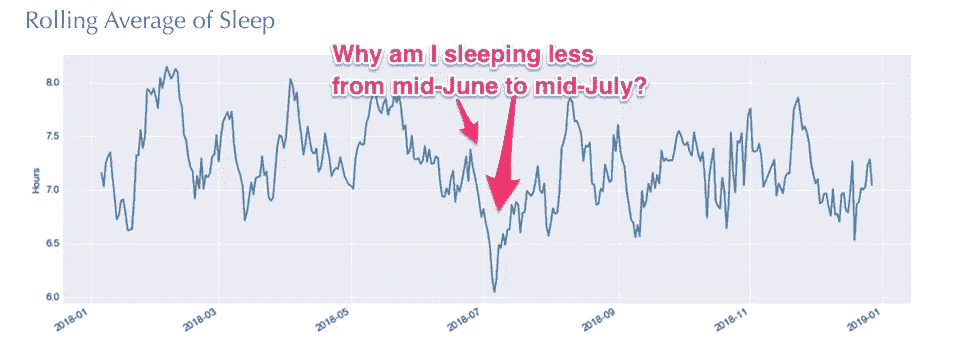
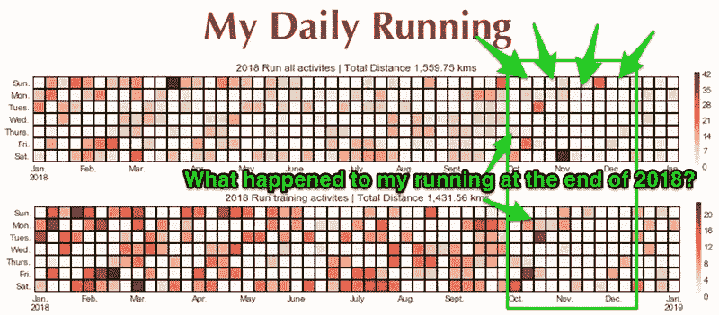
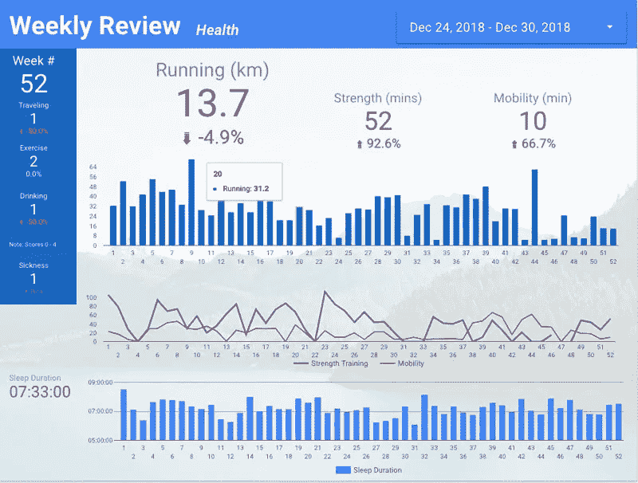
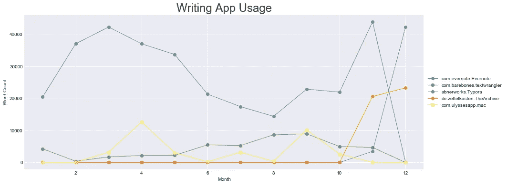
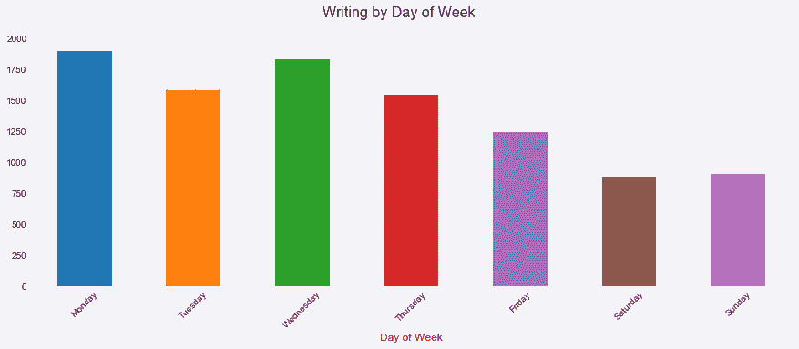
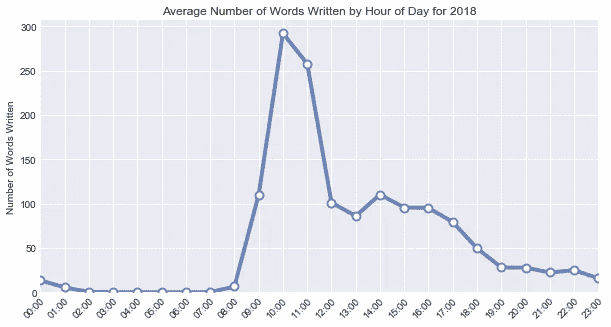
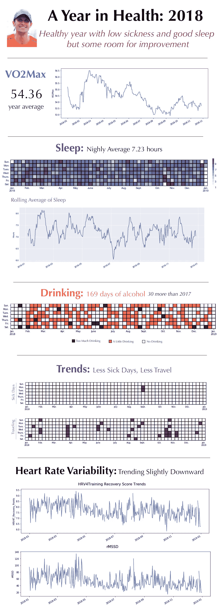
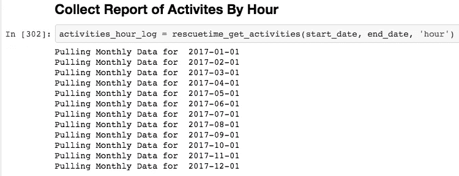
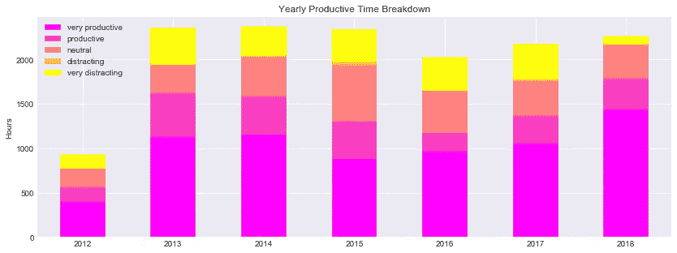

# 数据一年:2018

> 原文：<https://towardsdatascience.com/a-year-in-data-2018-d4445c8b7dce?source=collection_archive---------18----------------------->

## 从一年的自我追踪中，我们能学到和发现什么？

*追踪一个人的一生可以得出什么样的教训和观察结果？我们收集的所有数据可以用来更好地了解我们自己，甚至帮助我们变得更好吗？*

在开始分析之前，这里有三个“挑逗性”的数据可视化和问题，这些数据帮助我注意到并回答了去年的问题:

2018 年，我手动记录的大部分时间都用在了个人项目上，这很好。我仍然保持着体面的客户，自由职业者的收入，但我的重点仍然是自己的东西和业务。。如果这些是你的目标，这就是你的时间应该去的地方。但是发生在六月和八月？这两个月都出现了不错的时间记录下降。这两个月让我去演讲，参加更多的会议以及更多的旅行，包括和朋友去西藏和四川旅游一周。我的睡眠也讲述了另一个故事。

2018 年我平均每晚睡 7.23 小时，但从 6 月中旬开始发生了什么？为什么我的睡眠平均值下降了？世界杯！像许多人一样，我熬夜，喝了一点啤酒，因为我享受了一个史诗般的足球行动月。具有讽刺意味的是，其他领域也出现了下滑。我写得更少，锻炼也更少。具体图表见下图。

2018 年我跑了一年比较一致，一直到最后一个季度？发生了什么事？突然，我的跑步训练量大幅下降。这是由于一系列轻微到严重的伤病，我不能训练了。原因是什么？下面我检查了一系列其他跟踪的数据点，目前我的工作假设是一个起作用的因素是流动性/拉伸和力量训练的减少。

这是我使用简单但有规律的自我跟踪和数据收集创建的三个数据可视化，数据收集使用 [QS 分类账](https://github.com/markwk/qs_ledger/)。如果你有兴趣在未来一年创建类似的图表或变得更加数据驱动，请注册[我的简讯](https://int3c.us2.list-manage.com/subscribe/post?u=9678018750b254168e3a7033b&id=f4e2684697)以提前获得我的课程，2019 年初*谷歌数据工作室量化自我和数据驱动的生活*。

现在开始表演！

**我的数据驱动型年度评估**

年度回顾是目标导向型的人的主要任务，也是我自己喜欢做的事情。但鉴于我的中心论点是数据可以用来改善人类生活，我喜欢超越怀旧的思考或充满希望的战略愿望。**我喜欢用数据来充实我的一年回顾。**

让我在这里简单梳理一下我的核心信念:我们现在有足够多的廉价技术、传感器、小型电脑(即手机和可穿戴设备)和云存储，既可以跟踪很多领域，也可以存储大量的生活数据。这种活动通常被归类为量化自我、自我跟踪、个人信息学或数据驱动的生活。

基本上，它是人们收集生活中的数据并试图使用它。很简单，我可以也应该使用数据和自我跟踪，这样我们的生活就能被更好地理解和改善。这是数据驱动的个人发展 101。

因此，带着这些目标和希望，我很高兴分享最新版的**我的数据年**！

今年的报告包括我如何写作，我的电脑使用时间和项目时间，我完成任务的趋势，阅读的书籍和文章，我的健身努力，以及我用手机拍的一些照片。对于健康，我强调跑步，但也有一些关于睡眠和 HRV 的一般健康数据。显然，有一吨的数据可以用来切片和骰子，并告诉你一年的回顾故事。我选择这些是因为它们对我很重要，而且相对来说任何人都可以跟踪。

今年的一个好处是，不像去年的[数据年](http://www.markwk.com/2019/01/year-in-data.html#)，我也**开源并分享我用来创建这些图形的所有代码**。因此，对于任何有一些技术技能和时间的人来说，你也可以建立你自己的数据驱动的回顾年。此外，通过一些调整，您可以改变外观和感觉，或者进行额外的观察和分析。你可以在 [QS 分类账](https://github.com/markwk/qs_ledger/)找到代码，我在文章的最后分享了一些具体的做法。

希望到明年年底，我将有一个网络或移动应用程序，让任何人都可以更容易地做，甚至可以用数据创建一本关于你这一年的完整书籍。

来看看我这一年在数据上的故事吧！

(注意:虽然超出了这里的范围，但我也做了一些更深入的统计分析和机器学习方法来使用这些数据。现在，我将不得不把这个话题留给将来的文章。)

# 背景故事:从跟踪到处理数据的一年…

*(注意:本节将深入介绍细节，因此可以跳过下面的内容直接进入分析和数据，即！)*

首先，也许有必要告诉你一点关于我追踪的东西以及我为什么追踪这些东西。

我的一个核心信念是**数据和跟踪可以帮助我们更好地了解我们自己，并授权自我改善**。我跟踪不仅仅是因为我发现这是一个有趣的爱好。我跟踪自己的生活，以便更好地了解自己，进而做出改进和个人优化。追踪开始是有点怀疑地询问我的时间去了哪里，并扩展到其他领域，以了解生活中的活动如何相互影响。

*2018 年我追踪了什么？*我在 2018 年没有做太多明确的跟踪改变，相比[我在 2017 年跟踪的内容](http://www.markwk.com/2017/01/what-I-am-tracking-in-2017.html)，除了改变我跟踪习惯的方式(我现在使用 Habitica)和我测量设备屏幕时间的方式(我使用苹果的 screentime)。也就是说，我确实跟踪了我应得的份额，并将继续这样做。

如果你正在寻找关于你可能跟踪的事情的想法，请查看我的帖子:[2019 年你应该跟踪什么？](http://www.markwk.com/2019/01/what-should-you-track-in-2019.html)在这里，我将进入一个两步走的过程，即跟踪什么以及如何利用你的数据实现你的目标。

与 2017 年不同，我在 2018 年的主要关注点不是如何跟踪，而是数据参与。我的目标是让数据变得有用和有意义。我停止使用 Tableau，这是我在数据博客帖子中的 [2017 年我用于分析和图表的主要数据工具。Tableau 非常昂贵，作为一个拖放工具意味着不像在代码中那样容易再现数据可视化。这也意味着它不能扩展到创建未来的 web 工具或可共享的脚本。](http://www.markwk.com/2018/01/year-in-data.html)

由于今年重点关注 Python 的数据科学，我已经过渡到使用 Pandas 和 Matplotlib 来完成我的大部分数据分析工作，包括今年的数据审查。它还不是像素完美，但我对结果很满意。日复一日，我结合使用 IFTTT、Google Sheets 和 Google Data Studio 来驱动我的个人数据仪表盘。

实际上，这种对 Python 数据可视化的改变转化为我花了大量时间学习 Python，并为数据收集、数据可视化甚至一些机器学习编写代码。这是我多年来第一次使用 Python，我对可用的语言和工具非常满意。我在该地区的 PyCons 上的几次演讲中分享了我的学习和过程。最新版本可在:[如何成为数据驱动的你:从数据采集和数据处理到数据分析和数据可视化再到用 Python 进行机器学习和深度学习](https://rawgit.com/markwk/python4selftrackers/master/slides/index.html)。

此外，底层代码已经全部开源，可以在 Github 的 [QS 账本](https://github.com/markwk/qs_ledger/)上获得。事实上，这篇文章中的几乎所有内容都可以用你自己的数据和代码复制。除了代码中的数据分析，我唯一真正做的工作是将图表组合成一张图片，并用 Photoshop 添加一些样式。

总而言之，在 2018 年，我在 Apple Watch 上跟踪了我的步数、HR 和睡眠，用 Strava 跑步，用 Fitbod 应用程序进行力量训练，用 PhotoStats.io 拍摄照片，用 Goodreads 阅读书籍，用 Pocket/Instapaper 阅读文章，用 Todoist 完成任务，用 HR 训练心率变异性，用 PodcastTracker.com 收听播客，用 Toggl 进行项目时间，用 RescueTime 进行计算机时间。这些都是我拥有全年纵向数据的领域。

此外，我有一些血压和体重的定期检查数据，我还做了一些其他简短的跟踪实验，包括血糖监测和一个相当有趣的[粪便跟踪实验](http://www.markwk.com/poop-tracker.html)。

这些图表涵盖了健康、生产力、创造力、时间和其他一些领域，是我试图讲述的一个数据故事。2018 年是我超越自我跟踪和数据积累的一年，我开始更加自觉地使用和参与我的数据，以实现一个目标，即建立一个数据可以改善生活的世界。现在，我的目标是帮助人们了解使用跟踪数据达到目标的可能性，并为个人数据分析带来更多的可访问性。

受我收集、分析、可视化和构建的所有数据的启发，这是我的数据年！

# 我在谷歌数据工作室的一年概述:

在进入我的具体数据可视化之前，让我们快速看看我对 2018 年的最后一次每周回顾。下面是我的工作效率仪表板的样子:

以下是我的健康和健身数据:

我很高兴地说，我用一些很好的锻炼和一点休息结束了 2018 年。从全球来看，你可以看到睡眠和锻炼的一些趋势。我的睡眠在每周 27 至 29 日有一些大的下降。那里发生了什么？我的跑步在 2018 年初达到顶峰，但我没有在下半年保持这一趋势。我在机动性和力量训练中看到了类似的趋势。在我的工作时间里，总体趋势是积极的，但也有一些有趣的下降。

这些个人数据仪表板和报告是使用 Google Forms、Google Sheets 和 Google Data Studio 的组合创建的。你可以注册[我的时事通讯](https://int3c.us2.list-manage.com/subscribe/post?u=9678018750b254168e3a7033b&id=f4e2684697)以在 2019 年初首次获得我的课程*量化自我的谷歌数据工作室和数据驱动的生活*。

下面我们来看一下跟踪数据的分类。

# 一年时间:我在 Toggl 中使用计算机和记录项目时间的一年

几年来，我一直在记录我的电脑时间和手工记录的项目时间。这提供了一个有趣的机会去探索我的时间在一年中的各种变化。

总的来说，这是我最后一年的样子:

一些时间使用要点:

*   **2018 年更深入的工作:**我是卡尔·纽波特书和支持“深入工作”的论点的忠实粉丝基本上，他认为，在一个分心的世界里，那些能够专注于认知困难任务的人将会富有成效，富有创造力，并产生更高质量的工作。这就是我如何对待和安排我的一天。我早上和下午都在做重要的、有挑战性的工作。然后我在下午休息一会儿，锻炼、吃饭和散步。晚上，我做一些挑战性较小的任务和行政工作。实际上，这转化为几天的时间，我真的深入其中，花了 10 多个小时工作。我发现，再加上几天真正的休息，这种深度方法对我很有效。
*   **2018 年离开电脑 21 天:**我在电脑上度过了 344 天，低于前几年的 362 天(2017 年)、362 天(2016 年)和 364 天(2015 年)。基本上，我花了一些时间完全离开电脑。起初有点困难，但一两天后，不用打开电脑，而是以不同的方式创作、思考、写作和阅读，这是一种解放。我喜欢这种数字突破的想法，我将在 2019 年尝试再次这样做。
*   **更多的时间在软件开发和编码研究上:**根据 RescueTime 的实际程序使用情况，我在软件开发上多花了差不多 300(2018:563.7 小时 vs. 2017: 268.5 小时)。根据我的项目日志，我也达到了今年超过 312 小时的目标。虽然我已经做了很多年的开发人员，但这是我第一次有意识地想学习一门新的编程语言(Python)并更多地参与工程。此外，这也出现在一些附带项目或初创公司的努力中，包括我的应用 PhotoStats.io 和 BioMarkerTracker 以及 PodcastTracker.com。最大的事情仍然是 QS·莱杰(更多关于这一点在最后)。
*   **减少电子邮件:**我 2018 年的目标之一是减少电子邮件。2017 年，我在电子邮件上的时间超过了 149.8 小时，而可怕的是，2015 年我一年仅在电子邮件上就花了 405.1 小时。但在 2018 年，电子邮件甚至没有进入前 7 名。正如我喜欢说的，没有人会因为最快的邮件回复时间而获奖。但是他们确实因为完成了重要的、有价值的工作并且做得很好而得到它。有趣的是，与 2017 年相比，我在 2018 年花在组织工作上的时间也减少了，如项目，任务和目标规划。这可能意味着我知道我应该做什么，不会浪费在“生产力色情”上。
*   **更多的写作，努力成为职业作家:**我终于接受了写作不仅仅是个人爱好，我现在正在努力成为职业作家。我的数据揭示了花在写作上的时间意味着什么。根据 RescueTime 的纯应用程序使用日志，2018 年我花了 429.8 小时编写应用程序，相比之下，2017 年的 379.3 小时和 2016 年的 298.9 小时有所增加。根据我积极记录的“写作”项目时间，我在 2018 年花了 370 小时写作，而 2017 年花了 227 小时。虽然我没有发表很多博客，但我正在写一本书，并创建一个在线课程，这两者都与我的写作技能密切相关。

关于我的时间，我最大的收获是:我花了 25%的时间在电脑上，比花在项目上的时间少一点。这个项目时间与计算机时间的比率仍然是我工作效率的一个清晰的衡量标准。一天、一周或一年的 25%在电脑上似乎是一个不错的数字，我真的不认为我能在 2019 年做出更大的努力。我可以在某些方面变得更加有效和平衡。例如，我希望在客户端工作上更加一致，这样我就可以减少集群化，增加常规输出。此外，我应该得到报酬，所以我需要思考，并在来年努力获得报酬。基本上，我在过去的两年中创建了一系列的副业项目，所以我计划开展真正的针对性活动，努力创造收入。然而，从全球来看，如果我遵循我的一般时间管理和时间分配，在未来的一年里，大事情最终会发生。推那块巨石！

# 一年的健身和跑步

我在 2018 年跑了两次马拉松和两次半程马拉松，并在途中进行了有趣的跑步和训练。我是一个跑步爱好者，我发现这种定期锻炼对我的创造力和生活满意度产生了非常积极的影响。我仍在努力使我的力量训练和灵活性/伸展性更加一致。以下是我健身一年的情况:

通过查看这些数据并将其与 2017 年进行比较，最令人吃惊的发现之一是移动训练时间的大幅减少。我没有做那么多的运动后恢复(从 2017 年到 2018 年，移动时间减少了大约 40%)。这让我想知道这种缺乏拉伸和恢复是否是我在 2018 年受伤更多和表现更差的一个因素。

目前，我将假设它是，并将致力于增加我的移动工作，以达到 2017 年的水平。我希望这能减轻我的疼痛，并为来年的良好运行打下更坚实的基础。我应该能在未来几个月里梳理出一个效果。

下半年我的力量训练有所下降。我想在未来的一年里变得更强壮，肌肉更发达，所以力量训练将是主要的追求，希望我也能从数据中梳理出更多我的进步(或不足)。一致性才是王道。

# 完成的任务:我在 Todoist 的任务和项目中的一年

我仍然是 Todoist 的超级粉丝。本着 GTD 精神，Todoist 是一个优秀的[任务管理器，并提供了很好的数据可访问性，这也使它成为最好的](http://www.markwk.com/gtd-with-todoist.html)[任务跟踪器之一。](http://www.markwk.com/task-tracking-with-todoist.html)

我又一次在 2018 年完成了很多任务。我在数据分析中没有注意到这一点，但我已经开始更多地关注更高优先级的任务，而不仅仅是检查一堆中等重要性的东西。总体而言，正如我们在数据中看到的那样，2018 年的产量非常稳定:

虽然主热图显示了一年中相当一致的任务完成情况，但这个可视化的下半部分让我可以注意到某些项目活动增加的模式和特定时期。

例如，对于生产力任务，我们几乎在一年中的每个周日都能看到一致的苍白目的。这是我每周检查一两个任务并设定目标的时候。类似地，我的编码学习通常安排在周六完成，热图显示了这一趋势，同时也显示了更多任务的密度。找到一种更好地可视化项目任务的方法是很有趣的，这样我们就可以在一周中的不同象限中看到它们。

相比之下，我看到几个项目有周期性的集群。对于数据驱动的你(一个在线课程和书籍项目)、语言学习(我在 4 月份试图学习一些泰语)以及在某些旅行之前和期间的分散旅行任务来说，这是真实的。

总的来说，我对正在完成的任务感到满意，并将继续推动自己朝着目标前进。在未来，我希望能够更好地将我的任务与我的目标联系起来，这也是我现在试图以一致的方式跟踪的。

# 写作一年

2018 年是我真正接受写作作为职业追求的一年。我发表了 26 篇博文，为我正在创建的一门课程准备了十几篇课程文章，我还有一份正在进行中的手稿。写作对我来说是一种习惯，我仍然写很多东西作为学习和研究的一种形式，但它正在慢慢走向实际的可出版的手稿。

我的写作行为应该得到更好的数据分析，但目前，这里有一组基于 WordCounter 的数据可视化，这是一个 Mac 工具，我用它来计算我在一组选定的写作应用程序中每小时键入的单词数:

我的作品中有几个明显的要点:

*   一个上午写作的人:我坚持在早上写作，这既是一种生产习惯，也是为了我的工作。我写作的高峰时间是从上午 10 点到中午。我应该致力于在未来继续积极保护这段写作时间。很明显对我有效。
*   **一个不断变化的作家工具包:**对于[我的作家工具包](http://www.markwk.com/writing-tools.html)，我一直是 Evernote 的长期用户，但我最近转向用明文减价文件写作和记笔记。自从[从 Evernote](http://www.markwk.com/migrate-evernote-plaintext.html) 迁移出来，我就致力于这种新方法。这种对纯文本文件的改变也带来了跟踪我的写作的新能力。我也能跟上我的思想、学习和写作的发展。我计划很快就此分享一篇文章和代码。这将在未来几个月提供一些有趣的跟踪数据。
*   每月变化:我有一个一贯的写作习惯和产出，直到夏天事情开始下降。从 9 月到年底，活动再次增加。我不确定看到这种变化是件坏事。深度工作可以根据项目灵活安排。休息也是必要的。很高兴看到总体的一致性，但我喜欢在特定的时间和临近截止日期时深入努力，然后彻底休息。
*   **出版物数据分析在哪里？我肯定需要对我的实际手稿进行数据分析。我可以从一个简单的自动化脚本开始，从我过去的所有作品中提取字数和出版日期。这也是我要做的事情。**

# 睡眠与健康一年

自从我变得更健康，减肥，变得更加积极，我发现了很多关于自己和人类的事情。虽然我可以把这个放在开头，但我把这个可视化放在最后，因为它提供了一个有趣的方式来查看今年与这些趋势相关的其他方面。

让我们来看看数据:

以下是一些快速观察:

*   **2018 年是健康的一年:**我平均每晚睡眠约 7.23 小时，生病天数较少(2018 年 2 天，2017 年 5 天)，我的[最大摄氧量](http://www.markwk.com/2017/07/finding-my-vo2-max.html)，这是衡量你最大氧处理能力的指标，相当健康，我的[心率变异性【HRV】](http://www.markwk.com/hrv-for-beginners.html)相对稳定。
*   **为什么从 6 月到 7 月我的睡眠减少了？:**世界杯！你会听说世界杯对全世界的生产力都有影响。我确实从熬夜、喝啤酒和看大量足球比赛中看到了我自己的影响。开球也与一个大型演讲约会和准备活动重叠。
*   **(轻微)负面趋势:**我的几项健康指标呈轻微负面趋势，包括 HRV、最大摄氧量和我的一些睡眠。2018 年也喝的比较规律。如果我觉得 2018 年比 2017 年更好或更差，我自己的记忆是一个可怕的指标。我这一年过得不错，但我有一些数据可以看看，梳理出我的主观感受。就目前而言，这些核心指标确实需要一些努力来稳定下降趋势。在某些时候，我确实有一些跑步受伤和一定程度的个人压力。一些可能的选择是更好的睡眠模式(而不仅仅是更多的睡眠)，有意识的放松，也许是冥想。

关于我的健康，我最大的一般收获是:我还没有时间进行真正的统计数据分析，但这些健康可视化确实暗示了我健康的轻微负面趋势与我生活各个领域的影响之间的某种程度的联系和相关性，见其他图表。例如，有人可能会问:我睡眠时间的减少和饮酒量的增加是否影响了我的健康表现、创造力和学习能力？做较少的伸展和活动会影响其他区域吗？在特定时间起床对一天或第二天有什么影响？这些都是我希望在未来探索的问题，无论是对自己还是对他人。

现在，我主要可行的项目是安排更多的时间睡觉和伸展，再加上一些冥想。基本上，不要只是计划项目和目标，也要包括放松的项目。

反过来，我早就应该进行一些血液生物标志物测试，看看是否有一些营养或其他失衡问题我可以解决。我有一个关于最常见和最有用的血液生物标志物的[开源数据库](http://www.markwk.com/biomarkers.html)，如果你想了解更多信息或知道要做什么测试。

# 阅读一年

关于我阅读的内容和时间以及我个人最喜欢的书籍和文章的完整细节和信息图表，请参见: [2018:阅读年](http://www.markwk.com/2019/01/year-in-reading.html)。

# 照片一年

我们拍的照片也可以讲述一个关于我们生活的故事。这就是我开发 [PhotoStats.io](http://www.markwk.com/2019/01/www.photostats.io) 的动机，这是一款适用于苹果和安卓系统的手机应用，可以让你在本地统计和解析你的拍照生活。除了帮助你追踪照片历史和标记照片，该应用程序还提供了一些简单的图表和图形。人工智能支持的自动标记功能还可以帮助你分类和理解照片中的内容。

那么，*照片中的我这一年是什么样子的呢？*

我的照片数据揭示了一些有趣的事情。它显示我在周末拍了大部分照片。我拍了很多动物(狗和猫)的照片，也拍了很多自然照片。我使用 PhotoStats.io export 和 MapBox 地图设计工具创建的地图清晰地显示了我过去一年去过的地方，包括老挝之旅、四川公路旅行和西昌马拉松赛、马来西亚会议以及西藏徒步旅行。我还能看到我去年在新加坡、曼谷和成都附近的青城山的主要枢纽。

像许多人一样，2018 年我远离了大多数社交媒体。脸书和 Instagram 有太多的“表演”艺术和生活，而不是真实的生活，它可以变成我在时间和享受生活方面的负面影响。也就是说，我最终在 2018 年在 Instagram 上分享了大约 35 张照片，大部分是在年初，当时我有一些欧洲朋友来访。

总的来说，我发现照片数据仍然是理解生活的一种非常有趣的方式，我计划继续维护和添加 PhotoStats.io 应用程序的功能。如果你有兴趣，你可以在 [www.photostats.io 查看这个应用程序。](http://www.photostats.io.)假设你有最近几个月的大部分照片，它应该可以很好地给你一些总体趋势。

# 结论:大数字

以下是我 2018 年的“大”数字:

*   采取并记录了 3，878，369 个步骤。
*   在[www.markwk.com 上发表了 26 篇博文。](http://www.markwk.com.)
*   跑 1559.72 公里(969.16 英里)
*   2 完成 42.2 公里马拉松
*   2 完成 21.6 次半程马拉松
*   通过 [PhotoStats.io](http://www.markwk.com/2019/01/www.photostats.io) 拍摄、追踪 2991 张照片。
*   35 张通过我的 Instagram 发布在社交媒体上的照片(比 2017 年少了很多！)
*   94 天(的时间)在电脑上根据改期
*   根据人工时间跟踪，项目时间为 84 天
*   2212 在 Todoist 中完成了十几个项目的任务。
*   根据 GoodReads 的数据，60 本书阅读了 18657 页
*   通过 Pocket 和 Instapaper 阅读了 1785 篇文章
*   据 Trakt.tv 报道，他们看了 132 小时的电视和 82 小时的电影。
*   2018 年使用 Last.fm 收听和“搜索”了 16，855 首歌曲。我最喜欢的流派是 Synthwave、电子和 Synthpop。我最喜欢的歌曲是勒·马托斯的《冷夏》。我最喜欢的艺术家是乐卡带。

# 结论:离别的思念

好的。这是一年中的大量数据和数据可视化。总的来说，2018 年对我来说又是很好的一年。我保持健康，做对我重要的事情。我在财务上取得了一些进展，并致力于我的大愿景目标，即创造一个数据可以帮助改善和提高我们生活的世界。

显然，这种情况可能并不总是如此，未来的一年可能会在我的生活和数据中看到更糟糕的趋势。我可能会生病、受伤或抑郁。生活就是这样。我仍然致力于每年用数据讲述我的故事，一个真实的、个人的故事，不管那种生活是好是坏。

展望未来，我希望让这种跟踪和数据分析变得越来越容易被每个人理解。我目前正在*谷歌数据工作室为量化的自我*创建一个在线课程(计划在 2018 年初发布)和一个更长的课程*如何跟踪生活*。我在 QS·莱杰方面也取得了稳步进展，这是今年所有报告的主要代码。

如果你对使用数据来增强我们的世界和生活的可能性感到兴奋，请[加入我的简讯](https://int3c.us2.list-manage.com/subscribe/post?u=9678018750b254168e3a7033b&id=f4e2684697)或通过评论、电子邮件或社交分享来联系我。越来越多的人来烦我，加入我，肯定会推动我在未来的一年里在这些领域做更多的工作！

我希望你喜欢这篇文章，并发现它有趣和鼓舞人心。

祝你在新的一年里好运和快乐！

# 额外收获:用 QS 分类帐建立你自己的数据年度或数据驱动的年度回顾

《数据回顾》中我这一年的所有数据可视化都是使用[QS·莱杰](https://github.com/markwk/qs_ledger)创建的，这是一个 python 数据科学项目，专注于个人跟踪数据的数据收集和数据可视化。然后用 Photoshop 将它们组合起来。

唯一的例外是地图。这些是使用 MapBox 地图设计器创建的，并将基础数据导出到带有经度和纬度的 CSV 中。使用 MapBox 的在线数据集和制图工具，这是一个非常简单的过程。

在这一节中，我想简单介绍一下如何使用 QS 分类帐在数据中创建年份。

PS——如果你对 QS 账本中涉及的背景故事和数据科学感兴趣，并使用 Python 进行自我跟踪，请查看我在[如何成为数据驱动的你的详细幻灯片:从数据收集和数据处理到数据分析和数据可视化，再到使用 Python 进行机器学习和深度学习](https://rawgit.com/markwk/python4selftrackers/master/slides/index.html)。

跟踪注释:

为了跟进，你需要一直跟踪与 QS·莱杰集成的数据点之一。该项目目前集成了近 20 种不同的跟踪服务，如 Strava、Fitbit、Oura、RescueTime、Todoist 和许多其他服务。

安装 Anaconda 并下载代码和笔记本

首先，我推荐下载并使用 [Anaconda 发行版](https://www.anaconda.com/download/#macos)。这是一个 Python 的数据科学平台，包括一个简单的安装程序和你需要的主要软件包。

接下来在这里下载或者 git 克隆代码 repo:[https://github.com/markwk/qs_ledger.](https://github.com/markwk/qs_ledger.)

QS 莱杰是使用 Python 3 构建的，代码目前通过 Jupyter 笔记本共享。大多数服务依赖 Pandas 和 NumPy 进行数据操作，依赖 Matplot 进行数据分析和可视化。

在 QS 分类账目录中启动 Jupyter 笔记本

*   安装了 Anaconda 或同等软件后，打开命令行或终端应用程序。
*   定位至下载 QS 分类帐代码的位置。
*   在该目录中，只需命令`$ jupyter notebook`就可以在浏览器中启动 jupyter 笔记本程序。或者，您可以安装并使用 Jupyer Lab，它提供了更多的功能。

核心步骤:收集数据，运行分析

在接下来的步骤中，我们将浏览一个示例数据源，即 RescueTime。首先，我们将从 API 收集数据，然后运行一些数据分析代码。

虽然不同服务的细节可能略有不同，但基本方面基本上是相同的:在运行(和/或调整)数据分析之前收集数据。

示例:RescueTime 的数据收集

RescueTime 是我最喜欢的跟踪服务之一。它可以让您跟踪您的计算机使用时间的难以置信的细节。

在 Jupyer 笔记本的中，导航文件目录并打开 rescuetime 目录中的`rescuetime_downloader.ipynb`。如果你愿意，可以在网上看看代码:[https://github . com/markwk/QS _ ledger/blob/master/rescue time/rescue time _ downloader . ipynb .](https://github.com/markwk/qs_ledger/blob/master/rescuetime/rescuetime_downloader.ipynb.)

在该笔记本中，您将看到为收集数据进行重新时间设置的多个步骤。使用您自己的授权密钥遵循这些步骤。

完成后，运行所有单元格，开始收集数据。这可能需要几分钟，取决于您使用 RescueTime 的时间。

最终结果应该是几个导出的 csv 文件，您应该准备好做一些数据分析！

示例:重新计算时间的数据分析

现在是时候打开[rescue time _ data _ analysis . ipynb](https://github.com/markwk/qs_ledger/blob/master/rescuetime/rescuetime_data_analysis.ipynb)并运行数据分析了。

该笔记本的第一部分提供了一些关于你在电脑上花费的时间的一般数据分析，包括你的主要类别和应用程序的细分，每月生产时间与分心时间的细分，以及其他一些报告。我建议一个接一个地浏览第一部分，对您的数据有一个大概的了解。

以下是我的年度明细:

数据分析的后半部分允许您设定目标年份，然后查看您的年度分析。默认情况下，它被设置为当前年份，但是您可以调整它来查看与上一年的比较。我们再一次看到了热门应用和月份的细分。此外，还有一个热图，让您可以查看一年中哪一天工作效率最高，或者您使用电脑的时间最多。最后还有一个小时图表，显示你一天中哪几个小时效率最高。

这是我每天工作时间的热图:

虽然不可否认的是，代码确实需要在未来的一年中进行一些清理，但大多数代码都有很好的文档记录，并且清楚地说明了它在做什么，因此您应该能够调整和调整以查看时间数据的不同方面。如果您有任何问题，请在 github.com 的问题队列中留言。

下一步:其他服务的数据收集和数据分析。

现在我们已经看到了一个使用 RescueTime 进行数据收集和数据分析的示例，您可以继续为其他跟踪服务收集和生成数据报告。这包括锻炼、睡眠、完成的任务等数据。

我强烈建议使用相同的可视化方式并排比较不同的跟踪数据，看看是否能注意到任何可能的趋势或联系。

此外，还有一个[示例笔记本，展示如何将多个数据源组合成一个数据框](https://github.com/markwk/qs_ledger/blob/master/Example_Combined_Personal_Data.ipynb)。这可以用来创建包含多个数据点的图表，[探索相关性](https://github.com/markwk/qs_ledger/blob/master/example_correlation_explorer_with_plotly.py)甚至使用机器学习进行预测、聚类和预测。

祝你的数据分析和自我跟踪好运，我迫不及待地想看看你创造了什么！

【www.markwk.com】最初发表于**。**