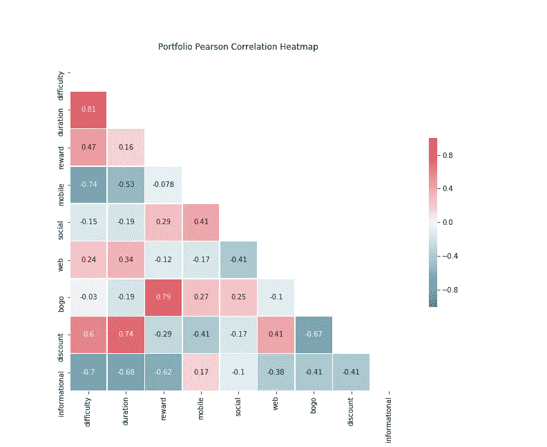
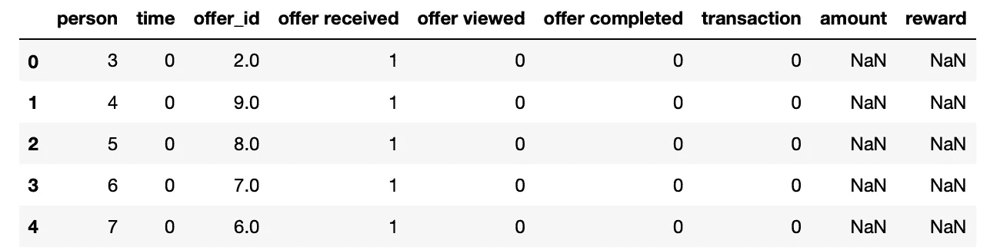
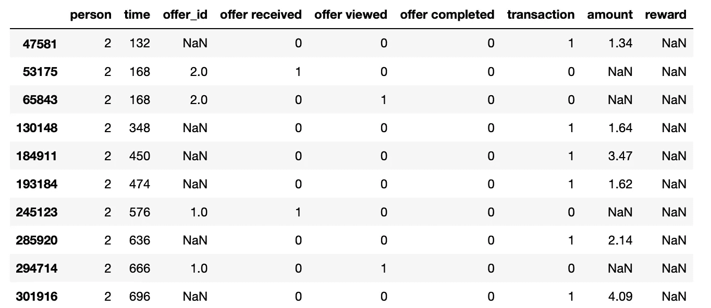

# 星巴克的 A-Z 特性工程

> 原文：<https://towardsdatascience.com/a-z-feature-engineering-with-starbucks-b40c47462de9?source=collection_archive---------26----------------------->

Photo by [Erik Mclean](https://unsplash.com/@introspectivedsgn?utm_source=medium&utm_medium=referral) on [Unsplash](https://unsplash.com?utm_source=medium&utm_medium=referral)

据估计，80%的数据科学过程致力于收集数据并将其塑造成可行的形状。许多组织坐拥大量数据，这些数据可能以各种形式出现。

在本帖中，我们将看到商业头脑和以客户为中心的方法如何转化为获得有用的见解，即所谓的[特征工程](https://en.wikipedia.org/wiki/Feature_engineering)。

[数据](https://github.com/NadimKawwa/starbucks/tree/master/data)可以在 github 上找到，包含星巴克奖励移动应用程序上的模拟客户行为，就像在现实生活中发生的一样。每隔几天，星巴克就会向手机应用程序的用户发出一次报价。

开始时严格的方法论可以转化为无缝的实现，比如制作一个[推荐引擎](/how-to-build-a-recommendation-engine-for-starbucks-662a982df0c2)。

这篇文章的解释和代码注释非常冗长:它试图阐明特性工程过程中的每一个步骤。

# 数据集

Photo by [Etty Fidele](https://unsplash.com/@fideletty?utm_source=medium&utm_medium=referral) on [Unsplash](https://unsplash.com?utm_source=medium&utm_medium=referral)

数据集被分成三个 [JSON](https://en.wikipedia.org/wiki/JSON) 文件:

*   *portfolio* :包含要约 id 和关于每个要约的元数据(持续时间、类型等)。)
*   *配置文件*:每个客户的人口统计数据
*   *抄本*:交易、收到的报价、查看的报价和完成的报价的记录

每个文件处理特征工程过程的一个主题。我们的最终目标是将这三个文件汇集成一个全面的用户特征数据框架和一个用户项目矩阵。我们将利用 [python 3.x](https://www.python.org/downloads/) 库，如 [pandas](https://pandas.pydata.org) ( *pd* )、 [numpy](https://numpy.org) ( *np* )、[matplotlib](https://matplotlib.org)(*PLT*)、以及 [seaborn](https://seaborn.pydata.org) ( *sns* )。

# 投资组合

Photo by [Bundo Kim](https://unsplash.com/@bundo?utm_source=medium&utm_medium=referral) on [Unsplash](https://unsplash.com?utm_source=medium&utm_medium=referral)

第一个文件处理可能仅仅是一个饮料广告或实际优惠的优惠，如折扣或买一送一( *BOGO* )。某些用户可能在特定的几周内收不到任何报价。

我们使用 [pandas.read_json](https://pandas.pydata.org/pandas-docs/stable/reference/api/pandas.read_json.html?highlight=read_json#pandas.read_json) 方法加载投资组合

我们可以在单一视图中显示产品组合:

Portfolio

下面是我们原来栏目的解读，建议在开头用 [pandas.dtypes](https://pandas.pydata.org/pandas-docs/stable/reference/api/pandas.DataFrame.dtypes.html) 来确认数据类型。

*   *id* (字符串)—报价 id
*   *offer_type* (string) —优惠类型，即 BOGO、折扣、信息
*   *难度*(int)——完成报价所需的最低花费
*   *奖励*(int)——完成一个要约给予的奖励
*   *持续时间* (int) —报价开放的时间，以天为单位
*   *通道*(字符串列表)

我们注意到 *offer id* 是一系列没有特定含义的字符串，用整数替换它们会很有用。如果这些整数在编号背后有某种意义，那就更有用了:让一个更小的 *offer id* 表示更容易的难度。

我们利用 python 内置的 [zip](https://docs.python.org/3.3/library/functions.html#zip) 和 [dict 构造函数](https://docs.python.org/3/library/stdtypes.html#dict)将报价映射成整数。如果我们需要返回，我们为另一个方向创建一个字典。

此外，我们可以看到*渠道*只能接受四个值:电子邮件、手机、媒体和社交。假设它是一个嵌套在列中的列表，我们使用 [pandas.get_dummies](https://pandas.pydata.org/pandas-docs/stable/reference/api/pandas.get_dummies.html) 和 [pandas。系列](https://pandas.pydata.org/pandas-docs/stable/reference/api/pandas.Series.html):

结果是一个可读性更好的表，其中 1 表示真，0 表示假。我们将同样的方法应用于 *offer_type* 特征。我们将同样的方法应用于 *offer_type* 列，并创建一个 *offer_type_dum* 表。

对于奖励和难度，我们对单位了解不多。奖励是美元还是一些 app 币？难度是如何衡量的？不确定性是数据科学过程的一部分，在这种情况下，我们将保持这两个特征不变。

我们将把持续时间转换成小时，因为我们将在后面看到它将与抄本数据集中的单位相匹配。我们可以用 [pandas.concat](https://pandas.pydata.org/pandas-docs/stable/reference/api/pandas.concat.html) 、 [replace](https://pandas.pydata.org/pandas-docs/stable/reference/api/pandas.Series.replace.html) 和 [reset_index](https://pandas.pydata.org/pandas-docs/stable/reference/api/pandas.DataFrame.reset_index.html) 创建一个干净的投资组合。：

结果是一个干净得多的桌子可以自己站立。

我们可以使用这些清理后的数据，用几行代码创建一个 [Pearson correlation](https://en.wikipedia.org/wiki/Pearson_correlation_coefficient) 热图:

热图揭示了一些有趣的相关性，例如 BOGO 的提议往往与更高的回报相关。

在*组合*中，我们看到了简单的清理步骤如何让数据自己讲述一个故事。在下一节中，我们将看到如何处理丢失的值。

# 用户概要

Photo by [Nathan Dumlao](https://unsplash.com/@nate_dumlao?utm_source=medium&utm_medium=referral) on [Unsplash](https://unsplash.com?utm_source=medium&utm_medium=referral)

我们以与投资组合类似的方式下载*个人资料*数据，下面是一个示例截图:

我们在以下特征空间下总共有 17，000 个观察值:

*   *年龄* (int) —客户的年龄(如果未知，则为 118)
*   *成为会员日期* (int) —客户创建 app 帐户的日期
*   *性别* (str) —客户的性别(注意，有些条目包含“O”表示其他，而不是 M 或 F)
*   *id* (str) —客户 id
*   *收入*(浮动)—客户收入

我们马上就可以看到，缺少值是一个问题。我们使用 [pandas.isna](https://pandas.pydata.org/pandas-docs/stable/reference/api/pandas.DataFrame.isna.html) 和 [pandas.mean](https://pandas.pydata.org/pandas-docs/version/0.23.4/generated/pandas.DataFrame.mean.html) 方法来查看缺失值的分数:

有趣的是，收入和性别都有相同比例的缺失值。对于同样的用户，我们是否对年龄、性别和收入一无所知？我们可以用一个[断言](https://docs.python.org/3/reference/simple_stmts.html?highlight=assert)语句来检验这个假设:

语句传递:原来这是同一批用户。

当处理缺失值时，我们必须问我们在模型中注入的方差和偏差是什么。丢弃所有丢失的值可能会使模型失去有用的信息。对于收入和年龄，我们查看没有缺失值的数据分布。

我们看到均值和中位数几乎是一样的。因此，如果我们[估算](https://scikit-learn.org/stable/modules/generated/sklearn.impute.SimpleImputer.html)中值，我们不期望均值或方差发生变化。

对 T2 来说，性别问题更加微妙。2018 年[亚马逊因对女性有偏见而废弃了他们的人工智能招聘工具](https://www.reuters.com/article/us-amazon-com-jobs-automation-insight/amazon-scraps-secret-ai-recruiting-tool-that-showed-bias-against-women-idUSKCN1MK08G)。性别是自我报告的，我们会把回答了其他问题的人和不想回答的人归为一类。

用户 *id* 是一系列没有特定含义的字符串，我们可以像以前一样创建一个 *human_to_int* 字典。

最后一个特征是客户创建账户的日期。这一特征对于衡量客户任期似乎很重要。然而，如果我们不能参照某个时间点，时间的度量就没什么用了。我们决定放弃*的*特性。

# 副本

Photo by [Carli Jeen](https://unsplash.com/@carlijeen?utm_source=medium&utm_medium=referral) on [Unsplash](https://unsplash.com?utm_source=medium&utm_medium=referral)

最终的数据集也是最有趣和最复杂的。以下是文字记录的样本:

其特点是:

*   *事件* (str) —记录描述(即交易、收到的报价、查看的报价等。)
*   *人员* (str) —客户 id
*   *时间*(int)——自测试开始后的时间，以小时为单位。数据开始于时间 t=0
*   *值* —(字符串字典)—报价 id 或交易金额，取决于记录

我们可以看出这份记录需要大量的清理工作。首先，在*事件*列上应用 *get_dummies* 方法是有帮助的。

我们可以通过将值列转换成一个序列来分解值列中的值。

我们看到键，现在是列，有四个不同的值。似乎 *offer id* 和 *offer_id* 是两个独立的列，可能是记录数据时出错。我们可以通过查看这两列是否互斥来检查这一点:

该行返回一个空数据帧。这意味着 *offer id* 中没有值包含在 *offer_id* 中，这两列之间没有明显的冲突。我们可以用熊猫来纠正这个错别字。

我们现在可以创建一个结合了这些列并使用了 *human_to_int* 和 *offer_to_int* 字典的抄本 _comb 数据框架。此外，我们建议使用 [pandas.map](https://pandas.pydata.org/pandas-docs/stable/reference/api/pandas.Series.map.html?highlight=map#pandas.Series.map) 而不是 pandas.replace 来提升[性能](https://stackoverflow.com/questions/20250771/remap-values-in-pandas-column-with-a-dict)。

组合的数据帧*抄本 _ 梳*看起来像:

我们可以调查*人物 2* 并查看他们的历史样本:

请注意，时钟不会在*时间=0* 时开始计时。这与给定条件表相冲突，记住总是要验证陈述，并且在证明之前不要假设为真。用户也有在报价前发生的购买，我们没有明确的方法知道后来的购买是否是因为报价。

此外，开始时间不依赖于某些参考，比如用户注册的日期或一天中的时间。因此，我们将假设观察期不受[季节性](https://en.wikipedia.org/wiki/Seasonality)的影响。

考虑下面显示的另一个人: *person 35* 。这位客户在 *time=0* 收到报价，立刻打开，6 小时内成交。

另一方面，他们在 *time=168* 收到一个报价，立刻打开，在 *time=336* 收到另一个报价，再次打开，在此期间没有完成两个报价就花了钱。

这两个案例揭示的是，支出还没有被标记，并且多个提供可以同时发生。这与现实中用户收到可以组合在一起的多个报价没有什么不同。

在某些情况下，用户没有看到报价，仍然会花钱。假设他们的消费是因为一个提议，这将是一个严重的高估。

我们将假设用户受到被查看的第一个要约的影响，该第一个要约将是被发送的第一个要约。下表是这一假设的示意图，也是整篇文章的症结所在:

考虑将接收两个要约 O1 和 O2 的单个用户，使得在接收到 O1 的时间 T0 记录时间。在 T0，用户不受任何报价的影响。从 T1 开始，用户看到了 O1，因此任何购买都是因为 O1 而完成的。

在 T1，用户也接收到 O2，但是还没有看到它。在 T2，可以看到 O2 的报价，但是用户仍然受到 O1 的影响。只有过了 O1 的有效期，才能认为购买是因为 O2 而完成的。

这是一个简化，被认为是这个职位的范围所必需的。在现实中，更详细的评估将包括至少 90 个可能的报价组合，并可能根据难度、报酬和沟通媒介等指标来确定哪个报价将占主导地位。

我们的目标是创建这样一个函数，为一个交易分配一个报价 id。此外，我们希望测量用户行为，如打开时间和完成时间，如果可能的话，到一个时态表。

我们从返回 iterable 的每个部分的成对函数开始。

我们定义 *person_fill_na.py* 为交易分配*报价 id* ，如下所示:

注意，在上面的函数中，我们将*开始时间*和*结束时间*定义为报价持续时间的一部分。事实上，相对于报价来衡量用户的反应比用绝对数字来衡量更有意义。

我们用*转录本 _ 填充 _ 钠. py* 构建了上面的函数。

在预期的[管道](https://www.infoworld.com/article/3198252/data-in-intelligence-out-machine-learning-pipelines-demystified.html)中，使用一个清理器函数从数据库中获取数据并返回清理后的数据帧是很有用的。为此，我们定义了一个*抄本 _cleaner.py* :

在将来的应用程序中，我们可以用一行代码来处理这个脚本:

# 把所有的放在一起

Photo by [Gabi Miranda](https://unsplash.com/@gabimirandan?utm_source=medium&utm_medium=referral) on [Unsplash](https://unsplash.com?utm_source=medium&utm_medium=referral)

## 创建用户数据框架

清理完所有三个文件后，我们可以开始组装带有 [pandas.merge](https://pandas.pydata.org/pandas-docs/stable/reference/api/pandas.DataFrame.merge.html) left join 的表，以便在一个公共键上进行一对多匹配。一个 [pandas.groupby](https://pandas.pydata.org/pandas-docs/stable/reference/api/pandas.DataFrame.groupby.html) 语句按用户和项目聚集统计数据。此外，我们将沟通渠道乘以被看到的时间量，从而相应地分配权重。

下一步，我们将思考什么是总和统计，什么是平均值统计。我们可以在下面的代码中看到，事务的数量应该是一个总和，而时间的度量应该是一个平均值。

最后，我们通过内部连接创建用户数据框架。我们还定义了更多功能，例如:

*   *amount_pct* :因促销而花费的钱的百分比
*   看过的出价与收到的出价的比率
*   *已完成 _ 比率*:已完成报价与已收到报价的比率

我们还用 1 填充*完成时间*和*打开时间*，这样 0 表示非常高的响应率，1 表示很少响应或没有响应。

user_df 现在是每个用户的个人资料和消费习惯的大规模特征集。下图展示了 23 个特性中的一小部分。

## 用户-项目矩阵

创建用户项目矩阵不太复杂，因为我们使用来自清理函数的*抄本 _ 完整的*:

得到的*用户条目*数据帧是:

# 摘要

Photo by [Hans Vivek](https://unsplash.com/@oneshotespresso?utm_source=medium&utm_medium=referral) on [Unsplash](https://unsplash.com?utm_source=medium&utm_medium=referral)

清洁过程绝不是一项简单的任务，需要所有负责方的审慎判断。大多数真实世界的数据是杂乱无章的，形式混乱，需要验证其可靠性。

引用[凯茜·奥尼尔和瑞秋·舒特](http://shop.oreilly.com/product/0636920028529.do)的话，一名数据科学家将时间花在了:

> 数据将如何用于决策，以及它将如何重新构建到产品中[…]她在收集、清理和挖掘数据的过程中花费了大量时间，因为数据从来都不是干净的。这个过程需要持久性、统计学和软件工程技能——这些技能对于理解数据中的偏差和调试代码的日志输出也是必要的。

我希望这篇文章对你有用！特别感谢 [Udacity](https://www.udacity.com) 和星巴克的合作，并使这些数据可用。