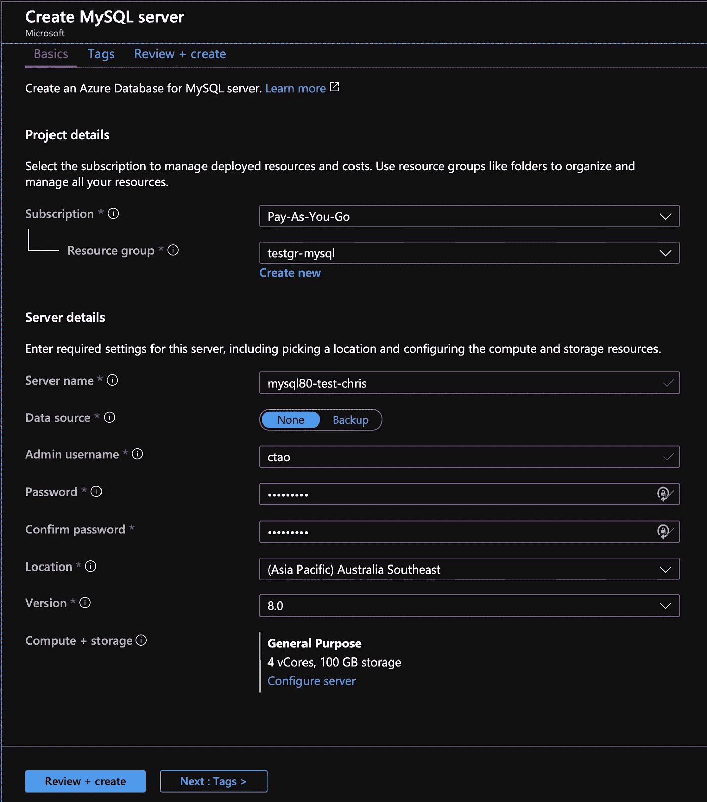
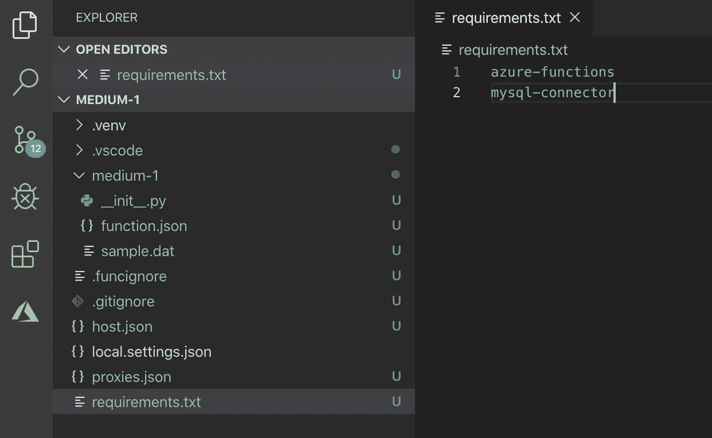
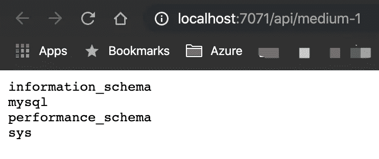

# 使用 SSL 证书验证从 Azure 函数访问 MySQL 的 Azure 数据库

> 原文：<https://towardsdatascience.com/access-azure-database-for-mysql-from-azure-functions-with-ssl-certification-verification-b6c6784f76fb?source=collection_archive---------10----------------------->

## 一种连接 MySQL 的安全方式，可防止中间人攻击


Photo by [Dayne Topkin](https://unsplash.com/@dtopkin1?utm_source=medium&utm_medium=referral) on [Unsplash](https://unsplash.com?utm_source=medium&utm_medium=referral)

最近，我有一个客户需要管理相对较少的数据。所以，我建议 MySQL 用 Azure 数据库。基本上，最小的实例成本大约每月 560 澳元就足够了。此外，因为这是 DBaaS，所以客户不需要雇用更多的人来维护它。

客户还希望自动化这个 MySQL 数据库的 ETL 过程。虽然我认为数据工厂将是理想的解决方案，但成本可能是一个大问题，因为 ETL 必须每 5 分钟进行一次，这将过于频繁地触发业务流程，并导致“休克”账单。因此，我建议使用 Azure Functions，它是一个无服务器的计算解决方案来完成这个 ETL。另一个原因是数据转换并不太复杂，一旦完成就很少会改变。

然而，当我使用 python 实现这个 Azure 函数来连接 Azure MySQL 服务器时，我遇到了一个问题。也就是说，MySQL 实施了 SSL 加密，但是 Azure 函数端不提供证书。在我们的案例中，禁用 SSL 实施不是一个选项，因为我们不想将客户的数据置于诸如中间人攻击这样的危险境地。因此，我需要解决这个问题，最后，我做到了。以下是重现问题的步骤和解决方法。

# 步骤 1:为 MySQL 创建 Azure 数据库

进入你的 Azure 订阅，点击**创建资源** - >搜索 MySQL 的 **Azure 数据库** - >创建

在**创建 MySQL 服务器**页面中，填写资源组、服务器名称和其他必填字段。在这个例子中，我选择 MySQL v8.0，然后点击**审核+创建**->-**创建**



为了能够在本地机器上测试你的 Azure 功能。不要忘记将您的本地 IP 地址添加到连接安全设置中。具体来说，转到我们刚刚创建的 Azure MySQL。在左侧导航的`Settings`部分选择`Connection security`。然后在右主视图上点击`+ Add client IP`按钮。这将自动将您当前的 IP 地址添加到白名单中。然后，点击`Save`。


# 步骤 2:创建 Azure 函数

为了开发的简单性，我更喜欢用 VS 代码创建 Azure 函数。您需要为 VS 代码安装 Azure Functions 扩展。完成后，你应该可以在左侧看到额外的 Azure 按钮。单击按钮并按照说明登录到您的 Azure 帐户。

在 Mac 上按`cmd+shit+p`或在 Windows 上按`ctrl+shift+p`调用命令面板，然后选择`Create New Project`


在这个例子中，我将使用 python 作为开发语言。


然后，选择 HTTP 触发器，因为它更易于测试。


然后，完成说明的其余步骤。

# 第三步:为 Python 安装`mysql-connector`

在你的 VS 代码终端，使用`pip`安装 Python 的`mysql-connector`库。

```
$ pip install mysql-connector
```

此外，不要忘记将依赖项添加到`requirements.txt`，因为 Azure 函数依赖于这个文件来为你的应用安装 Python 依赖项。



# 步骤 4:编写 Python 代码来连接 MySQL 服务器

转到您刚刚创建的 MySQL 的 Azure 数据库。记下服务器名称和登录名。


代码只是连接到 MySQL 服务器并显示所有的数据库。

```
import logging
import azure.functions as funcimport mysql.connectordef main(req: func.HttpRequest) -> func.HttpResponse:
    logging.info('Python HTTP trigger function processed a request.') # Connect to MySQL
    cnx = mysql.connector.connect(
        user="ctao@mysql80-test-chris", 
        password='<your_password>', 
        host="mysql80-test-chris.mysql.database.azure.com", 
        port=3306
    )
    logging.info(cnx) # Show databases
    cursor = cnx.cursor()
    cursor.execute("SHOW DATABASES")
    result_list = cursor.fetchall()
    # Build result response text
    result_str_list = []
    for row in result_list:
        row_str = ', '.join([str(v) for v in row])
        result_str_list.append(row_str)
    result_str = '\n'.join(result_str_list) return func.HttpResponse(
        result_str,
        status_code=200
    )
```

# 步骤 5:运行 Azure 函数(重现问题)

您可以部署 Azure 函数以在生产环境中测试它，或者在 VS 代码终端中运行以下命令以在本地测试它。

```
$ func start run
```

Azure 函数运行后，访问 URL 以尝试获取数据库列表。

如果在本地运行，URL 应该如下所示

> [http://localhost:7071/API/<](http://localhost:7071/api/medium-1)

不出所料，你的浏览器会报错 HTTP 错误 500。如果您返回到 VS 代码终端，您会在控制台中看到一些错误消息。这个问题的关键在图像中突出显示

> 异常:编程错误:9002 (28000):需要 SSL 连接。请指定 SSL 选项，然后重试。


# 步骤 6:添加证书文件并在 Python 中正确使用它

老实说，这个问题困扰了我一段时间，但我最终解决了它。

首先，获取证书文件并不困难。你可以从微软 Azure 官方文档网站下载，在[这个页面](https://docs.microsoft.com/en-us/azure/mysql/howto-configure-ssl)。我会把下载链接直接贴在这里:

[https://www . digicert . com/CACerts/baltimorecybertrustrust root . CRT . PEM](https://www.digicert.com/CACerts/BaltimoreCyberTrustRoot.crt.pem)

用 Python 引用也不难。通常，您可以使用任一相对路径:

```
crtpath = '../BaltimoreCyberTrustRoot.crt.pem'
```

或绝对路径:

```
crtpath = '/User/.../BaltimoreCyberTrustRoot.crt.pem'
```

然后，只需将`path`变量放入`connect`函数中:

```
# Connect to MySQL
cnx = mysql.connector.connect(
    user="ctao@azure-mysql-test", 
    password='<your_password>', 
    host="azure-mysql-test.mysql.database.azure.com", 
    port=3306,
    ssl_ca=crtpath
)
```

**然而**，在你部署 Azure 功能后**不会**工作。

这是因为 Azure Function 会自动将你的代码部署到实际后端服务器上`/var`下的某个地方，而你根本没有访问这个服务器的权限。

在这种情况下，我们必须让 Python 找到证书文件的正确位置，这肯定是可行的。我们可以用`__file__`。

让我们将证书文件放在项目的根路径中。因此，如果以后我们有更多的 Azure 功能，并希望重用这个证书文件，它可以确保我们可以以正确的方式引用它。


然后，编写一个函数来获取这个文件

```
import pathlibdef get_ssl_cert():
    current_path = pathlib.Path(__file__).parent.parent
    return str(current_path / 'BaltimoreCyberTrustRoot.crt.pem')
```

注意，第一个`.parent`将返回 Azure 函数的根路径，我们需要另一个`.parent`来确保它返回项目的根路径。这意味着，如果你喜欢把证书文件放在 Azure 函数的根路径中，你只需要一个`.parent`。

之后，按如下方式更改连接代码:

```
cnx = mysql.connector.connect(
    user="ctao@mysql80-test-chris", 
    password='<your_password>', 
    host="mysql80-test-chris.mysql.database.azure.com", 
    port=3306,
    ssl_ca=get_ssl_cert()
)
```

# **现在就来试试吧！**

再次访问网址，你将能够看到数据库列表！



这将在您的本地机器上和部署您的 Azure 功能后都有效。

[](https://medium.com/@qiuyujx/membership) [## 通过我的推荐链接加入灵媒-陶

### 作为一个媒体会员，你的会员费的一部分会给你阅读的作家，你可以完全接触到每一个故事…

medium.com](https://medium.com/@qiuyujx/membership) 

如果你觉得我的文章有帮助，请考虑加入 Medium 会员来支持我和数以千计的其他作者！(点击上面的链接)