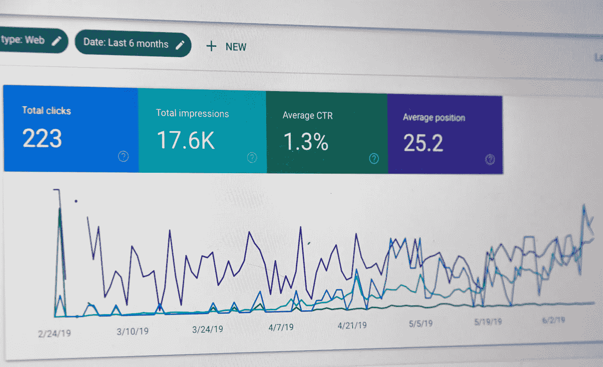

# 如何通过使用 Python 获得更多的 Google 搜索控制台数据

> 原文：<https://towardsdatascience.com/access-google-search-console-data-on-your-site-by-using-python-3c8c8079d6f8?source=collection_archive---------14----------------------->


[谷歌搜索控制台](https://search.google.com/search-console/about)(之前的谷歌网站管理员工具)是谷歌提供的一项网络服务，帮助你监控和维护你的网站在**谷歌搜索结果**中的显示。它也是一个很好的工具，可以用来分析从谷歌到你的网站的有机搜索。



Google Search Console UI (credit to [unsplash](https://unsplash.com))

谷歌搜索控制台是伟大的，但它的数据只有过去 1 年零 4 个月。如果你想查看历史数据超过时期，可惜你不能！:(

幸运的是，Google 为我们提供了一个[搜索控制台 API](https://developers.google.com/webmaster-tools/search-console-api-original/) 来访问 Google 搜索控制台中的数据。使用这个 API，您可以访问您站点上的数据，并将它们存储在您的首选数据库中，用于分析或其他目的。

# 使用搜索控制台 API

在开始编码之前，您应该准备好您的搜索控制台 API。我以前写过一篇文章，介绍如何通过客户端 ID 访问您的 [Google 服务。您应该能够获得包含密钥的 JSON 文件来访问您的 Google 搜索控制台。](https://medium.com/@chingjunetao/simple-way-to-access-to-google-service-api-a22f4251bb52)

[](https://medium.com/@chingjunetao/simple-way-to-access-to-google-service-api-a22f4251bb52) [## 访问 Google 服务 API 的简单方法

### 我们大多数人肯定会使用谷歌提供的至少一项服务。自从我成为一名互联网数据分析师后…

medium.com](https://medium.com/@chingjunetao/simple-way-to-access-to-google-service-api-a22f4251bb52) 

# 访问搜索控制台 API

## 入门指南

在本教程中，我们将使用 google-auth-oauthlib(一个 google 认证库)来访问 API。

```
pip install google-auth-oauthlib
```

您需要将`https://www.yourwebsite.com/`更改为您自己的站点。对于`OAUTH_SCOPE`，Google 搜索控制台 API 只有 2 个 OAuth 作用域。

## 建筑连接

第一次，您需要使用基于此 web 身份验证流程的 web 浏览器登录。之后，它会将您的凭证保存在 pickle 文件中。以后每次运行该脚本时，它都会使用存储在`config/credentials.pickle`中的“腌制”凭证来建立与搜索控制台的连接。

## 提取数据

对于每个请求，数据数量有一个限制，即 25，000 行。如果数据超过 25，000 行，您必须将它们分成多个请求。

```
request = {            
'startDate' : date,            
'endDate' : date,            
'dimensions' : ["query","page","country","device"],                       'searchType': "Web",
'rowLimit' : maxRows,            
'startRow' : i * maxRows        
}
```

这是请求数据时必须发送的 JSON 格式的请求。在这种情况下，我想用查询的维度*(搜索关键字)*、页面、国家和设备提取我前面定义的日期的数据。搜索类型将是 Web only(也有图像和其他选项)。更多细节，可以参考[文档](https://developers.google.com/webmaster-tools/search-console-api-original/v3/searchanalytics/query)。

获得数据后，您就可以开始工作了！你可以把它存放在任何地方。在我的例子中，出于分析目的，数据将存储在 BigQuery 中。

希望这篇文章能帮助你理解搜索控制台 API 以及如何使用它。

可以在我的 [**Github**](https://github.com/chingjunetao/google-service-with-python/tree/master/google-search-console-api) 中查看完整脚本。干杯！

**如果你喜欢读这篇文章，你可能也会喜欢这些:**

[](/how-to-master-python-command-line-arguments-5d5ad4bcf985) [## 如何掌握 Python 命令行参数

### 使用命令行参数创建自己的 Python 脚本的简单指南

towardsdatascience.com](/how-to-master-python-command-line-arguments-5d5ad4bcf985) [](/how-to-style-your-dataframe-with-python-eabf376d1efd) [## 如何用 Python 设计你的数据框架

### 如何使用 Python 高亮显示、格式化或着色您的数据框

towardsdatascience.com](/how-to-style-your-dataframe-with-python-eabf376d1efd) 

**你可以在 Medium 上找到我其他作品的链接，关注我** [**这里**](https://medium.com/@chingjunetao) **。感谢阅读！**