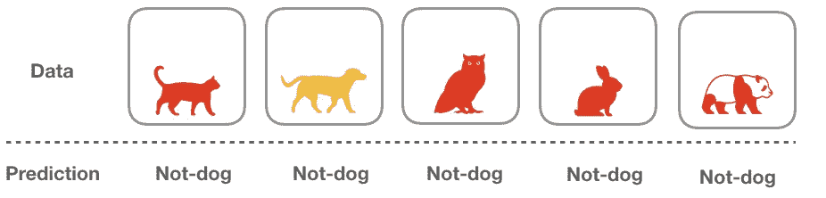

# 对于分类任务来说，准确度是不够的

> 原文：<https://towardsdatascience.com/accuracy-is-not-enough-for-classification-task-47fca7d6a8ec?source=collection_archive---------23----------------------->

## 准确度、精确度和召回率之间的区别


Photo by [Matthew Henry](https://unsplash.com/@matthewhenry?utm_source=medium&utm_medium=referral) on [Unsplash](https://unsplash.com?utm_source=medium&utm_medium=referral)

在这个机器学习时代，我们已经看到了很多关于使用人工智能来分类图像是否包含小狗、进行垃圾邮件检测或训练自动驾驶汽车识别交通标志的宣传。正如拥有正确的模型很重要一样，更重要的是能够判断您的模型执行得如何，以便您可以选择最适合您的任务的模型。

在这篇文章中，我们将介绍:

*   分类任务的一般定义
*   准确性指标
*   精确度和召回率
*   混淆度量
*   精确-召回权衡

# 什么是分类？

假设你面前有一张上面的图片，任务是判断图片中是否包含一只狗。如果你回答正确，你得到一分。如果没有，你将什么也得不到。这就是通常所说的分类任务，您试图给给定的数据分配一个特定的标签。

这个分类任务在机器学习社区中非常流行，他们试图训练他们的模型，看看当前的算法是否可以完全区分对象。对于本文，我们不会关注使用哪种算法。相反，我们假设我们已经有了一个算法，我们想知道我们的算法执行得好不好？

# 准确(性)

一个简单的评估指标是准确性。假设你有 5 张图片，模型答对了 4 张，那么分数就是 0.8。因此，我们可以说准确度是全部图像中正确分类的图像的数量。这是简单而直观的，但这还不够。


Figure 1 — Images of dog and not-dog

准确性本身也有一些下降。让我们考虑下面的例子。假设我们的数据集有 5 张图片:4 张不是狗，1 张是狗。我们还有一个如下的算法:

```
def is_a_dog (x):
    return False
```

上面的朴素算法假设所有东西都不是狗，而不对给定的数据做任何计算。需要注意的一点是，因为我们的数据集碰巧有 4 幅非狗的图像，所以这种简单算法的得分为 0.8。这不是我们想要的。



Figure 2 — Naive algorithm returns all False

# 精确度和召回率

应对这种情况的两个概念是精确和召回。下面我们来看看他们的简要说明。

*   **精度**:在所有“狗”的预测中，有多少是正确分类的？


*   **回忆**:在所有“狗”的数据中，有多少是正确分类的？


Figure 3 — Recall (looks only on data whose labels are dogs)

先说回忆。在我们的数据集中，只有一只狗，我们的算法将其归类为非狗。所以，回忆=0/1=0。

然而为了精确，在这些预测中，没有一个预测是狗。因此，精度=0/0。注意，在某些情况下，由于分母为 0，所以不可能进行精度除法；因此，在这种情况下，我们可以简单地假设 precision=0。

# 混淆矩阵

混淆矩阵将数据分为 4 类:真阳性、真阴性、假阳性和假阴性，如下图所示。


Figure 4 — Confusion Matrix

*   当数据具有标签“狗”并且预测具有相同的阳性标签时，为真阳性。
*   当数据的标签是“非狗”并且预测正确地具有相同的标签时，为真否定。
*   假阳性是当数据的标签是“非狗”但算法没有将其分类为“狗”时。
*   假阴性是当数据的标签是“狗”时，但算法说不是这样。

通常，当我们想要计算精确度和召回率时，使用混淆矩阵。计算方法与上一节描述的相同，但它使数字更容易阅读。对于这个例子，我们将看一个不同的例子，其中我们尝试对 10 幅图像进行分类。


Figure 5 — Example of 10 images. Label underneath the images are the prediction


Figure 6 — Confusion Matrix on 10 images

在这种情况下，精度是 4/(4+3)=0.57，而召回率是 4/(4+2)=0.66。

# 精确度或召回率

理想情况下，我们希望这两个值尽可能高。然而，这可能是不可能的。当我们提高召回率时，精确度会降低，反之亦然。因此，我们需要决定哪个对任务更重要。让我们仔细看看这种现象是如何发生的。


Figure 7 — PrecisionRecall Tradeoff

绿色框是正确分类的标签，黄色框是错误分类的标签。每个被错误分类的图像必须进入一个黄色的盒子:假阳性(精确)或假阴性(召回)。当然不可能两者兼而有之。

假设我们的模型肯定会有 5 个错误的标签，如果所有的错误分类都属于假阳性，那么我们将会有低精度和高召回率。然而，如果不正确的标签落入假阴性，我们反而会有高精度和低召回率。


Figure 8 — Examples of Precision-Recall Tradeoff

因此，当你训练你的机器学习模型时，你需要决定哪些指标更重要。例如，如果你被要求为金融机构建立一个模型，他们希望对借款人是否是一个好的候选人进行分类，你可能更喜欢你的模型不要鲁莽地提供贷款。因此，你宁愿把好人归类为坏人(假阴性)，而不是把坏人归类为好人(假阳性)。

换句话说，假阴性(召回)比假阳性(精确)更好。

# 结论

所以，下一次当你面对一个分类任务时，确保不要只选择准确性作为度量，然后马上开始设计模型。当然，摆弄模型是令人兴奋的，但重要的是花一些时间来清楚地了解您正在处理什么样的问题，以及哪些指标最适合这项任务。一旦你解决了这个问题，你就可以确定你正在构建的模型是适合你的任务的。

# 关键外卖

就是这样。我们已经到了这篇文章的结尾。回顾一下我们刚刚讨论的内容，以下是这篇文章的一些要点:

1.  对于分类任务来说，准确度是不够。我们需要看看其他一些指标，以确保我们的模型是可靠的。
2.  精度:在所有说狗的预测中，有多少是正确分类的？
3.  回想一下:在所有关于狗的数据中，有多少是正确分类的？
4.  混淆矩阵有助于您更好地分析模型的性能。

# 参考

*   [https://en.wikipedia.org/wiki/Precision_and_recall](https://en.wikipedia.org/wiki/Precision_and_recall)
*   [https://machine learning mastery . com/classification-accuracy-is-not-whole-not-whole-performance-measures-you-can-use/](https://machinelearningmastery.com/classification-accuracy-is-not-enough-more-performance-measures-you-can-use/)
*   [https://medium . com/tech space-usict/measuring-just-accuracy-is-what-not-what-difficult-have-better-technique-is-required-e 7199 AC 36856](https://medium.com/techspace-usict/measuring-just-accuracy-is-not-enough-in-machine-learning-a-better-technique-is-required-e7199ac36856)
*   [https://towards data science . com/beyond-accuracy-precision-and-recall-3da 06 bea 9 f6c](/beyond-accuracy-precision-and-recall-3da06bea9f6c)