# 数据科学中的准确性性能测量:混淆矩阵

> 原文：<https://towardsdatascience.com/accuracy-performance-measures-in-data-science-confidence-matrix-8559381b8b29?source=collection_archive---------21----------------------->

## 简要介绍使用数据科学模型混淆矩阵评估绩效指标的各种方法

Photo by [Eleonora Patricola](https://unsplash.com/@ele1010?utm_source=medium&utm_medium=referral) on [Unsplash](https://unsplash.com?utm_source=medium&utm_medium=referral)

在之前的[文章](https://medium.com/@dhruvsharma14/k-nearest-neighbors-a-simple-classification-story-bbac4cdb6766)中，我已经简要解释了 k-NN 模型的复杂工作和陷阱，现在让我们先尝试简单地看看如何实现该模型并评估成人收入数据集，然后通过各种性能指标来分析准确性。

简单看一下 k-NN 算法，我们会发现该算法是一种分类算法，基本上是通过识别最近邻，然后将它们分类到不同的类中来执行的。它可用于二元或多类问题。

Photo by [Alexander Mils](https://unsplash.com/@alexandermils?utm_source=medium&utm_medium=referral) on [Unsplash](https://unsplash.com?utm_source=medium&utm_medium=referral)

## **成人收入数据集**

我们将尝试实现的模型是成人收入数据集。数据集可以在 [Kaggle](https://www.kaggle.com/wenruliu/adult-income-dataset) 或者我的 [GitHub](https://github.com/dhruvsharmaokstate/MachineLearning/blob/master/K%20Nearest%20Neighbors/K%20Nearest%20Neighbors.ipynb) 仓库中找到。该数据集包含美国成年人的收入，是使用 k-NN 算法解决的最常见问题之一。在这里，收入最初是连续的，但通过使用 50，000 美元的过滤器，已经变成了二进制。收入高于 50，000 美元的给 1 分，收入低于 50，000 美元的给 0 分。该数据集还有 14 个其他预测因子。对数据集的最初几个简短观察显示了以下内容:

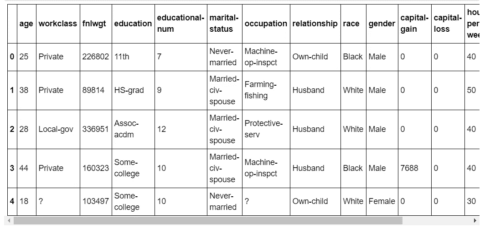

Result from head() on the dataset

从上面我们可以看到，数据集有重要的描述符，可以用来解释为什么一个人的收入会高于或低于 50，000 美元。我们还可以观察到收入水平的分布是相当偏斜的，即收入低于 50，000 美元的人比收入高于 50，000 美元的人多。

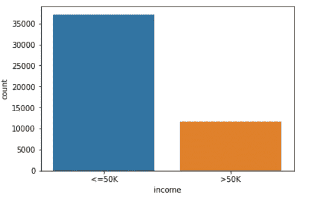

More incomes lesser than $50,000 than above it

在执行删除空值和缩放要素的必要数据操作后，我们得到最终的部分数据集:

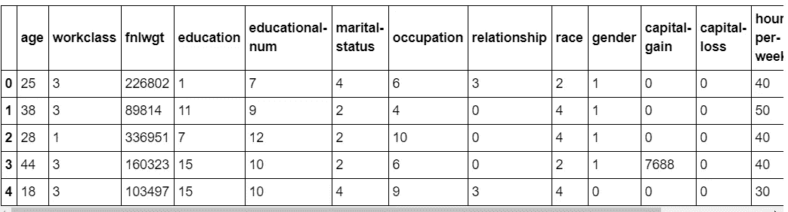

Partial dataset after data cleaning has been performed

## 模型实现

既然已经清理了数据，我们可以在其上实现模型，然后继续通过各种度量来执行准确性。如前所述，k-NN 模型在不同的步骤中实现，这些步骤是:

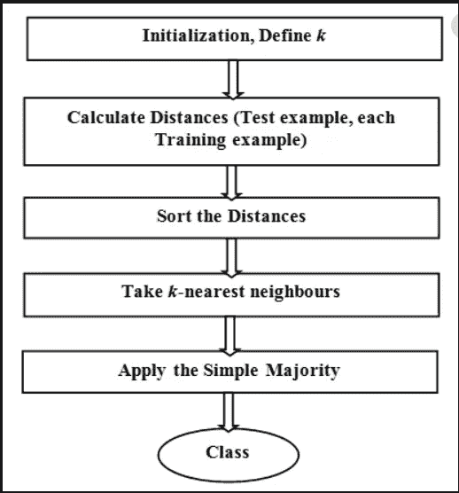

Steps for conducting a k-NN analysis, source: [Recent Trends in Big Data Using Hadoop](https://www.researchgate.net/publication/332541933_Recent_trends_in_big_data_using_hadoop)

因此，让我们采用 scikit-learn 给出的默认邻居数量(k=5 ),并且让我们也采用基线条件，我们可以执行模型如下:

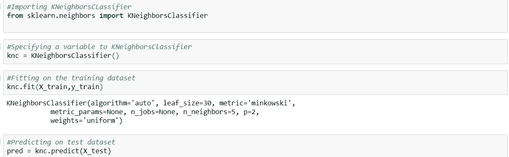

然后，我们可以使用各种可用的评估方法来评估模型的表现。

## 混淆矩阵

我们可用的最常见的度量类型是混淆矩阵，也称为置信矩阵。混淆矩阵是一个看起来像这样的矩阵:

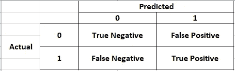

Sample Confusion Matrix

从上面我们可以看到，混淆矩阵是实际值与预测值之间的矩阵。它通常用于分类目的，其中需要将目标预测为 1 或 0。当我们观察到实际值不存在时，我们给它 0，否则给 1。预测值也是如此。那么，这有什么重要的？
嗯，我们可以从这个矩阵中看出很多东西，比如:

我们的混淆矩阵看起来像:

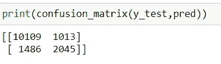

Confusion Matrix for the Adult Income dataset

*   **准确率:**这是分类器正确的比率，所以基本上取真正值和真负值之和，然后除以总和。这意味着总共有 14，653 个值，其中有 10，109 个真正值和 2045 个真负值。因此，我们的模型的精度将是(10109 + 2045)/14653 = 82.94%。可以说我们的模型有很好的准确性。它也被称为命中率，因为它是总命中率与所有值的度量。
*   **误分类率(MISC)** :顾名思义，这是值被误分类的比率。它也被称为缺失率，因为它是缺失值的计数。所以，如果我们用 100%减去准确率，就会得到误分类率。我们这里的杂项价值是 0.17 或 17%。这意味着在我们的情况下，我们可以说当错误分类率为 17%时，在数据集中的 100 个人中，有 17 个人被错误分类。
*   **Precision** :这是衡量正面预测准确性的值的比率。所以当我们用真阳性除以总阳性，我们得到精度值。因此我们这里的精度是(2045)/(2045 + 1013) = 66.87%。这意味着，在我们的例子中，我们可以说，当精度为 66.81%时，预测收入超过 50，000 美元的 100 人中，有 67 人被正确分类。
*   **回忆**:这是测量被分类器正确识别的正面实例的值的比率。它也被称为敏感性，或真正的阳性率。因此，召回率是(真阳性)/(真阳性+假阴性)，或者在我们的例子中是 2045/(2045 + 1486) = 57.91%。这意味着，在我们的例子中，我们可以说，当召回率为 57.91%时，在 100 个收入超过 50，000 美元的人中，有 57.91 人或 58 人被正确分类。
*   **特异性**:这是测量被分类器正确识别的阴性实例的值的比率。它也被称为真实负利率。特异性则是，(真阴性)/(真阴性+假阳性)或在我们的情况下，10109/(10109 + 1013)或 90.89%。这意味着在我们的案例中，我们可以以 90.89%的特异性说，在 100 个收入不超过 50，000 美元的人中，90.89 或 91 人被正确分类。
*   **F-1 分数**:它是精确度和召回率的调和平均值。正常平均值对所有值给予同等的优先权，而 F-1 分数对低值给予更大的权重。F-1 的分数基本上是这样的:

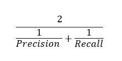

F-1 Score

在我们的例子中，F-1 分数为:

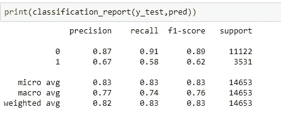

Precision, Recall and F1- Score values for 1 and 0 respectively

*   **受试者工作特征和曲线下面积**:受试者工作特征曲线，也称为 ROC 曲线，基本上是真阳性率对假阳性率的曲线图。假阳性率是被错误分类的阴性实例的比率。也可以定义为 1-真阴性率，这也是特异性。因此，该曲线也可以被认为是灵敏度和 1-特异性之间的曲线。在 Python 中，可以使用 scikit-learn 或 matplotlib 库来实现。曲线下的面积也是这里的另一个重要指标。它越接近 1，分类执行得越好。我们案例的曲线如下所示:

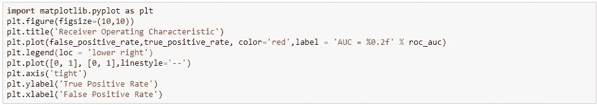

Code to draw the ROC Curve, Source: Hands-on ML by Aurelien Geron

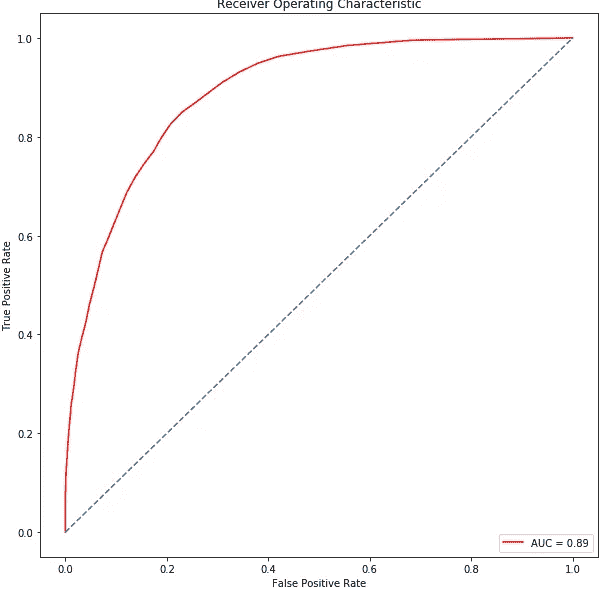

ROC Curve and the AUC at bottom

*   **累积精度曲线**:该曲线类似于 ROC 曲线，但它是一个精度图。它基本上描绘了准确性，并有助于理解和总结模型的稳健性。
    制作曲线的代码:

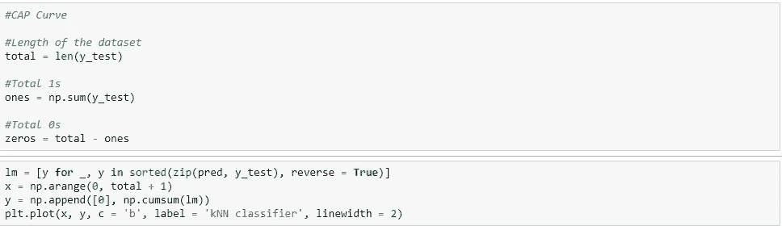

Code for drawing the CAP Curve

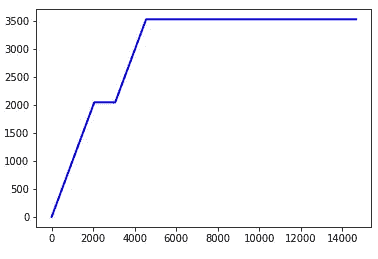

CAP Curve

如上所述，重要的是要注意，您可以使用大量其他信息来确保您的模型具有所需的准确性和性能。这些包括变异系数、均方根误差等，但本文仅针对混淆矩阵。