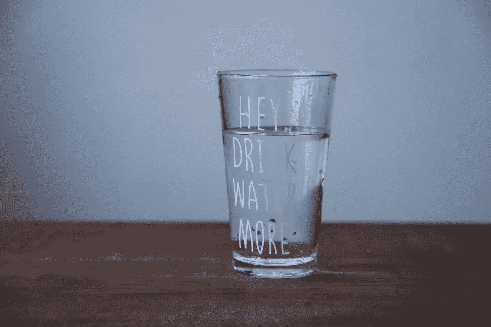
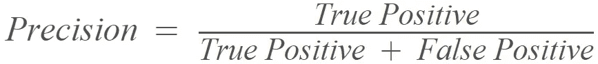
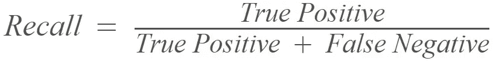
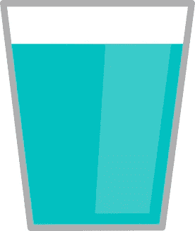

# 用一杯水解释准确度、精确度和召回指标

> 原文：<https://towardsdatascience.com/accuracy-precision-recall-5c8b8f0abde1?source=collection_archive---------24----------------------->

**准确率**、**精度**和**召回率**是衡量机器学习分类案例中模型性能的三个基本分数。准确性是一个相当容易理解的概念:取所有正确的预测的总和，然后除以预测总数，正确的*和错误的*。自然，如果没有错误的预测，正确的预测除以正确的预测会得到 1。完美的准确性！

如果数据不平衡，就会出现问题，这是分类问题的常见情况。假设你有一个关于信用卡交易的数据库，其中 95%的交易是好的，5%是欺诈性的。你设计了一个模型，它能正确预测所有 95%的合法交易，但没有一个是坏交易。根据该公式，该模型将具有 95%的准确性水平，这是一个非常不错的结果。不幸的是，这并不能证明你的模型足够好，因为它没有发现任何欺诈行为。在那些数据明显不平衡的分类情况下，准确度分数可能会产生误导。

这就是精确度和回忆分数介入的地方。精确度和召回率公式如下:

虽然公式中的变量应该不会引起任何问题，但在开始时，精确度和召回背后的思想可能更难理解。为每个类分别测量精度和召回率也没有帮助。但是让我用下面的比喻来解释给你听。

想象你有一杯水。 **Precision** 将显示水中有多少污垢，即有多少不应该存在的物质。就这么简单——精确度是关于玻璃杯中水的纯度以及有多少外来物质。水越清澈，精确度分数就越高。如果你的模型声称某样东西是水，但它不是，这将降低精度分数。

**回忆**是完全不同的故事。这不是纯度的问题，而是数量的问题。想象你要了一杯水。他们已经把它带给你，但是它不是满的。问题是杯子里应该有多少水，但实际上没有，也就是说，有多少水溢出来了——这就是召回的衡量标准。回忆越高，水在流向你的途中流失越少。如果 recall 等于 1，这意味着玻璃杯是满的——您的模型已经正确预测了某个特定类的所有记录，没有遗漏任何东西，没有遗漏任何东西。

总结一下:

**Precision** 测量你的模型将多少灰尘带入一杯水中。**回忆**测量你的模型洒了多少水。就这么简单！