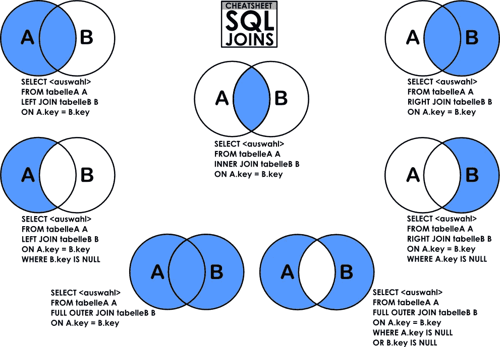

# 赢得数据分析面试

> 原文：<https://towardsdatascience.com/ace-your-data-analytics-interviews-ef114606c5d7?source=collection_archive---------5----------------------->

## 有志成为数据专业人士的指南

## 我在谷歌、Visa 等公司担任数据分析师/科学家的面试经历

Source ([unsplash](https://unsplash.com/photos/GkEt4m4btLM))

# 面试——我在谷歌的故事

我于 2019 年 5 月 23 日上午 10 点来到谷歌办公室，我记得我惊讶于这里的办公室有多么大和酷。在每一个角落，都有一个微型厨房和有趣的娱乐主题，这些主题在视频博客上出现过很多次。我一直等到面试官上来。他介绍自己是招聘经理，我们找到了一个房间，里面有一个有趣的形状奇怪的白板和高高的木头桌子。

面试进行得非常顺利——就像和一个朋友的对话，对自己和面试官有了更多的了解。虽然有一些棘手的技术和编码问题，但这个过程很有趣，值得庆幸的是，充满了微笑。

一旦我通过了技术和招聘经理的面试，我就被安排去面试大人物:高级主管和全球主管。我尽可能地微笑着，自信地阐述我对多个行为和假设问题的想法。

几个月后，我收到了邀请，并在第二周接受了邀请。我很高兴终于可以称自己为谷歌的数据分析师(机器学习)。

这就是我在最近一次求职面试中经历的过程，同样，其他大数据公司也是如此。

# 目的:我给有抱负的数据分析师/科学家的建议

在这篇博客中，我将告诉你如何在大公司的数据分析师/科学家面试中胜出，如谷歌、Gojek、Visa、银行等。我创建这个博客是为了回答我的下级反复提出的关于如何在大公司艰难的数据面试中胜出的问题。

**作为免责声明**，由于博客政策的原因，我不会揭露具体公司的具体问题。但是我会尽我所能，这样你仍然可以从我的经历中学习。如果你想更具体地了解谷歌如何招聘，有一本由[拉兹洛·博克](https://www.workrules.net/)写的好书。

在大多数面试中，你会遇到三种类型的面试问题:技术型、行为型和假设型。

# 技术问题

Technical interview went wrong :)

这通常是第一轮或第二轮，以确保你能在面试招聘经理和他们的主管之前满足技术专长的基本要求

## 结构化查询语言

您将看到由日期、字符串和数字组成的表格。在此基础上，您需要使用 SQL 语言找到年的总数，或某些类别(如年龄范围或地点等)。

**为了解决这些问题，我建议你:**

1.  **问一些假设**:某个数据点对于同一个值是否可以有不同的表示。例如，区分大小写不同的“Street”和“St”。这将有助于您在 SQL 中执行过滤，例如 like 或 exact words。
2.  **考虑极限情况:**数值数据是否已经是纯数值格式，没有任何歧义或缺少值，比如-1 表示缺少的数字。'
3.  **大声思考:**从用图表表示你的答案开始，在白板上写下你的解决方案，然后大声思考，以确保你的思路清晰地展示出来。一旦你得到面试官的确认，用你喜欢的语言写出解决方案。在这种情况下，我总是鼓励使用 python，因为作为一种脚本语言，它的语法要短得多，并且留给 bug 的空间也更少(比如 Java 中缺少分号)

最有可能的是，您还会收到一些关于连接表的问题(*内连接、外连接*)，了解聚合及其过滤器( *group by* 和 *having* )。请参考下图。

SQL Joins and their respective codes ([source](https://stackoverflow.com/questions/26923616/inner-join-left-right-outer-join))

此时，如果你忘记了语法，请对面试官诚实。写下你知道的一切，然后继续前进。很有可能你的面试官会知道，尽管你对 SQL 连接有透彻的理解，但你总是可以谷歌一下语法。如果你犯了错误，不要让他们阻止你。忘记它，微笑，继续前进。

## 编码问题

你的面试官会接着问一些编码问题。这可以是任何事情，比如你如何排序一个二维数组，甚至你如何在字符串中搜索特定的模式，或者甚至使用 Pandas 和 Python 聚合数据。

同样，要回答这个问题，我们需要从以下几点开始:

1.  **给出假设，找到你的测试用例:**这是你自己安排测试用例的机会。如果列表有重复或未排序的数据，它会返回什么？如果列表是空的，它会返回什么？如果用户传递空值，会发生什么呢？
2.  **给出多个答案:**大多数时候，你应该能想到**蛮力**方法，你会逐个迭代列表元素。或者，您可以设计一个更有效的排序算法(合并排序等)和迭代。
3.  **编码前确认您的答案:**确保向面试官确认您的答案，只有在获得批准后才开始编码。征求他们的反馈，修正你的算法。此外，要注意可能出现越界问题的**栅栏和柱子**问题。最后，用你的测试用例测试你的代码。

## 参考

总的来说，我发现 [CS Dojo](https://www.youtube.com/channel/UCxX9wt5FWQUAAz4UrysqK9A) 和 [Devpost](https://www.youtube.com/watch?v=GBp0yIdJtUk) 有助于在技术面试中胜出。请检查一下。

# 行为问题

Behavioral Questions to know more about your experiences

面试官想知道你最大的成就以及你是如何解决问题和冲突的。

## 问题 1

> **你以前做过哪些数据项目？**

这是你大放异彩的机会。作为一名有抱负的数据分析师/科学家，你们大多数人都应该有一些投资组合可以夸耀。如果您有 Github 项目，部署并展示您构建的一些应用程序。如果你像我一样在媒体上写博客，展示你最受欢迎的项目，展示你的高访问量。无论你有什么项目，集中精力给出展示你的技能和自信的指标。

> 让我给你举个例子
> 
> “在 Visa，我曾为客户(收购方和发行方)提取客户关键报告。这些是作为授权流程的一部分进行管理的关键信息，Visa 必须确保安全的交易渠道。因此，用户现在可以通过自己的门户生成报告，节省了 43%的时间。我还提到了我在 Lazada 的项目，该项目使用聚类和功能工程来发现重要的销售人员功能，然后将它们与我如何为该角色做出贡献联系起来。”

确保你能突出你的项目，并说明它与你申请的工作有什么关系。

# 假设性问题

Hypothetical questions summarized

面试官会用这些问题来了解你对你申请的职位的反应或想法。你的目标是以结构化和理性的方式引导面试官完成你的关键行动。

## 问题 1

> **如果我们在<产品>上发现一些漏洞，但产品经理或更高级别的领导否认。你会有什么反应？**

这是一个棘手的问题，但公司希望看到你如何处理棘手的情况，并能够执行“正确的路径”，而不是“简单的路径”。

这些是你应该问的几个问题:

1.  **为什么 PM 拒绝我们的调查结果**，有什么特别的原因吗？
2.  **我们团队和产品经理有哪些共同利益？**其中的共同利益可能是用户体验或安全性。

**一旦你知道了问题所在，你就可以通过使用数据驱动的决策来论证你的发现。**

1.  **首先**，你需要找出影响的规模，并用它创建一些可视化。例如，您可以进一步用条形图或地理位置图来显示漏洞的位置以及受影响的用户数量。
2.  **第二**，你可以从客户支持中找到定性的反馈。你需要和客户经理谈谈，看看有哪些常见的用户痛点。然后，您可以将此与主要关注点联系起来，即用户体验。
3.  **最后**，向产品经理推荐重点行动。这必须是在产品经理的权限范围内能够相对快速完成的事情。例如，产品经理应该使用增强的 API 来检测和解决漏洞。

通过用问题和有条理的回答突出你的想法，你会给面试官留下深刻印象。

## 问题 2

> 你会如何为<insert tasks="">设计机器学习模型？</insert>

在这种情况下，您需要测试自己对某项任务建模的理解。通常，在这种情况下，您可以:

1.  **从探索性数据分析(EDA)开始**:你可以建议先将某个问题可视化。比方说，如果在午餐时间产品流量增加，你会想制定一个假设来解释为什么会发生这种情况，并测试它们。
2.  **用解释性的&简单模型寻找信号:**在数据管道的早期阶段，获得洞察力比获得准确性更重要。这意味着您应该使用更简单的模型从观察中得出一些见解，并了解哪些特性最能驱动因变量/指标。我建议对分类模型使用决策树和逻辑回归，对回归模型使用简单线性回归。这些模型让你可以将信息增益和重要系数可视化，以启动你的洞察力。
3.  **强调具体的模型学习:**一旦你通过 EDA 和简单模型强调了可能的见解，那么你就可以建议一种更专业的技术。在文本分析问题中，我建议你使用主题建模 LDA(潜在狄利克雷分配)来寻找主题聚类。对于需要高精度分类的问题，您可以考虑集合模型，例如 Random Forest 和 XGBoost。一个警告是要确保你深刻理解其中的一些模型。
4.  **坦诚继续**:如果你对某个话题不熟悉，就坦诚说“我不知道”就好。数据科学是一个快速发展的学科，不可能有人指望你 100%精通。因此，承认自己的缺点，继续前进。

# 赢得面试的最后提示

## 准备，准备，准备

我能玩得开心的一个主要原因是我做了准备。我经历了许多不同的准备问题，并不断打扰我的朋友和女朋友来听我的推销。他们给了我很多反馈，我可以很高兴地反映给招聘经理。同样的，你也要尽可能的花时间去准备。

## 面试是一个双向对话，带有一点销售技巧

到最后，你的面试官是你的朋友。放轻松，直言不讳。多听，好好玩。我很开心，因为我可以分享我的主要职业经历。从我与招聘经理的交谈中，我了解到的角色比他们从你那里学到的更多，这是一种非常令人满意的感觉。

## 希望、祈祷和享受

面试结束后，花 5 分钟思考一下这个过程。记下哪些进展顺利，哪些出了问题。如果你像我一样是一个信徒，为这些有价值的经历祈祷和感谢。无论接下来发生什么，你都能够将你的抱负和技能带入下一个层次。到目前为止，我已经被谷歌拒绝了 3 次，只有在上帝的恩典下，我才最终被接受。我很开心，也很感激。

总的来说，我真诚地希望我的这次经历能帮助你在数据分析工作面试中胜出。一切顺利，愿上帝保佑你。

# 最后…

Source: [Unsplash](https://unsplash.com/photos/TbHYpbi_Gbc).

我真的希望这是一本很棒的读物，是你发展和创新的灵感来源。

请在下面**评论**以获得建议和反馈。就像你一样，我也在学习如何成为一名更好的数据科学家和工程师。请帮助我改进，以便我可以在后续的文章发布中更好地帮助您。

谢谢大家，编码快乐:)

# 关于作者

Vincent Tatan 是一名数据和技术爱好者，拥有在 Google LLC、Visa Inc .和 Lazada 实施微服务架构、商业智能和分析管道项目[的相关工作经验。](https://bit.ly/2I8jkWV.?source=post_page---------------------------)

Vincent 是土生土长的印度尼西亚人，在解决问题方面成绩斐然，擅长全栈开发、数据分析和战略规划。

他一直积极咨询 SMU BI & Analytics Club，指导来自不同背景的有抱负的数据科学家和工程师，并为企业开发他们的产品开放他的专业知识。

文森特还在 best top 上开设了他的一对一导师服务，指导你如何在谷歌、Visa 或其他大型科技公司获得你梦想中的数据分析师/工程师职位。 [**如果你正在寻找良师益友，请在这里预约他**](https://www.besttopcareer.com/mentors-datascience) **。**

最后，请通过 [**LinkedIn**](http://www.linkedin.com/in/vincenttatan/?source=post_page---------------------------) **，**[**Medium**](https://medium.com/@vincentkernn?source=post_page---------------------------)**或** [**Youtube 频道**](https://www.youtube.com/user/vincelance1/videos?source=post_page---------------------------) 联系文森特