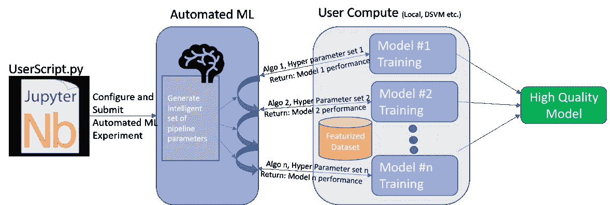
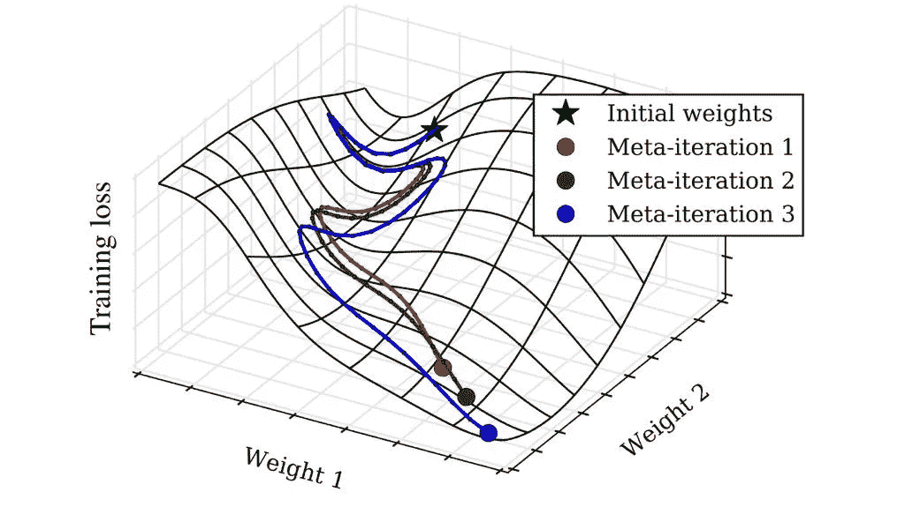
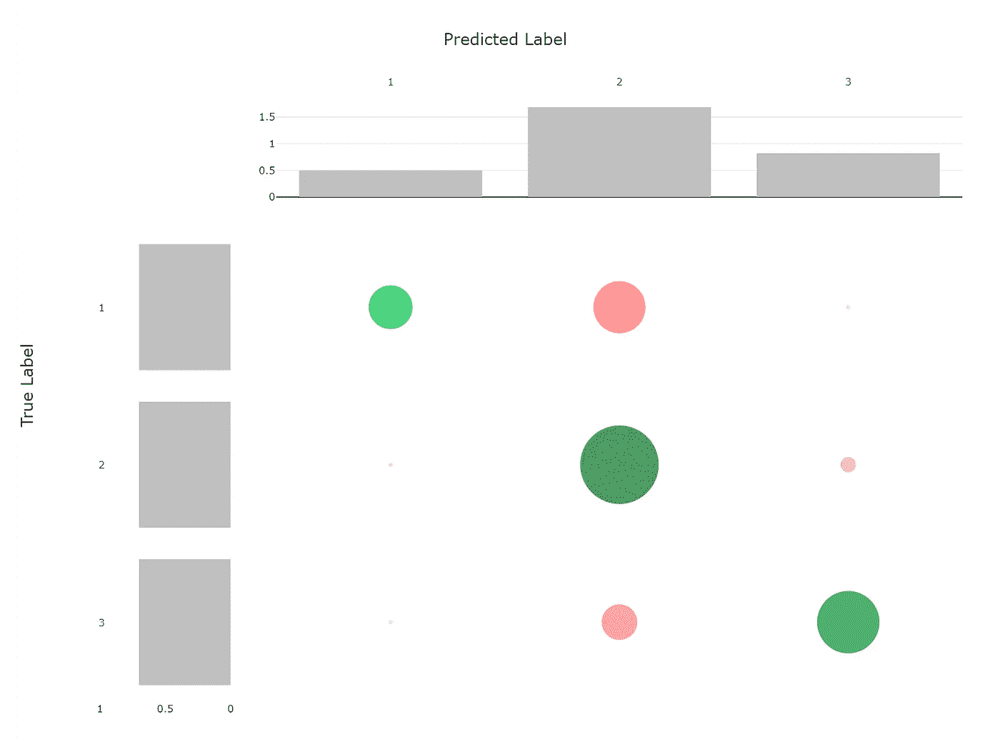
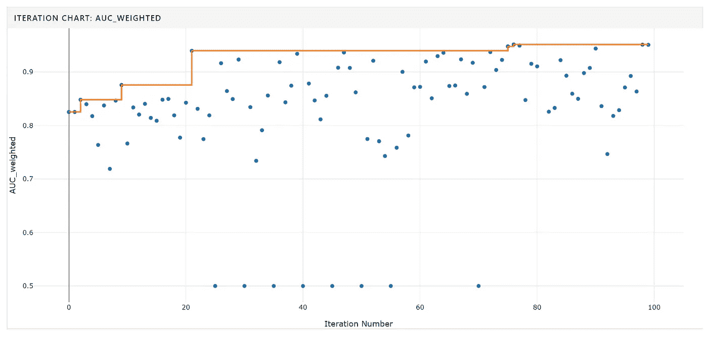
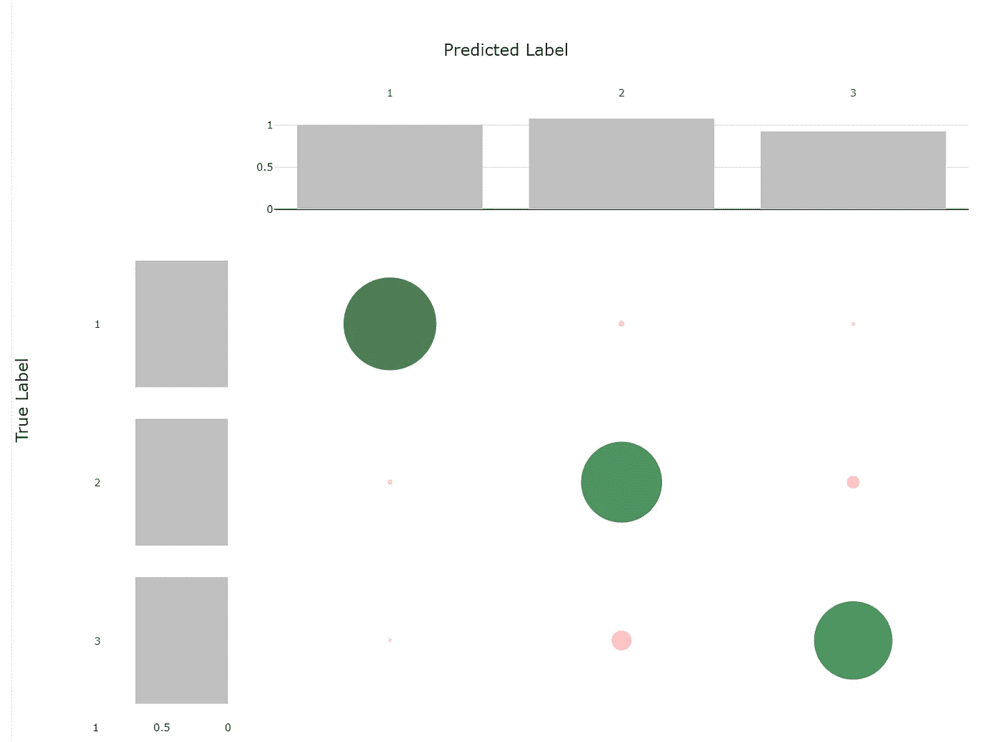
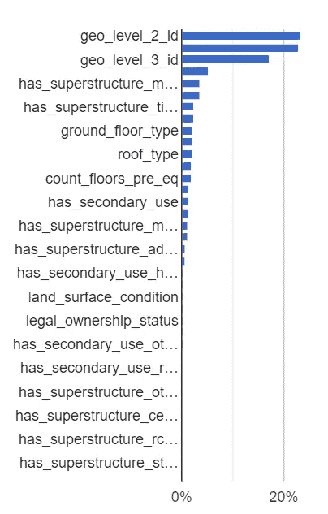
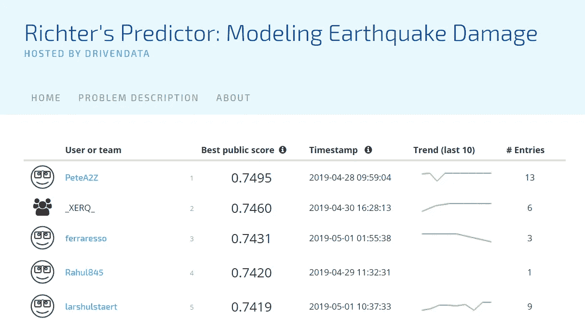

# 在与 AutoML 的 ML 竞争中取得前 5%的位置

> 原文：<https://towardsdatascience.com/achieving-a-top-5-position-in-an-ml-competition-with-automl-89a5a6fb8060?source=collection_archive---------12----------------------->

## 模拟地震破坏

AutoML 管道是一个热门话题。总体目标很简单:依靠最先进的机器学习模型、超调技术和大量计算，让每个人都能训练出符合其业务需求的高质量模型。

在这篇博文中，我将把[微软的 AutoML pipeline](https://docs.microsoft.com/en-us/azure/machine-learning/service/concept-automated-ml) 应用到一场公开的 ML 竞赛中，通过剖析结果，我希望了解 AutoML pipeline 在哪些方面增加了重要价值，以及它们仍可以改进的地方。通过较小的编码工作和 AutoML 管道，我能够以离 F1 最高分仅 0.004 分的成绩获得第五名！你可以找到我在 [GitHub](https://github.com/larshulstaert/RichterCompetition) 上用过的笔记本。

## 里希特预测器:模拟地震破坏

我选择的比赛在 DrivenData.org 举行。这是一个中级实践比赛，目标是**预测 2015 年尼泊尔廓尔喀地震**对建筑物造成的破坏程度。

Image from the DrivenData [competition](https://www.drivendata.org/competitions/57/nepal-earthquake/page/134/).

[数据](https://www.drivendata.org/competitions/57/nepal-earthquake/page/136/)是干净的，没有任何缺失值，主要由关于建筑物结构及其合法所有权的信息组成(分类和数字特征)。在这场比赛中，我们试图预测顺序变量`damage_grade`[，它代表了被地震击中的建筑物的损坏程度。损坏有三个等级。](https://www.ma.utexas.edu/users/mks/statmistakes/ordinal.html)

训练和测试数据集分别由 260602 和 86869 个建筑物组成。

## AutoML

AutoML 被集成到微软的 Azure 机器学习服务中。这意味着在 Azure 中使用存储和计算来执行和监控 AutoML 管道相对简单。

AutoML 管道的一般工作流程相当简单。您定义了训练数据集(Richter 数据集)、交叉验证方案(5 重交叉验证)、主要指标(加权 AUC)、实验类型(分类)，一切就绪。根据您想要执行实验的位置(在本地 pc 上、云中的虚拟机或大型集群上)以及数据驻留的位置(本地或云中)，您还必须指定数据和计算配置。

一个 AutoML 流水线由以下步骤组成:
1 .给定实验类型，生成一组初始管道参数。
2。使用不同的参数执行实验，并使用交叉验证测量主要指标。
3。选择一组新的(最佳)管道参数，并继续下去，直到达到一个阈值。这可以是大量的实验、花费在实验上的时间或不同的度量。
4。最后，构建不同模型的集成，以在测试集上获得最佳性能。

注意，选择一组好的算法和超参数的一般问题是一个复杂的问题。搜索空间(即模型空间)非常大，评估不同的实验通常需要大量的计算和时间。在相当长的一段时间里，超调是通过对模型空间执行随机或完全搜索来完成的。由于计算能力有限，这意味着这些模型空间必须受到启发式的限制。

如今，贝叶斯方法通常被视为超参数优化的优越方法，尽管基于 RL 的方法在例如神经架构搜索中也变得相当流行。这些方法背后的一般思想是，它们将“智能地”和“有效地”搜索模型空间，在探索(新的模型类型)和开发(改进以前的最佳模型类型)之间进行权衡。

## 结果

将 AutoML 管道直接应用于数据集会导致模型的性能(F1 为 0.5441)比竞争基线(F1 为 0.5815 的随机森林模型)差。对模型结果的分析很快说明了为什么会达到如此低的 F1。数据集不平衡(第一类:7.5%，第二类:52.5%，第三类:40%)。由于 AutoML 管道不执行欠采样或过采样，这意味着 AutoML 管道中的不同模型是在不平衡的数据集上训练的。

AutoML 管道的混淆矩阵也证实了模型中存在的对两个主要类别的偏向。由于比赛是对 F1 微分的评价，这个模型表现的不是很好。

尽管 AutoML 包含了一些特征工程、预处理、缺失值插补，但为 AutoML 管道提供一个干净、平衡的数据集仍然很重要。

为了改善结果，我采取了以下步骤:

1.  验证不同的要素是否转换为正确的格式(数值或分类)。
2.  利用 [SMOTE](https://imbalanced-learn.readthedocs.io/en/stable/generated/imblearn.over_sampling.SMOTE.html) 进行合成数据生成。这确保了数据是平衡的，而不必欠采样或丢弃任何数据。

实验部署在 AzureML compute(托管虚拟机)上，并使用 AutoML 管道运行了 100 个实验。

正如您在下面的图中看到的，运行更多的实验管道不会导致性能方面的显著改善，尽管这很可能是在竞争中获得第一名的必要条件。

放大混淆矩阵，很明显该模型表现更好，尽管第二类和第三类之间仍然存在明显的混淆。在这种情况下，额外的数据扩充技术(例如欠采样或过采样)或手动特征工程可能会有所帮助。

下图还展示了一些功能的重要性。显然，有许多(稀疏的)特性对最终性能的影响有限。因此，去掉这些特性是值得尝试的。首先，位置特征具有最大的影响，这是因为

最终的“最佳表现”车型 F1 得分为 0.7419。这比比赛中的最好成绩略低，但考虑到获得这些结果所涉及的工作量，我想说这对 AutoML 来说是一个非常有希望的结果。

## 结论

AutoML 对于任何数据科学家的工具箱来说都是一个很好的补充。超参数调优框架并不新(例如 [hyperopt](https://github.com/hyperopt/hyperopt) )，但是一个允许数据科学家在单个 Python 包中轻松结合计算、数据和实验的框架是一个很大的改进。也就是说，为了充分利用这些工具，有必要执行适当的数据预处理，选择正确的优化指标等。此外，为了避免在这些工作负载上花费大量计算和时间，可以根据数据探索和经验缩小搜索空间。

如果你对 AutoML 有任何问题，我很乐意在评论中阅读。如果你想收到我博客上的更新，请在 [Medium](https://medium.com/@lars.hulstaert) 或 [Twitter](https://twitter.com/LarsHulstaert) 上关注我！