# 用几行代码实现深度学习模型的激活图

> 原文：<https://towardsdatascience.com/activation-maps-for-deep-learning-models-in-a-few-lines-of-code-ed9ced1e8d21?source=collection_archive---------4----------------------->

## 我们用几行代码演示了如何在深度 CNN 模型中显示不同层的激活图。

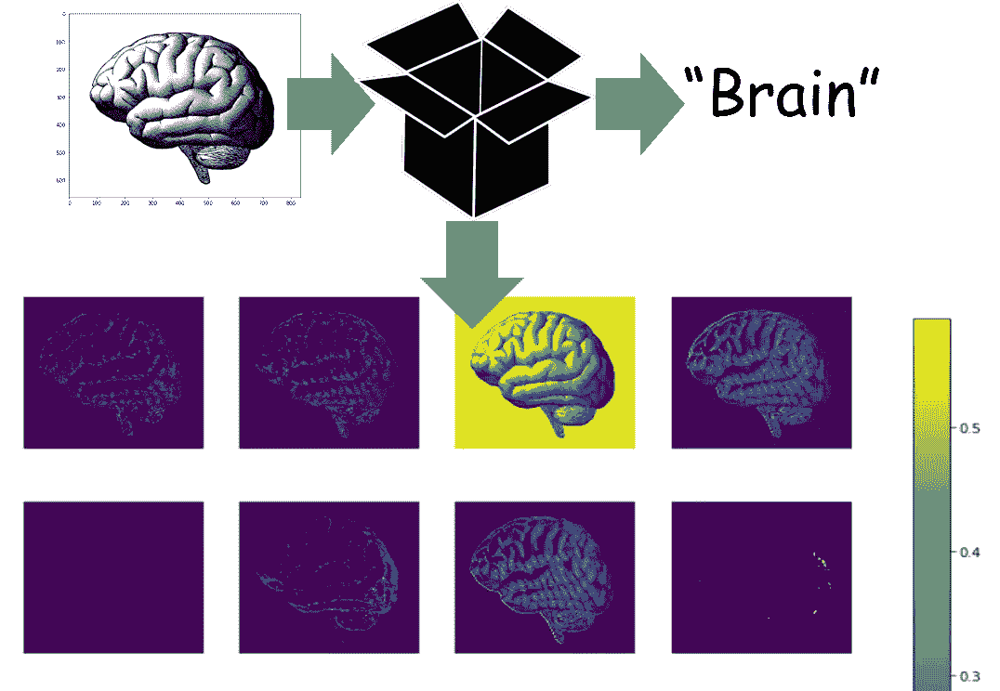

**更新**:这个故事获得了 KDNuggets 颁发的十月最受分享的故事银奖。

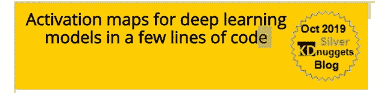

[https://www.kdnuggets.com/2019/10/activation-maps-deep-learning-models-lines-code.html](https://www.kdnuggets.com/2019/10/activation-maps-deep-learning-models-lines-code.html)

# 深度学习有一个坏名声:“黑箱”

**D** eep **L** earning (DL)模型[在一个又一个应用领域以令人瞠目结舌的性能彻底改变了商业和技术世界](https://tryolabs.com/blog/2018/12/19/major-advancements-deep-learning-2018/)—仅举几个例子，图像分类、物体检测、物体跟踪、姿势识别、视频分析、合成图片生成。

然而，它们一点也不像经典的盈利算法/技术。DL 模型使用数百万个参数，并创建极其复杂和高度非线性的图像或数据集的内部表示，这些图像或数据集被提供给这些模型。

因此，它们通常被称为 [**完美的黑盒 ML 技术**](https://www.wired.com/story/inside-black-box-of-neural-network/) 。在我们用大型数据集训练它们之后，我们可以从它们那里获得高度准确的预测，但我们几乎没有希望理解模型用来将特定图像分类的数据的内部特征和表示 。

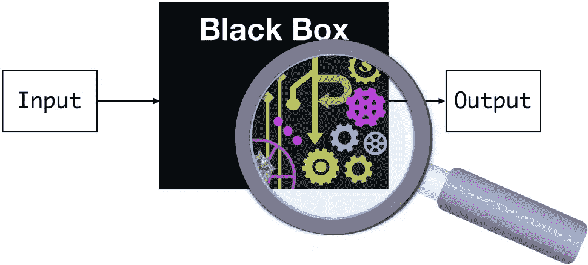

**Source**: [CMU ML blog](https://blog.ml.cmu.edu/2019/05/17/explaining-a-black-box-using-deep-variational-information-bottleneck-approach/)

> 深度学习的黑箱问题-没有直观和易于理解的解释的预测能力。

这不是好兆头，因为我们人类是视觉动物。数百万年的进化赋予了我们一双极其复杂的眼睛和更复杂的视觉皮层，我们用这些器官来理解世界。

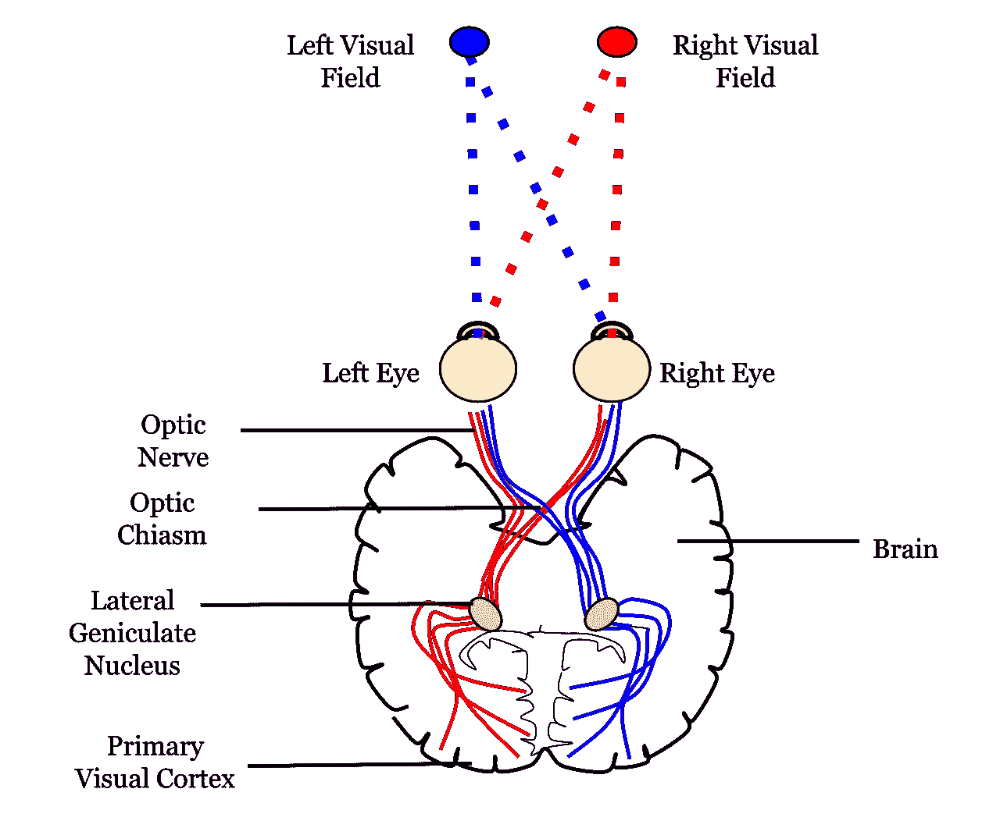

**Source**: Wikimedia

科学过程始于观察，而观察几乎总是视觉的同义词。在商业中，只有我们能观察和测量的，我们才能有效地控制和管理。

看到/观察是我们如何开始[对世界现象](https://medium.com/personal-growth/mental-models-898f70438075)建立心智模型，对我们周围的物体进行分类，区分朋友和敌人，爱，工作和玩耍。

> 可视化很有帮助。尤其是对于深度学习。

因此，一个“黑箱”DL 模型，我们不能可视化内部工作，经常会招致一些批评。

# 激活图

在各种深度学习架构中，最突出的可能是所谓的**C**on voluntual**N**eural**N**network(CNN)。[它已经成为分析高维、非结构化数据](https://www.flatworldsolutions.com/data-science/articles/7-applications-of-convolutional-neural-networks.php)的主力，这些数据包括图像、文本或音频，传统上对经典的 ML(非深度学习)或手工制作的(非 ML)算法提出了严峻的挑战。

在[文献](https://arxiv.org/pdf/1806.00069.pdf)中已经开发了几种理解和可视化 CNN 的方法，部分是作为对 CNN 内部特征不可解释这一常见批评的回应。

**最直接的可视化技术是显示网络在正向传递过程中的激活**。

> 那么，什么是激活呢？

在简单的层面上，激活函数有助于决定一个神经元是否应该被激活。这有助于确定神经元接收的信息是否与输入相关。激活函数是发生在输入信号上的非线性变换，并且变换后的输出被发送到下一个神经元。

如果你想准确地理解这些激活意味着什么，为什么它们首先被放在神经网络结构中，请查看这篇文章，

[](https://www.analyticsvidhya.com/blog/2017/10/fundamentals-deep-learning-activation-functions-when-to-use-them/) [## 深度学习的基础——激活函数以及何时使用？

### 今天，互联网提供了获取大量信息的途径。我们需要的只是一个谷歌(搜索)…

www.analyticsvidhya.com](https://www.analyticsvidhya.com/blog/2017/10/fundamentals-deep-learning-activation-functions-when-to-use-them/) 

下面是著名数据科学家 Brandon Rohrer 的精彩视频，讲述了 CNN 的基本机制，即如何一层一层地处理给定的输入(比如二维图像)。在每一层，通过激活函数传递转换后的输入来生成输出。

作为各种线性代数运算的结果，当给定图像前进通过时，激活图只是这些激活号在网络的各层的可视化表示。

对于基于 ReLU 激活的网络，激活通常开始时看起来相对较大和密集，但是随着训练的进行，激活通常变得更加稀疏和局部化。这种可视化很容易捕捉到的一个设计陷阱是，对于许多不同的输入，一些激活图可能全为零，这可能表明*失效*过滤器，并且可能是高学习率的症状。

> 激活图只是这些激活号码在网络各层的直观表示。

听起来不错。**但是可视化这些激活图是一项重要的任务**，即使你已经很好地训练了你的神经网络，并根据它进行预测。

> 对于一个相当复杂的 CNN，如何用几行代码轻松地可视化和显示这些激活图？

# 只有几行代码的激活图

整本 [**Jupyter 笔记本都在这里**](https://github.com/tirthajyoti/Deep-learning-with-Python/blob/master/Notebooks/Keract-activation.ipynb) 。随意分叉和扩展(如果您喜欢，可以给存储库留一个星号)。

## 一个简洁的函数和一个漂亮的小库

在之前的一篇文章中，我展示了如何编写一个简洁的函数，通过利用 Keras 库提供的一些令人惊叹的实用方法和类，从磁盘中一个接一个地自动读取图像文件，从而获得完全训练好的 CNN 模型。

**一定要看看这篇文章，因为没有它，你就不能以紧凑的方式用任意的图像数据集训练任意的模型，正如本文所描述的**。

[](/a-single-function-to-streamline-image-classification-with-keras-bd04f5cfe6df) [## 使用 Keras 简化影像分类的单一功能

### 我们展示了如何构建一个单一的、通用的、实用的函数来从一个目录中自动提取图像…

towardsdatascience.com](/a-single-function-to-streamline-image-classification-with-keras-bd04f5cfe6df) 

接下来，我们使用这个函数和一个叫做 **Keract** 的[漂亮的小库，这使得激活图的可视化变得非常容易。这是 Keras 库的一个高级附件库，用于显示神经网络各层的有用热图和激活图。](https://github.com/philipperemy/keract)

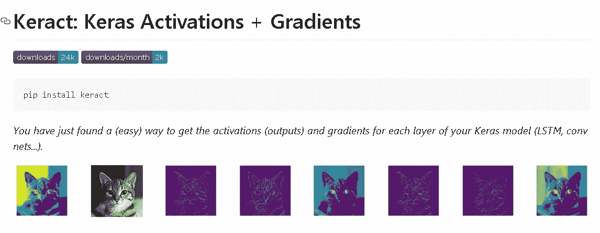

因此，对于这段代码，我们需要使用来自我的`utils.DL_utils`模块- `train_CNN_keras`和`preprocess_image`的几个实用函数，使随机 RGB 图像兼容生成激活图(这些在上面提到的文章中有描述)。

[**这里是 Python 模块—**](https://raw.githubusercontent.com/tirthajyoti/Deep-learning-with-Python/master/Notebooks/utils/DL_utils.py) `[**DL_utils.py**](https://raw.githubusercontent.com/tirthajyoti/Deep-learning-with-Python/master/Notebooks/utils/DL_utils.py)`。您可以像往常一样存储在本地驱动器中并导入函数。

## 数据集

为了训练，我们使用著名的**加州理工学院-101 数据集**来自[http://www.vision.caltech.edu/Image_Datasets/Caltech101/](http://www.vision.caltech.edu/Image_Datasets/Caltech101/)。这个数据集在某种程度上是 ImageNet 数据库[](http://image-net.org/)**的**前身，ImageNet 数据库是当前图像分类数据存储库的黄金标准。****

****

**这是一个图像数据集，包含属于 101 个类别的不同类型的物体。每个类别大约有 40 到 800 张图片。大多数类别大约有 50 张图片。每个图像的大小大约为 300 x 200 像素。**

**然而，我们仅使用 5 类图像进行训练— *螃蟹、杯子、大脑、相机*和*椅子*。**

**这只是这个演示的随机选择，请随意选择您自己的类别。**

## **训练模型**

**训练只用几行代码就完成了。**

## **从网上下载的人脑的随机图像**

**为了产生激活，我们从互联网上下载一个随机的人脑图像。**

**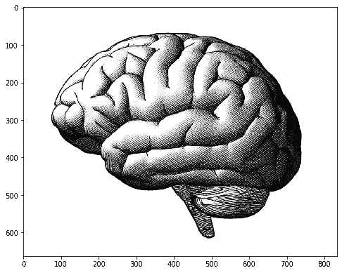**

## **生成激活(字典)**

**然后，生成激活的另几行代码。**

**我们得到一个字典，其中层名作为键，Numpy 数组作为对应于激活的值。下面示出了一个图示，其中激活阵列被示为具有对应于该特定卷积层的滤波器映射的大小的不同长度。**

**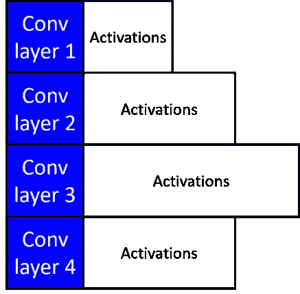**

## **显示激活**

**同样，一行代码，**

```
display_activations(activations, save=**False**)
```

**我们可以一层一层地看到激活地图。这里是第一个卷积层( **16 个图像对应 16 个滤波器**)**

**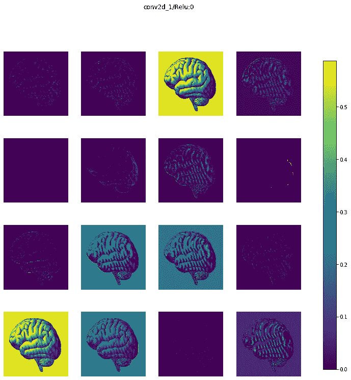**

**这里是图层号 2 ( **32 个图像对应 32 个滤镜**)**

**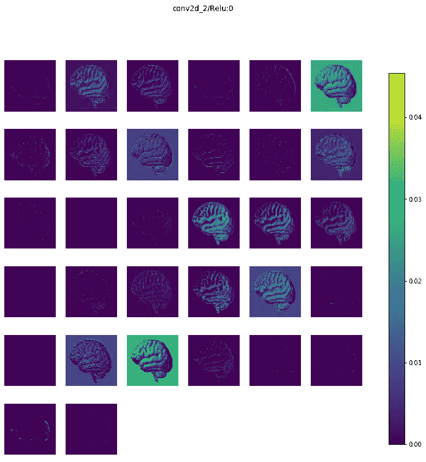**

**在这个模型中，我们有 5 个卷积层(后面是最大池层)，因此，我们得到 10 组图像。为简洁起见，我没有展示其余的，但你可以在我的 Github repo 中看到它们。**

## **热图**

**您还可以将激活显示为热图。**

```
display_heatmaps(activations, x, save=**False**)
```

**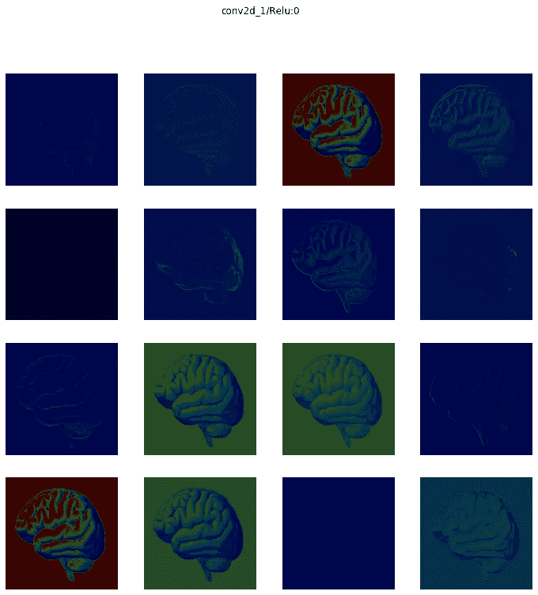**

# **更新:颤**

**上周写完这篇文章后，我发现了另一个漂亮的激活可视化库，名为[](https://github.com/keplr-io/quiver)**。然而，这个是在 Python 微服务器框架 Flask 上构建的，并在浏览器端口上显示激活图，而不是在您的 Jupyter 笔记本中。****

****他们还需要一个经过训练的 Keras 模型作为输入。因此，您可以很容易地使用本文中描述的压缩函数(来自我的 [DL_uitls 模块](https://github.com/tirthajyoti/Deep-learning-with-Python/blob/master/Notebooks/utils/DL_utils.py))并尝试这个库来实现激活图的交互式可视化。****

****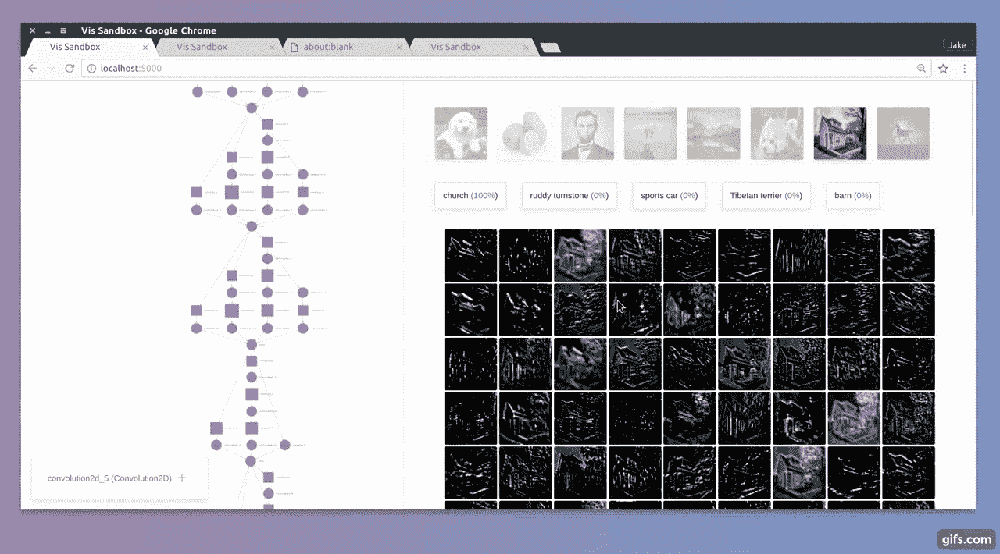****

# ****摘要****

****就这样，暂时的。****

****整个 [**Jupyter 笔记本都在这里**](https://github.com/tirthajyoti/Deep-learning-with-Python/blob/master/Notebooks/Keract-activation.ipynb) 。****

****我们展示了如何只使用几行代码(利用来自一个特殊模块的紧凑函数和 Keras 的一个漂亮的小附件库)就可以训练 CNN，生成激活图，并一层一层地显示它们——从零开始。****

****这使您能够从任何图像数据集(只要您能以简单的格式排列它)训练 CNN 模型(从简单到复杂),并查看它们内部的任何测试图像。****

****更多这样的动手教程， [**查看我的用 Python 深度学习 Github repo**](https://github.com/tirthajyoti/Deep-learning-with-Python) 。****

****如果您有任何问题或想法要分享，请通过[**tirthajyoti【AT】Gmail . com**](mailto:tirthajyoti@gmail.com)联系作者。此外，您可以查看作者的 [**GitHub**](https://github.com/tirthajyoti?tab=repositories) **资源库**，了解 Python、R 和机器学习资源中其他有趣的代码片段。如果你像我一样，对机器学习/数据科学充满热情，请随时[在 LinkedIn 上添加我](https://www.linkedin.com/in/tirthajyoti-sarkar-2127aa7/)或[在 Twitter 上关注我。](https://twitter.com/tirthajyotiS)****

****[](https://www.linkedin.com/in/tirthajyoti-sarkar-2127aa7/) [## Tirthajyoti Sarkar - Sr .首席工程师-半导体、人工智能、机器学习- ON…

### 通过写作使数据科学/ML 概念易于理解:https://medium.com/@tirthajyoti 开源和有趣…

www.linkedin.com](https://www.linkedin.com/in/tirthajyoti-sarkar-2127aa7/)****