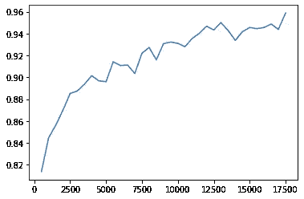
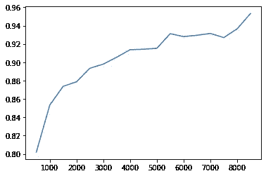
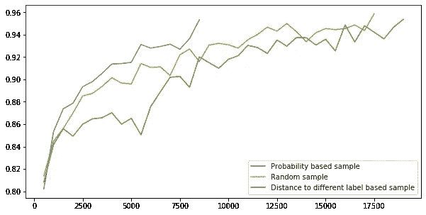
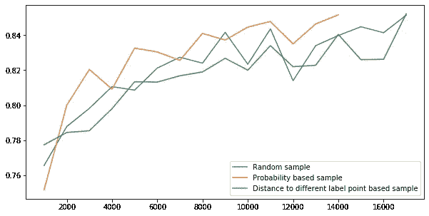

# 主动学习:充分利用有限的数据

> 原文：<https://towardsdatascience.com/active-learning-getting-the-most-out-of-limited-data-16b472f25370?source=collection_archive---------24----------------------->

上周，我在[快进实验室](https://www.cloudera.com/products/fast-forward-labs-research.html)看到了一位研究员的精彩演讲，这让我想到了被称为“主动学习”的机器学习的例子。主动学习指的是处理不完全标记数据的许多策略，特别是识别哪些点需要手动标记。

当人们听到“机器学习”这个术语时，他们想到的大多数用例都涉及所谓的“监督学习”，这意味着他们需要有标签目标变量的数据来进行训练。如果一家银行希望建立一个模型，根据某些特征预测特定交易是否是欺诈性的，它需要有训练数据，可以向计算机显示包含欺诈性和非欺诈性交易的已知案例。如果机器视觉工程师想要教会汽车的车载计算机识别停车标志，它需要向计算机提供一些带有和没有停车标志的清晰标记的图像示例。有一些非监督技术不引用特别标记的目标变量，例如尝试将点分组在一起或搜索异常的算法，但预测模型几乎总是需要引用目标变量，因此要求数据集已经考虑了该变量。毕竟，你还能如何验证这个模型呢？

然而，在某些情况下，收集足够多的标记数据是困难的。考虑识别路边图片中的停车标志的例子。在互联网上搜索成千上万的照片，或者像谷歌地图那样，在汽车上安装一台相机，开一会儿车，都很容易。识别这些照片中哪些包含停车标志是一项更加艰巨的任务，需要有人逐个照片地检查收集的照片，并标记适当的照片。不幸的是，你不能使用你的停车标志识别机器学习模型来识别你用来训练该模型的照片…

在机器视觉等领域，这是一个特别棘手的问题。可以识别许多不同方向的许多不同种类的对象的健壮模型需要大量的数据来训练，当然比任何一个人能够标注的都多。简单地制作数据集可能会很昂贵——如果这项任务外包给亚马逊的机械土耳其人这样的服务，就需要花费大量的劳动时间或金钱。

如果你看到一个未标记或部分标记的数据集，你该如何处理？很明显，你需要手动标记它，但是对于一个大的集合来说，这可能是昂贵的。不过，也许你真的不需要给整套标签。如果仔细选择这些点，就有可能用较小的训练数据集获得高价值的模型。你如何区分标签和训练模型的优先顺序？这是主动学习策略的核心问题，也是我想在这篇文章中探讨的问题。

特别是，我想思考一些可以在小范围内轻松测试的策略。一些方法需要比在家工作的人更多的模型工作的可见性，例如“预期模型变化”是一种优先选择可能对模型产生最大影响的点的策略。然而，许多机器学习模型必然是不透明的，因此并不总是清楚如何辨别哪些点可能会影响模型。尽管如此，任何人都可以对主动学习在家里的实践中是如何运作的有一种直觉。

假设我们有一个很大但标签不够的数据集，我们如何处理它？嗯，你需要从某处开始，这意味着采取一个更小的，随机的数据集子样本来手动标记。第一次随机抽样是不可避免的；你需要启动这个模型。当你这样做的时候，你可能还需要一个手工标记的测试集。很抱歉，但从现在开始会好起来的。在您标记的较小子样本上训练您的模型，并在您的测试集上评估它的性能。它可能不太好。现在，选择一个新的点样本进行标注，并继续在这些点上训练您的模型，然后进行重新评估。冲洗并重复，直到你的模型按照你想要的方式运行。唯一的问题是如何选择标记哪些点。

最简单的策略是继续随机抽取子样本。你不能指望像这样的随机策略能让你超快地达到目标。它的主要好处是，如果您在用完要标记的数据之前碰巧达到了目标绩效，它允许您停止标记。我们真的希望有一种方法来选择点，以便我们在标记最少的点后获得性能。我们如何找到这些点？

对于分类模型，一种方法是询问模型本身它不确定哪些点。许多机器学习实现不仅可以很容易地从测试集中获得目标变量的预测，还可以获得模型分配给每个潜在结果的概率(假设它是分配概率的模型)。只需使用部分训练的模型对未标记的数据进行预测，并选择模型对其预测最没有信心的点进行标记，并作为下一批训练数据。

思考任务的另一种方式是，我们正在寻找最能阐明模型的隐含决策边界的点。我们正在寻找边缘情况，即决策边界附近的点，如果边界稍微移动，这些点可能会被不同地分类。为什么不选择边界附近的点？一些类型的模型，比如支持向量机，可以很容易地判断出决策边界在哪里。其他模型没有明确定义边界，但是您可以通过找到与模型不同标记的点最接近的点来隐式地寻找它们。旁注:这种策略有点耗时，特别是对于大型数据集，因为它涉及到遍历所有点来计算每个点到其他点的距离。如果你像我一样在用 Python 工作，[矢量化是加速这个过程的必要条件](/one-simple-trick-for-speeding-up-your-python-code-with-numpy-1afc846db418)，但即使这样也需要一些时间。

为了测试这些策略在实践中的效果，我开始使用著名的 [MNIST 手写数字数据集](https://en.wikipedia.org/wiki/MNIST_database)。我听说这一组被称为机器学习的“hello world ”,它无处不在，但对于这个练习来说它有一些有用的功能。这是一个具有许多点的多类分类数据集(训练集中有 60，000 行，测试中有 10，000 行)。它还被方便地处理成一组列，这些列的整数值对应于手写图像中的不同像素，因此在我们开始测试模型之前，它不需要大量的预处理。至关重要的是，用 MNIST 集也很容易得到好的结果。获得 90%以上的精度并不真的需要大量的预处理或模型调整。这个练习的目的不是看你能把一个 MNIST 模型做得多好(我们已经知道答案是非常好)，而是看你能否用很少的训练点得到一个好的模型。

Examples of handwritten digits from the MNIST data set

在这个练习中，我使用了 sklearn 的[多层感知器模型](https://scikit-learn.org/stable/modules/generated/sklearn.neural_network.MLPClassifier.html)，它方便地提供了一个“热启动”选项，允许您使用新数据继续训练现有模型，具有两个隐藏层。我依次尝试了每种策略，从随机选择的 500 个点开始每个模型，然后向训练数据中添加新的一批点，每次 500 个。我一直坚持到模型达到 95%的准确率。随机策略的性能(您不一定期望它能很好地工作)主要说明了 MNIST 数据集的易用性。正如我提到的，训练集是整整 60，000 行，但随机策略使用不到三分之一的行就让我们达到了 95%的准确率:

Number of training data rows vs model accuracy for randomly chosen training rows

您会注意到，虽然随着您添加更多批次的训练数据，模型通常会变得更好，但根据新点的随机分布，它偶尔会损失一些新训练数据的准确性。相比之下，当我们通过询问模型哪些点最不确定来选择新点时，模型的性能通常会随着每个新批次而提高，并且更快地获得我们的目标准确性:

Increasing model accuracy by selecting training points based on the model’s assigned probabilities

随机方法最终需要看到 17500 个点才能达到 95%的准确率。基于概率的方法只需要 8500 英镑。也许这是意料之中的。真正令人惊讶的是，除了花费很长时间之外，基于我们对它们离决策边界有多远的隐式度量来选择点，实际上并没有比随机样本方法产生任何改进。这是所有三种策略的图表:

起初，每个模型都从新批次的数据中受益匪浅——我启动这些模型时只有 500 行，这显然是不够的。基于概率的样本策略很快取得并保持领先，然而，随着每一个新的批次，看到稳定的改善，而随机策略有点向目标弯曲。在加快速度之前，到决策边界策略的距离似乎停滞了近 4000 行，最终甚至不如随机策略。

我承认对决策边界策略似乎不起作用感到有点惊讶。然后我在其他数据集上尝试了这些策略，大部分都得到了相似的结果。我喜欢的一套是 Zalando Research 的“[时尚-MNIST”](https://github.com/zalandoresearch/fashion-mnist)，它是在最初的 MNIST 集(它有相同的行数，像最初的集一样，每一列对应一个像素值)的基础上制作的，除了它有衣服的灰度图像，而不是手写数字。

The Fashion-MNIST dataset

这是一个很难得到结果的集合，所以我把我的目标降低到 85%的准确率。两种策略之间的总体学习曲线基本保持不变:

Similar results using the more difficult Fashion-MNIST set

基于概率的样本方法表现更好，尽管不如普通 MNIST 集明显好。同样，决策边界方法似乎不起作用。实际上，您可能会注意到，决策边界方法模型恰好在性能方面优于其他两个模型——这只是一点偶然，因为这些模型都是从随机抽取的样本开始训练的。然而，决策边界浪费了它的领先优势，并且在接下来的 3000 行增量训练数据中基本上看不到改进。

当然，任何给定的主动学习策略的有效性可能会因数据集和模型而异。机器学习的挑战之一是，事先并不总是清楚什么样的策略和模型最有效。然而，实验是有用的，因为实际上，学习方法和模型的选择一样重要。