# 2019 年的 ADAM—下一个 ADAM 优化器是什么

> 原文：<https://towardsdatascience.com/adam-in-2019-whats-the-next-adam-optimizer-e9b4a924b34f?source=collection_archive---------6----------------------->

> 如果 ADAM 速度快，SGD +动量收敛更好，为什么不能从 ADAM 开始，后来改用 SGD？

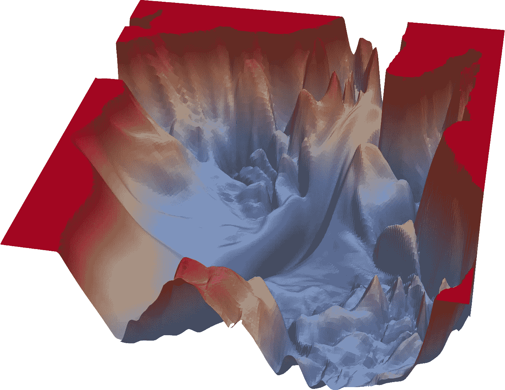

Visualization of loss landscape from [https://www.cs.umd.edu/~tomg/projects/landscapes/](https://www.cs.umd.edu/~tomg/projects/landscapes/)

1.  [简介](#a7c5)
2.  [亚当及其家庭快速回顾](#1ac5)
3.  [拉达姆](#270c)
4.  [前瞻优化器](#fb03)
5.  [羊肉](#3cb5)
6.  [学习率和批量的动态](#db98)
7.  [最佳的学习进度是什么？](#848d)

# 介绍

深度学习已经取得了很多进展，每隔几周就会有新的模型问世，然而我们在 2019 年仍然停留在亚当身上。你知道亚当论文是什么时候出版的吗？现在是 2014 年，相比之下，BatchNorm 论文是 2015 年发表的！🎈

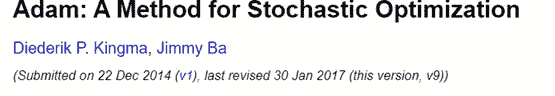

the original Adam paper

Batch Norm paper was published in 2015

对于深度学习社区来说，5 年就像是一个世纪，我对最近 optimizer 的发展很好奇，所以我四处搜索并试图总结我的发现。Sebastian 对优化算法有一个很好的概述，但是它不是最新的，并且错过了最近出现的一些进展。

# 见见亚当的家人

你可以从 PyTorch [*文档*](https://pytorch.org/docs/stable/optim.html) *中轻松找到很多优化器。阿达德尔塔，阿达格拉德，阿达姆，阿达马克斯，这样的例子不胜枚举。看来我们真的无法摆脱亚当。o 让我们快速回顾一下亚当。如果你已经熟悉了，可以跳过这一部分。*

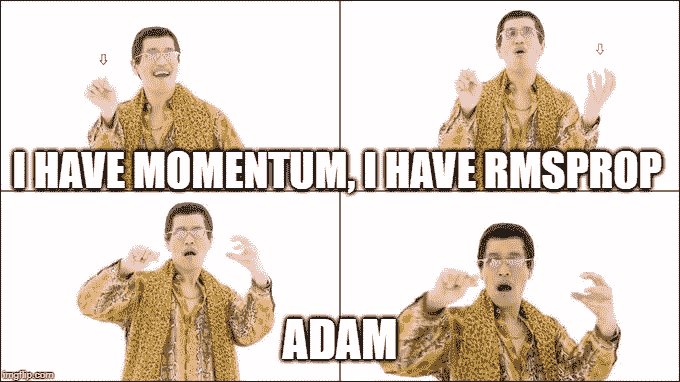

Adam = Momentum + RMSProp

大坝是动量和 RMSProp 的结合。动量(v)为优化器提供短期记忆，而不是完全信任当前梯度，它将使用先前梯度和当前梯度，并以比率β1 将它们相加。虽然 RMSProp 将梯度的 1/平方根考虑在内，但直觉上，这意味着如果方差很小(有把握)，优化器将采取更大的步骤，反之亦然。

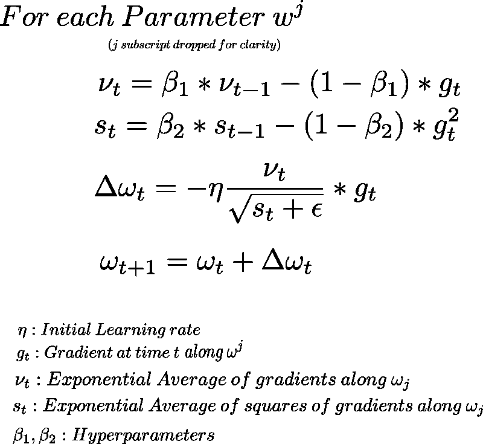

Adam updates rules

Adam 很棒，它比 SGD 快得多，默认的超参数通常工作良好，但它也有自己的缺陷。许多人指责亚当有收敛问题，往往 SGD +动量可以用更长的训练时间收敛得更好。我们经常看到很多 2018 年和 2019 年的论文还在用 SGD。

# 最近的进展

那么，关于训练神经网络，我们学到了什么？我会尽量保持简短，并补充文章的细节。

## 圣经》和《古兰经》传统中）亚当（人类第一人的名字

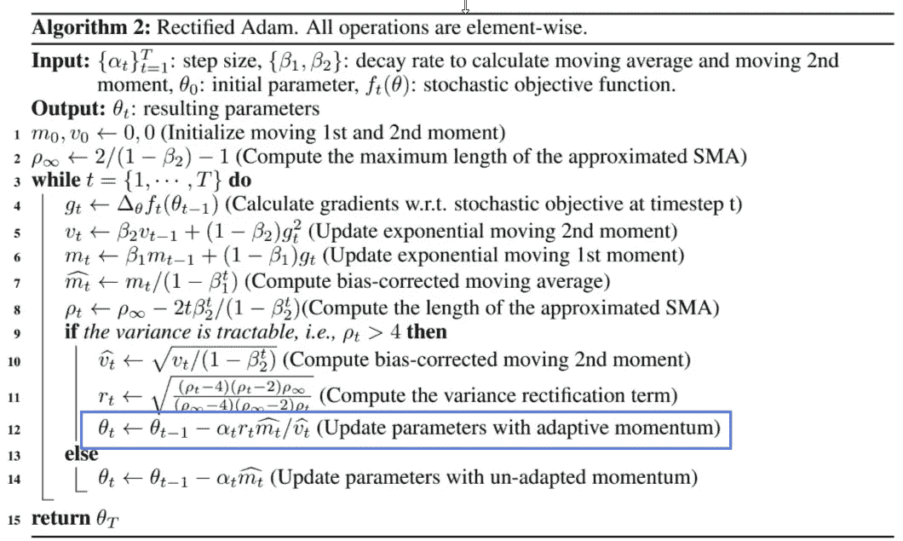

RAdam update

[*关于自适应学习率的方差和超越*](https://arxiv.org/abs/1908.03265) 引入宣叙调——亚当。本文认为，Adam 的初始训练是不稳定的，这是由于只有很少的数据点用于计算二阶矩(s_t)项的指数移动平均。RAdam 通过仅在对梯度的方差有把握时校正自适应学习率来解决这个问题。否则，它会关闭自适应学习率，并使其回落为 SGD +动量。热身学习率具有类似的效果，因为学习率从较低值(高方差，数据点少)开始，慢慢增加到较大的学习率(稳定方差，数据点多)。使用 RAdam 的一个好处是，它在学习速度的选择上更加稳健，而且你不必决定热身期的长度。

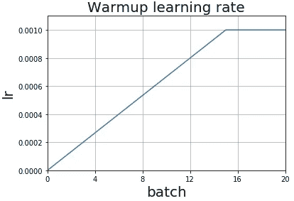

Warm-up learning rate

如果你想了解更多关于 RAdam 的知识，可以参考这篇[好看的文章](https://medium.com/@lessw/new-state-of-the-art-ai-optimizer-rectified-adam-radam-5d854730807b)。

**前瞻优化器**

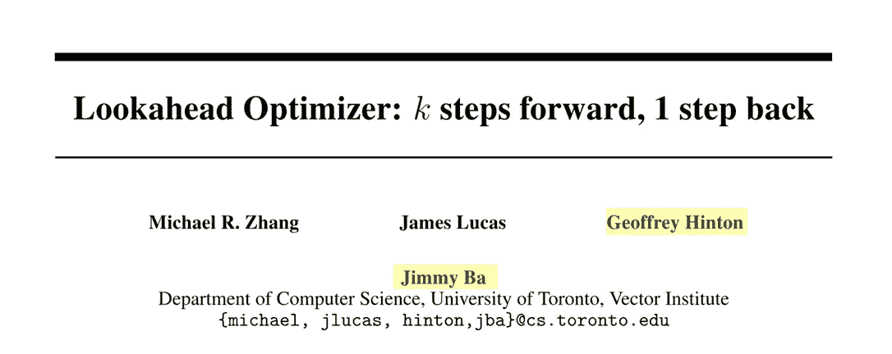

Jimmy Ba was one of the authors of the Adam Optimizer, and we all know about Geoffrey Hinton already. :)

前瞻优化器由两部分组成，慢速权重和快速权重。快速权重是充满活力的，每次更新需要几个步骤，慢速权重是谨慎的，它不是跟随快速权重，而是基于指数平滑对参数进行插值并采取一些中间步骤。前瞻优化器本身并不工作。如果你看一下算法，内循环只是普通的小批量更新，所以它需要像 SGD 或 Adam 这样的优化器。

蓝线是快速权重的轨迹，有多个数据点，因为对于快速权重(蓝色)的每 k 次更新，我们将仅对慢速权重(紫色)进行 1 次更新，然后我们将重置快速权重。基本上，快速的重量是哨兵，它需要多走几步，以确保周围是安全的，然后慢速的重量采取一些中间步骤。对于下面的例子，您可以看到，只需一次更新，慢速权重就更接近黄色区域(高精度)。

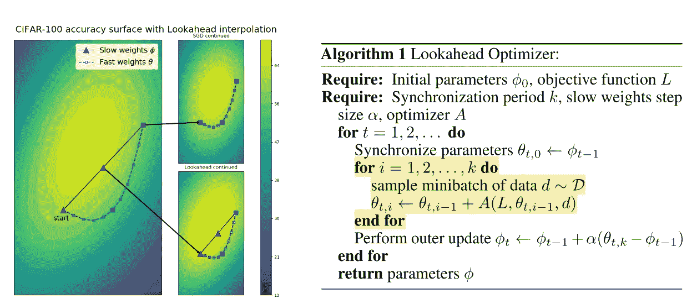

## 拉尔斯/兰姆

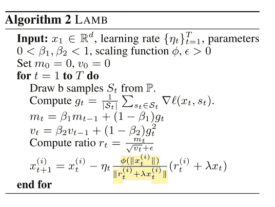

The highlighted part is the trust ratio calculation, the φ is a scaling function which the paper similar use identity function φ(z) = z

LARS 及其继任者 **L** 逐层 **A** 自适应 **M** 网膜优化器为 **B** atch training (LAMB)优化器向前迈进了一步。LAMB (1)像 Adam 一样保持梯度的平方根作为自适应学习率的一部分，但是(2)它有一个额外的组件，称为“信任比”。这篇[文章](/an-intuitive-understanding-of-the-lamb-optimizer-46f8c0ae4866)更详细地解释了 LAMB，如果你感兴趣的话。其要点是，它不仅将梯度的方差作为缩放因子，而且还将层权重和层梯度的范数之比作为**。**很有道理，比较大的权重和小的权重，你需要根据它们的比例来缩放学习率才能有类似的效果。通过用信任比率缩放，它确保每层的更新是单位 l2 范数，这通过减轻梯度消失问题来帮助训练深度网络。

# 讨论

> 如果 ADAM 速度快，SGD +动量收敛更好，为什么不能从 ADAM 开始，后来改用 SGD？

我对此没有很好的答案，我有时在 Kaggle 上看到人们这样做，这篇文章暗示这是可行的。为了训练**更快、更准确的**神经网络，有很多改进当前优化器的尝试。在深度学习中，解释往往出现在经验结果之后。那么我们到底对优化器或神经网络的优化了解多少呢？

《与 SGD 一起散步》这篇文章有一些有趣的解释，我鼓励你去读一读。我认为这解释了最近发展的一些联系。

> 为什么线性比例学习率和批量不能达到特定的批量？

与 SGD 一起散步的论文比较了梯度下降和随机梯度下降(SGD ),并提出学习速率和批量大小在 SGD 动力学中扮演两个非常不同的角色

## 学习率

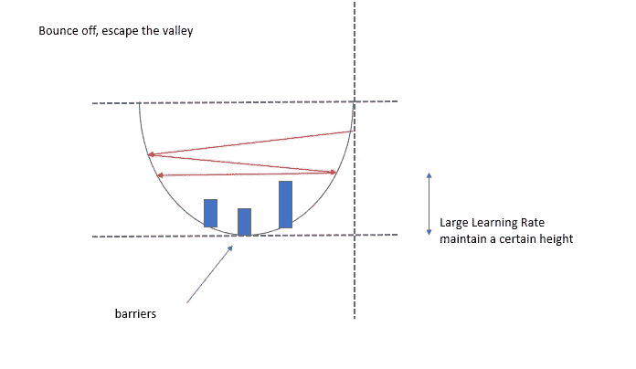

通过观察每次更新前后插值参数的损失，发现 SGD 谷大致是凸的，这大致符合我们的理解。然而，该论文也指出 SGD 谷的底部是高度非线性的，并且充满了障碍。学习率控制 SGD 的高度，所以使用大的学习率**简单地越过障碍，而不是跨越它。**这与我们的理解不同，我们通常认为较大的学习率会导致 SGD 更难反弹，并有助于避免局部最小值。下图显示了假设的拓扑结构。这可能是反直觉的，如果学习率保持在地板以上的高度，它如何将损失最小化？事实证明，我们过于简化的错觉，即 SGD 只是从一座静止的小山上走下来，是错误的。事实上，“山”本身也在不断变化，因为它只是我们从高维空间到三维空间的投影。看看这个由 https://losslandscape.com/gallery/[创造的美丽而奇异的失落景观视频吧！](https://losslandscape.com/gallery/)

## 批量

而批量大小控制随机性，这有助于探索。本文通过观察 SGD 导致比梯度下降(GD)大得多的参数距离来支持这一论点。

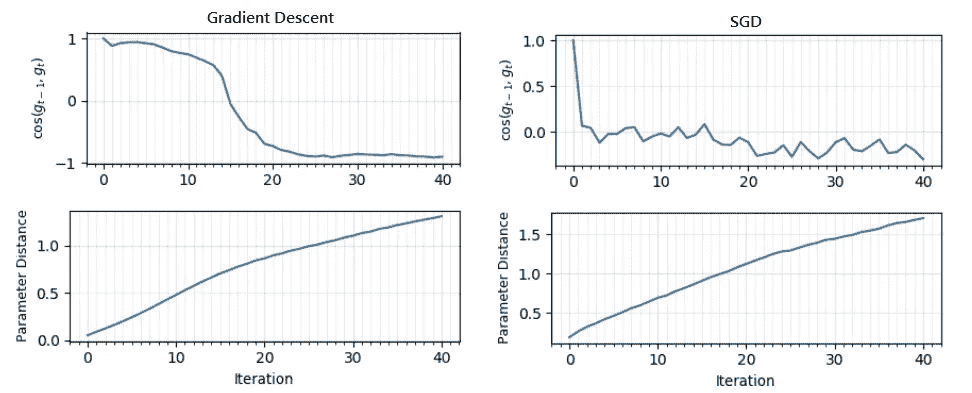

The upper graph represents the angle between each update, -1 means it is the opposite direction. The lower graph measures the ||parameter distance||² from initialization, a larger value means it is further from the initialization points.

从这个图中可以学到一些东西。(1)每次更新之间的角度具有非常不同的梯度下降和 SGD *特征。*(2)SGD 在 40 次迭代后参数距离大很多。这个角度告诉我们一些有趣的故事。首先，对于梯度下降，它很快稳定在-1，这意味着 SGD 很可能在类似山谷的地形中振荡。而对于 SGD，该值较大，并上下波动，表明它沿着谷壁振荡，但具有更多勘探，而不是停留在局部谷中。较大的参数距离也支持了 SGD 有助于勘探这一论点。

事实上，我认为这种见解可能与这样一个事实有关，即为什么在批量达到某个阈值之前，线性提升学习率/批量比例不起作用。如果批量大小具有根本不同的动态，这是有意义的。LAMB 优化器成功地用非常大的批量(65536/131072)训练了 BERT。研究 LAMB 如何改变批量大小的动态变化，并通过逐层缩放学习速率来帮助优化，这可能是很有趣的。

> 最好的学习率时间表是怎样的？

根据 RAdam 论文，我们了解到热身计划有助于减少梯度的变化。这是否意味着我们不再需要热身了？可能不会，因为我们知道高学习率也有助于优化。SGD 文件还提出了一个梯形进度表，我们可以将进度表分为 3 个阶段。fast.ai 也使用了类似的策略，他们称之为单周期训练的修改版

(1)热身阶段，从低学习率开始，线性增加到最大
(2)公路训练阶段，停留在最大学习率
(3)收敛阶段，学习率线性衰减到最小值

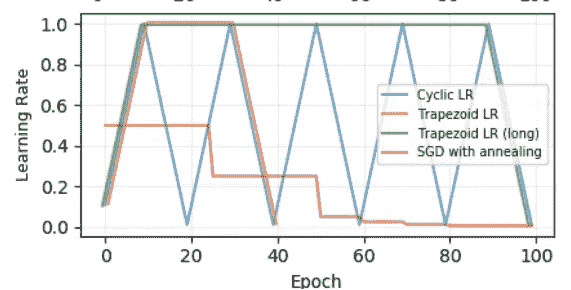

## 请给我留下评论，如果你认为有用，别忘了**竖起大拇指**。👍👍👍👍👍

关键词:亚当，SGD，RAdam，前瞻，羔羊

# 参考

【P1】[、](https://arxiv.org/search/cs?searchtype=author&query=Liu%2C+L)、[、](https://arxiv.org/search/cs?searchtype=author&query=Jiang%2C+H)、[彭城何](https://arxiv.org/search/cs?searchtype=author&query=He%2C+P)、[陈](https://arxiv.org/search/cs?searchtype=author&query=Chen%2C+W)、[、](https://arxiv.org/search/cs?searchtype=author&query=Liu%2C+X)、[高剑锋](https://arxiv.org/search/cs?searchtype=author&query=Gao%2C+J)、[韩家伟](https://arxiv.org/search/cs?searchtype=author&query=Han%2C+J)对自适应学习率的方差及其超越

[p2] [迈克尔·r·张](https://arxiv.org/search/cs?searchtype=author&query=Zhang%2C+M+R)，[詹姆斯·卢卡斯](https://arxiv.org/search/cs?searchtype=author&query=Lucas%2C+J)，[杰弗里·辛顿](https://arxiv.org/search/cs?searchtype=author&query=Hinton%2C+G)，[吉米·巴](https://arxiv.org/search/cs?searchtype=author&query=Ba%2C+J)前瞻优化器:向前 k 步，向后 1 步

【P3】[陈星](https://arxiv.org/search/stat?searchtype=author&query=Xing%2C+C)，[德万什·阿皮特](https://arxiv.org/search/stat?searchtype=author&query=Arpit%2C+D)，[克里斯特斯·齐里戈蒂斯](https://arxiv.org/search/stat?searchtype=author&query=Tsirigotis%2C+C)，[约舒阿·本吉奥](https://arxiv.org/search/stat?searchtype=author&query=Bengio%2C+Y)与 SGD 一起散步

Leslie N. Smith ， [Nicholay Topin](https://arxiv.org/search/cs?searchtype=author&query=Topin%2C+N) 超收敛:使用大学习率非常快速地训练神经网络

【P4】[【尤杨】](https://arxiv.org/search/cs?searchtype=author&query=You%2C+Y)[【李京】](https://arxiv.org/search/cs?searchtype=author&query=Li%2C+J)[萨尚克·雷迪](https://arxiv.org/search/cs?searchtype=author&query=Reddi%2C+S)[乔纳森·谢](https://arxiv.org/search/cs?searchtype=author&query=Hseu%2C+J)[桑基夫·库马尔](https://arxiv.org/search/cs?searchtype=author&query=Kumar%2C+S)[斯利那达·博贾纳帕利](https://arxiv.org/search/cs?searchtype=author&query=Bhojanapalli%2C+S)[肖丹·宋](https://arxiv.org/search/cs?searchtype=author&query=Song%2C+X)[詹姆斯·德梅尔](https://arxiv.org/search/cs?searchtype=author&query=Demmel%2C+J)[库尔特·库特策](https://arxiv.org/search/cs?searchtype=author&query=Keutzer%2C+K)[赵瑞希](https://arxiv.org/search/cs?searchtype=author&query=Hsieh%2C+C)

[p5] [帕维尔·伊兹迈洛夫](https://arxiv.org/search/cs?searchtype=author&query=Izmailov%2C+P)，[德米特里·波多普里欣](https://arxiv.org/search/cs?searchtype=author&query=Podoprikhin%2C+D)，[帖木儿·加里波夫](https://arxiv.org/search/cs?searchtype=author&query=Garipov%2C+T)，[德米特里·维特罗夫](https://arxiv.org/search/cs?searchtype=author&query=Vetrov%2C+D)，[安德鲁·戈登·威尔逊](https://arxiv.org/search/cs?searchtype=author&query=Wilson%2C+A+G)平均权重导致更宽的最优值和更好的泛化能力

[p10]伊恩·J·古德菲勒、奥里奥尔·维尼亚尔斯和安德鲁·M·萨克斯。定性表征神经网络优化问题。arXiv 预印本 arXiv:1412.6544，2014。