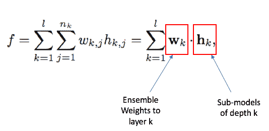
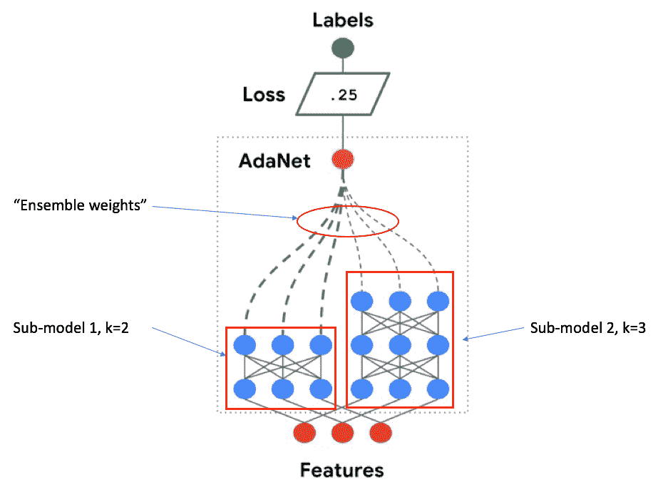
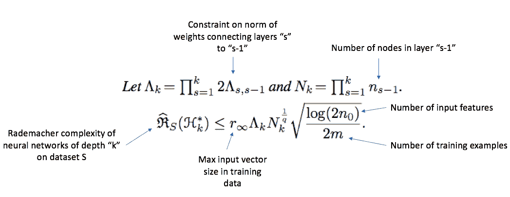
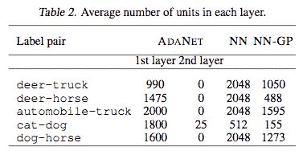

# AdaNet —论文评论

> 原文：<https://towardsdatascience.com/adanet-adaptive-structural-learning-of-artificial-neural-networks-2a0e380afe94?source=collection_archive---------23----------------------->

## 人工神经网络的自适应结构学习

*本文原载于*[*【blog.zakjost.com】*](https://blog.zakjost.com/)*。格式/数学看起来更好:)*

# 介绍

在向机器学习普及进军的过程中，AutoML 正在成为一种重要的机制，使那些在该领域没有深厚专业知识的人可以访问 ML。简单地说，AutoML 的愿望是允许一种“按钮式”体验，用户提供数据，按下按钮，从另一端得到 ML 模型。

在神经网络的情况下，确定网络结构是一个重要的挑战-例如，有多少层，每层有多少节点，各层如何连接在一起？典型的建议是，从硬件能力和速度的角度出发，选择尽可能大的模型，然后使用标准实践来防止过度拟合。

来自 Google Research 的[网络论文](https://arxiv.org/abs/1607.01097)提出了一种新算法，允许我们*学习*最佳网络结构。他们在论文中发展和应用的理论与我过去阅读的完全不同，通过研究，我学到了一个有价值的观点。我将试着在这里用一种更容易理解的方式来表达我对它的理解，希望其他人也能从他们的观点中受益。

# 框定问题

## 泛化误差

监督 ML 的主要目标是学习一个模型，该模型提供对新数据的良好预测，即最小化*泛化误差*。对此的典型方法是首先优化模型参数，以学习对训练数据进行良好的预测。然而，众所周知，单独使用最大似然技术来学习模型参数会导致模型在训练数据上表现良好，但可能不会很好地推广到新数据，因为它也适合训练数据中的噪声。因此，已经开发了各种技术，以一种或另一种方式试图限制模型的复杂性(例如，正则化、丢弃、提前停止等)，以使其无法适应噪声。然后使用迭代循环来开发该模型，在该循环中，通过使用维持数据集来评估过拟合的程度，然后使用不同的参数来重新训练该模型，目的是最终减少泛化误差。

本文采用了不同的方法。作者发展了一种理论，该理论产生了一个方程，用于**直接**估计泛化误差的上限。直观地说，这个等式取决于训练数据性能和模型复杂性之间的权衡。有了泛化误差的显式方程(以及最小化它的算法)，我们就可以在训练性能和复杂性之间做出良好的权衡决策。由于模型的复杂性取决于神经网络的结构和训练数据的性质，我们可以学习网络的最佳结构。

## 合奏

首先，应该注意的是，这篇论文是同一作者在[深度增强](https://ai.google/research/pubs/pub42856)论文中开发的技术的扩展。尽管那篇论文是在树的集合的上下文中，但是这篇论文将类似的技术扩展到了神经网络的世界。这项工作的基础是将“终极模型”视为更简单的“子模型”的集合(引号中的术语是我的非正式术语，不是论文)。这意味着:

其中“最终模型” *f* 是子模型的加权和， *w* 表示权重， *h* 表示子模型。在树的情况下，集成学习每棵树的决策的最佳权重。在神经网络的情况下，这只是另一个具有单个输出节点的密集层，该输出节点连接到子模型层的所有输出节点。下面是一个示例网络架构，其中有两个子模型，每个子模型每层有 3 个输出节点，但具有不同的深度:

# 理论

## 计算泛化误差

我不会在这里试图重新创建证明，我将只讨论结果的有趣方面。泛化误差上限的等式如下:

用英语来说，大致是这样的:

> *泛化误差< =训练误差+ensemble _ weights * submodel _ complexity+取决于你训练数据大小和神经网络最大深度的东西。*

我想特别提醒大家注意这一部分:

**泛化误差=~子网络上的集成权重？！**这真是个好消息！这意味着我们可以:

1.  通过修改应用于集合中各种组件的权重来改善泛化误差。
2.  允许复杂的模型(即深层)，只要我们通过给它们小的权重来补偿。

这为我们提供了一种原则性的方法，用于决定何时在我们的集合中包括更复杂的模型，以进一步减少训练误差:当训练误差的*减少大于复杂性项的*增加时，我们应该这样做。

## 复杂性

到目前为止，我们已经看到了模型复杂性是如何影响估计泛化误差的，但是还没有看到如何计算模型复杂性本身。在这个研究的世界里，拉德马赫复杂性的概念似乎是标准。在阅读这篇论文之前，我对这个概念并不熟悉。我的理解是，它衡量的是一族函数对噪声的拟合程度。在高层次上，您可以想象一些复杂的深度神经网络可能比逻辑回归更适合随机生成的训练数据集。拉德马赫复杂性是量化这种能力的公式。

此外，*经验* Rademacher 复杂度量化了一族函数在特定数据集上拟合噪声的程度。虽然我对自己的理解不是 100%有信心，但我认为这个想法是，一些数据集自然允许一个模型比其他模型适合更复杂的函数。例如，如果您想象一个包含 100 行单一二进制特征的数据集，那么即使使用深度神经网络，您使用该特征预测噪声标签的能力也是有限的。然而，如果您有 1000 个高基数特性，那么您可以更容易地适应噪音标签。这样，**模型的复杂度就依赖于训练数据集。**这是一个特性，而不是一个错误，因为数据相关的复杂性度量允许理解一些数据集比其他数据集需要更复杂的模型(例如，语音识别与虹膜物种分类)。

困难的部分是使用 Rademacher 复杂度的一般定义来导出特定函数族的上界。幸运的是，AdaNet 的论文为前馈神经网络做了这样的工作:

所有这些术语都与神经网络的结构(例如， *Lambda_{s，s-1}* 是对层 *s* 和 *s-1* 之间的连接规范的约束)或训练数据集的属性相关。

# 那又怎样？

好，让我们深呼吸，从所有这些方程中恢复过来。到目前为止，我们已经有了一个神经网络集成的泛化误差方程。这取决于我们控制的子模型连接的权重，以及它所连接的层的复杂性。层的复杂性由网络的结构决定，例如，更多/更深的层和更大数量的节点增加了我们的训练数据集的复杂性和属性。

通过将该方程视为成本函数并将其最小化，我们可以以原则的方式学习神经网络集成的最佳结构。在这一创新之前，我们只是选择了一种网络结构，并针对间接复杂性惩罚方法(如放弃和提前停止)迭代调整了参数。或者我们将结构参数，如层数，视为另一个超参数，并进行大量试验来调整一切。

但是还有一些事情我们没有讨论:生成这些集合之一并在网络架构搜索空间中导航的秘诀是什么？

# 实际的算法

有多种方法可以做到这一点，但是作者建议了一种相当直接的方法:

1.  训练两个候选子网络(这与集合无关):一个具有与前一次迭代中使用的相同层数；一个具有作为先前迭代的一个附加层。
2.  一旦子网络的训练完成，剥离最后一个节点以暴露最后一个隐藏层，然后通过学习权重将每个节点插入到集成中，以将最后一层连接到集成的输出。这是从步骤 1 开始对每个候选子网独立完成的。(这一步使用泛化误差方程作为代价函数，量化了训练误差和子网络复杂度之间的权衡。)
3.  为集合选择导致最低泛化误差的候选项
4.  从步骤 1 开始重复，直到泛化误差停止改善。

这里有一个来自[官方回购](https://github.com/tensorflow/adanet)的动画演示了这一过程:

请注意，这是一个自适应的过程，开始时很简单，随着时间的推移会变得越来越复杂。如果手头的问题需要一个更复杂的模型，算法将运行更长时间，并扩大结构。如果模型具有足够的复杂性/容量，泛化误差降至最低点，算法终止。这是一种贪婪的搜索，类似于决策树如何一次选择一个分裂点，而不是试图联合优化所有分裂点。通常，这可能导致次优结果。然而，这是标准的保证，即如果我们继续降低我们的目标，我们仍然可以得到正则化增强的收敛(参见原始论文的更多讨论和参考)。

# 实验结果

作者使用 CIFAR-10 数据集将他们的方法应用于一些图像分类任务。他们比较了两种调整神经网络的标准方法:在结构+学习参数(NN)上进行随机网格搜索，并应用贝叶斯优化来帮助搜索相同的超参数空间(NN-GP)，这是一种为亚马逊 SageMaker 提供动力的 HPO 过程。

笑点是 AdaNet 表现更好。但是，请观察这些不同方法针对不同图像分类任务所采用的最终结构:

在这些例子中，NN 和 NN-GP 总是选择一个层。这也是 AdaNet 的情况，除了区分猫和狗，它们生长了第二层。这符合我们的直觉，即这将是一项比区分鹿和卡车更复杂的任务。有趣的是，在大多数情况下，AdaNet 的网络规模比其他方法要小，但在性能上仍优于其他方法。

最后，作者在标准点击预测数据集上比较了 AdaNet 和 GP-NN，这是一项具有挑战性的分类任务。(贝叶斯优化也被应用于 AdaNet 的超参数搜索)。在这种情况下，GP-NN 选择了四个各有 512 个单元的隐藏层。AdaNet 能够使用 512 个单元的单层实现更好的性能。

# 结论

这项工作采取了一种有趣的方法，因为它直接试图量化/最小化泛化误差的估计。令人惊讶的是，这被证明是一项可学习的任务，它基于训练误差和子模型复杂性来调整应用于集成子模型的权重，而子模型复杂性又取决于它们的结构。与简单的搜索算法相结合，这使我们能够自适应地生成神经网络结构，以便为手头的问题找到正确的模型复杂性水平。

然而，这种方法不是免费的。我们仍然需要通过使用维持集来调整超参数，例如学习速率、节点/层的起始数量、复杂性损失的强度等等。但是，这个过程往往会学习更好的表现和更有效的结构。通过直接最小化泛化误差，我们可以对模型结构做出更有原则的决定，而不是例如选择不必要的大模型，并试图通过间接方法来调整我们的过度拟合。

要亲自尝试，请查看官方回购。

*最初发表于*[T5【https://blog.zakjost.com】](https://blog.zakjost.com/post/adanet/)*。*