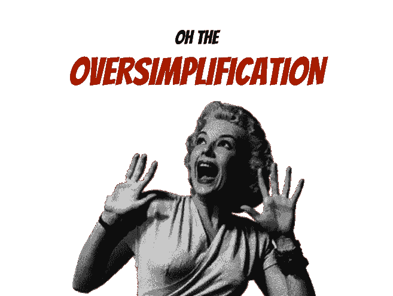
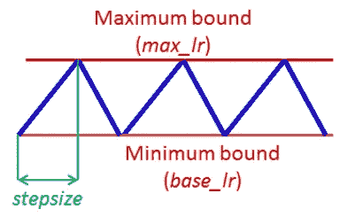
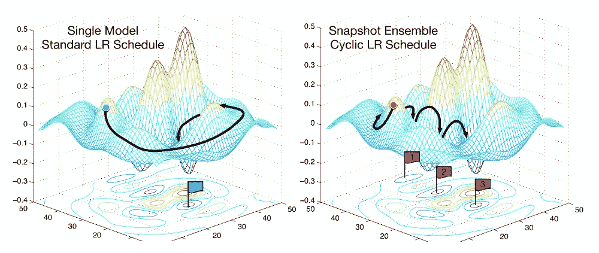
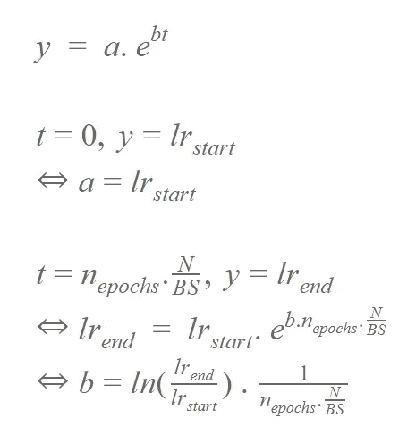
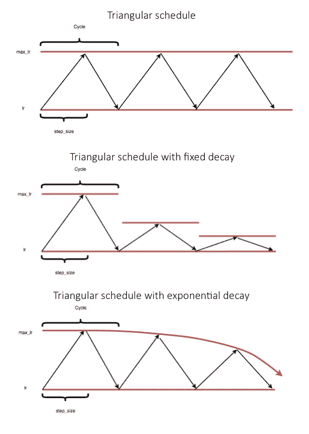

# 使用 PyTorch 的自适应和循环学习率

> 原文：<https://towardsdatascience.com/adaptive-and-cyclical-learning-rates-using-pytorch-2bf904d18dee?source=collection_archive---------7----------------------->

Photo by [Sirma Krusteva](https://unsplash.com/@forevercarrieon?utm_source=medium&utm_medium=referral) on [Unsplash](https://unsplash.com?utm_source=medium&utm_medium=referral)

学习率(LR)是调整神经网络的关键参数之一。具有自适应学习率的 SGD 优化器已经流行了一段时间:Adam、Adamax 和它的老兄弟们通常是事实上的标准。它们消除了手动搜索和安排你的学习速度(如衰减率)的痛苦。

Source: Jeremy Jordan’s blogpost

这篇文章将给出一个简短的例子，概述和比较最流行的自适应学习率优化。我们将使用 PyTorch，时髦的神经网络库的选择！

除此之外，fast.ai 还宣扬了循环学习率(CLR)的概念，提到了莱斯利·史密斯的伟大论文([链接](https://arxiv.org/abs/1506.01186))。我们将看看 SGD 如何与其他优化程序相抗衡。

为了演示，我们将承担两项分类任务:

*   基于普通 CNN 架构的图像分类
*   使用预训练(在 ImageNet 上)的 ResNet34 网络进行图像分类

该职位的所有代码和培训日志可以在 [GitHub](https://github.com/TDehaene/blogposts/tree/master/learning_rates) 上找到。

# 数据

在这篇文章中，我们将使用 Kaggle 的“鲜花识别”数据集([链接](https://www.kaggle.com/alxmamaev/flowers-recognition))。这是一个很好的测试图像分类网络的基本真实数据集。

example image of the class ‘dandelion’

使用 20%进行验证的数据被平均分配到 5 个类别中进行预测:

# 自适应优化器

在不深入研究每一个优化器的数学原理的情况下，这里有一个简短(有点过于简单)的概述，介绍一下我们将要与之对抗的优化器:

*   **Adagrad** :这将根据梯度的过去历史，缩放每个参数的学习率。本质上:大梯度= >小α，反之亦然。然而不利的一面是学习率会很快下降。
*   **Adadelta** :在 Adagrad 上继续，但是有了新的花样:只存储过去的 w 渐变而不是整个历史，(现在有限的)历史存储为衰减的平均值。
*   RMSProp :有点类似(请不要向我开枪，辛顿先生，先生)，但是 RMSProp 将 LR 除以梯度平方的指数衰减平均值。
*   **Adam** :除了存储历史梯度平方和，它还计算过去梯度的指数衰减平均值(类似于动量)。
*   **Adamax** :这里，另一个技巧应用于平方梯度 v(t)的移动平均值，作者应用无穷范数ℓ∞来获得新的范数约束向量 v(t)，将其插入 Adam，从而获得令人惊讶的稳定算法。

👉提示:如果你正在寻找优化者的更深入的数学比较，看看 Sebastian Ruder 的[这篇精彩的博客文章](http://ruder.io/optimizing-gradient-descent/index.html#momentum)，它对我写这篇文章有很大帮助。

# 循环学习率

CLR 的论文提出了两个非常有趣的观点:

1.  它为我们提供了一种在训练过程中有效安排学习速率的方法，即以三角形的方式在上限和下限之间变化。
2.  这给了我们一个非常合理的估计，哪个学习率范围最适合你的特定网络。

这里有许多参数可供选择:

*   **步长**:LR 从下限上升到上限需要多少个历元。
*   **max_lr** :调度中最高的 lr。
*   **base_lr** :进度表中最低的 lr，实际上:本文作者建议将此取比 **max_lr** 小一个因子 R。我们的利用系数是 6。

当然，很难分析出这种方法行得通的确切原因。LR 的发展可能会导致网络在短期内出现更高的损耗，但这种短期的缺点在长期内证明是有利的。如果当前的网络不太稳定，它可以让网络跳到另一个局部最小值。

Source: Snapsshot Ensembles ([https://arxiv.org/abs/1704.00109](https://arxiv.org/abs/1704.00109))

CLR 优于上述自适应方法的另一个优点是计算量较小。

在论文中，还提到你可以随着时间线性或指数递减上界，但这在这篇博文中没有实现。

那么这在代码中是如何工作的呢？…

## 第一步:找到上面的 LR

以一个普通的 CNN 为例:第一步是为你的模型计算学习率的上限。做到这一点的方法是:

*   定义一个初始学习率，即您想要测试的范围的下限(假设为 1e-7)
*   定义范围的上限(假设为 0.1)
*   定义一个指数方案来逐步完成这个过程:

Used formula for the LR finder scheduling (N = number of images, BS = Batch Size, lr = learning rate)

幸运的是，PyTorch 有一个 LambdaLR 对象，它允许我们在 lambda 函数中定义上述内容:

*   接下来，在你的网络中运行(我用了两个纪元)。在每个步骤(每个批量):获取 LR、获取损失并优化梯度:

👉注意:我们不是在每一步取“原始”损失，而是平滑损失，即:损失= α。损耗+ (1- α)。以前的损失

在此之后，我们可以清楚地看到 LR 遵循一个很好的指数规律:

基本网络的损耗-lr 曲线(见下文)如下所示:

我们可以清楚地看到，过高的 LR 会导致网络损耗发散，过低的 LR 根本不会导致网络学习太多…

在他的 fast.ai 课程中，杰瑞米·霍华德提到一个好的上限并不在最低点，而是向左 10 倍。

考虑到这一点，我们可以说学习率的一个好的上限是:3e-3。

根据这篇论文和其他资料，一个好的下限是上限除以因子 6。

## 步骤 2: CLR 调度程序

第二步是创建一个循环学习时间表，它在下限和上限之间改变学习速率。

这可以通过多种方式实现:

Various possibilites for the CLR shape (source: [jeremy jordan’s blog](https://www.jeremyjordan.me/nn-learning-rate/))

我们要用简单的三角 CLR 时间表。

以编程方式，我们只需要创建一个自定义函数:

## 第三步:包装

在步骤 3 中，这可以被包装在 PyTorch 中的 LambdaLR 对象中:

## 训练

在一个时期内，我们需要使用'更新 LR。scheduler 对象的“step()”方法:

# 对比 1:香草 CNN

首先是使用普通的(非预训练的)CNN 进行分类。我使用了以下网络架构:

为了防止模型过度适应(相对较小的)数据集，我们使用以下技术:

*   线性图层中的丢失
*   CNN 块中的 Batchnorm 层
*   数据扩充:

👉提示:你需要提前计算通道标准化的均值和标准差，查看完整的笔记本，看看如何解决这个问题。

我们为 6 个优化器中的每一个训练了 150 个时期的网络。为了消除一些可变性，我们为每个优化器运行了 3 次。

训练和验证准确性看起来像这样:

Training accuracy

Validation accuracy

好了，孩子们，我们在这里能看到什么:

👉阿达格拉德:平庸的表现，正如所料

👉阿达德尔塔:在 acc 训练中不是真正的冠军，但在验证中表现非常出色

👉RMSProp:除非我在这里做错了什么，否则我对糟糕的表现感到有点惊讶

👉亚当:一直很好

👉Adamax:有希望的训练精度发展，但没有完美地反映在验证精度上

👉带 CLR 的 SGD:训练精度收敛快得多，验证精度收敛快，不算太差…

最终，SGD+CLR、Adam 和 Adadelta 似乎都以大约 83%的最终验证准确率结束。

# 对比二:Resnet34 迁移学习

如果你说:“小数据集上的图像分类”，你需要考虑迁移学习。

所以我们就这么做了，使用 Resnet34，在 ImageNet 上进行预训练。我相信数据集相当接近 Imagenet 图片，所以我只解冻了 5 个卷积块的最后一个块，并用新的线性层替换了最后一个线性层:

对于 6 个优化器中的每一个，网络被训练 100 个时期(由于更快的收敛):

Training accuracy

Validation accuracy

此处有重要提示:

👉总的来说:优化器之间的差异要小得多，尤其是在观察验证准确性时

👉RMSProp:仍然有点表现不佳

👉SGD+CLR 在训练准确性方面再次表现良好，但这并没有立即反映在验证准确性上。

对于迁移学习来说，调整学习速度和仔细选择优化器的绝对回报似乎不太大。

这可能是由于两个主要影响:

*   网络权重已经大大优化
*   优化器通常只能优化整个网络权重的一小部分，因为大部分权重保持冻结

# 结论

这篇博文的主要观点是:

> 不要只是采用任何旧的现成的优化程序。学习率是最重要的超参数之一，因此仔细研究它是值得的。如果你想比较，看看 SGD 的 CLR 时间表。

再次声明:所有代码都可以在这里找到[，可以随意查看！](https://github.com/TDehaene/blogposts/tree/master/learning_rates)

资料来源和进一步阅读

*   https://arxiv.org/abs/1506.01186
*   [https://www . data camp . com/community/tutorials/cyclic-learning-neural-nets](https://www.datacamp.com/community/tutorials/cyclical-learning-neural-nets)
*   [https://medium . com/@ Li Peng 2/cyclic-learning-rates-for-training-neural-networks-4de 755927 d46](https://medium.com/@lipeng2/cyclical-learning-rates-for-training-neural-networks-4de755927d46)
*   [http://ruder . io/optimizing-gradient-descent/index . html # momentum](http://ruder.io/optimizing-gradient-descent/index.html#momentum)
*   [http://teleported.in/posts/cyclic-learning-rate/](http://teleported.in/posts/cyclic-learning-rate/)