# Matlab/Simulink 中传感器融合的自适应巡航控制

> 原文：<https://towardsdatascience.com/adaptive-cruise-control-with-sensor-fusion-within-matlab-simulink-294aeb24e6e0?source=collection_archive---------8----------------------->

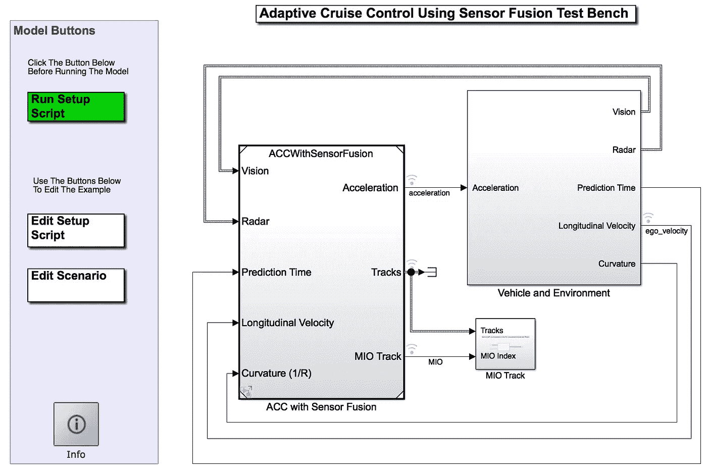

最近，我试图使用 Matlab/Simulink 工具箱运行一些先进的驾驶辅助系统(ADAS)测试台。近年来，Matlab 发布了[自动驾驶工具箱](https://ch.mathworks.com/help/driving/index.html)，结合最近流行的机器/深度学习技术，使得单个 ADAS 功能的开发变得更加简单。

在我继续讲下去之前，必须先对相关主题做一个简短的总结。

# 目标检测

关于这个问题有大量的教程和例子。可以使用 [Tensorflow API](https://github.com/tensorflow/models/tree/master/research/object_detection) 或 Matlab/Simulink [计算机视觉工具箱](https://ch.mathworks.com/help/vision/index.html)利用各种类型的传感器数据，例如 3D 激光雷达云点和/或从相机拍摄的图片，从相机视频流中检测物体。

即使通过 ML/DL 技术有可能检测到目标，它仍然远离甚至简单的 ADAS 功能开发。由于 ADAS 或自动驾驶汽车必须首先在传感器数据的帮助下正确地解释现实世界，因此它还应该具备思考、规划和反应的能力，更具体地说是对汽车的控制。

> 模型预测控制

基于简单的[自行车模型](https://borrelli.me.berkeley.edu/pdfpub/IV_KinematicMPC_jason.pdf)，运动学和动力学控制方程可以馈入 MPC 算法。

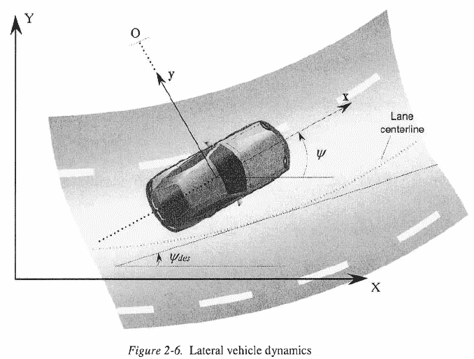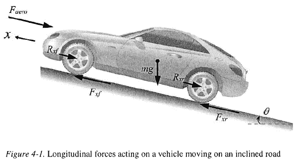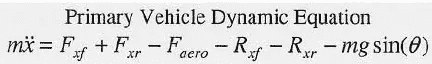

[模型预测控制](https://www.academia.edu/31492223/Rajesh_Rajamani_Vehicle_Dynamics_and_Control_Mechanical_Engineering_Series.pdf)只是控制技术中的一种，由于具有多输入/输出以及约束的优化能力，它在 ADAS 开发中越来越受欢迎。对于线性时不变(LTI)控制系统，连续状态空间模型可以描述为

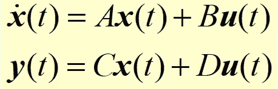

continuum state-space model. **A, B, C D** are constant state space matrices. x is state vector, y the output, u the input/control variable.

基于一个简单的自行车模型，状态函数可以写成

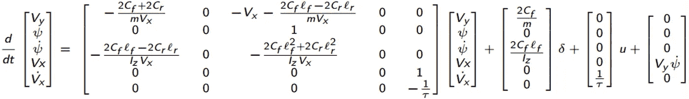

Vy，dot_Vy 用于横向控制，psi，dot_psi 用于转向控制，Vx，dot_Vx 用于纵向控制。详细信息可从 Matlab [文档](https://ch.mathworks.com/help/driving/examples/adaptive-cruise-control-with-sensor-fusion.html?searchHighlight=Autonomous%20Vehicle%20Steering%20Using%20Model%20Predictive%20Control&s_tid=doc_srchtitle)页面找到。

Matlab 中有一个关于 MPC 的简短的[网络研讨会](https://ch.mathworks.com/videos/series/understanding-model-predictive-control.html)，可以帮助理解背后的算法。MPC 的主要思想是对未来的工厂输出进行预测，优化器找到最优的控制输入序列，使工厂输出尽可能接近设定值。

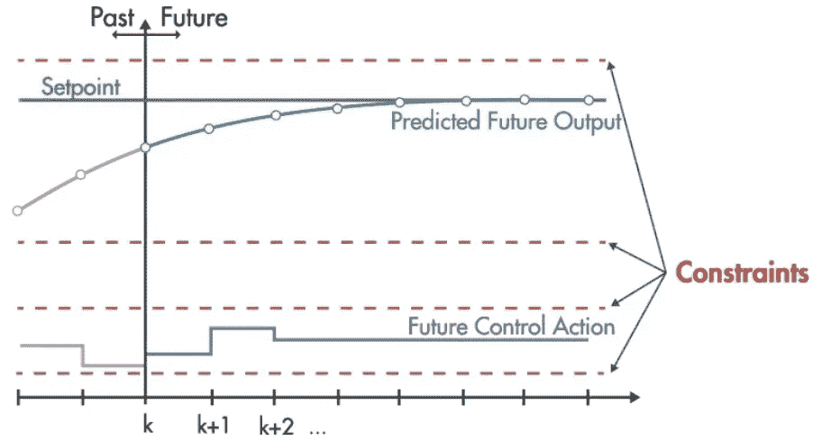

例如，下图显示了在十字路口转弯的典型场景。MPC 将考虑道路图的曲率，并最小化道路图和工厂路径之间的误差。MPC 的主要优点之一是具有硬/软约束能力的多输入和多输出，这使得它非常适合于 ADAS 函数中的控制策略。

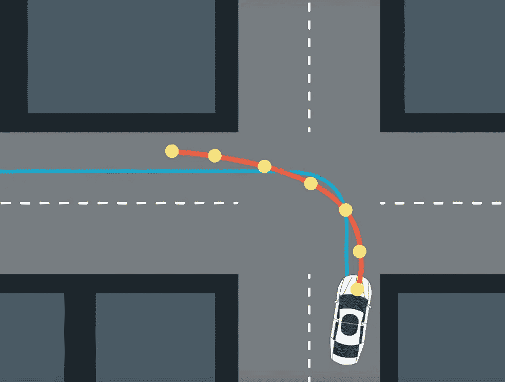

既然我们已经从对象检测技术和 MPC 策略中获得了输入，那么我们可以开始使用 Matlab/Simulink 工具箱来构建玩具模型。

关于前面提到的 MPC，重要的一点是它只对慢动作 senario 有效。当处理高速情况时，必须使用离散 MPC 技术。

# 自适应巡航控制系统

此处显示的示例演示了这样一个场景:自我车前面的一辆车从右侧切入自我车的车道。雷达和摄像头传感器检测并确认前车。出于安全原因，自车必须估计与前车的相对距离，如果该距离小于允许距离，则自车必须刹车并保持安全距离，直到完全停止。直到/当前面的车远离时，然后自我车逐渐加速，直到达到期望的速度。

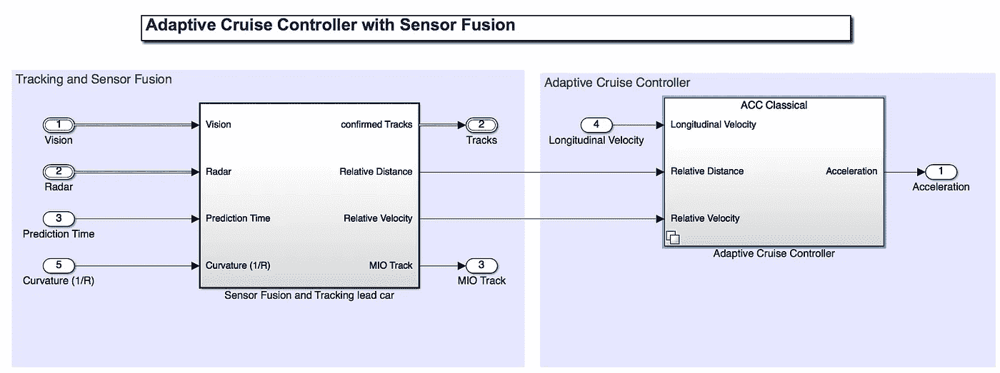

ACC with sensor fusion function

在该测试台中，ACC 传感器融合模块具有这样的功能:检测在同一车道(以及在传感器检测范围内的其他车道)是否有领先车，融合检测结果(去除冗余)，将检测结果传递给 MPCMPC 相应地减慢/加速 ego 汽车。

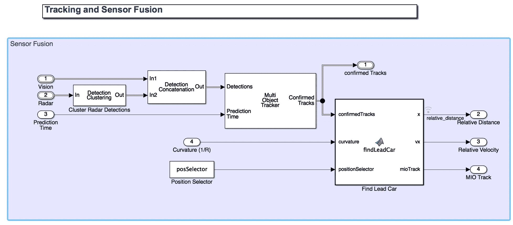

输入参数是视觉和雷达探测目标、模拟时间、自车的纵向速度和道路曲率。**传感器融合和跟踪引导车**子模块包含由于来自雷达的噪声而导致的第一次雷达检测聚类，然后将来自视觉和雷达的检测组合起来传递给多目标跟踪器。使用[卡尔曼滤波器](https://ch.mathworks.com/videos/series/understanding-kalman-filters.html)精确估计检测状态，并融合检测。然后，使用确认的轨迹和道路信息来确定本车和引导车之间的相对距离和相对速度，这将用于 ACC。

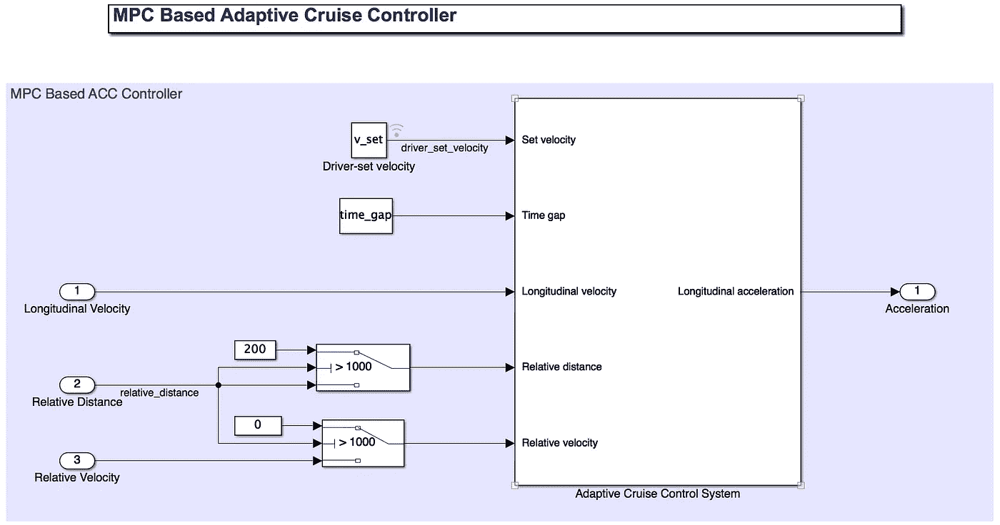

连同相对距离和相对速度，time_gap(驾驶员的反应时间？)使用 MPC 方案将纵向速度和驾驶员设定速度馈入自适应巡航控制系统。在该测试台中，使用了预建的 ACC 控制模块。也有可能建立用户特定的 MPC 模块，这里有一个[教程](https://ch.mathworks.com/videos/understanding-model-predictive-control-part-1-why-use-mpc--1526484715269.html)如何这样做。该 ACC 模块的主要功能是跟踪驾驶员设定的速度，并通过调整本车的纵向加速度来保持与前方车辆的安全距离。该模块使用模型预测控制(MPC)计算最佳控制动作，同时满足安全距离、速度和加速度约束。算法结构的细节如下所示。然后，用户可以相应地从 Matlab 修改原始 ACC 模块。

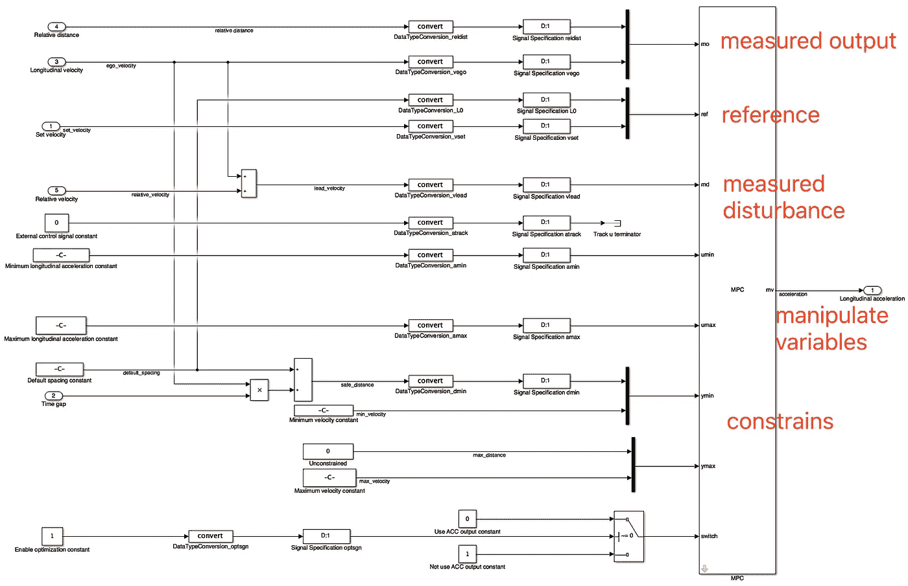

Adaptive Cruise Control using Model Predictive Control

到目前为止，主要的 ACC 控制已经基本完成。然而，当在道路上驾驶时，驾驶员也必须始终保持在车道上。因此，车道跟踪功能，换句话说，转向控制也必须考虑。道路(地图)信息必须与 MPC 调节的纵向加速度一起输入车辆和环境 Simulink 模块。在当前的测试案例中，道路几何形状通过恒定曲率 1/R 进行简单描述，并且已经在 Matlab 的工作空间中创建，可以从子系统中直接使用。

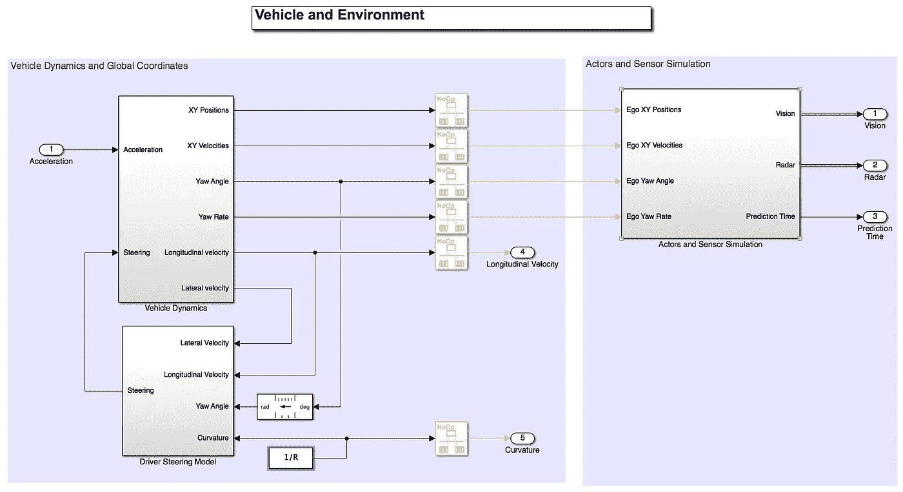

Using the MPC regulated longitudinal acceleration and curvature of the road to update the position and yaw angle of the ego car. The steering control is achieved via PID control.

与 MPC 调节的 ego 汽车加速度一起，通过**比例-积分-微分** (PID)控制方案实现转向控制。

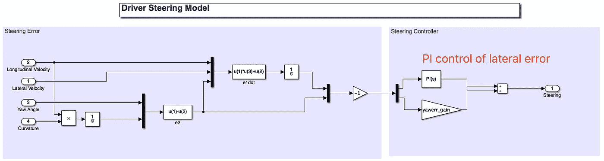

基于带力输入的自行车模型，对自主车的位置和横摆角进行了仿真。

到目前为止，我们已经具备了运行 ACC 模拟所需的所有要素。单击 run 按钮，可以从鸟瞰范围查看结果，如下所示，仅显示一帧。

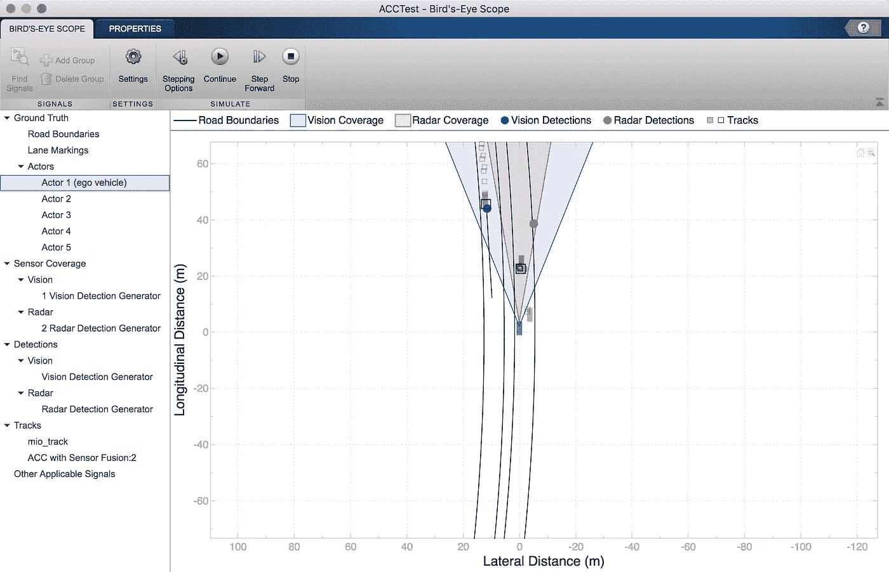

整个模拟结果看起来像

从视频中我们可以看到，当一辆速度较低的汽车切入速度较快的自我车的车道时，只要传感器检测到这种领先的汽车，在 MPC 控制的帮助下，自我车首先减速以保持安全距离。当前车离开同一车道时，本车再次加速，直到达到驾驶员设定的速度。自我车辆的速度和驾驶员设定速度如下图所示。还示出了自我车辆的相对距离和加速度曲线。

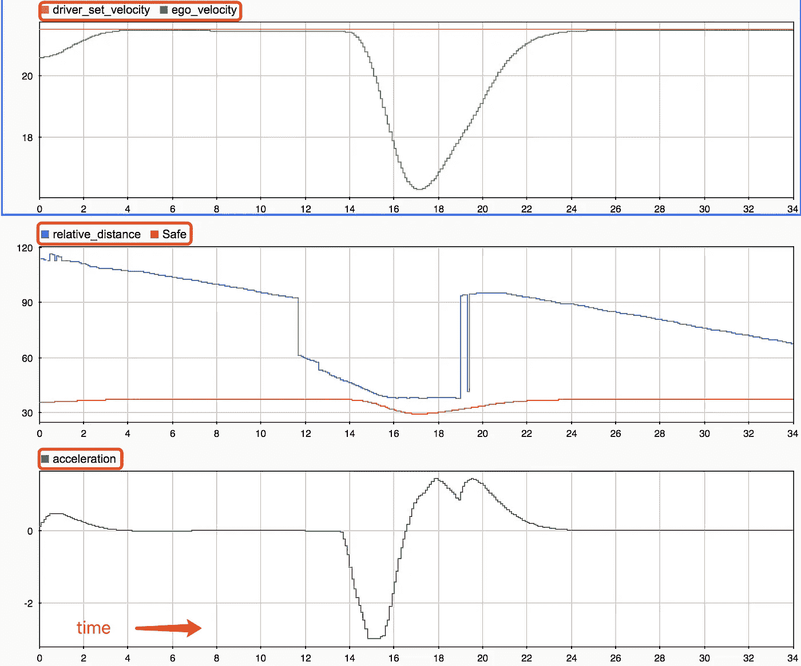

最后但同样重要的是，这种 ADAS 必须用 C 或 C++部署到特定的 ECU 上，Matlab 提供了代码生成器工具箱来轻松完成这一任务。如果需要添加或修改更多的 C 算法，那么可以基于生成的 C/C++代码继续工作。

到目前为止，我已经回顾了 Matlab/Simulink 实现的 ACC 测试 bensch。可以正确地恢复主要功能。对于更复杂或不同的驾驶场景，用户可以使用这里描述的类似时间表进行进一步的功能开发。