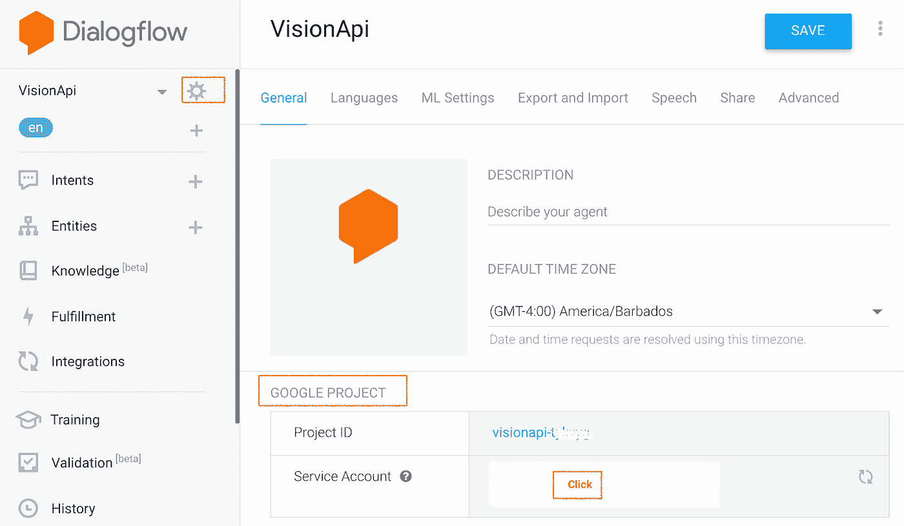

# 使用 Google Dialogflow 和 Vision API 为您的聊天机器人添加图像识别功能

> 原文：<https://towardsdatascience.com/add-image-recognition-to-your-chatbot-with-google-dialogflow-and-vision-api-fd45cd0bdd45?source=collection_archive---------7----------------------->


对话式人工智能的使用案例多种多样。它们包括客户支持、电子商务、控制物联网设备、企业生产力等等。用非常简单的术语来说，这些用例涉及用户问一个特定的问题(意图)，以及对话体验(或聊天机器人)通过调用后端系统(如 CRM、数据库或 API)来响应该问题。这些“意图”通过利用自然语言处理(NLP)和机器学习(ML)来识别。

事实证明，这些用例中的一些可以通过允许用户上传图像来丰富。在这种情况下，您会希望对话体验基于该图像中的确切内容采取行动。

让我们想象一个电子商务客户支持示例:如果您提供自动退款，那么您会要求用户上传收据的图像，将图像发送到预先训练的 ML 模型，从图像中提取文本，从文本中识别购买日期，查看它是否符合退款窗口，然后处理退款或拒绝退款。

让我们想象另一个支持示例:您的硬件产品要求客户遵循一些设置步骤，如果他们遇到问题，他们会求助于聊天机器人，聊天机器人会要求他们上传设备的图像，图像会被发送到预先训练的 ML 模型，该模型会识别问题可能是什么，并通过聊天机器人将其反馈给用户。

# 介绍


The chat experience that you will build as a part of this tutorial

在本教程中，您将学习如何将 Dialogflow 与 Vision API 集成在一起，以便对用户提供的图像输入做出丰富的、动态的基于 ML 的响应。您将创建一个简单的聊天机器人应用程序，该应用程序将图像作为输入，在 Vision API 中对其进行处理，并将识别出的地标返回给用户。见下图。

*   您将创建一个 Dialogflow 代理
*   实现一个 django 前端来上传文件
*   实现 Dialogflow fulfillment 以针对上传的图像调用 vision API。就像下图一样。

[这里的](https://www.youtube.com/watch?v=4wS3Wkjols4&list=PLIivdWyY5sqK5SM34zbkitWLOV-b3V40B&index=13&t=0s)是解释接下来步骤的视频。

# 架构概述

我们正在创建一个自定义 Django 前端的对话体验，并将其与 Vision API 集成。我们将使用 Django-framework 构建前端，在本地运行并测试它，然后在 Google App Engine 上部署它。前端将如下所示:

请求流将是:

1.  用户将通过这个前端发送一个请求。
2.  这将触发对 Dialogflow DetectIntent API 的调用，以将用户的话语映射到正确的意图。
3.  一旦检测到“探索地标”意图，Dialogflow fulfillment 将向 Vision API 发送请求，接收返回的响应并将其发送回用户。


整体架构:


Architectural Overview

# 什么是谷歌云视觉 API？

谷歌云视觉 API 是一个预先训练好的机器学习模型，有助于从图像中获得洞察力。您可以获得包括图像标记、人脸和地标检测、光学字符识别(OCR)和明确内容标记在内的洞察。[此处是链接](https://cloud.google.com/vision/),以更具体地了解 Vision API。

# 创建对话流代理

1.  转到[对话流控制台](https://console.dialogflow.com/api-client/)。
2.  登录，如果你是第一次使用，然后使用您的电子邮件注册
3.  接受条款和条件，您将进入控制台
4.  创建一个**代理。**要创建**，**单击左侧窗格中的下拉菜单，以查看“**创建新代理**
5.  称之为“VisionAPI”
6.  Dialogflow 为你创建了一个 Google Cloudproject 来访问日志，云功能等。您也可以选择一个现有的项目。
7.  准备好后，点击**创建**。
8.  作为代理的一部分，Dialogflow 创建了两个默认意图。默认欢迎意图有助于问候您的用户。默认的回退意图有助于捕捉机器人不理解的所有问题。

在这一点上，我们有一个向用户问候的功能性机器人。但是我们需要稍微更新一下，让用户知道他们可以上传一张图片来探索地标。

# 更新默认欢迎意向以通知用户上传图像

1.  点击“默认欢迎意向”
2.  将“回复”更新为“嗨！可以上传一张图探索地标。”


# 创建实体

1.  点击“实体”
2.  创建一个新实体，命名为“文件名”和“保存”。


# 创建新意图

*   点击“意图”
*   将其命名为“探索上传的图像”
*   点击“训练短语”，添加“文件是 demo.jpg”和“文件是 taj.jpeg”，以@filename 作为实体。


*   点击“回复”并添加“评估文件”作为文本回复
*   点击“履行”并切换“为此目的启用 webhook 调用”


# 设置实施以与 Vision API 集成

*   导航到对话流代理“VisionAPI”并单击“[实现](https://console.dialogflow.com/api-client/#/agent//fulfillment)
*   **通过切换开关启用**内联代码编辑器。
*   用下面的代码更新 index.js 文件，并用您的存储桶的名称更新您的-BUCKET-NAME。
*   单击 package.json 并粘贴以下内容以替换其内容。
*   点击页面底部的**部署**。

# 下载并运行前端应用程序

*   将此存储库克隆到您的本地机器:[https://github . com/priyankavergadia/vision API-dialog flow . git](https://github.com/priyankavergadia/visionapi-dialogflow.git)
*   转到包含代码/的目录。或者，您可以下载 zip 格式的示例并解压缩。

# 设置您的本地环境

部署时，您的应用程序使用内置于应用程序引擎环境中的云 SQL 代理与您的云 SQL 实例进行通信。但是，要在本地测试您的应用程序，您必须在您的开发环境中安装并使用云 SQL 代理的本地副本。点击了解更多关于云 SQL 代理[的信息。要在云 SQL 实例上执行基本的管理任务，可以使用 MySQL 客户端。](https://cloud.google.com/sql/docs/mysql/sql-proxy)

**注意:**您必须认证 gcloud 才能使用代理从本地机器连接

# 安装云 SQL 代理

下载并安装云 SQL 代理。云 SQL 代理用于在本地运行时连接到您的云 SQL 实例。

下载代理服务器:

```
curl -o cloud_sql_proxy [https://dl.google.com/cloudsql/cloud_sql_proxy.darwin.amd64](https://dl.google.com/cloudsql/cloud_sql_proxy.darwin.amd64)
```

使代理可执行:

```
chmod +x cloud_sql_proxy
```

# 创建云 SQL 实例

*   为 MySQL 二代实例创建一个云 SQL。命名实例*“民意测验实例”*或类似。实例准备就绪可能需要几分钟时间。实例准备好后，它应该在实例列表中可见。请确保创建第二代实例。
*   现在使用 Cloud SDK 运行以下命令，其中[YOUR_INSTANCE_NAME]表示您的云 SQL 实例的名称。记下为 connectionName 显示的值，以供下一步使用。connectionName 值的格式为**【项目名称】:【区域名称】:【实例名称】**

```
gcloud sql instances describe [YOUR_INSTANCE_NAME]
```

*   或者，您可以通过单击实例从控制台获得**连接名称**


# 初始化您的云 SQL 实例

*   使用上一步中的 connectionName 启动云 SQL 代理。

```
./cloud_sql_proxy -instances=”[YOUR_INSTANCE_CONNECTION_NAME]”=tcp:3306
```

*   将[您的实例连接名称]替换为您在上一步中记录的连接名称的值。
*   这一步建立了从本地计算机到云 SQL 实例的连接，用于本地测试。在本地测试应用的整个过程中，保持云 SQL 代理运行。

接下来，创建一个新的云 SQL 用户和数据库。

*   使用 Google CloudConsole 为您的云 SQL 实例 polls-instance 创建一个新数据库。例如，您可以使用名称民意测验。


*   使用 Google CloudConsole 为您的云 SQL 实例 polls-instance 创建一个新用户。


# 配置数据库设置

*   打开 mysite/settings-changeme.py 进行编辑。
*   将该文件重命名为 setting.py
*   在两个地方，将[您的用户名]和[您的密码]替换为您之前在步骤“创建云 SQL 实例”中创建的数据库用户名和密码。这有助于为 App Engine 部署和本地测试建立到数据库的连接。
*   在“HOST”行中，“cloud SQL/[项目名称]:[区域名称]:[实例名称]”用您在上一步中获取的实例名称替换[项目名称]:[区域名称]:[实例名称]。
*   运行以下命令。为下一步复制输出的 connectionName 值。

```
gcloud sql instances describe [YOUR_INSTANCE_NAME]
```

*   将[您的连接名称]替换为上一步中的连接名称
*   用您在“初始化您的云 SQL 实例”步骤中选择的名称替换[您的数据库],然后关闭并保存 settings.py

```
# [START db_setup]if os.getenv(‘GAE_APPLICATION’, None):# Running on production App Engine, so connect to Google Cloud SQL using# the unix socket at /cloudsql/<your-cloudsql-connection string>DATABASES = {‘default’: {‘ENGINE’: ‘django.db.backends.mysql’,‘HOST’: ‘/cloudsql/[PROJECT_NAME]:[REGION_NAME]:[INSTANCE_NAME]’,‘USER’: ‘[YOUR-USERNAME]’,‘PASSWORD’: ‘[YOUR-PASSWORD]’,‘NAME’: ‘[YOUR-DATABASE]’,}}else:# Running locally so connect to either a local MySQL instance or connect to# Cloud SQL via the proxy. To start the proxy via command line:# $ cloud_sql_proxy -instances=[INSTANCE_CONNECTION_NAME]=tcp:3306# See [https://cloud.google.com/sql/docs/mysql-connect-proxy](https://cloud.google.com/sql/docs/mysql-connect-proxy)DATABASES = {‘default’: {‘ENGINE’: ‘django.db.backends.mysql’,‘HOST’: ‘127.0.0.1’,‘PORT’: ‘3306’,‘NAME’: ‘[YOUR-DATABASE]’,‘USER’: ‘[YOUR-USERNAME]’,‘PASSWORD’: ‘[YOUR-PASSWORD]’}}# [END db_setup]
```

# 设置服务帐户

*   在 Dialogflow 的控制台中，进入设置⚙，在常规选项卡下，你会看到谷歌项目部分。单击服务帐户。这将打开谷歌云控制台。



*   在 Google Cloudconsole 中，呈现的网页会显示 Dialogflow 服务账号。点击最右边的“**动作**部分的 3 个点，然后点击“**创建键**


*   一个 JSON 文件将被下载到您的计算机上，您将需要在下面的设置部分。

# 设置要从应用程序调用的 Dialogflow DetectIntent 端点

*   在聊天文件夹内，用自己的凭证 json 文件替换 ***key-sample.json*** ，并将其命名为 ***key.json*** 。
*   在聊天文件夹的 views.py 中，将 GOOGLE_PROJECT_ID = " <your_project_id>"更改为您的项目 ID</your_project_id>

# 创建 GCS 存储桶

## 为前端静态对象创建 GCS 存储桶

*   导航到 Google CloudProject，从汉堡菜单中点击存储


*   点击“创建新存储桶”
*   提供名称—这必须是一个全局唯一的名称


*   选择存储数据的位置—选择“区域”并选择最适合您需求的位置。
*   选择数据的默认存储类别为“标准”


*   选择如何控制对对象的访问，如“在存储桶级别统一设置权限”,然后继续创建存储桶。


*   一旦创建了 bucket，单击“Browser”并找到您刚刚创建的 bucket。
*   单击右侧对应于存储桶的三个点，然后单击“编辑存储桶权限”


*   在显示的侧面板中，单击“添加成员”，然后添加新成员“ *allUsers* ”，然后单击“选择角色”，添加“*存储对象查看器*”角色。我们这样做是为了向所有用户提供对静态前端文件的查看访问。对于文件来说，这不是理想的安全设置，但对于这个特定的实验来说，这是可行的。


# 为用户上传的图像创建 GCS 存储桶

按照相同的说明，创建一个单独的存储桶来上传用户图像。

将权限设置为“所有用户”，并将角色设置为“存储对象创建者”和“存储对象查看者”

# 在前端应用程序中配置 GCS 存储桶

## 在 settings.py 中配置 GCS 存储桶

*   打开 mysite/setting.py
*   找到 GCS_BUCKET 变量，并用您的 GCS 静态 BUCKET 替换"<your-gcs-bucket-name>"</your-gcs-bucket-name>
*   找到 GS_MEDIA_BUCKET_NAME 变量，并用图像的 GCS 存储桶名称替换“<your-gcs-bucket-name-media>”。</your-gcs-bucket-name-media>
*   找到 GS_STATIC_BUCKET_NAME 变量，并用静态文件的 GCS 存储桶名称替换“<your-gcs-bucket-name-static>”。</your-gcs-bucket-name-static>
*   保存文件。

```
GCS_BUCKET = ‘<YOUR-GCS-BUCKET-NAME>’GS_MEDIA_BUCKET_NAME = ‘<YOUR-GCS-BUCKET-NAME-MEDIA>’GS_STATIC_BUCKET_NAME = ‘<YOUR-GCS-BUCKET-NAME-STATIC>’
```

# 在 home.html 配置 GCS 存储桶

*   打开聊天->模板-> home-changeme.html
*   将其重命名为 home.html
*   查找<your-gcs-bucket-name-media>,并将其替换为您希望保存用户上传文件的位置的 bucket 名称。我们这样做是为了不将用户上传的文件存储在前端，并将静态资产全部保存在 GCS bucket 中。Vision API 调用 GCS bucket 来获取文件并进行预测。</your-gcs-bucket-name-media>

# 在本地构建并运行应用程序

*   要在本地计算机上运行 Django 应用程序，您需要设置一个 Python 开发环境，包括 Python、pip 和 virtualenv。有关说明，请参见[为谷歌云平台](https://cloud.google.com/python/setup)设置 Python 开发环境。
*   创建一个独立的 Python 环境，并安装依赖项:

```
virtualenv envsource env/bin/activatepip install -r requirements.txt
```

*   运行 Django 迁移来设置您的模型:

```
python3 manage.py makemigrationspython3 manage.py makemigrations pollspython3 manage.py migrate
```

*   启动本地 web 服务器:

```
python3 manage.py runserver
```

*   在你的网络浏览器中，输入这个地址 [http://localhost:8000/](http://localhost:8000/) 你应该会看到一个简单的网页，上面有文本:“Dialogflow”文本框和提交按钮。


示例应用程序页面由运行在您计算机上的 Django web 服务器提供。当您准备好继续前进时，按 Ctrl+C 停止本地 web 服务器。

# 将应用部署到应用引擎标准环境

将所有静态内容收集到一个文件夹中。该命令将应用程序的所有静态文件移动到 settings.py 中 STATIC_ROOT 指定的文件夹中:

```
python3 manage.py collectstatic
```

通过在 app.yaml 文件所在的应用程序目录中运行以下命令来上传应用程序:

```
gcloud app deploy
```

等待通知您更新已完成的消息。

# 测试在云中运行的前端应用程序

在您的 web 浏览器中，输入以下地址:

```
https://<your_project_id>.appspot.com
```

这一次，您的请求由运行在 App Engine 标准环境中的 web 服务器提供服务。

该命令按照 app.yaml 中的描述部署应用程序，并将新部署的版本设置为默认版本，使其为所有新流量提供服务。

# 生产

当您准备好在生产中提供内容时，在 mysite/settings.py 中，将 DEBUG 变量更改为 False。

# 测试你的聊天机器人！

让我们用下面的提示来测试我们的聊天机器人

1.  用户:“嗨”
2.  聊天机器人回应:“嗨！可以上传一张图探索地标。”
3.  用户:上传图像。
4.  下载一张带有地标的图片，命名为“demo.jpg”
5.  聊天机器人回应:“文件正在处理中，这里是结果:XXXX <whatever landmark="" is="" in="" your="" image="">”</whatever>
6.  总体来说，应该是这样的。


# 清除

确保删除 Google Cloud 项目和 Dialogflow 代理，以避免产生任何费用。

# 资源和后续步骤

查看我的视频系列 [*解构聊天机器人*](https://www.youtube.com/playlist?list=PLIivdWyY5sqK5SM34zbkitWLOV-b3V40B) ，在这里我分享如何开始使用 Dialogflow 和谷歌云工具建立对话体验。

# 参考

Appengine 上的 [Dialogflow](https://cloud.google.com/dialogflow/) ，[Django app](https://cloud.google.com/python/django/appengine)，[https://github.com/vkosuri/django-dialogflow](https://github.com/vkosuri/django-dialogflow)