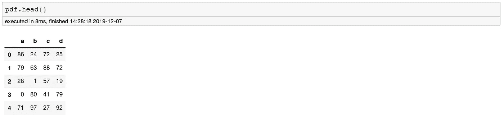
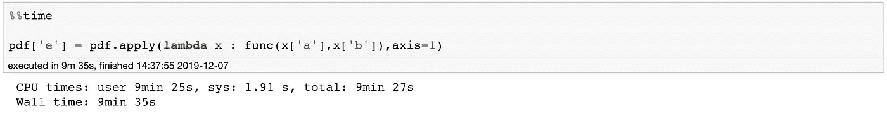
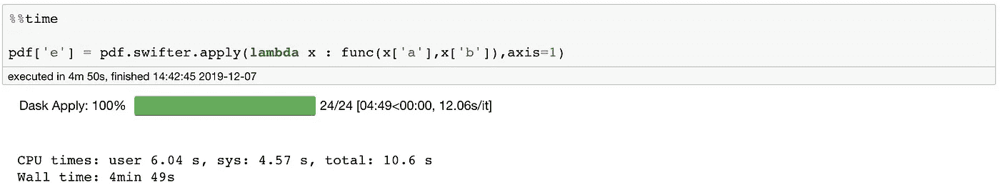
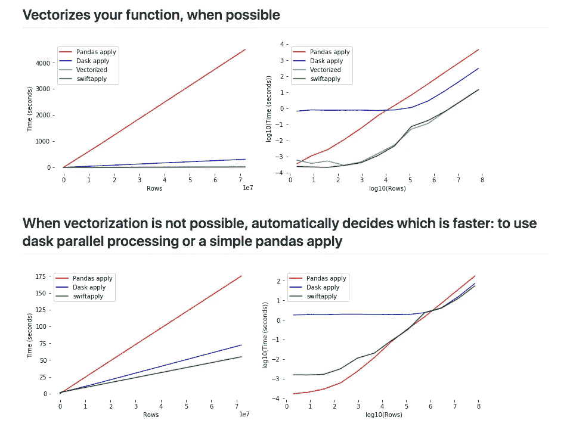
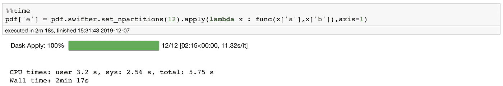

# 添加这个单词，让你的熊猫申请更快

> 原文：<https://towardsdatascience.com/add-this-single-word-to-make-your-pandas-apply-faster-90ee2fffe9e8?source=collection_archive---------1----------------------->


Image by [Karolina Grabowska](https://pixabay.com/users/kaboompics-1013994/?utm_source=link-attribution&utm_medium=referral&utm_campaign=image&utm_content=791149) from [Pixabay](https://pixabay.com/?utm_source=link-attribution&utm_medium=referral&utm_campaign=image&utm_content=791149)

## ***易于实现并行化***

作为数据科学家，我们有四核、八核和睿频加速的笔记本电脑。我们使用具有更多内核和计算能力的服务器。

但是我们真的利用了我们手头的原始力量吗？

有时，我们会受到我们所掌握的工具的限制。有时我们不愿意为了节省几分钟时间而编写所有无关的代码。后来才意识到时间优化从长远来看是有帮助的。

***那么，我们能做得更好吗？***

是的，很明显。

以前，我曾经写过如何让你的`apply`函数更快——使用[多重处理](/make-your-own-super-pandas-using-multiproc-1c04f41944a1)，但是由于有了 [swifter](https://github.com/jmcarpenter2/swifter) 库，它现在变得更加琐碎。

***这篇文章是关于使用我们手头的计算能力，并使用 Swifter 将其应用于熊猫数据帧。***

# 问题陈述

我们有一个巨大的熊猫数据框，我们想对它应用一个复杂的函数，这需要很多时间。

对于这篇文章，我将生成一些 25M 行 4 列的数据。

***可以轻松使用并行化来获得额外的代码性能吗？***

```
import pandas as pd
import numpy as nppdf = pd.DataFrame(np.random.randint(0,100,size=(25000000, 4)),columns=list('abcd'))
```

数据看起来像:



Data Sample

# 仅使用一项变更的并行化


Relax and Parallelize !!!

让我们做一个简单的实验。

我们将尝试在数据框架中创建一个新列。我们可以简单地通过在熊猫身上使用 apply-lambda 来做到这一点。

```
def func(a,b):
    if a>50:
        return True
    elif b>75:
        return True
    else:
        return Falsepdf['e'] = pdf.apply(lambda x : func(x['a'],x['b']),axis=1)
```



上面的代码运行大约需要 10 分钟。这里我们只是对两列进行简单的计算。

我们能做得更好吗？需要什么？

是的，我们可以做得更好，只要加上一个“神奇的词”——更快。

但是首先，您需要安装 swifter，这很简单:

```
conda install -c conda-forge swifter
```

然后，您可以在`apply`之前导入并附加 swifter 关键字来使用它。

```
import swifter
pdf['e'] = pdf.**swifter**.apply(lambda x : func(x['a'],x['b']),axis=1)
```

## ***那么，这行得通吗？***



是的。确实如此。与直接使用该函数相比，我们的运行时间提高了 2 倍。

## ***那么这里到底发生了什么？***



[Source](https://github.com/jmcarpenter2/swifter): How increasing data size effects performances for Dask, Pandas and Swifter?

***Swifter 为您的函数选择实现*** `***apply***` ***的最佳方式，方法是对您的函数进行矢量化，或者在后端使用 Dask 来并行化您的函数，或者在数据集很小的情况下使用简单的 pandas apply。***

在这个特例中，Swifter 使用 Dask 来并行化我们的应用函数，默认值为`npartitions = cpu_count()*2`。

对于 MacBook，我使用的 CPU 数量是 6，超线程是 2。因此，CPU 计数为 12，这使得 npartitions=24。

***我们也可以选择自己设置 n_partitions。虽然我观察到缺省值在大多数情况下工作得很好，但有时你也可以调整它来获得额外的加速。***

例如:下面我设置 n_partitions=12，我们再次获得了 2 倍的加速。这里，减少我们的分区数量会缩短运行时间，因为分区之间的数据移动成本很高。



# 结论

> **并行化不是银弹；这是铅弹。**

并行化不会解决您的所有问题，您仍然需要优化您的函数，但是它是您的武器库中的一个很好的工具。

时间一去不复返，有时我们也缺少时间。在这些时候，我们需要用一个词来处理并行化。

***而那个字就是*** [***更快***](https://github.com/jmcarpenter2/swifter) ***。***

# 继续学习

另外，如果你想了解更多关于 Python 的知识，我想向密歇根大学推荐一门优秀的中级 Python 课程。一定要去看看。

将来我也会写更多初学者友好的帖子。在 [**媒体**](https://medium.com/@rahul_agarwal) 关注我或者订阅我的 [**博客**](https://mlwhiz.ck.page/a9b8bda70c) 了解他们。一如既往，我欢迎反馈和建设性的批评，可以通过 Twitter [@mlwhiz](https://twitter.com/MLWhiz) 联系到我。

此外，一个小小的免责声明——这篇文章中可能会有一些相关资源的附属链接，因为分享知识从来都不是一个坏主意。