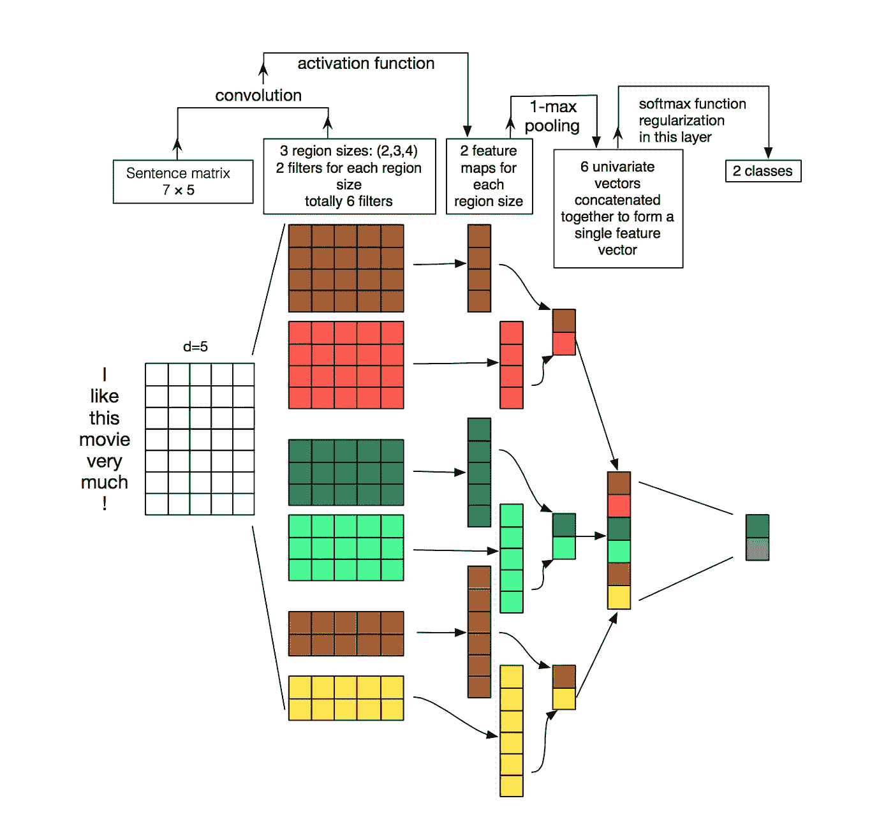

# 为多类文本分类模型增加可解释性

> 原文：<https://towardsdatascience.com/adding-interpretability-to-multiclass-text-classification-models-c44864e8a13b?source=collection_archive---------9----------------------->


ELI5: Image by [Sasin Tipchai](https://pixabay.com/users/sasint-3639875/?utm_source=link-attribution&utm_medium=referral&utm_campaign=image&utm_content=1782427) from [Pixabay](https://pixabay.com/?utm_source=link-attribution&utm_medium=referral&utm_campaign=image&utm_content=1782427)

## ELI5:增加可解释性，但不损失准确性

像我 5 岁一样解释。

对我来说，这是学习的基本原则之一，我试图以一种更容易接受的形式提炼任何概念。正如费曼所说:

> 我做不到。我不能把它降低到大一的水平。这意味着我们并没有真正理解它。

所以，当我看到旨在解释机器学习模型的 ELI5 库时，我只是必须尝试一下。

在向企业解释我们复杂的机器学习分类器时，我们面临的一个基本问题是*。*

*有时候利益相关者想要理解——是什么导致了特定的结果？ ***可能是因为手头的任务非常关键，我们不能做出错误的决定。*** 想象一个基于用户评论采取自动货币行为的分类器。*

****也可能是对业务/问题空间了解多一点。****

*也可能是为了增加你的模型的 ***社会接受度*** 。*

****这个帖子是关于解读复杂文本分类模型的。****

# *数据集:*

*为了解释 ELI5 如何工作，我将使用 Kaggle 上的堆栈溢出数据集。这个数据集包含大约 40000 个帖子和相应的帖子标签。*

*这是数据集的外观:*

**

*下面是不同类别的分布情况。*

**

*这是一个平衡的数据集，因此非常适合我们理解的目的。*

*让我们开始吧。你可以跟随这个 [Kaggle 内核](https://www.kaggle.com/mlwhiz/interpreting-text-classification-models-with-eli5)中的代码*

# *凝视简单:*

**

*[Interpretable ML Book](https://christophm.github.io/interpretable-ml-book/terminology.html)*

*让我们首先尝试使用一个简单的 scikit-learn 管道来构建我们的文本分类器，稍后我们将尝试解释它。 ***在这个管道中，我将使用一个非常简单的计数矢量器和逻辑回归。****

```
*from sklearn.model_selection import train_test_split
from sklearn.feature_extraction.text import CountVectorizer
from sklearn.linear_model import LogisticRegressionCV
from sklearn.pipeline import make_pipeline# Creating train-test Split
X = sodata[['post']]
y = sodata[['tags']]X_train, X_test, y_train, y_test = train_test_split(X, y, test_size=0.2, random_state=0)# fitting the classifier
vec = CountVectorizer()
clf = LogisticRegressionCV()
pipe = make_pipeline(vec, clf)
pipe.fit(X_train.post, y_train.tags)*
```

*让我们看看我们得到的结果:*

```
*from sklearn import metricsdef print_report(pipe):
    y_actuals = y_test['tags']
    y_preds = pipe.predict(X_test['post'])
    report = metrics.classification_report(y_actuals, y_preds)
    print(report)
    print("accuracy: {:0.3f}".format(metrics.accuracy_score(y_actuals, y_preds)))print_report(pipe)*
```

**

*上面是一个非常简单的逻辑回归模型，它表现很好。 ***我们可以使用下面的函数来检查它的权重:****

```
*for i, tag in enumerate(clf.classes_):
    coefficients = clf.coef_[i]
    weights = list(zip(vec.get_feature_names(),coefficients))
    print('Tag:',tag)
    print('Most Positive Coefficients:')
    print(sorted(weights,key=lambda x: -x[1])[:10])
    print('Most Negative Coefficients:')
    print(sorted(weights,key=lambda x: x[1])[:10])
    print("--------------------------------------")------------------------------------------------------------
OUTPUT:
------------------------------------------------------------Tag: python
Most Positive Coefficients:
[('python', 6.314761719932758), ('def', 2.288467823831321), ('import', 1.4032539284357077), ('dict', 1.1915110448370732), ('ordered', 1.1558015932799253), ('print', 1.1219958415166653), ('tuples', 1.053837204818975), ('elif', 0.9642251085198578), ('typeerror', 0.9595246314353266), ('tuple', 0.881802590839166)]
Most Negative Coefficients:
[('java', -1.8496383139251245), ('php', -1.4335540858871623), ('javascript', -1.3374796382615586), ('net', -1.2542682749949605), ('printf', -1.2014123042575882), ('objective', -1.1635960146614717), ('void', -1.1433460304246827), ('var', -1.059642972412936), ('end', -1.0498078813349798), ('public', -1.0134828865993966)]
--------------------------------------
Tag: ruby-on-rails
Most Positive Coefficients:
[('rails', 6.364037640161158), ('ror', 1.804826792986176), ('activerecord', 1.6892552000017307), ('ruby', 1.41428459023012), ('erb', 1.3927336940889532), ('end', 1.3650227017877463), ('rb', 1.2280121863441906), ('gem', 1.1988196865523322), ('render', 1.1035255831838242), ('model', 1.0813278895692746)]
Most Negative Coefficients:
[('net', -1.5818801311532575), ('php', -1.3483618692617583), ('python', -1.201167422237274), ('mysql', -1.187479885113293), ('objective', -1.1727511956332588), ('sql', -1.1418573958542007), ('messageform', -1.0551060751109618), ('asp', -1.0342831159678236), ('ios', -1.0319120624686084), ('iphone', -0.9400116321217807)]
--------------------------------------
.......*
```

*这一切都很好。我们可以看到这些系数是有意义的，我们可以尝试使用这些信息来改进我们的模型。*

*但是上面有很多代码。 ***ELI5 让这个练习对我们来说相当简单*** 。我们只需使用下面的命令:*

```
*import eli5
eli5.show_weights(clf, vec=vec, top=20)*
```

**

*现在你可以看到 Python 的权重值与我们从手动编写的函数中得到的值相同。探索它会更加美丽和有益健康。*

*但这只是冰山一角。正如我们在下面看到的，ELI5 还可以帮助我们调试模型。*

# *理解我们的简单文本分类模型*

*现在让我们试着找出为什么一个特殊的例子被错误分类。我使用的例子最初来自 Python 类，但被错误地归类为 Java:*

```
*y_preds = pipe.predict(sodata['post'])sodata['predicted_label'] = y_predsmisclassified_examples = sodata[(sodata['tags']!=sodata['predicted_label'])&(sodata['tags']=='python')&(sodata['predicted_label']=='java')]***eli5.show_prediction(clf, misclassified_examples['post'].values[1], vec=vec)****
```

****

*在上面的例子中，分类器以低概率预测 Java。我们可以检查上面例子中发生的许多事情来改进我们的模型。例如:*

1.  *我们看到分类器考虑了很多数字(不好)，这让我们得出清理数字的结论。或者用日期时间标记替换日期时间对象。*
2.  *还可以看到，虽然 dictionary 对 Java 的权重为负，但单词`dictionaries`的权重为正。所以也许词干也有帮助。*
3.  *我们还看到像`<pre><code>`这样的词正在影响我们的分类器。清洗的时候要把这些字去掉。*
4.  *为什么`date`这个词会影响结果？一些值得思考的事情。*

*我们可以看看更多的例子来获得更多这样的想法。你知道要点了。*

# *深入而复杂*

*这一切都很好，但是如果我们使用的模型不能像 LSTM 那样提供个体特征的权重呢？正是有了这些模型，可解释性才能发挥非常重要的作用。*

**

*为了理解如何做到这一点，我们首先在我们的数据上创建一个 TextCNN 模型。*为了节省空间，没有显示模型创建过程*，而是将其视为一系列预处理步骤，然后创建深度学习模型。如果有兴趣，你可以看看这个 [Kaggle 内核](https://www.kaggle.com/mlwhiz/interpreting-text-classification-models-with-eli5)中的建模步骤。*

*当我们有一个经过训练的黑盒模型对象时，从我们的角度来看，事情变得有趣了。*

*ELI5 为我们提供了`eli5.lime.TextExplainer`来调试我们的预测——检查文档中什么是重要的，以做出预测决策。*

*为了使用`[**TextExplainer**](https://eli5.readthedocs.io/en/latest/autodocs/lime.html#eli5.lime.lime.TextExplainer)`实例，我们向`[**fit()**](https://eli5.readthedocs.io/en/latest/autodocs/lime.html#eli5.lime.lime.TextExplainer.fit)`方法传递一个要解释的文档和一个黑盒分类器(一个返回概率的`predict`函数)。从文档来看，我们的预测函数应该是这样的:*

> ***预测** ( *可调用* ) —黑盒分类流水线。`***predict***`应该是一个函数，它接受一个字符串(文档)列表，并返回一个带有概率值的形状矩阵`***(n_samples, n_classes)***`-每个文档一行，每个输出标签一列。*

*因此，要使用 ELI5，我们需要定义自己的函数，该函数将一系列字符串(文档)作为输入，并返回一个形状为`***(n_samples, n_classes)***` ***的矩阵。*** *你可以看到我们是如何先预处理再预测的。**

```
*def predict_complex(docs):
    # preprocess the docs as required by our model
    val_X = tokenizer.texts_to_sequences(docs)
    val_X = pad_sequences(val_X, maxlen=maxlen)
    y_preds = model.predict([val_X], batch_size=1024, verbose=0)
    return y_preds*
```

*下面给出了我们如何使用`TextExplainer`。在我们的简单分类器中使用与之前相同的错误分类示例。*

```
*import eli5
**from eli5.lime import TextExplainer****te = TextExplainer(random_state=2019)**
te.fit(sodata['post'].values[0], predict_complex)
te.show_prediction(target_names=list(encoder.classes_))*
```

**

*这次它不会被错误分类。你可以看到关键字`dict`和`list`的出现影响了我们的分类器的决定。一个人可以尝试看到更多的例子，以找到更多的见解。*

****那么这到底是怎么运作的呢？****

*`[**TextExplainer**](https://eli5.readthedocs.io/en/latest/autodocs/lime.html#eli5.lime.lime.TextExplainer)`通过删除一些单词生成大量与文档相似的文本，然后训练一个白盒分类器，预测黑盒分类器的输出，而不是真正的标签。我们看到的解释是针对这个白盒分类器的。*

*本质上，这有点类似于师生模型的提炼，我们使用一个简单的模型来预测一个复杂得多的教师模型的输出。*

*简而言之，它试图创建一个简单的模型来模拟一个复杂的模型，然后向我们展示更简单的模型权重。*

# *结论*

> *理解至关重要。能够解释我们的模型可以帮助我们更好地理解我们的模型，从而更好地解释它们。*

*ELI5 为我们提供了一个很好的方法来做到这一点。它适用于各种模型，这个库的[文档是我见过的最好的文档之一。](https://eli5.readthedocs.io/en/latest/index.html)*

*此外，我喜欢 ELI5 库提供的修饰输出，它以简单快捷的方式解释我的模型。并调试它们。*

*要在你的模型中使用 ELI5，你可以跟随这个 [Kaggle 内核](https://www.kaggle.com/mlwhiz/interpreting-text-classification-models-with-eli5)中的代码*

# *继续学习*

*如果你想[学习](/how-did-i-start-with-data-science-3f4de6b501b0?source=---------8------------------)更多关于 NLP 和如何创建文本分类模型的知识，我想调出 [**高级机器学习专业化**](https://www.coursera.org/specializations/aml?siteID=lVarvwc5BD0-AqkGMb7JzoCMW0Np1uLfCA&utm_content=2&utm_medium=partners&utm_source=linkshare&utm_campaign=lVarvwc5BD0) 中的 [***自然语言处理***](https://www.coursera.org/learn/language-processing?ranMID=40328&ranEAID=lVarvwc5BD0&ranSiteID=lVarvwc5BD0-HcQgnbxBjnlE7bTEy2jJRw&siteID=lVarvwc5BD0-HcQgnbxBjnlE7bTEy2jJRw&utm_content=2&utm_medium=partners&utm_source=linkshare&utm_campaign=lVarvwc5BD0) 课程。一定要去看看。它讲述了许多从初学者到 NLP 高级水平的主题。你可能也想看看我在 NLP 学习系列的 NLP 上的一些[帖子。](https://towardsdatascience.com/tagged/nlp-learning-series)*

*谢谢你的阅读。将来我也会写更多初学者友好的帖子。在 [**媒体**](https://medium.com/@rahul_agarwal?source=post_page---------------------------) 关注我或者订阅我的 [**博客**](http://eepurl.com/dbQnuX?source=post_page---------------------------) 了解他们。一如既往，我欢迎反馈和建设性的批评，可以通过 Twitter [@mlwhiz](https://twitter.com/MLWhiz?source=post_page---------------------------) 联系*

*此外，一个小小的免责声明——在这篇文章中可能会有一些相关资源的附属链接，因为分享知识从来都不是一个坏主意。*