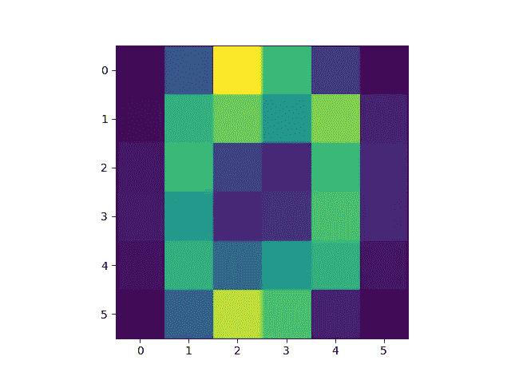
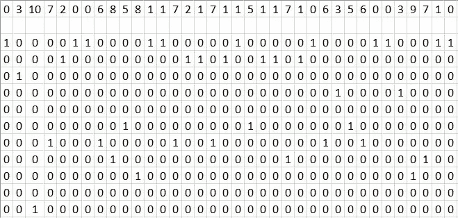
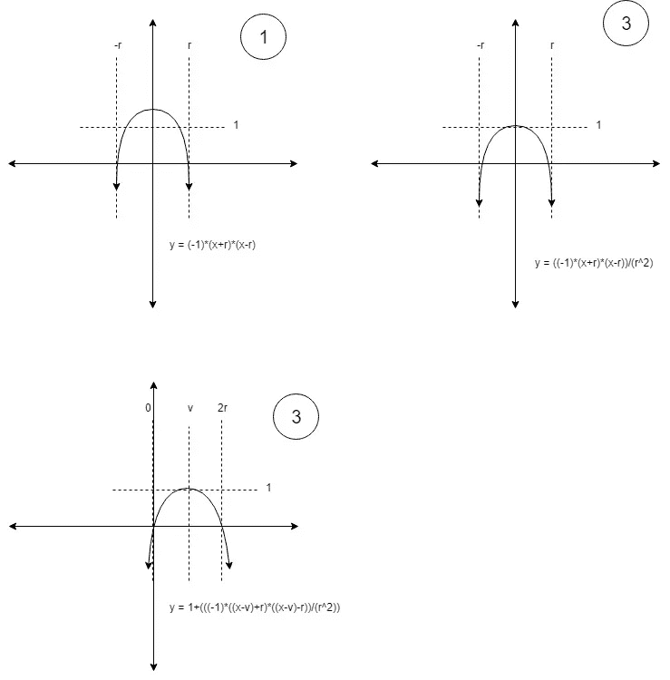
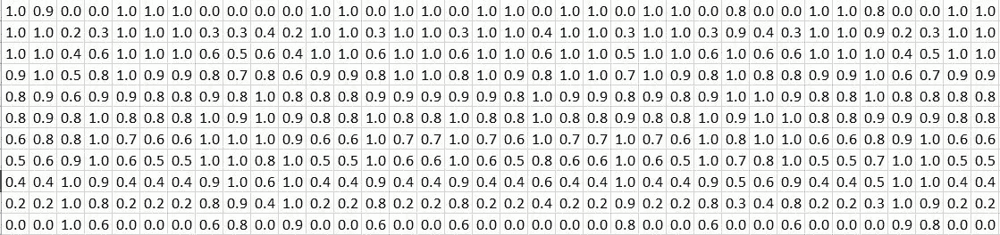

# 通过概率维度添加新特征

> 原文：<https://towardsdatascience.com/adding-new-features-by-probability-dimension-bea2a4be45d5?source=collection_archive---------17----------------------->

# 简介:

特征工程是机器学习中的一个重要课题。如果我们想让我们的机器学习，我们需要给它有意义的信息。深度学习架构可能不需要创建良好的功能，因为它们实际上可以自己创建功能。但是，这将需要一个巨大的数据集，也需要大量的计算能力。

对于特征创建，我们需要了解机器学习将处理的主题。如果是信号处理，我们需要了解一下信号处理。如果是金融，我们需要了解一些金融知识，这样我们才会知道我们可以创造哪些特色。

# 方法:

另一种可以应用于大多数领域的特征是概率。一个值与其他现有值一起存在于一个示例中的概率可能是一个有意义的特征。

## 示例:假设我们有一个数字图像 0，如下所示。当其他值存在时，我们将创建每个值存在的概率。



Digit 0 Image

我们将创建每个值的概率，并通过增加矩阵的维数来映射它。(表示是用 Python 语言编写的)

1.  展平图像。(2D 至 1D) (imgFlat)
2.  创建一个具有维度(valueRange，len(imgFlat))的零值矩阵。值域就是我们后面要确定的范围。
3.  将 imgFlat 值作为二进制矩阵映射到我们的零值矩阵(我们将在这里确定值的范围。假设我们的取值范围是 10。值范围是我们将映射图像值的范围。图像中的值将被映射到 0 到 10 之间的值。).我们的带有映射值的 imgFlat 是[ 0，3，10，7，2，0，0，6，8，5，8，1，1，7，2，1，7，1，1，5，1，7，1，0，6，3，5，6，0，3，9，7，1，0]。因此，让我们根据 imgFlat 值创建二元矩阵。



Binary Mapping

4.所以，我们拉平了我们的矩阵。然后，我们又增加了一个维度。在这个维度上，我们增加了概率。但是，我们还没有完成。根据我的启发式方法，最好将概率映射到接近概率 1 值的值。因此，我们将得到类似于[0 0.3 0.7 1 0.7 0.3]的值，而不是[0 0 0 1 0 0]。为此，我创建了一个新的概率分布函数。

## 概率分布函数:

假设我们需要一个有两个根的函数，这个函数的最大输出值是 1。



Probability Distribution Matrix

```
def distFunc(argmax,xrange,valRange):
    x = np.linspace(0,valRange,valRange+1)
    a = argmax
    b = xrange
    y = ((x**2)-(2*x*a)+(a**2)-(b**2))/(valRange**2)
    return 1-y
yHist = exposure.rescale_intensity(y)#reason of this line is to distribute our values even more. ([skimage.exposure.rescale_intensity function](https://scikit-image.org/docs/dev/api/skimage.exposure.html#skimage.exposure.rescale_intensity))
```

为了看清楚，我将数值四舍五入为十进制 1。正因为如此，一些值变成了 1。请忽略它。



Probability Distribution to Binary Mapping

6.概率分布之后，我们展平 2D 概率矩阵。它变得相当大。因此，我将在下面补充其中的一部分。

[1 0.9375 0 0 0.987654 1 1 0 0 0 0 1 1 0 0.987654 0.987654 0 0.987654 1 0 0.987654 0.987654 0 0.987654 1 0 0.816327 0 0 1 1 0.816327 0 0 1 …]

## 这个结果意味着什么？

毕竟，我们的矩阵代表了下面给出的陈述。

矩阵中第 0 列的值 0 以概率 1 存在，第 10 列的值 8 以概率 1 存在，而第 3 列的值 1 也以概率 0.3 存在，同时…

这给了我们一种情况，我们用它们存在的可能性来赋予我们的价值以意义。

# 基于 SVM 和概率维特征的数字分类；

图书馆:

```
import numpy as np
from skimage import exposure
from sklearn.datasets import load_digits
from sklearn import svm
```

概率分布函数:

```
def distFunc(argmax,xrange,valRange):
    x = np.linspace(0,valRange,valRange+1)
    a = argmax
    b = xrange
    y = ((x**2)-(2*x*a)+(a**2)-(b**2))/(valRange**2)
    return 1-y
```

概率维特征的创建:

```
def createProbOfVal(kernel,valRange):
    kernelFlat = kernel.flatten()
    kernelFlat = kernelFlat/np.max(kernelFlat)*valRange
    tempBefore = np.zeros((valRange+1,len(kernelFlat)))
    tempAfter = np.zeros((valRange+1,len(kernelFlat)))
    for cnt in range(len(kernelFlat)):
        y = distFunc(int(kernelFlat[cnt]),1,valRange)
        yhist = exposure.rescale_intensity(y)
        tempBefore[int(kernelFlat[cnt]),cnt] = 1
        tempAfter[:,cnt] = yhist
    tempBeforeFlat = tempBefore.flatten()
    tempAfterFlat = tempAfter.flatten()
    return tempAfterFlat
```

数据集准备(图像到概率维度特征):

```
def prepareDataset(datasetImages,datasetLabels):
    dataset = []
    for cnt in range(len(datasetImages)):
        processedImage = createProbOfVal(datasetImages[cnt],10)
        dataset.append([processedImage,datasetLabels[cnt]])
    return dataset
```

加载并准备数据集:

```
digits = load_digits()
dataset = prepareDataset(digits.images,digits.target)
```

创建分类器实例并训练它:

```
clf = svm.SVC(gamma='scale')
clf.fit([np.array(row[0]) for row in dataset[0:1500]],[np.array(row[1]) for row in dataset[0:1500]])
```

测试:

```
preds = clf.predict([np.array(row[0]) for row in dataset[1500:1796]])
score = clf.score([np.array(row[0]) for row in dataset[1500:1796]],[np.array(row[1]) for row in dataset[1500:1796]])
```

## 准确率:92%