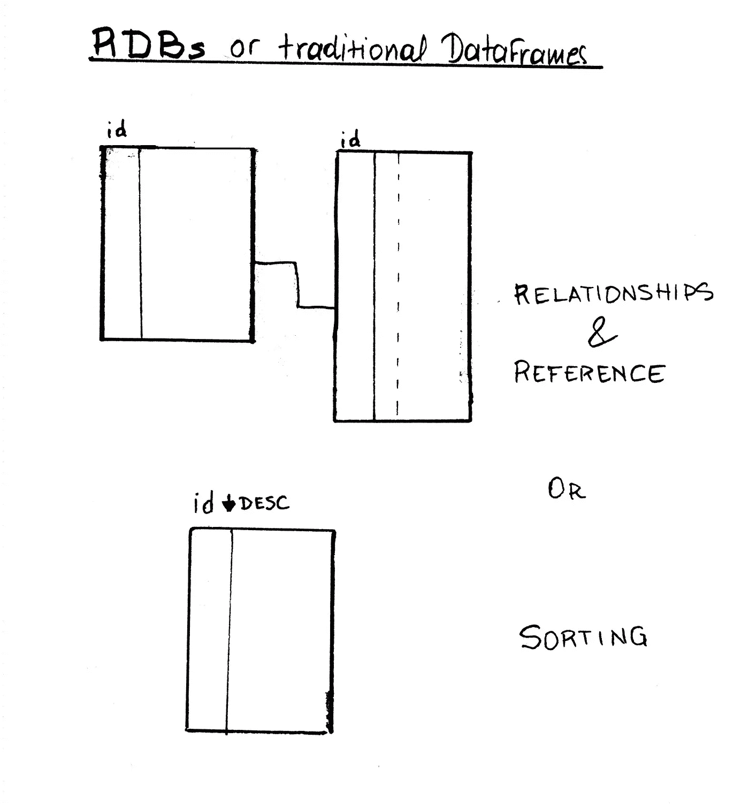
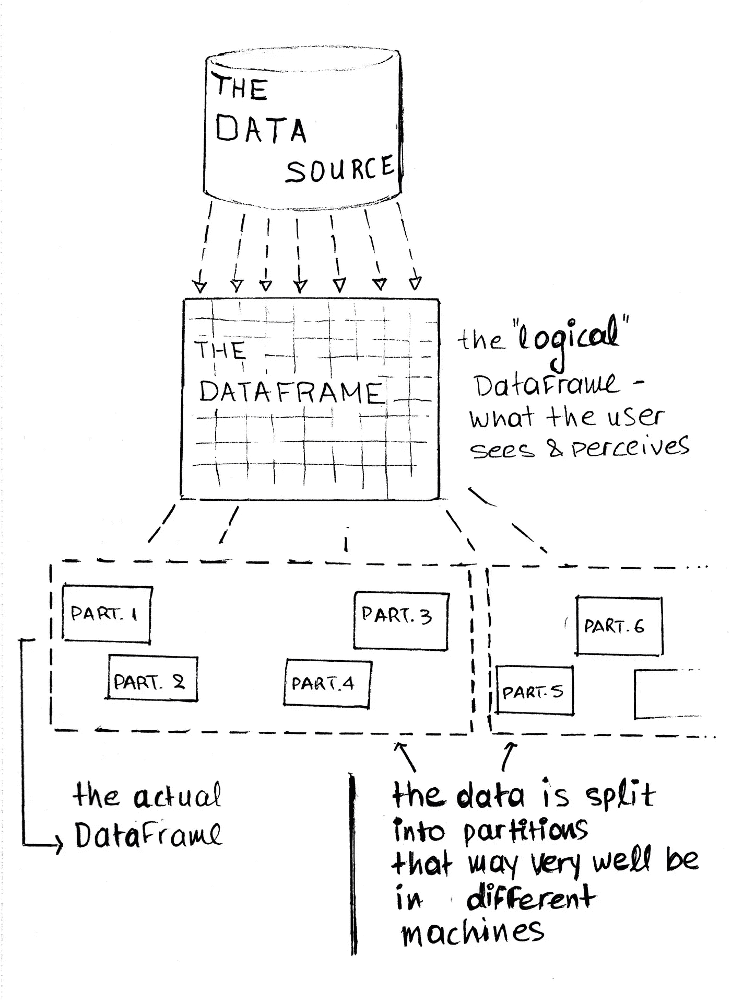
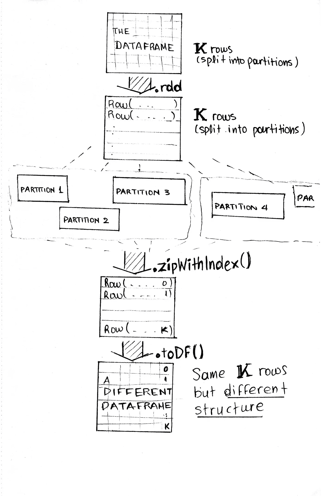
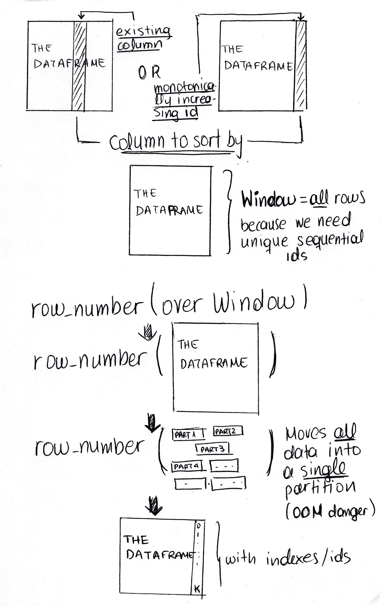

# 向 Spark 数据帧添加顺序 id

> 原文：<https://towardsdatascience.com/adding-sequential-ids-to-a-spark-dataframe-fa0df5566ff6?source=collection_archive---------1----------------------->

## 怎么做，这是个好主意吗？


Photo by [Markus Spiske](https://unsplash.com/@markusspiske?utm_source=medium&utm_medium=referral) on [Unsplash](https://unsplash.com?utm_source=medium&utm_medium=referral)

> **TL；博士**
> 
> 向 Spark 数据帧添加连续的惟一 id 并不是很直接，尤其是考虑到它的分布式本质。您可以使用 zipWithIndex()或 row_number()来实现这一点(取决于数据的数量和种类)，但是在每种情况下都有一个关于性能的问题。

## 这背后的想法



Typical usages for ids — besides the obvious: for identity purposes

来自传统的关系数据库，如 [MySQL](https://www.mysql.com) ，以及非分布式数据框架，如 [Pandas](https://pandas.pydata.org) ，人们可能习惯于使用 id(通常自动递增)进行标识，当然，也可以使用它们作为参考来对数据进行排序和约束。例如，按 id(通常是一个索引字段)降序排列数据，将首先给出最近的行，等等。



A representation of a Spark Dataframe — what the user sees and what it is like physically

根据需要，我们可能会发现在 spark 数据帧中拥有一个(独特的)类似 auto-increment-ids '的行为对我们有好处。当数据在一个表或数据帧中时(在一台机器上)，添加 id 是非常直接的。但是，当您将数据分散到可能驻留在不同机器(如 Spark)上的分区中时，会发生什么呢？

(更多关于分区[的信息，请点击](https://jaceklaskowski.gitbooks.io/mastering-apache-spark/spark-rdd-partitions.html))

在这篇文章中，我们将探索显而易见和不那么显而易见的选项，它们的作用，以及使用它们背后的陷阱。

**注释**

*   请注意，本文假设您对 Spark 有一定的了解，尤其是对 [PySpark](http://spark.apache.org/docs/latest/quick-start.html) 有一定的了解。如果没有，这里有一个[简短介绍](/explaining-technical-stuff-in-a-non-techincal-way-apache-spark-274d6c9f70e9#b88f-81d3a1ffe447)以及它是什么，我已经在*有用链接和注释*部分放了几个有用的资源。我很乐意回答任何我能回答的问题:)。
*   再次练习**速写**，是的，整篇文章都有*可怕的速写*，试图直观地解释我所理解的事物*。希望它们更有帮助，而不是令人困惑:)。*

## *RDD 之路—ziptwithindex()*

*一种选择是退回到 [RDDs](https://spark.apache.org/docs/latest/rdd-programming-guide.html)*

> **弹性分布式数据集* (RDD)，它是跨集群节点划分的、可以并行操作的元素的集合*

*并使用`df.rdd.zipWithIndex()`:*

> *排序首先基于分区索引，然后是每个分区内项目的
> 排序。所以第一个分区中的第一个项目得到索引 0，最后一个分区中的最后一个项目得到最大的索引。*
> 
> *当这个 RDD 包含
> 多个分区时，这个方法需要触发一个火花作业。*

*An example using `zipWithIndex`*

**

*The process of using zipWithIndex()*

*这里有四点:*

*   *索引将从 0 开始**，并且**排序**由分区**完成*
*   ***您需要将所有数据保存在数据框中— **添加*不会添加自动递增 id*****
*   ***退回到 rdds，然后退回到 dataframe [**可能会相当昂贵**](https://stackoverflow.com/questions/37088484/whats-the-performance-impact-of-converting-between-dataframe-rdd-and-back) **。*****
*   ***带有 id 的数据帧的更新版本将要求您做一些额外的工作以将数据帧恢复到原始形式。这也增加了**性能损失**。***

***你不能真正地更新或添加一个数据帧，因为它们是不可变的，但是你可以把一个数据帧和另一个数据帧连接起来，最终得到一个比原始数据帧有更多行的数据帧。***

## ***数据框架方式***

*****如果您的数据可排序*****

***如果您可以按其中一列对数据进行排序，比如我们示例中的`column1`，那么您可以使用`[row_number](https://spark.apache.org/docs/latest/api/python/pyspark.sql.html#pyspark.sql.functions.row_number)()`函数来提供行号:***

***Resuming from the previous example — using row_number over sortable data to provide indexes***

> ***`row_number()`是一个窗口函数，这意味着它在预定义的窗口/数据组上运行。***

***这里的要点是:***

*   ***您的数据必须是**可排序的*****
*   ***你需要使用一个非常大的窗口(和你的数据一样大)***
*   ***您的索引将从 1 开始***
*   *****您需要将所有数据保存在数据框中— **更新不会添加自动递增 id*******
*   *****没有额外的工作来重新格式化你的数据帧*****
*   *******但是**你可能会以一个 **OOM 异常**结束，我稍后会解释。*****

*******如果您的数据不可排序，或者您不想改变数据的当前顺序*******

*****另一种选择是将`row_number()`与`monotonically_increasing_id()`结合，根据[文档](http://spark.apache.org/docs/latest/api/python/pyspark.sql.html#pyspark.sql.functions.monotonically_increasing_id)创建:*****

> *****>生成单调递增的 64 位整数的列。*****
> 
> *****>生成的 ID 保证是****单调递增且唯一的，而不是连续的**。当前的实现将分区 ID 放在高 31 位，将每个分区内的记录号放在低 33 位。假设数据帧有不到 10 亿个分区，每个分区有不到 80 亿条记录。*******

*********单调递增且唯一，但不连续的**是这里的关键。这意味着你可以按它们排序，但你不能相信它们是连续的。在某些情况下，你只需要排序，`monotonically_increasing_id()`就非常方便，你根本不需要`row_number()`。但是在这种情况下，假设我们绝对需要后续 id。*******

*****再次，从我们在代码中留下的地方继续:*****

*****Resuming from the previous example — using row_number over initialy non-sortable data to provide indexes*****

*****当然有不同的方式(语义上)去做这件事。例如，您可以使用一个临时视图(除了可以使用 pyspark SQL 语法之外，它没有明显的优势):*****

```
*****>>> df_final.createOrReplaceTempView(‘df_final’)
>>> spark.sql(‘select row_number() over (order by “monotonically_increasing_id”) as row_num, * from df_final’)*****
```

*****这里的要点是:*****

*   *****同上，但还有一点要注意，实际上**排序**是由分区完成的*****

## *******这整个努力的最大收获是*******

*******为了使用`row_number()`，我们需要将数据移动到一个分区中。两种情况下的`Window`(可排序和不可排序的数据)基本上都包含了我们当前拥有的所有行，因此`row_number()`函数可以遍历它们并增加行号。这可能会导致性能和内存问题——我们很容易崩溃，这取决于我们有多少数据和多少内存。所以，我的建议是，你真的要问问自己，你的数据是否需要一种类似自动递增/索引的行为，或者你是否可以用另一种方式来避免这种行为，因为这将是昂贵的。尤其是当您每次处理任意数量的数据时，因此无法仔细考虑内存量(例如，在组或窗口中处理流数据)。*******

*******每当您使用`Window`时，Spark 都会给出以下警告，而没有提供对数据进行分区的方法:*******

```
*******WARN WindowExec: No Partition Defined for Window operation! Moving all data to a single partition, this can cause serious performance degradation.*******
```

**************

*******Using row_number() over Window and the OOM danger*******

# *******结论:这到底是不是一个好主意？*******

*******嗯，*大概不是*。根据我的经验，如果你发现自己需要这种功能，那么你应该*好好审视一下你的需求和你的转变过程*，如果可能的话，找出解决方法。即使你使用了`zipWithIndex()`,你的应用程序的性能可能仍然会受到影响——但是对我来说这似乎是一个更安全的选择。*******

*******但如果你无法避免，至少要意识到它背后的机制、风险，并做好相应的计划。*******

*******我希望这有所帮助。任何想法，问题，更正和建议都非常欢迎:)*******

# *******有用的链接和注释*******

*******[](/explaining-technical-stuff-in-a-non-techincal-way-apache-spark-274d6c9f70e9) [## 用非技术性的方式解释技术性的东西——Apache Spark

### 什么是 Spark 和 PySpark，我可以用它做什么？

towardsdatascience.com](/explaining-technical-stuff-in-a-non-techincal-way-apache-spark-274d6c9f70e9) 

## **从 0 开始调整指标**

使用`row_number()`时的索引从 1 开始。要让它们从 0 开始，我们可以简单地从`row_num`列中减去 1:

```
df_final = df_final.withColumn(‘row_num’, F.col(‘row_num’)-1)
```

## **关于 rdd 和数据集**

[](https://databricks.com/blog/2016/07/14/a-tale-of-three-apache-spark-apis-rdds-dataframes-and-datasets.html) [## 三个 Apache Spark APIs 的故事:RDDs 与数据帧和数据集

### 总之，选择何时使用 RDD 或数据框架和/或数据集似乎是显而易见的。前者为您提供…

databricks.com](https://databricks.com/blog/2016/07/14/a-tale-of-three-apache-spark-apis-rdds-dataframes-and-datasets.html) [](https://spark.apache.org/docs/latest/rdd-programming-guide.html) [## RDD 节目指南

### 默认情况下，Spark 2.4.4 的构建和发布是为了与 Scala 2.12 协同工作。(Spark 可以构建为与其他……

spark.apache.org](https://spark.apache.org/docs/latest/rdd-programming-guide.html) 

## **关于 createOrReplaceTempView**

这将为您的数据创建一个延迟评估的“视图”(如果该视图名称已经存在，则替换它),这意味着如果您不缓存/持久化它，每次您访问该视图时，任何计算都将再次运行。通常，您可以在 Spark SQL 中使用 hive 表。

 [## pyspark.sql 模块- PySpark 2.4.4 文档

### schema-py spark . SQL . types . datatype 或数据类型字符串或列名列表，默认值为。数据类型字符串…

spark.apache.org](https://spark.apache.org/docs/latest/api/python/pyspark.sql.html#pyspark.sql.DataFrame.createOrReplaceTempView) 

## 行号和窗口

 [## pyspark.sql 模块- PySpark 2.4.4 文档

### schema-py spark . SQL . types . datatype 或数据类型字符串或列名列表，默认值为。数据类型字符串…

spark.apache.org](https://spark.apache.org/docs/latest/api/python/pyspark.sql.html#pyspark.sql.functions.row_number) [](https://databricks.com/blog/2015/07/15/introducing-window-functions-in-spark-sql.html) [## Spark SQL 中的窗口函数介绍

### 在这篇博文中，我们介绍了 Apache Spark 1.4 中添加的新窗口函数特性。窗口功能…

databricks.com](https://databricks.com/blog/2015/07/15/introducing-window-functions-in-spark-sql.html) 

# 接下来去哪里？

理解你的机器学习模型的预测:

[](https://medium.com/mlearning-ai/machine-learning-interpretability-shapley-values-with-pyspark-16ffd87227e3) [## 机器学习的可解释性——带有 PySpark 的 Shapley 值

### 解读隔离森林的预测——不仅仅是

medium.com](https://medium.com/mlearning-ai/machine-learning-interpretability-shapley-values-with-pyspark-16ffd87227e3)*******