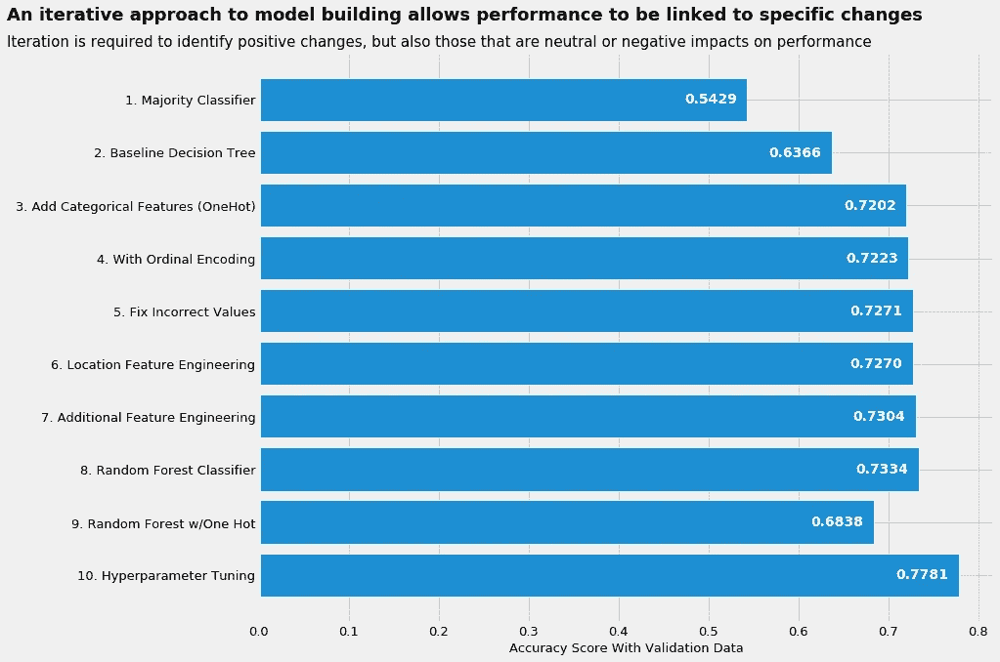
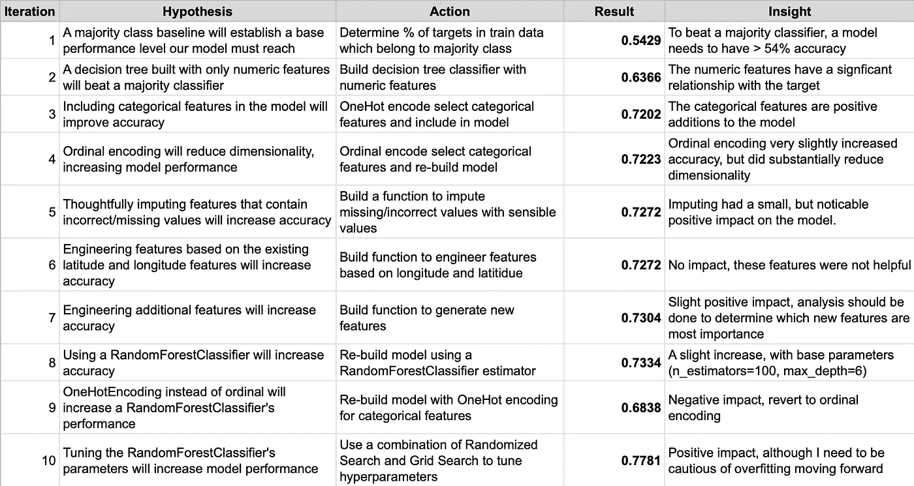

# 采用假设驱动的建模工作流程

> 原文：<https://towardsdatascience.com/adopting-a-hypothesis-driven-modeling-workflow-9edc8b80a8ed?source=collection_archive---------27----------------------->

用作现代预测建模基础的许多算法使用迭代过程来获得优化的解决方案。对于某些模型类型，如 boosting，每次迭代都要参考前一次迭代的结果。作为一名模型构建者，我寻求实现一个工作流程，该工作流程反映了那些构成我的模型核心的预测算法:**由假设决定的不断迭代。**

*   **不断的迭代允许复杂性慢慢地在基本基线模型之上分层**(例如，附加特性、缩放、输入、调整)。
*   **一次迭代评估模型的一组目标变更。**该过程允许模型构建者评估每组变更对整个模型的影响(仅保留那些具有积极影响的变更)。
*   **每次迭代都试图评估模型构建者所持有的假设**的有效性。模型构建者的核心工作是形成和检验假设。假设的来源包括以前的经验(什么在过去有效？)、领域专业知识、探索性数据分析和直觉。

当构建预测模型时，我经常陷入的一个陷阱是，没有遵循上述迭代构建过程，就过快地增加了模型的复杂性。增加复杂性而不迭代意味着我失去了对我的假设中哪些是有用的，哪些是不相关的(从而可能增加噪音)，以及哪些是有害的粒度理解。这通常会导致许多问题:

1.  **较慢的迭代:**模型运行的计算成本很高，降低了我快速迭代/工作的能力
2.  **理解力低:**我无法解释是什么赋予了我的模型预测能力，降低了我的优化能力。此外，该模型经常是不必要的复杂(例如，更简单的模型将实现类似的性能)
3.  **更少的想法:**我产生好的假设的能力降低了，因为我从模型中得不到太多的反馈(它通常是好想法的来源)

为了展示符合假设驱动迭代理念的工作流的力量，下面的可视化详细描述了我用来构建一个简单模型的迭代过程，该模型旨在预测位于坦桑尼亚的水泵是否正常工作，是否正常工作但需要维修，或者是否正常工作。该数据集是由 [DrivenData](https://www.drivendata.org/competitions/7/pump-it-up-data-mining-the-water-table/) 主办的正在进行的建模竞赛的一部分。

如下图所示，经过一系列的 10 次迭代，我的模型从 54%精度的多数类基线提高到大约 78%精度。

如图所示，一组相对简单的迭代产生了大约 78%准确度的预测模型(相比之下，原始基线为 54%)。作为我工作流程的一部分，对于每一次迭代，我都会详细说明:

*   假设:我在用这个迭代测试什么信念？
*   **行动:**我要采取什么行动(改变模型)来测试假设？
*   **结果:**这对模型有什么影响？
*   洞察力:假设正确吗？这个迭代如何通知未来的迭代？

下面的屏幕截图显示了我用来支持创建水泵状态预测模型的表格:

[Google Sheets](https://docs.google.com/spreadsheets/d/1ZXQ4y-DpZ-RmY7h6sKeYUTcGnYphLDSfk-AbrpNc0r0/edit?usp=sharing)

老实说，我在构建这个模型时的第一次尝试并没有坚持通过不断迭代将复杂性分层到模型中的理论。更确切地说，我很少迭代，导致迭代之间的许多变更降低了我评估每个变更有效性的能力。虽然模型的性能相似，但迭代过于复杂且计算量大(降低了我测试假设的能力)。此外，我并不清楚为什么这款车型表现出色。

由于我的原始模型的复杂性，我最终不得不重新开始来增加我快速实验的能力。采用上述过程最终实现了更高性能、更轻的模型。

总之，虽然很容易给模型增加多层复杂性，但是接受不断迭代将提供对模型的更深入理解，产生更有创造性的假设，并产生更简单、更轻便的模型。