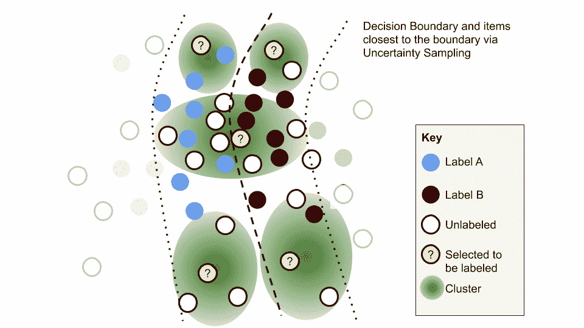
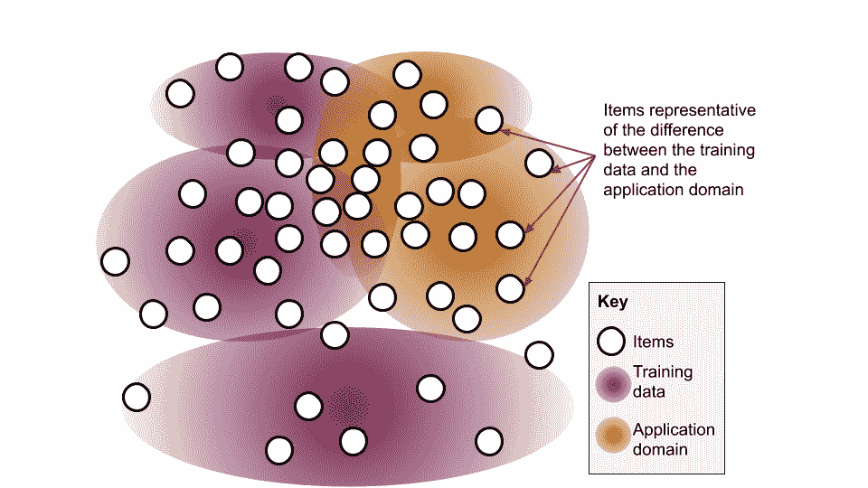
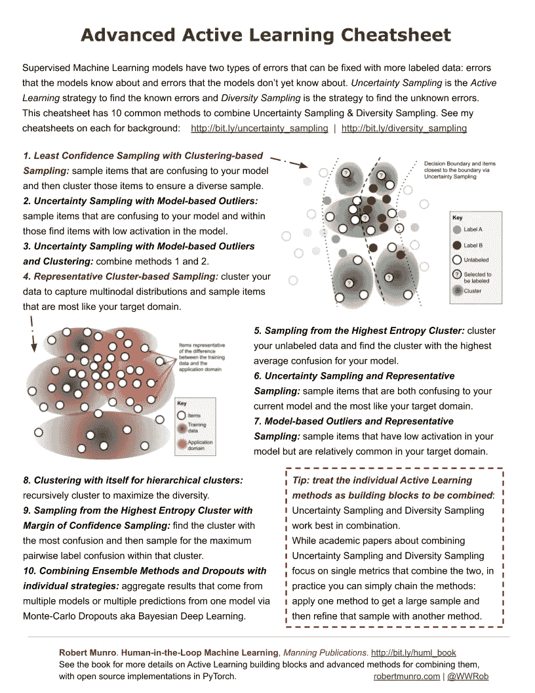

# 高级主动学习备忘单

> 原文：<https://towardsdatascience.com/advanced-active-learning-cheatsheet-d6710cba7667?source=collection_archive---------30----------------------->

主动学习是为人类选择最佳未标记数据以供监督机器学习查看的过程。大多数真实世界的机器学习系统都是在数千甚至数百万人类标记的样本上训练的。在这种情况下，如果人类花时间查看正确的数据进行注释，你可以更快地让机器学习模型更准确。

有两种类型的主动学习:不确定性采样和多样性采样。不确定性采样的目标是那些在当前状态下明显使模型混乱的数据，而多样性采样的目标是那些在模型知识中存在缺口的数据。在机器学习的[知识象限](/knowledge-quadrant-for-machine-learning-5f82ff979890)中，不确定性采样处理已知的未知，多样性采样处理未知的未知:

Knowledge Quadrant for Machine Learning

有关每种主动学习类型的更多信息，请参见前面的备忘单:

 [## 不确定性采样备忘单

### 用于主动学习的四种常见不确定性抽样策略的快速参考。

towardsdatascience.com](/uncertainty-sampling-cheatsheet-ec57bc067c0b)  [## 多样性抽样备忘单

### 主动学习的四种常见多样性抽样策略的快速参考。

towardsdatascience.com](/https-towardsdatascience-com-diversity-sampling-cheatsheet-32619693c304) 

理想情况下，在你尝试实施更高级的主动学习策略之前，你应该亲自尝试实施我的[书中的不确定性采样和多样性样本的例子。我的免费 PyTorch 库中也有主动学习算法的清晰示例:](https://www.manning.com/books/human-in-the-loop-machine-learning)

 [## rmunro/pytorch_active_learning

### 图书馆常见的主动学习方法伴随:人在回路中的机器学习罗伯特芒罗曼宁…

github.com](https://github.com/rmunro/pytorch_active_learning) 

孤立地使用，不确定性采样方法通常会集中于特征空间的一部分，因此缺乏多样性。如果单独使用，多样性抽样方法通常会发现大多数多样性远离决策边界，因此不会对可能被错误标记的项目进行抽样。因此，大多数现实世界的策略将结合这两种方法来进行主动学习。

你将通过在你自己的数据上执行算法并评估哪种算法最适合你所面临的问题而学到最多。因此，我建议在您亲自尝试过这些方法，并对每种方法在数据上的优缺点积累了实际经验之后，使用这份备忘单作为参考。

Advanced Active Learning: the optimal methods are often the combination of simpler building blocks.

## 提示:把单独的主动学习方法看作是需要组合的积木

不确定性抽样和多样性抽样结合起来效果最好。虽然关于结合不确定性抽样和多样性抽样的学术论文关注的是结合两者的单一指标，但在实践中，你可以简单地将这些方法串联起来:应用一种方法获得大样本，然后用另一种方法提炼该样本。

这种脱节的原因是机器学习的学术界论文倾向于关注能够端到端完成任务的单一算法，主动学习也不例外。因此，如果你只阅读关于主动学习的学术论文，那么你可能会被误导，认为现实世界中的最佳方法也需要是一个复杂的组合指标。在关于高级主动学习的章节中，我们确实涵盖了将不确定性采样和多样性采样结合到单一方法中的最新方法。然而，我建议首先尝试组合更简单的方法:它们通常对数据来说是最佳的，并且更容易解释和实验。

比较简单的方法应该是比较高级方法的基线，所以无论如何都应该实现它们。

# 结合不确定性采样和多样性采样的 10 种策略:

1.  ***基于聚类的最小置信度抽样:*** 对模型中容易混淆的项目进行抽样，然后对这些项目进行聚类，以确保样本的多样性(见下图)。
2.  ***基于模型的异常值的不确定性采样:*** 对您的模型中容易混淆的项目进行采样，并在这些项目中找到模型中激活度较低的项目。
3.  ***基于模型的异常值和聚类的不确定性采样:*** 结合方法 1 和 2。
4.  ***典型的基于聚类的采样:*** 对您的数据进行聚类，以捕捉与您的目标域最相似的多节点分布和样本项目(见下图)。
5.  ***从最高熵聚类中采样:*** 对你的未标记数据进行聚类，为你的模型找到平均混淆度最高的聚类。
6.  ***不确定性抽样和代表性抽样:*** 既让你当前模型困惑又最像你目标域的样本项。
7.  ***基于模型的离群值和代表性采样:*** 在你的模型中激活度低，但在你的目标域中相对常见的样本项。
8.  ***聚类以自身为层次聚类:*** 递归聚类以最大化多样性。
9.  ***从具有置信区间的最高熵聚类中采样采样:*** 找到具有最大混淆的聚类，然后在该聚类内对最大成对标签混淆进行采样。
10.  ***将集成方法和漏失与个体策略结合:*** 通过蒙特卡罗漏失又名贝叶斯深度学习，聚合来自多个模型或来自一个模型的多个预测的结果。

Example of Least Confidence Sampling with Clustering-based Sampling: sample items that are confusing to your model and then cluster those items to ensure a diverse sample.

Example of Representative Cluster-based Sampling: cluster your data to capture multinodal distributions and sample items that are most like your target domain.

有许多不同的方法可以将不同的方法结合起来，以下是 10 种常见的方法。已经实现了几个组合 [PyTorch 主动学习库](https://github.com/rmunro/pytorch_active_learning)并在书中进行了讨论。大多数组合只是几行额外的代码来组合更简单的方法。所以，你应该能够相对容易地尝试其他组合。

对于现实世界的多样性，您可能需要组合任意数量的这些方法，以最小化来自您的数据的任何偏差。就像这本书推荐的那样，你应该明确地跟踪你所关心的人口统计数据的准确性，并使用关注多样性的准确性度量标准来评估不同的方法。你还应该知道你的模型是否会纠正、反映或放大数据中的偏差，因为这也会改变你的主动学习策略。

# 下载备忘单:

你可以在这里下载 PDF 版本的 cheat sheet:[http://www . Robert Munro . com/Advanced _ Active _ Learning _ cheat sheet . PDF](http://www.robertmunro.com/Advanced_Active_Learning_Cheatsheet.pdf)

这份备忘单摘自我的书《人在回路中的机器学习:

[https://www . manning . com/books/human-in-the-loop-machine-learning](https://www.manning.com/books/human-in-the-loop-machine-learning#ref)

我的书的章节已经出版了——高级主动学习章节已经出版，下一章将讲述如何将主动学习应用于不同的机器学习任务，如预测文本序列和图像的语义分割。我会一边走一边分享摘录！

罗伯特·芒罗

2019 年 12 月