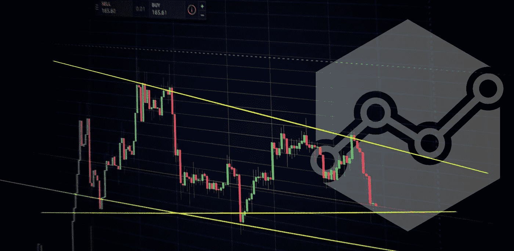
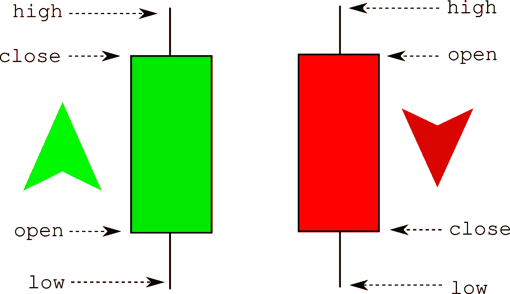
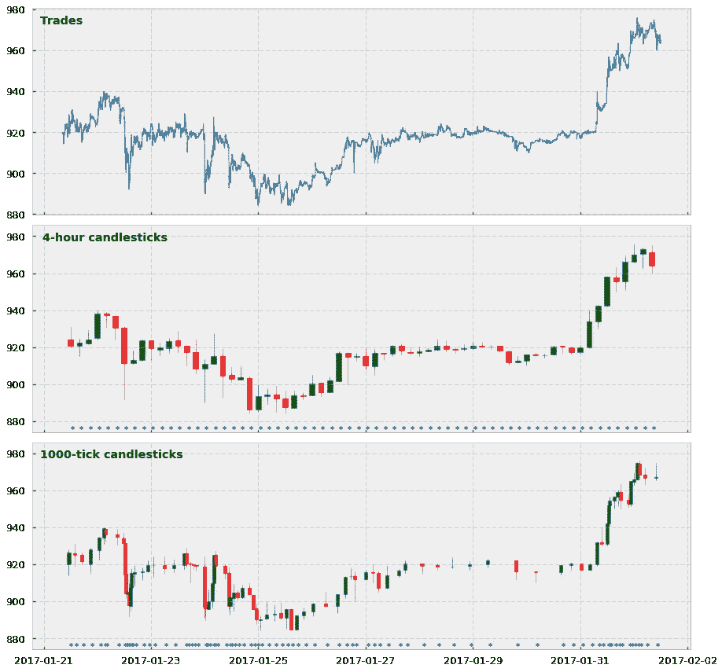
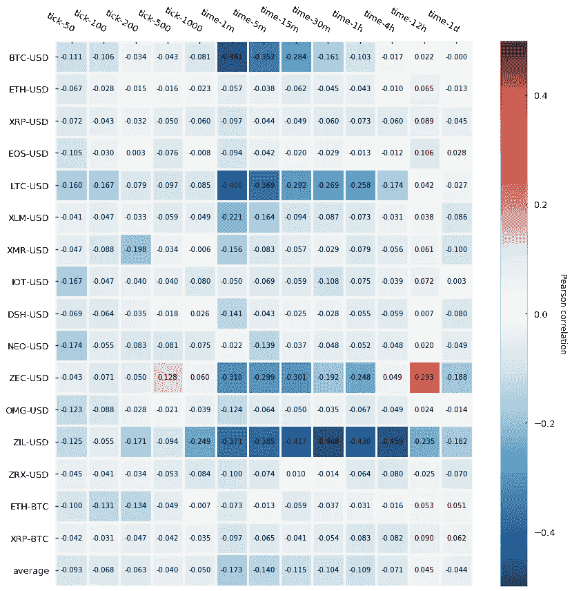
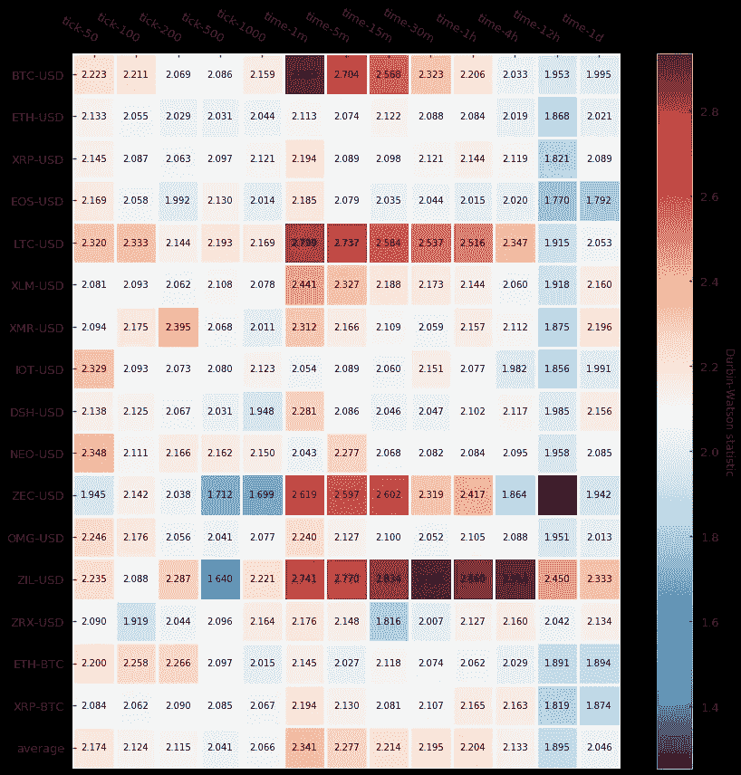
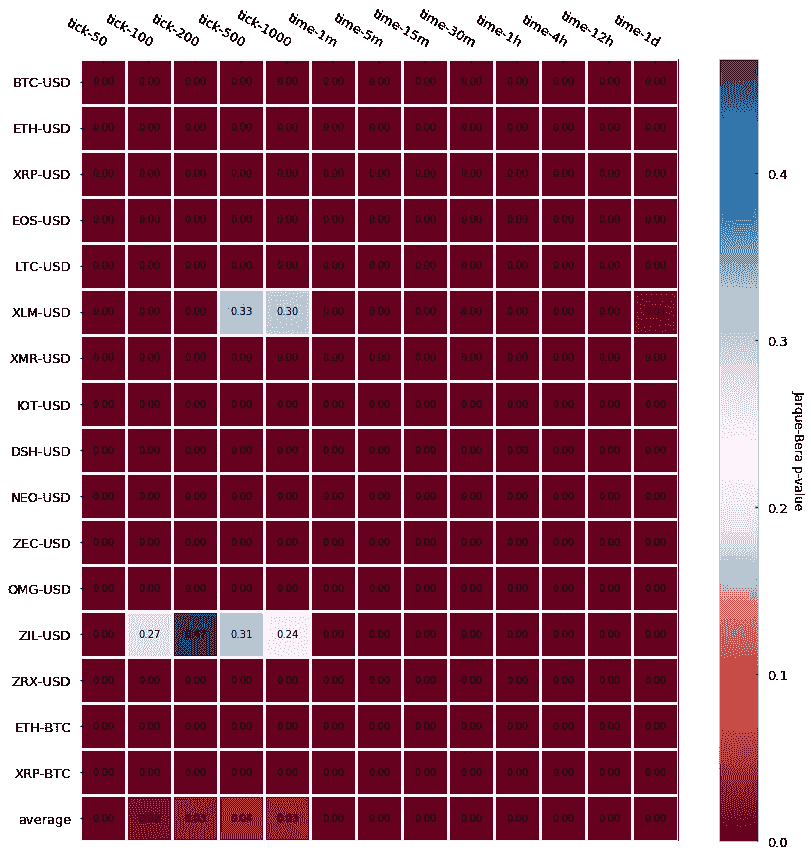
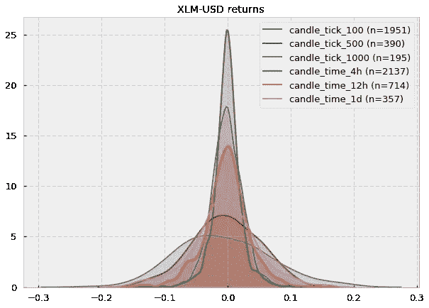
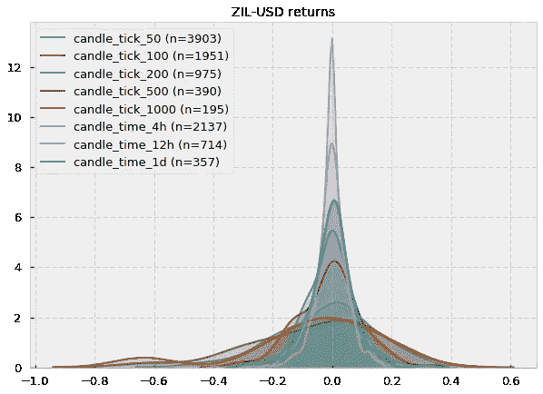
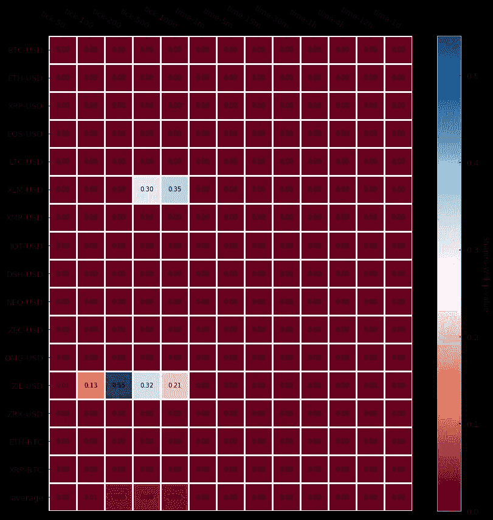

# 机器学习的高级烛台(一):刻度条

> 原文：<https://towardsdatascience.com/advanced-candlesticks-for-machine-learning-i-tick-bars-a8b93728b4c5?source=collection_archive---------1----------------------->

## 在本文中，我们将学习如何构建分笔成交点，我们将彻底分析它们的统计属性，如回报率的正态性或自相关性，我们将探索在哪些情况下这些棒线可以很好地替代传统的基于时间的蜡烛图。为了说明分笔成交点在预测加密货币市场中的适用性，我们将基于由 16 个加密货币交易对组成的整个数据集进行分析，其中包括最受欢迎的加密资产，如比特币、以太币或莱特币

## 1.—导言

在之前的一篇文章中，我们探讨了如果我们计划训练机器学习(ML)算法，为什么传统的基于时间的烛台不是最合适的价格数据格式。即:(1)基于时间的蜡烛图过采样低活动期和欠采样高活动期，(2)市场越来越多地被不再遵循任何与人类相关的日光周期的交易算法所控制，(3)基于时间的蜡烛图在交易者和交易机器人中普遍存在，这增加了竞争，正如我们将在本文中看到的，(4)基于时间的蜡烛图提供了较差的统计属性。如果您错过了更新，请找到下面文章的链接。

 [## 金融机器学习从业者一直在使用错误的烛台:原因如下

### 在这篇文章中，我们将探讨为什么传统的基于时间的烛台是一种低效的方法来汇总价格…

towardsdatascience.com](/financial-machine-learning-practitioners-have-been-using-the-wrong-candlesticks-heres-why-7a3fb85b5629) 

在这篇文章中，我们将探讨其中一个建议的替代酒吧:滴答酒吧。让我们深入研究一下。

## 2.—构建刻度条

关于什么是分笔成交点，至少有两个主要的定义。报价[投资媒体](https://www.investopedia.com/terms/t/tick.asp):

> 分笔成交点是衡量证券价格最小上下波动的指标。分笔成交点也可以指一种证券在不同交易中的价格变化。

在分笔成交点的例子中，我们关心的定义是第二个:在分笔成交点的范围内，分笔成交点本质上是一个交易和在交易所进行交易的价格。分笔成交点或分笔成交点蜡烛线只是预定义数量的分笔成交点的集合。例如，如果我们想要生成 100 点棒线，我们必须保存所有交易的数据，每次我们从交易所“收到”100 笔交易，我们就创建一个棒线或蜡烛线。然后通过计算开盘价、最高价、最低价、收盘价和成交量来构建烛台(通常简称为 OHLCV)。

开盘价和收盘价分别对应于第一笔和最后一笔交易的价格。最高价和最低价是蜡烛线中所有交易的最高价和最低价(可能与开盘价和收盘价重叠)。最后，交易量是所有交换资产的总和(例如，在 ETH-USD 对中，交易量以蜡烛线期间交换的以太物数量来衡量)。惯例是，当一根蜡烛的收盘价比开盘价高时，我们把它涂成绿色(或者空着)，而如果收盘价比开盘价低，我们就把它涂成红色(或者填满黑色)。

下面是一个非常简单但快速的 Python 实现来生成刻度烛台:

这是与标准的基于时间的烛台相比，刻度条的视觉效果。在这种情况下，我们显示了 BTC-美元交易对的 4 小时和 1000 点棒线，以及 2017 年 1 月 21 日至 2017 年 2 月 20 日之间所有交易的价格。请注意，对于烛台，我们每次对一根棒取样时都会显示一个星号。

关于这些地块的两个主要观察结果:

1.  是的，壁虱烛台看起来很丑。它们混乱、重叠、难以理解，但请记住，它们不应该对人类友好:它们应该对机器友好。
2.  他们丑的真正原因是因为他们工作做得很好。看看星号，看看在价格变化很大的时期，有更多的星号(和更多的棒线)混杂在一起？而相反:当价格变化不大时，分笔成交点采样要低得多。我们实际上是在创建一个系统，在这个系统中，我们将信息到达市场(更高的活动和价格波动)与烛台的取样同步。我们终于在高活动期采样更多，在低活动期采样更少。万岁！

## 3.—统计属性

那么它们的统计特性如何呢？它们比传统的基于时间的同类产品更好吗？

我们将关注两个不同的属性:(1)序列相关性和(2)在 [CryptoDatum.io，](https://cryptodatum.io)中提供的 15 种加密货币对中的每一种的回报的正态性，包括 Bitfinex 交易所的所有历史棒线，以及基于时间和分笔成交点的棒线大小:

*   **基于时间的条形大小** : 1 分钟、5 分钟、15 分钟、30 分钟、1 小时、4 小时、12 小时、1 天。
*   **刻度条尺寸** : 50，100，200，500，1000

## **3.1——序列相关性(也称为自相关)**

序列相关度量时间序列中的每个值与下一个值(对于 lag=1)的相关程度，或者任何值 I 与任何其他值 i+n (lag=n)之间的相关程度。在我们的例子中，我们将计算对数回报的序列相关性，这是作为蜡烛收盘价的对数的一阶差来计算的。

理想情况下，我们系列的每个数据点应该是一个独立的观察。如果存在序列相关性，这意味着它们不是独立的(它们在滞后=1 或更高时相互依赖)，这将在建立回归模型时产生后果，因为我们在回归中观察到的误差将小于或大于真实误差，这将误导我们的解释和预测。你可以在这里看到这个问题[非常形象的解释。](https://www3.nd.edu/~rwilliam/stats2/l26.pdf)

为了测量序列相关性，我们将计算序列相对于移位自身的皮尔逊相关性(滞后=1，也称为一阶相关性)。结果如下:

Pearson auto-correlation

事实证明，分笔成交点(标记为 tick-*)通常比基于时间的蜡烛图(标记为 time-*)具有更低的自相关性，也就是说，皮尔逊自相关性更接近于 0。对于较大的时间棒线(4h、12h、1d)，这种差异似乎不太明显，但有趣的是，即使是最小的分笔成交点(50 分笔成交点和 100 分笔成交点)也产生非常低的自相关性，这对于较小的时间棒线(1 分钟、5 分钟)并不成立。

最后，有趣的是，我们可以看到几种加密货币(BTC、LTC、ZEC 和 ZIL)在几个时间条中表现出相当强的负自相关性。Roberto Pedace 在这里[评论了关于负自相关的](https://www.dummies.com/education/economics/econometrics/patterns-of-autocorrelation/):

> 当数据中观察值的顺序相关或重要时，回归模型中可能存在*自相关、*序列相关、序列相关。换句话说，对于时间序列(有时是面板或纵向)数据，自相关是一个问题。[…] *无自相关*是指误差项的值之间不存在可识别关系的情况。[……]虽然不太可能，但负自相关也是可能的。*负自相关*发生在一个给定符号的误差之后往往是相反符号的误差。例如，正误差之后通常是负误差，负误差之后通常是正误差。

我们将执行一个额外的统计测试，称为 Durbin-Watson (DB)测试，它也诊断序列相关性的存在。DB 统计值在 0–4 范围内，其解释如下:

本质上，越接近 2，序列相关性越低。结果如下:

Durbin-Watson test

结果与 Pearson 自相关测试一致，该测试为以下叙述提供了证据:分笔成交点显示的自相关性略低于基于时间的蜡烛图。

## **3.2 —回报的正态性**

我们可以查看的另一个统计数据是回报的正态性，这是我们的对数回报的分布是否遵循正态(也称为高斯)分布。

我们可以运行几个测试来检查正态性——我们将执行其中的两个测试:测试数据的[偏斜度](https://en.wikipedia.org/wiki/Skewness)和[峰度](https://en.wikipedia.org/wiki/Kurtosis)是否符合正态分布的 **Jarque-Bera 测试**，以及检验样本是否符合高斯分布的最经典测试之一**夏皮罗-维尔克测试**。

在这两种情况下，零假设是样本服从正态分布。如果拒绝零假设(p 值低于显著性水平—通常是< 0.05) there is compelling evidence that the sample does not follow a normal distribution.

Let’s look at the p-values for the Jarque-Bera first:

Jarque-Bera p-value

The results are almost unanimous: log returns do not follow a Gaussian distribution (most p-values < 0.05) . Two cryptocurrency pairs (Stellar and Zilliqa) seem to actually follow a Gaussian if we set our significance level at 0.05\. Let’s take a look at their distributions (kernel density estimates):

Fair enough, some of them could look Gaussian (at least visually). However, notice that the number of samples (n) is very small (e.g. for XLM-USD candle_tick_1000 n=195) so I suspect that one of the reasons may just be the lack of sampling, which provides Jarque-Bera not enough evidence to reject the null hypothesis of normality.

In fact, a quick look at the [CryptoDatum.io](https://cryptodatum.io) 数据库显示，XLM-美元和 ZIL-美元交易对分别在去年(2018 年)5 月和 7 月刚刚发布，它们似乎有相当低的成交量...

谜团解开了？:)

现在让我们进行夏皮罗-维尔克检验，看看它是否与先前的结果一致:

Shapiro-Wilk p-value

该死，夏皮罗，他们没教你在学校考试时不要抄袭吗？不管棒线的类型如何，回报的非正态性似乎是规律。

## 4.我们学到了什么？

1.  通过聚合预定义数量的分笔成交点并计算相关的 OHLCV 值来生成分笔成交点蜡烛图。
2.  在图表中，刻度线看起来很难看，但它们做得很好:它们在高活动期采样更多，在低活动期采样更少。
3.  与基于时间的蜡烛图相比，即使在小尺寸(50，100 分笔成交点)下，来自分笔成交点的对数回报显示出较低的序列相关性。
4.  基于分笔成交点和基于时间的棒线的日志回报都不服从正态分布。

感谢阅读。在接下来的几周，我们将讨论其他类型的高级棒线，如量棒线、美元棒线和(我最喜欢的)不平衡棒线。所以，如果你喜欢这篇文章:敬请期待！

*这个项目是我们在*[*cryptodatum . io*](https://cryptodatum.io)*研究的一部分，这是一个加密货币数据 API，旨在提供即插即用的数据集来训练机器学习算法。如果您喜欢我们在本文中展示的数据，您可以在*[*https://cryptodatum . io*](https://cryptodatum.io.)获得免费的 API 密钥并亲自使用它

