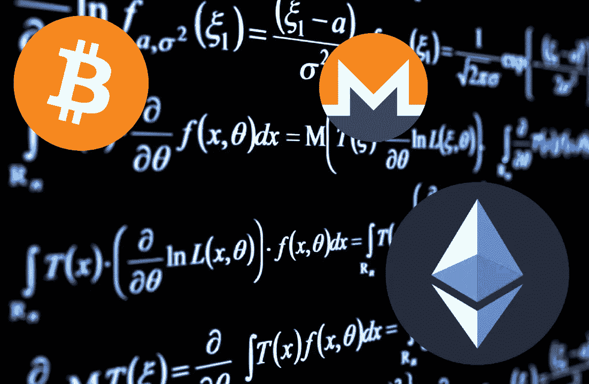
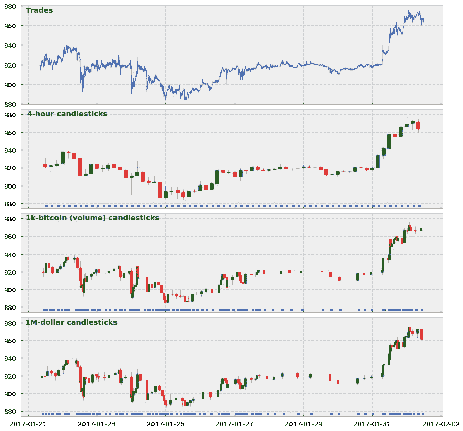
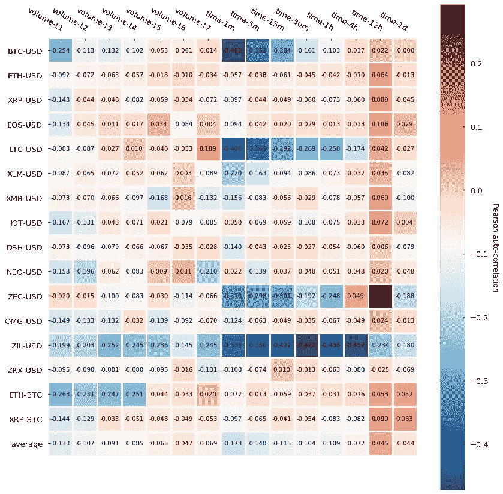
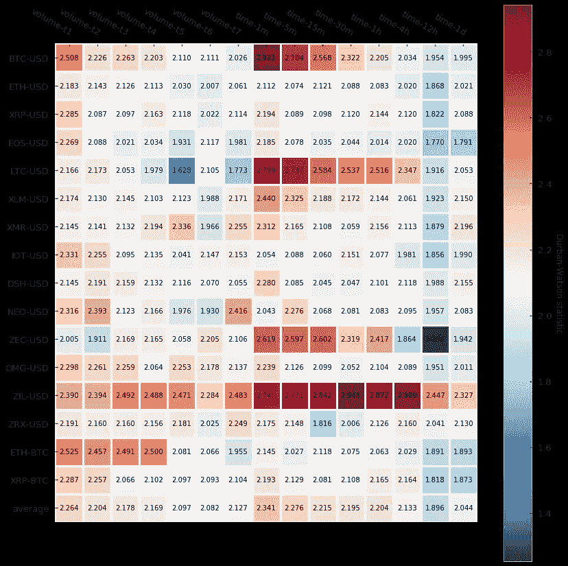
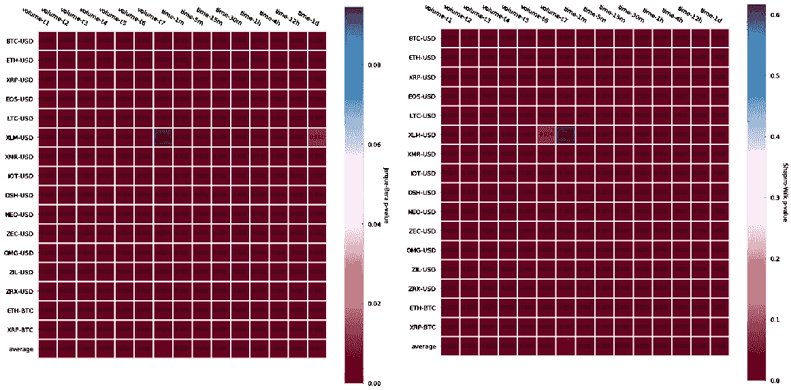
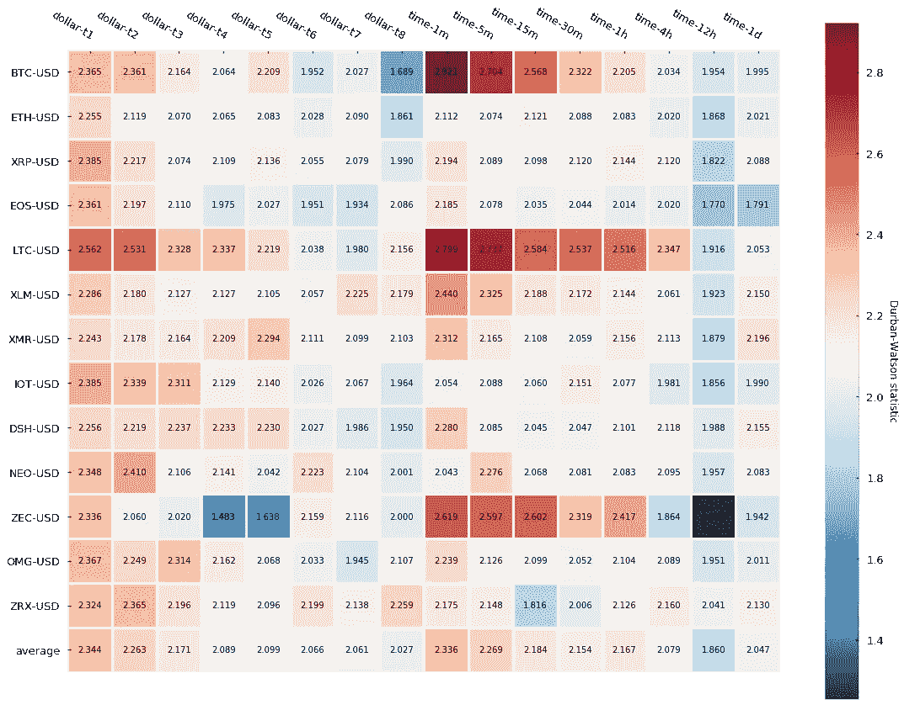
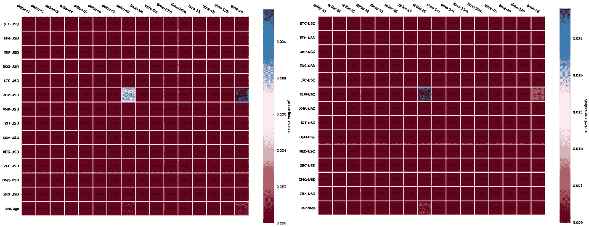
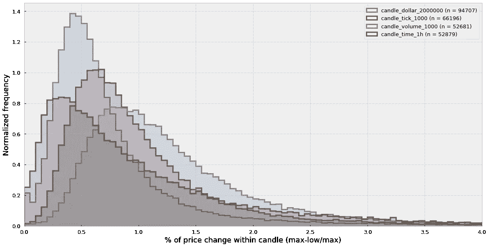

# 机器学习的高级烛台(二):体积和美元酒吧

> 原文：<https://towardsdatascience.com/advanced-candlesticks-for-machine-learning-ii-volume-and-dollar-bars-6cda27e3201d?source=collection_archive---------7----------------------->

## 在本文中，我们将学习如何构建成交量和美元棒线，并探索它们相对于传统的基于时间的烛台和分笔成交点棒线的优势。最后，我们将在 16 个加密货币交易对的大型数据集中分析它们的两个统计属性——回报的自相关性和正态性

## 介绍

在一篇[的前一篇](/advanced-candlesticks-for-machine-learning-i-tick-bars-a8b93728b4c5)文章中，我们学习了如何构建分笔成交点，并评估了它们根据市场中较高或较低的活动自动调节采样率的特殊能力。与分笔成交点相似，成交量和美元线也允许采样率与市场活动同步，但他们每个人对*活动*的理解不同。在分笔成交点的例子中，市场活动被定义为在交易所发生的交易数量。交易量条将交易量定义为交易所交易的资产数量，例如，交易的比特币数量。对于美元棒线，活动被定义为交换的固定价值，例如，每次交换 1000 美元的资产时对棒线进行取样，它可以用美元来衡量，也可以用欧元、日元等来衡量。

因此，每种棒线对市场活动的理解和同步方式不同，这种不同的理解带来了它的优点和缺点。让我们深入研究一下。

## 分笔成交点、成交量和美元棒线的优缺点

利用棒线，我们找到了一种方法来扫描交易所的交易历史，并在交易所执行更多交易时，简单地采样更多棒线。虽然交易数量和信息到达之间可能存在很强的相关性，但这种相关性是不确定的。例如，一个非常熟悉的算法或交易员可能会自动发出非常小的重复订单，以影响市场情绪(通过将交易历史“变绿”)，隐藏交易总量(也称为[冰山订单](https://www.investopedia.com/terms/i/icebergorder.asp))，或者只是通过伪造信息到达来迷惑其他交易机器人。

这种情况的一个潜在解决方案是使用音量条。成交量棒不关心交易的顺序或数量，他们只关心这些交易的总量。对他们来说，信息的到来是交易所用户之间交易量的增加。通过这种方式，交易量柱能够绕过对交易数量的误导性解释，代价是失去隐藏在实际交易序列中的任何信息。

成交量棒线的另一个有趣的特征，听起来很明显，但值得注意的是，市场成交量信息本身就编码在棒线上:每个成交量棒线都是一个预定义成交量的桶。同样，这听起来可能是显而易见的，但长期以来，直到今天，金融领域的许多研究人员对如何将交易量信息纳入他们的预测模型毫无头绪。音量条提供现成的音量信息。

现在，交易量柱的问题是，交易量可能与交易资产的实际价值密切相关。例如，在 2017 年初，1 万美元可以购买大约 10 个比特币，但到了 2017 年底，你只能用它购买半个比特币。潜在价值的巨大波动极大地削弱了量柱的力量，因为由于资产的重估，在某个时间点相关的量大小可能在不久的将来不相关。纠正这种波动的一种方法是，不计算交换的资产数量(数量条)，而是计算交换的固定价值数量(美元条)，对于 etc 美元货币对，这恰好是以美元计算的，但对于欧洲货币对，也可能是以欧元计算的，等等。

## 建筑体积和美元酒吧

现在我们已经看到了每种条形的优点和缺点，让我们来看看如何实际构建它们。

下面是构建音量条的快速 Python 实现:

**Snippet 1**. Volume bar implementation

这里是美元条的一个实现，它只包括对前面函数的一些小的修改——让我们看看您是否能发现它们:

**Snippet 2**. Dollar bar implementation

最后，以下是它们与传统计时烛台的对比:

**Figure 1**. Trade, time-based, volume and dollar bars depiction. Asterisks are plotted every time a candle is sampled

基于交易量和美元的蜡烛线在某种意义上类似于分笔成交点，虽然与基于时间的调和蜡烛线相比，它们看起来混乱和重叠，但只要市场活动有变化，它们就能很好地采样。

## 量柱的统计分析

现在让我们看看它们的统计特性。我们将通过 Pearson 自相关测试和 Durbin-Watson 测试来研究收益的序列相关性。最后，我们还将通过执行贾尔克-贝拉和夏皮罗-维尔克检验来研究结果的正态性。参考关于刻度条的[旧文章](/advanced-candlesticks-for-machine-learning-i-tick-bars-a8b93728b4c5)，了解更多关于这些统计测试的信息。

在交易量柱的情况下，我们将显示 16 个交易对的结果，每个交易对有 7 个交易量(标记为第 1 层到第 7 层)。与分笔成交点不同，交易量大小是特定于加密货币的，因为它们取决于多种因素，如流通中的硬币总量、基础资产价值等。我们选择每种加密货币的交易量大小的方法是通过计算每天的平均交易量，然后将每天的平均交易量除以相同的比率，如 5 分钟、15 分钟、30 分钟、1 小时、4 小时、12 小时对应于 1 天，并四舍五入到最接近的 10。以下是每个加密货币对自动选择的数量:

**Table 1**. [CryptoDatum.io](https://cryptodatum.io) volume bar sizes

**Figure 2**. Pearson auto-correlation for volume bars

**Figure 3**. Durban-Watson statistic for volume bars

结果与我们看到的分笔成交点一致。与基于时间的蜡烛图(图 2 和图 3)相比，量柱显示的自相关性稍低，并且在两个正态性检验(图 4)中的大多数情况下，正态性的零假设都被拒绝，因此我们确定收益不遵循高斯分布。

**Figure 4**. Jarque-Bera and Spahiro-Wilk tests p-value for volume bars

## 美元金条的统计分析

我们将重复之前对收益的自相关性和正态性的测试。在美元条的情况下，美元条的大小(以美元表示)定义如下表所示:

**Table 2**. [CryptoDatum.io](https://cryptodatum.io) dollar bar sizes ($)

现在让我们看看正态性和自相关测试的结果:

**Figure 5**. Pearson auto-correlation for dollar bars

**Figure 6**. Durbin-Watson test results for dollar bars

**Figure 7**. Normality tests for dollar bars

与我们在分笔成交点和成交量棒线中看到的相反，结果是美元棒线与基于时间的蜡烛线相比，在自相关性方面几乎没有改善。我们可以观察到不同加密货币之间的自相关方差略低，但平均来看差异很小。最后，回归常态再次遭到广泛拒绝。

## 蜡烛内部价格变化分析

我们已经说过，分笔成交点、成交量和美元棒线采样适应市场活动，允许我们在高活动期采样更多，在低活动期采样更少。最终，这种属性应该反映在单根蜡烛的价格变化量上。这个想法是，基于时间的烛台在固定的时间间隔采样，而不管市场活动，而替代酒吧得到与市场活动同步。因此，基于时间的蜡烛图应该同时具有价格变化很小的蜡烛线(过采样期间)和价格变化很大的蜡烛线(欠采样期间)，而替代棒线应该更加均衡，这似乎是很直观的。

然而，我们所理解的市场活动是什么？一个市场可以非常活跃，价格横向移动吗？答案是肯定的，虽然通常在高市场活动和大的价格变化之间存在相关性，但这种关系是不确定的。例如，在某些情况下，高 FUD(恐惧、不确定性和怀疑)会导致交易量激增，但价格变化很小。此外，在加密货币市场中，清洗交易并不少见。这些动作包括自我交易(买方和卖方是同一个人)，这再次引发了巨大的交易量高峰，而价格变化很小。

为了弄清楚这个问题，让我们来看看每种类型的棒线的蜡烛线内价格变化的分布。蜡烛线内价格变化计算如下:

> 蜡烛线内变化=(高-低)/高

**Figure 8**. Intra-candle price variation for all the history of the BTC-USD pair at the Bitfinex exchange (data source: [CryptoDatum.io](https://cryptodatum.io))

我们可以看到，时间蜡烛图分布更偏向于 0，并且有一个向右的长尾，而其他分布在高价格变化期间有效地采样更多。

## 每日酒吧频率

B 在结束本文之前，我想看看日柱线的频率，以及交易资产的价格和市场活动如何影响采样率。让我们看看结果:

Figure 9\. Bar sampling frequency per day for the whole BTC-USD history at the Bitfinex Exchange. Bitcoin log price is shown in grey line. (data source: [CryptoDatum.io](https://cryptodatum.io))

我们可以看到，基于时间的烛台以相同的速率采样(每天 24 根棒线)，替代棒线的采样速率根据比特币价格的变化而变化(以灰色显示)。

有趣的是，在替代棒线中，成交量棒线的采样频率似乎仍然是 BTC 兑美元历史上最稳定的——只有当我们包括 2017 年的历史高点时，否则美元或分笔成交点棒线似乎更稳定。另一个让我惊讶的特征是，美元蜡烛应该更稳定，因为它们对实际资产价格有所“修正”，但在 2017 年的历史高点期间，美元蜡烛似乎失去了控制。我怀疑这是因为在大致稳定的交易量中，美元棒线能很好地修正资产的重估。然而，如果你结合资产价格增长 10 倍或更多的事实，总交易量，而不是由于资产的高成本而减少，保持增长，那么你会遇到一种情况，当美元棒采样简单地爆炸。

## 我们学到了什么？

*   成交量棒线通过只关注交换的资产总额，解决了关于多个小额交易和冰山订单的价格棒线限制。
*   美元棒衡量交换的固定价值，这在理想情况下可以校正资产(如加密货币)的波动价值。
*   当市场活动增加时，成交量和美元棒线取样较多，当市场活动减少时，取样较少。
*   与传统的基于时间的蜡烛图相比，量柱通常显示较低的序列相关性。
*   美元棒线似乎不会产生较低的序列相关性。然而，请记住，美元棒线的数量似乎在历史高点期间爆炸，这意味着大多数美元棒线可能来自非常短的时间，因此平均自相关可能更高，只是因为棒线的紧密“相邻”。
*   成交量和美元棒线的对数收益率都不服从高斯分布。
*   传统烛台的蜡烛内变化分布似乎向零移动，并呈现长尾，这证实了它们不能使取样适应市场活动。或者，分笔成交点、成交量和美元棒线的蜡烛线内变化分布看起来更平衡，并向右移动。
*   基于固定周期的烛台后，体积条的采样率似乎是最稳定的。
*   美元的取样率似乎在泡沫中爆炸，体积非常大。

感谢阅读！在下一集，我们将谈论一种最有趣的酒吧:不平衡酒吧。这些棒线是根据交易顺序中观察到的不平衡来取样的，是信息驱动棒线的一个很好的例子。

*这个项目是我们在*[*cryptodatum . io*](https://cryptodatum.io)*研究的一部分，这是一个加密货币数据 API，旨在提供即插即用的数据集来训练机器学习算法。如果您喜欢我们在本文中展示的数据，您可以在*[*https://cryptodatum . io*](https://cryptodatum.io.)获得免费的 API 密钥并亲自使用它

