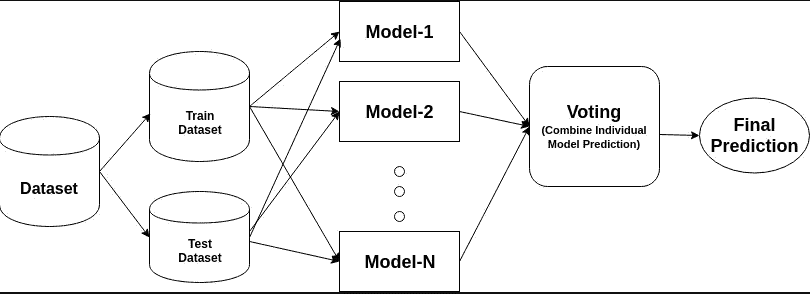
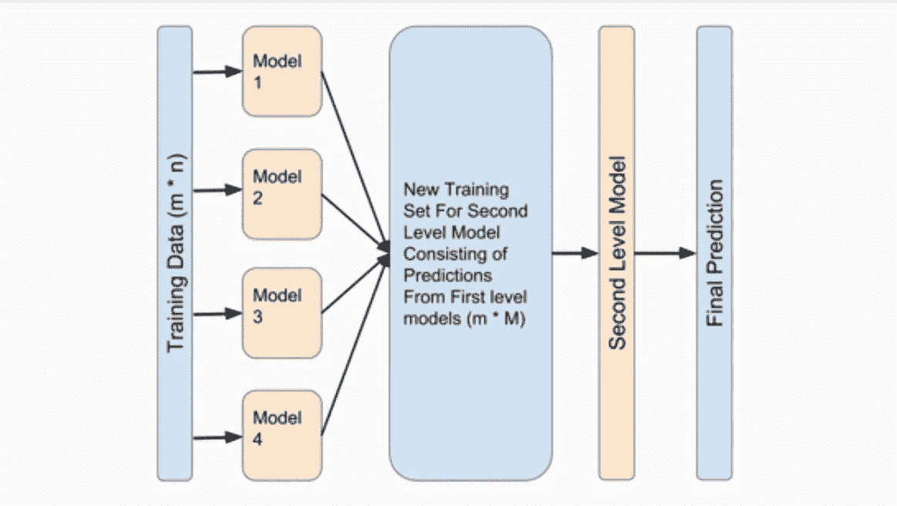
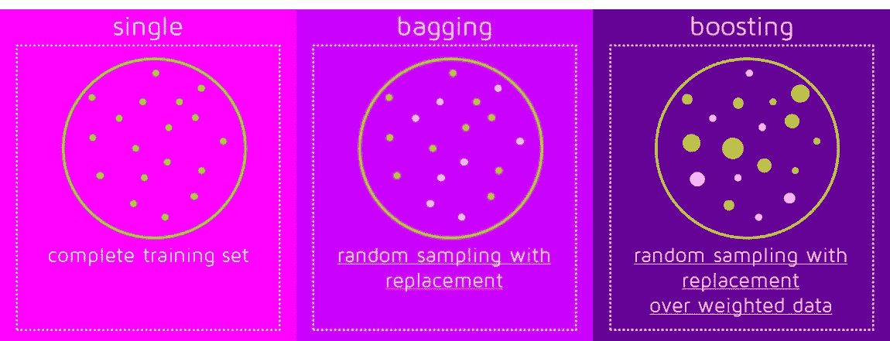

# 高级集成分类器

> 原文：<https://towardsdatascience.com/advanced-ensemble-classifiers-8d7372e74e40?source=collection_archive---------11----------------------->

系综这个词是一个拉丁语派生词，意思是“各部分的结合”。常用的常规分类器容易出错。虽然这些错误是不可避免的，但是可以通过学习分类器的适当构造来减少它们。

*集成学习是一种生成各种基本分类器的方法，从这些基本分类器中导出一个新的分类器，其性能优于任何组成分类器*。这些基本分类器可能在使用的算法、超参数、表示或训练集方面有所不同。

集成方法的关键目标是减少**偏差**和**方差**。

The figure shows a basic outline of ensemble techniques.

一些高级集成分类器是:

1.  堆垛
2.  混合
3.  制袋材料
4.  助推

**堆叠:**堆叠是一种将单个训练数据集给多个模型并进行训练的方法。使用 k-fold 验证进一步划分训练集，并形成结果模型。这里，每个模型表示使用的不同算法。

size of the training data=m*n | no. of models=M

*从这 M 个模型中做出的预测被用作最终模型的预测器*。如此共同形成的变量用于预测最终分类，比每个基础模型更精确

**混合:**与叠加相比，混合是一种类似的技术，但唯一的区别是数据集直接分为训练和验证，而不是 k 倍验证。

**Bagging**(Bootstrap aggregation):在这种方法中，*通过替换从训练数据中选取各种数据项，产生 n 个训练数据样本。*

装袋时，由于数据是未加权的，所以抽样中的项目是随机选择的。

对于每次迭代，

1.  在这些样本中的每一个上创建一个基础模型。
2.  这些模型并行运行，相互独立。
3.  通过组合所有模型的预测来确定最终预测。

这些模型共同形成更高等级的模型，以产生更高的准确性。最终模型的平均值为:

e =(**σ**eᵢ)/n

e₁,e₂…在哪里..eₙ =基本分类器

e =最终分类器

打包算法:

*   Bagging 元估计量
*   随机森林

**升压:**升压是一种自学习技术。它通过为数据中的各种项目分配权重来学习。提升技术最初以相等的权重开始，但是在每个模型之后，每个模型基于其性能被分配一个权重。

类似地，在评估每个模型之后，错误分类的数据被赋予更多的权重，以便下一个模型更加关注这些项目。

对于每次迭代，

1.  它根据分类的不正确程度对每个训练样本进行加权。
2.  做一个假设
3.  权衡假设

因此，通过基于权重对数据组进行投票，最终模型是从关注不同数据组的各种模型中得出的。

使用加权平均法对最终模型进行平均

e =((**σ**eᵢwᵢ)/***σ**wᵢ))/n

哪里，e₁,e₂…..eₙ =基本分类器

w₁,w₂…..wₙ=重量

n =模型数量

e =最终分类器

升压算法:

*   adaboost 算法
*   马恩岛
*   XGBM
*   轻型 GBM
*   CatBoost

注意:在 bagging 中，模型并行运行并且相互独立，而在 boosting 中，模型按顺序运行并且依赖于前面的模型。