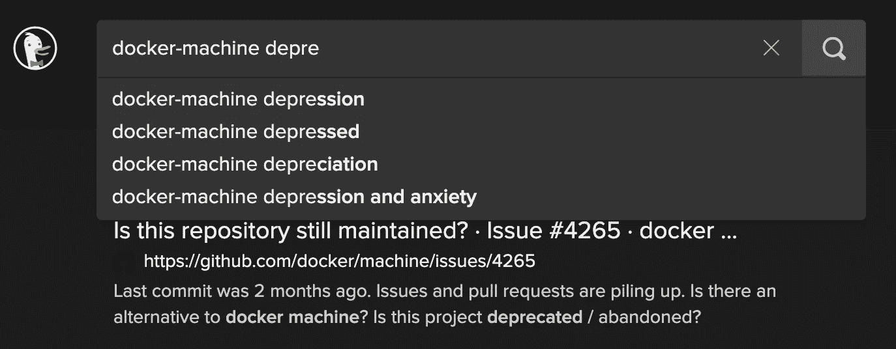
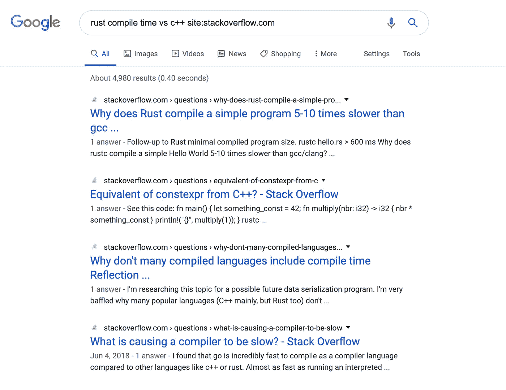
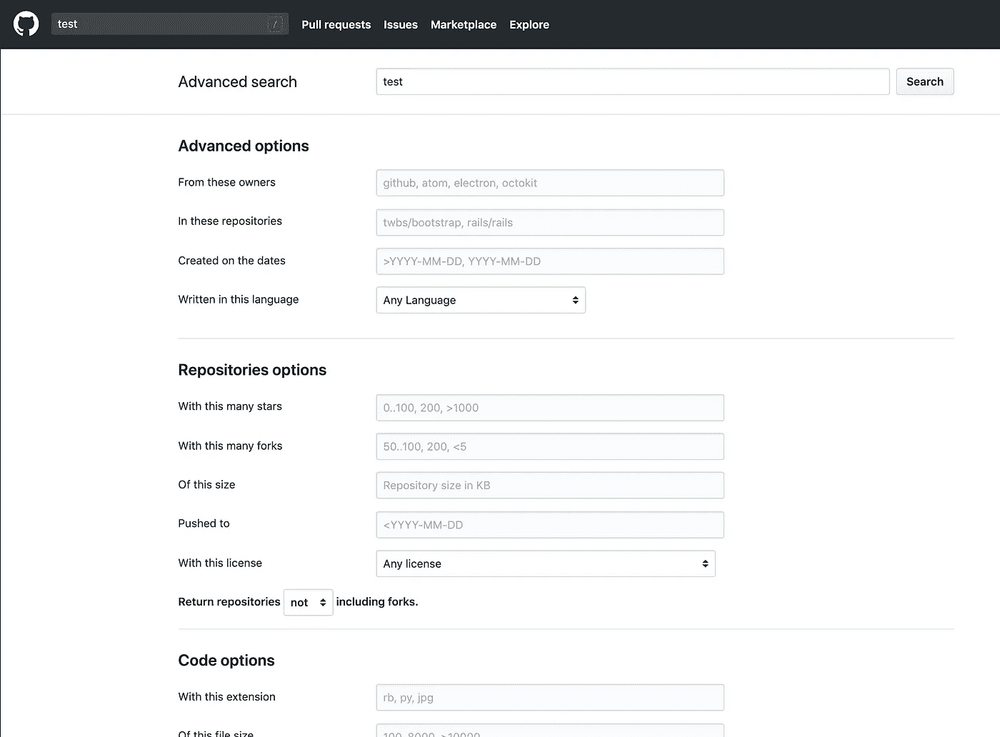

# 数据科学的高级谷歌技能

> 原文：<https://towardsdatascience.com/advanced-google-skills-for-data-science-350bf828dbe6?source=collection_archive---------15----------------------->

## 像专业人士一样搜索，优化您的编程

Photo by [Clay Banks](https://unsplash.com/@claybanks?utm_source=medium&utm_medium=referral) on [Unsplash](https://unsplash.com?utm_source=medium&utm_medium=referral)

## “谷歌一下”的问题是

“ [LMGTFY](http://lmgtfy.com/?q=lmgtfy) ”是一个历史悠久的笑话网站。“ [RTFM](https://www.xkcd.com/293/) ”是不屑的冷笑。(法语为 Ouais，aussi[en Fran ais](https://mouef.fr/argo_geek-pour-les-noobs/#RTFM)。)

但是，如果找到答案就像在搜索引擎中输入自然语言查询和阅读手册页一样简单，那么就不会有图书馆学研究生学位，我也会失业。

> LMGTFY:回答开放式问题不是一件小事。

除了作为一个未解决的、NLP 困难的机器学习问题，寻找“为什么我的代码不编译？”或者“我的模型有什么问题？”是你——用你的非人工智能——在日常生活中需要高效处理的问题，以成为一名有效的数据科学家和程序员。

在这里，我将分享信息专家工具箱中的一些强大工具，您可以使用它们来调试代码并更快地了解相关信息。

## 有目的的谷歌

它不仅仅是一个自然语言的问题框，尽管没有人否认自动完成是 AI 娱乐的最佳和最高形式。

Who hurt you?

如果你没有使用先进的谷歌搜索功能，你就错过了它的全部功能。这些功能包括:

*   排除带负号的词语:比较热门搜索视频`python`和`python -programming`:

python

python -programming

*   *包含带双引号的*词条:如果一个词条*一定要*出现，即使很少见，PageRank 也不怎么看重，那么你可以用引号把它括起来。`python x86–64 assembly “fail”`将确保你得到编译器“失败”的结果。
*   同样，使用这些双引号来搜索与完全匹配的*字符串。通过将 stderr 复制并粘贴到搜索引擎的一对双引号中来调试代码问题。*
*   Bootstrap Google 来弥补另一个网站糟糕的搜索功能。将`site:www.example.com`作为查询的一部分会将您的搜索限制在该域内。

using Google as a single-site search engine

*   如果你和我不一样，更喜欢 GUI 而不是语法，[将高级搜索页面](https://www.google.com/advanced_search)加入书签。它有翻译这些选项和更多的字段。

## 成为 Github 和 StackExchange 忍者

除了 Google 上的`site:github.com`，Github 的 UI 和 API 都提供了[高级搜索功能](https://help.github.com/en/github/searching-for-information-on-github/about-searching-on-github)，这通常符合我们刚刚讨论的语法。[将高级搜索页面加入书签。](http://github.com/search/advanced)

github advanced search

StackExchange 为高级无畏研究者提供了无数的语法选项。一个很棒的特性是能够使用**主题标签**上的任何搜索选项，用【括号】表示，来包含或排除内容(例如`concurrency *ython -[java]` ==“我想看关于 Cython 和 Python 中的并发性的答案，但不是 Java。”).StackExchange】也有一个支持高级搜索的 API (尽管 GitHub 的 API 与更酷的 [GraphQL](https://graphql.org/learn/) 一起工作)。

## 做你自己的 NLP 模型+参考馆员

编程的能力是强大的——你创造的东西可以创造其他东西。进行战术研究的能力是一种超能力——你学得更快，解决问题更有效率，并且在这个过程中利用你的元技能。

那么什么是“好的搜索”呢？

*   把垃圾拿出来。思停话和 TF-IDF。(复习: [TF-IDF 的基本思想](https://en.wikipedia.org/wiki/Karen_Spärck_Jones)是，如果一个词在你的语料库中出现得更频繁，它就更有意义，但如果它出现得如此频繁，无论上下文如何，它都不会更有意义。)
*   **获取具体。**可能需要几次尝试来校准查询特异性的水平，以找到相关的答案，但它介于“python 模块不起作用”和复制粘贴带有您的特殊用户名、文件路径和函数名称的回溯之间。试着上下拨动特异性键，看看你的点击会发生什么。
*   尝试不同的单词。你所包含的术语有可能产生独特的*结果吗，或者至少比一些更普通的词获得更多的信息吗？如果没有，你能不能用几种不同的方式来解释你的问题，看看其他人是否尝试过这些措辞？*

有时，这是第三或第四个问题的重新措辞，在 StackExchange 搜索结果的第无数页上找到了金子。如果你被一些想法难住了，试试 textblob，它能让你快速地头脑风暴同义词、 [meroynms](https://en.wikipedia.org/wiki/Meronymy) 、 [holonyms](https://en.wikipedia.org/wiki/Holonymy) 、定义、例句和单词的其他意思，以丰富和重组你的查询。

虽然你可能更喜欢这个 Python 要点，而不是头脑风暴术语的模拟方法，但我还是鼓励你伸展你的精神肌肉，尝试一下。从学习看到一个问题的多个方面中获得的思维可塑性是一种帮助你成为更好的程序员的技能。

## 保留研究线索

一旦你找到了来之不易的答案，不要失去你已经取得的进步。**记录下来。**

*   注释你的代码。你知道有多少次我忘记了一个复杂的研究线索的答案，并感谢过去的我把链接放在了一个屏蔽评论里？
*   当我们谈到这个主题时，使用版本控制。你的研究笔记没有理由不能是本地 git 回购。一旦你解决了一个大问题，如果它坏了，你需要再次修复它，你会很高兴你有线索。养成写(或做书签)到文件、添加和提交的习惯。一个可追踪的研究轨迹几乎是自我文档化的，并且绝对会为你节省数小时的回溯时间。
*   **利用您的浏览器历史记录。**如果你使用 Chrome，使用谷歌 Chrome/Gmail 开发专用账户来跟踪你的浏览历史。
*   使用 [Vivaldi](https://vivaldi.com) (我最喜欢的浏览器)，这是一个基于 Chromium 的浏览器，允许您创建多个浏览配置文件和标签/书签组(例如，一个用于开发，一个用于 ML，一个用于前端，一个用于休闲时间……)
*   **保存研究文档。将书签存储在一个开源的、跨平台的、支持多媒体的引用和研究管理器 Zotero 中。**
*   或者，如果你[也爱命令行](https://github.com/k4m4/terminals-are-sexy)，试试 [papis](https://github.com/papis/papis) 。

我主要使用一个 CLI，我用一堆普通的。txt 文件和一个 sqlite 后端来管理它们。但是 Zotero 是我最喜欢的与他人分享和合作的开源软件。Papis 功能丰富，我一直在关注[概念](https://www.notion.so/?r=bf26be3d6eb948d39e753c78d52ed62d)作为吉拉式服务的一种降价友好、集成和防干扰的替代方案。

## 欢迎来到信息科学！

(重新)搜索是一门科学和艺术——我拥有这方面的硕士学位，并训练模型试图理解如何擅长它，这是有原因的。**这很难——即使对聪明的人来说也是如此。**

“谷歌一下”是个糟糕的建议。拿这个代替。