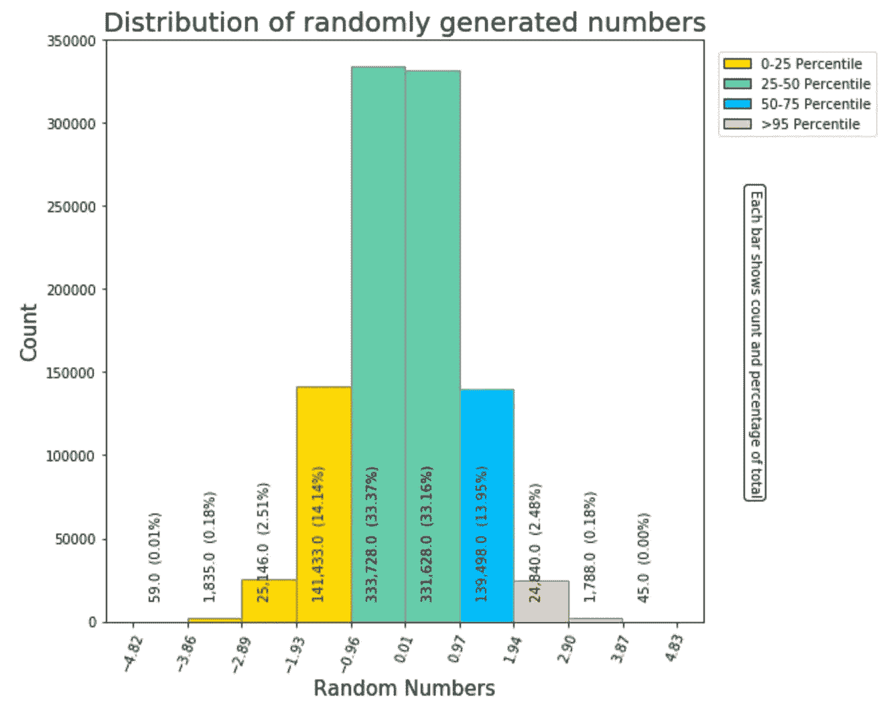
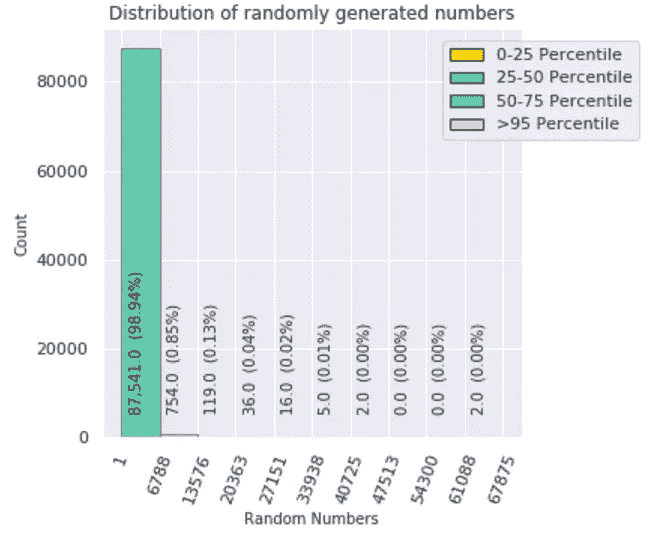
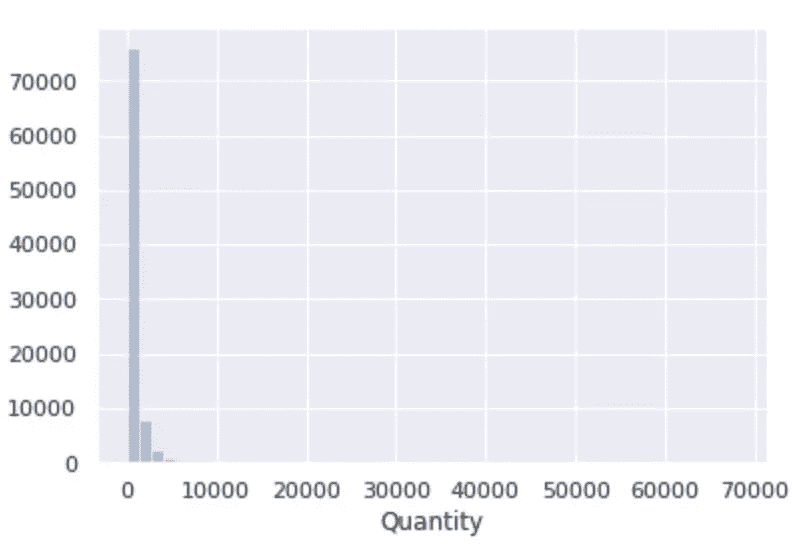

# 使用 Python 的高级直方图

> 原文：<https://towardsdatascience.com/advanced-histogram-using-python-bceae288e715?source=collection_archive---------12----------------------->

## 让业务用户和数据科学家高兴的直方图

# 需要什么？

Python 对生成直方图有很好的支持。但在数据科学中，显示条形/条柱计数、条柱范围、给条形着色以分隔百分位数并生成自定义图例以向业务用户提供更有意义的见解是非常有用的。使用 Python 时，没有内置的直接方法来实现这一点。

所以作为数据科学家需要提供有用的直方图有:

1.  如何在直方图中显示每个条形的数据点计数？
2.  如何在直方图的 X 轴上显示条形/条柱范围？
3.  如何根据百分比改变直方图中条形/条柱的颜色？
4.  如何生成自定义图例？

我们尝试生成的最终输出将对最终用户非常有用，如下所示:

Advanced Histogram

# 这为什么有用？

了解数据范围和百分位数以及计数和标准化百分比对于确定如何处理/清理数据非常有用。业务用户也很容易理解直方图并从中获取价值。

例如，如果数据严重倾斜，无论是正的还是负的，并且有极端的异常值，则图表可能会揭示关于数据的一些有价值的见解。

Advance histogram for skewed data

上面的直方图显示，大约 99%的数据在 1 到 6788 的范围内。虽然数据范围是从 1 到 67875，但很明显，几乎 99%的数据都在 1 到 6788 之间，这有助于决定如何处理异常值。

您无法从下图所示的标准直方图中获得这种细节层次的洞察力。

Standard histogram for skewed data

# Python 代码

你可以从我的***AnalyticsInsightsNinja***[GitHub 网站](https://github.com/AnalyticsInsightsNinja/PythonVisualAnalytics/blob/master/01_AV_Adavced_Histogram.ipynb)或者从 [Azure 笔记本](https://notebooks.azure.com/AnalyticsInsightsNinja/projects/PythonVisualAnalytics/html/01_AV_Adavced_Histogram.ipynb)下载代码。

代码中重要的一行是:

> **counts，bin，patches = ax.hist(data，facecolor = perc _ 50 _ colour，edgecolor='gray')**

它返回以下内容:

**计数** =直方图中每个面元/列的数据点计数的 numpy . n 数组

**面元** =面元边缘/范围值的 numpy . n 数组

**补丁** =补丁对象列表。每个 Patch 对象包含一个 Rectnagle 对象。例如矩形(xy=(-2.51953，0)，宽度=0.501013，高度=3，角度=0)

通过操作这三个集合，我们可以获得关于直方图的非常有用的信息。

鸣谢:这个代码的灵感来自于 stackoverflow.com 大学的乔·金顿的一个回答

# 结论

虽然标准直方图很有用，但拥有一个可以显示数据范围和百分位数以及计数和归一化百分比的增强版本，对于数据科学家来说非常有用，可以帮助他们确定应该如何处理/清理数据，并为业务最终用户提供更多价值。