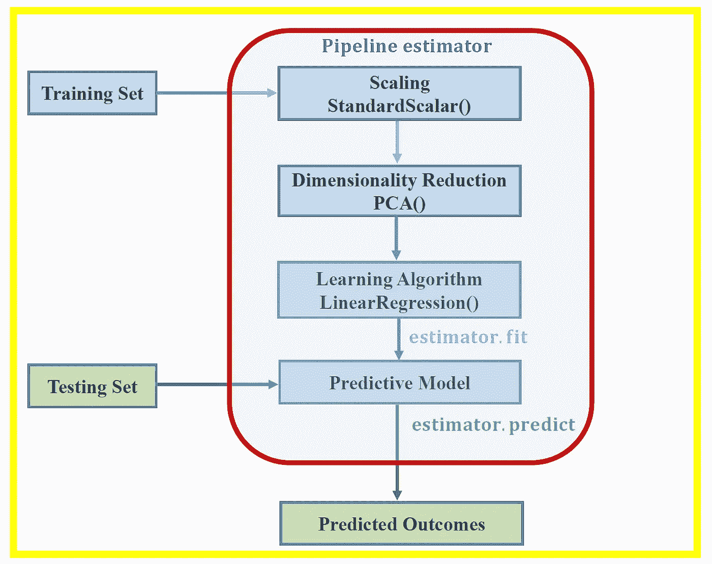
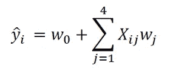
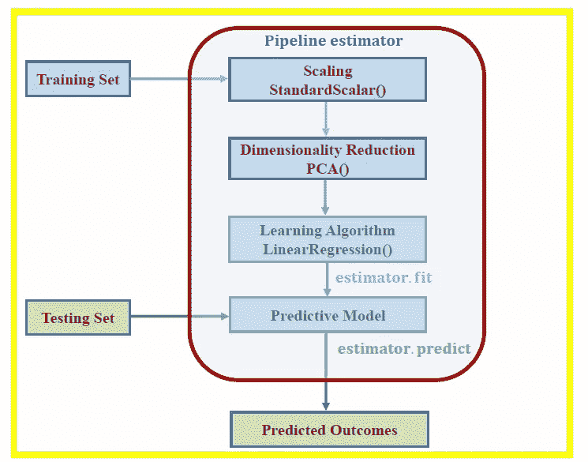
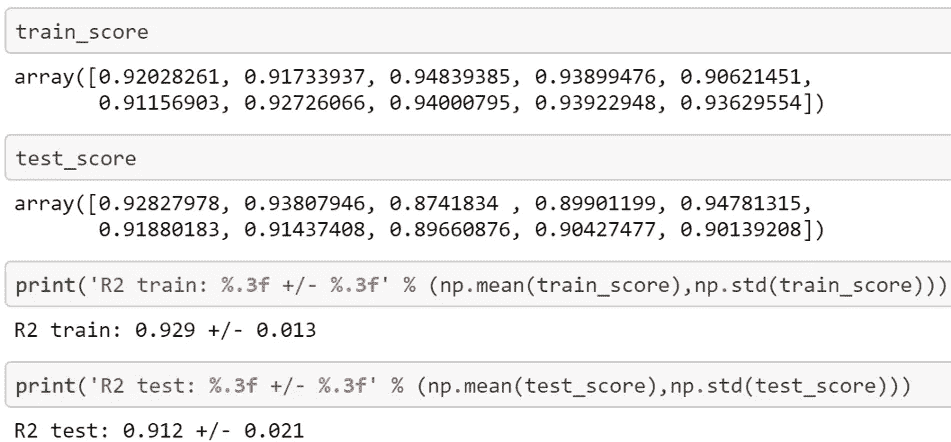

# 使用管道估计器的高级模型构建

> 原文：<https://towardsdatascience.com/advanced-model-building-using-the-pipeline-estimator-59581244386c?source=collection_archive---------27----------------------->



在本文中，我们展示了 sci-kit learn 中的 Pipeline 估计器如何用于高效的机器学习模型构建、测试和评估。我们将使用游轮数据集来说明我们的示例，以构建一个线性回归模型来推荐船只的船员人数。

在上一篇文章中( [**使用协方差矩阵图进行特征选择和降维**](https://medium.com/towards-artificial-intelligence/feature-selection-and-dimensionality-reduction-using-covariance-matrix-plot-b4c7498abd07) )，我们已经展示了协方差矩阵图可以用于特征选择和降维。

使用游轮数据集[**cruise _ ship _ info . CSV**](https://github.com/bot13956/ML_Model_for_Predicting_Ships_Crew_Size)**，**我们发现，在 6 个预测特征[' **年龄**'、**吨位**'、**乘客**'、**长度**'、**舱室**、**乘客密度** ]中，如果我们假设重要特征的相关系数为 0 那么目标变量“**乘员**”与 4 个预测变量:“**吨位**”、“**乘客**”、“**长度**、“**车厢**”强相关。 因此，我们能够将特征空间的维数从 6 降低到 4。

现在，假设我们想在新的特征空间上建立一个模型来预测船员变量。我们的模型可以用以下形式表示:



在本文中，我们展示了如何使用 scikit-learn 的**管道估算器以有效的方式训练、测试和评估我们的模型。**

# 什么是管道估算器？

流水线估计器是一种将几个估计器和转换器组合在一起的方法。这有助于我们编写高效的代码。在下图中，管道估计器在输入数据集中执行 3 项重要任务:(1)使用 **StandardScaler()** 转换器进行特征缩放；(2)使用 **PCA()** 变换器的特征工程和维数减少；以及(3)使用**线性回归()**估计器建立模型。



# 为什么要使用管道估算器？

作为数据科学家，重要的是我们要高效地编码。包含较少行的高效代码更容易捕捉可能存在的任何错误。所采用的流水线使得模型构建非常高效和健壮。

我们现在将考虑一个示例，该示例说明如何使用流水线估计器来构建、测试和评估线性回归模型，该线性回归模型用于基于 4 个预测变量，即“**吨位**”、“**乘客**”、“**长度**和“**舱室**”，来推荐船只的船员人数。

# 1.导入必要的库

```
import numpy as npimport pandas as pdfrom sklearn.metrics import r2_scorefrom sklearn.model_selection import train_test_splitfrom sklearn.preprocessing import StandardScalerfrom sklearn.decomposition import PCAfrom sklearn.linear_model import LinearRegressionfrom sklearn.pipeline import Pipelinepipe_lr = Pipeline([('scl', StandardScaler()),('pca', 
                  PCA(n_components=4)),('slr', LinearRegression())])
```

# 2.读取数据集并选择预测值和目标变量

```
df=pd.read_csv("cruise_ship_info.csv")cols_selected = ['Tonnage', 'passengers', 'length', 'cabins','crew']X = df[cols_selected].iloc[:,0:4].values 

y = df[cols_selected]['crew'] sc_y = StandardScaler()train_score = []test_score =  []
```

# 3.使用管道估算器进行模型构建、测试和评估(交叉验证)

```
for i in range(10): X_train, X_test, y_train, y_test = train_test_split( X, y, 
                                  test_size=0.4, random_state=i) y_train_std = sc_y.fit_transform(y_train[:, 
                                     np.newaxis]).flatten() pipe_lr.fit(X_train, y_train_std) y_train_pred = sc_y.inverse_transform(pipe_lr.predict(X_train)) y_test_pred = sc_y.inverse_transform(pipe_lr.predict(X_test)) train_score = np.append(train_score, r2_score(y_train, 
                            y_train_pred)) test_score = np.append(test_score, r2_score(y_test, 
                            y_test_pred))
```

# 4.我们代码的输出



总之，我们已经展示了如何通过将几个基本的转换器和估计器组合在一起，使用非常少的代码行来使用管道估计器来构建、测试和评估机器学习模型。

# 参考

1.  [在具有高度相关特征的数据集上训练机器学习模型](https://medium.com/towards-artificial-intelligence/training-a-machine-learning-model-on-a-dataset-with-highly-correlated-features-debddf5b2e34)。
2.  [使用协方差矩阵图进行特征选择和降维](https://medium.com/towards-artificial-intelligence/feature-selection-and-dimensionality-reduction-using-covariance-matrix-plot-b4c7498abd07)。
3.  Raschka、Sebastian 和 Vahid Mirjalili **。** *Python 机器学习，第二版*。帕克特出版社，2017 年。
4.  Benjamin O. Tayo，*预测船只船员规模的机器学习模型*，[https://github . com/bot 13956/ML _ Model _ for _ Predicting _ Ships _ Crew _ Size](https://github.com/bot13956/ML_Model_for_Predicting_Ships_Crew_Size)。