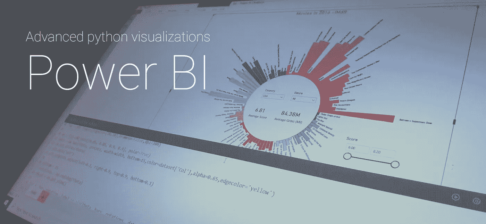
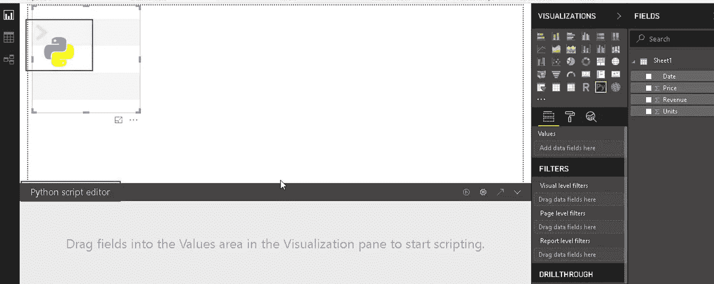
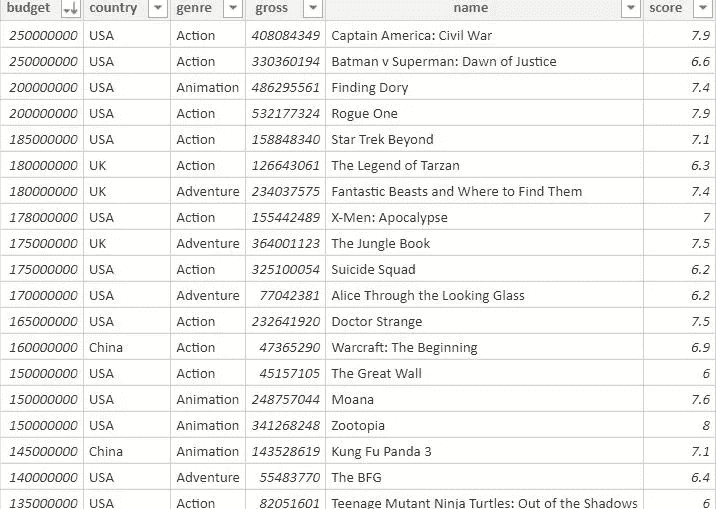
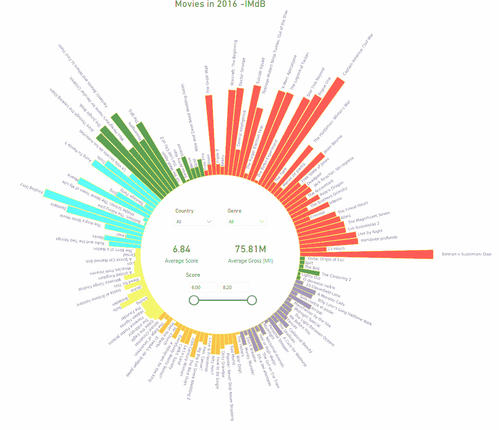

# PowerBI 中的高级 Python 可视化

> 原文：<https://towardsdatascience.com/advanced-python-visualizations-in-powerbi-b64fe8602a8a?source=collection_archive---------4----------------------->



Image by author

> 如何利用最新的 Python-PowerBI 集成，将 Python 的高级视觉效果与原生数据钻取和 DAX 功能相结合

最新的 Python 可视化支持完善了 Power BI 中对 Python 的支持，使您能够使用 Python 脚本来准备数据集，在 Power BI 桌面中应用复杂的分析或机器学习，然后使用数百个开源 Python 可视化包中的任何一个在 Power BI 报告中绘制结果。

这种视觉效果随着报告中的交叉筛选而更新，并且可以与 DAX 功能相结合。这是一个强大的组合，它允许我们通过增加交互性来充分利用数据。

# **在 PowerBI 报告中创建 Python 视觉效果**

可以通过从 Power BI Desktop 的 Visualizations 窗格中选择 Python 可视化图标来添加 Python 可视化，这会将占位符 Python 脚本添加到报表中。



必填字段可以从我们正在处理的数据集中添加到值窗格中，这在内部创建了一个 Pandas 数据框架。然后，我们可以使用 Matplotlib 和 Seaborn 等库编写自定义脚本来创建视觉效果。

本机 PowerBI 功能(如切片器、过滤器)可以在 python 可视化工具之上使用，以根据需要进行选择。视觉效果会动态更新。

# **创建径向条形图以可视化 IMdB 2016 电影数据集**

这里有一个小教程，教你如何用 python 创建一个自定义的视觉效果，并添加切片器，让你对数据背后的故事有一个交互式的视觉体验。



IMdB 2016 movie database

该数据集由 2016 年 IMdB 评分为 6 分或更高的电影列表以及属性-预算、总收入、类型和分数组成。
这个数据集在 IMdB 和 kaggle 等其他地方公开。

使用 Matplotlib 在脚本中添加了一个自定义的径向条形图。它根据所应用的选择/过滤器动态地从数据帧中获取值。



用于选择流派、国家和分数范围的切片器直接添加到 PowerBI 中，并显示所选集的平均分数和总收藏数等指标。这使我们能够全面地探索数据，并根据需要做出推论。

代码片段:

```
# Import the libraries
from matplotlib import pyplot as plt
import numpy as npdataset.sort_values('genre', inplace=True) # Creating values (budget amount) for the bars
iN = len(dataset)
arrCnts = dataset['budget']/10000000theta=np.arange(0,2*np.pi,2*np.pi/iN)
width = (2*np.pi)/iN *0.9 # Plot size and proportions
fig = plt.figure(figsize=(20,18),frameon=False,dpi=200)

# Adding radial axes
ax = fig.add_axes([0.05, 0.05, 0.9, 0.9], polar=True)
bars = ax.bar(theta, arrCnts, width=width, bottom=15,color=dataset['Col'],alpha=0.65,edgecolor='yellow')
ax.set_xticks(theta)
plt.axis('off')
plt.subplots_adjust(left=0.1, right=0.9, top=0.9, bottom=0.1)

bottom = 15
rotations = np.rad2deg(theta)
y0,y1 = ax.get_ylim()

# Adding radial tags
for x, bar, rotation, label in zip(theta, bars, rotations, dataset['name']):
    offset = (bottom+bar.get_height())/(y1-y0)
    lab = ax.text(0, 0, label, transform=None, 
             ha='center', va='center',alpha=0.5)
    renderer = ax.figure.canvas.get_renderer()
    bbox = lab.get_window_extent(renderer=renderer)
    invb = ax.transData.inverted().transform([[0,0],[bbox.width,0] ])
    lab.set_position((x,offset+(invb[1][0]-invb[0][0])/2.*2.7 ) )
    lab.set_transform(ax.get_xaxis_transform())
    lab.set_rotation(rotation) 

fig.tight_layout()
plt.show()---
This code should be pasted in the script and the visual must be updated.
```

python 支持的这一扩展作为一个强大的分析框架带来了许多可能性，无论是使用高级 python 库制作高级视觉效果还是复杂的机器学习算法，从而使 PowerBI 成为数据科学领域的必备工具。

看看我下一篇关于如何在 PowerBI 中制作直方图的博客吧！

[https://sriharipramod . medium . com/advanced-python-visualizations-in-power bi-histograms-and-frequency-plots-66f 238684011](https://sriharipramod.medium.com/advanced-python-visualizations-in-powerbi-histograms-and-frequency-plots-66f238684011)

> 关于作者
> 斯里哈里·普拉莫德

从事人工智能产品和建筑技术的数据分析和决策科学专家。印度海得拉巴。

[https://www.linkedin.com/in/sriharipramod/](https://www.linkedin.com/in/sriharipramod/)