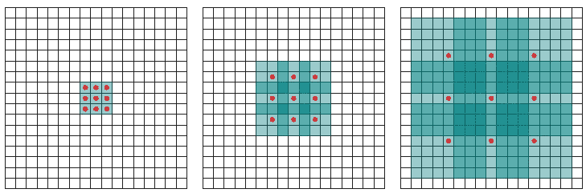
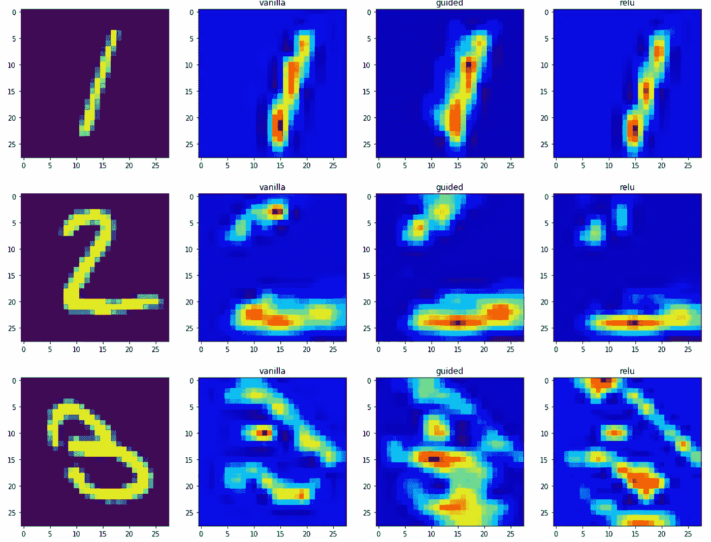
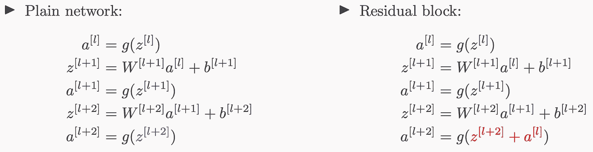

# 深度卷积神经网络的高级课题

> 原文：<https://towardsdatascience.com/advanced-topics-in-deep-convolutional-neural-networks-71ef1190522d?source=collection_archive---------6----------------------->

## 残差网络、显著图、扩张卷积等等。

> “如果我们想让机器思考，我们需要教它们看”——***费-***

在整篇文章中，我将讨论卷积神经网络的一些更复杂的方面，以及它们如何与特定任务相关，如对象检测和面部识别。

本教程将讨论的主题有:

*   **CNN 评论**
*   **感受野和扩张的回旋**
*   **显著图**
*   **转置卷积**
*   **经典网络**
*   **剩余网络**
*   **迁移学习**

这篇文章是我的文章标题: [**神经网络简单介绍**](/simple-introduction-to-convolutional-neural-networks-cdf8d3077bac) **的自然延伸。如果你不熟悉卷积神经网络的思想和功能，我建议你在阅读本文其余部分之前先看看这个。**

由于原始文章过长，我决定省略与对象检测和面部识别系统相关的几个主题，以及研究文献中目前正在试验的一些更深奥的网络架构和实践。我可能会在未来的一篇文章中更具体地讨论深度学习在计算机视觉中的应用。


You Only Look Once (YOLO) — 2016

所有相关代码现在都可以在我的 GitHub 存储库中找到:

[](https://github.com/mrdragonbear/CNNs) [## 龙熊先生/CNN

### 此时您不能执行该操作。您已使用另一个标签页或窗口登录。您已在另一个选项卡中注销，或者…

github.com](https://github.com/mrdragonbear/CNNs) 

# **CNN 评论**

在我的原始文章中，我讨论了为什么全连接网络不足以完成图像分析任务的动机。CNN 的独特之处如下:

*   比全连接网络的参数(权重和偏差)更少。
*   对对象平移不变-它们不依赖于特征在图像中出现的位置。
*   可以容忍图像中的一些失真。
*   能够归纳和学习特征。
*   需要网格输入。

卷积层由**滤波器、特征图、激活函数构成。**这些卷积层可以**满**、**同**或**有效。**


如果已知输入中的层数、 *nᵢ* 、该级中的滤波器数量、 *f* 、步长大小、 *s* 以及图像的像素尺寸、 *p* (假设是正方形)，我们就可以确定给定卷积块的输出层数。

池层用于减少过度拟合。完全连接的图层用于将空间和通道要素混合在一起。在整个图像上绘制了特征图之后，每个过滤层对应于该图像，这就是提取特征的方式。


知道输入和输出层的数量很重要，因为这决定了构成神经网络参数的权重和偏差的数量。网络中的参数越多，需要训练的参数就越多，这导致训练时间更长。训练时间对于深度学习非常重要，因为它是一个限制因素，除非你可以访问强大的计算资源，如计算集群。

下面是一个示例网络，我们将计算其参数总数。


在这个网络中，卷积滤波器有 250 个权重和 10 个偏置项。我们没有最大池层的权重。在 max-pooling 层之后，我们有 13 × 13 × 10 = 1，690 个输出元素。我们有一个 200 节点的全连接层，因此全连接层中共有 1，690 × 200 = 338，000 个权重和 200 个偏置项。因此，我们总共有 338，460 个参数要在网络中训练。我们可以看到，大多数训练参数出现在完全连接的输出层。

CNN 的每一层都学习越来越复杂的过滤器。第一层学习基本的特征检测过滤器，例如边缘和拐角。中间层学习检测物体部分的过滤器——对于人脸，他们可能会学习对眼睛和鼻子做出反应。最后一层有更高的表现:他们学习识别不同形状和位置的完整物体。


Feature maps showing increasing resolution of features through different convolutional layers of a neural network.

对于那些在继续之前需要更直观地了解卷积神经网络的人来说，看看这个三维表示可能会有所帮助:

 [## 卷积神经网络的三维可视化

### 编辑描述

加利福尼亚洲](http://scs.ryerson.ca/~aharley/vis/conv/) 

在下一节中，我们将更详细地讨论卷积层感受野的概念。

# 感受野和扩张的脑回

感受野被定义为输入空间中特定 CNN 特征所关注的区域(即受其影响)。在一个 5 × 5 的输入图上应用一个内核大小为*k =*3*T5×*3，填充大小为 *p =* 1 × 1，步距为 *s =* 2 × 2 的卷积 *C* ，我们将得到一个 3 × 3 的输出特征图(绿色图)。**


在 3 × 3 特征图的顶部应用相同的卷积，我们将得到 2 × 2 特征图(橙色图)。


让我们在一维中再次观察感受野，没有填充，步幅为 1，核大小为 3 × 1。


我们可以跳过其中的一些连接，以创建一个扩展的卷积，如下所示。


这种扩展卷积的工作方式与正常卷积类似，主要区别在于感受野不再由连续像素组成，而是由其他像素分隔的单个像素组成。下图显示了将扩展卷积图层应用于图像的方式。


Dilated convolution

下图显示了二维数据的扩展卷积。红点是 3 × 3 滤波器的输入，绿色区域是每个输入捕捉的感受野。感受野是每个输入(单元)对下一层的初始输入所捕获的隐含区域。



使用扩张卷积背后的动机是:

*   通过以更高的分辨率处理输入来检测细节。
*   更广泛的输入视图，以获取更多上下文信息。
*   运行时间更快，参数更少

在下一节中，我们将讨论使用显著图来检查卷积网络的性能。

# 显著图

显著图是一种有用的技术，数据科学家可以用它来检查卷积网络。它们可以用来研究神经元的激活模式，以了解图像的哪些特定部分对特定特征很重要。


让我们想象一下，给你一张狗的图片，让你给它分类。这对于人类来说非常简单，但是，深度学习网络可能没有你聪明，可能会将其归类为猫或狮子。它为什么这样做？

网络可能错误分类图像的两个主要原因是:

*   训练数据中的偏差
*   没有正规化

我们想了解是什么让网络给出某个类作为输出——一种方法是使用显著图。显著图是一种测量给定图像中特定类别的空间支持度的方法。

*“当图像 I 通过我的网络时，找出负责具有分数 S(C)的类 C 的像素”。*

我们如何做到这一点？我们差异化！对于任意一个函数 *f(x，y，z)* ，我们可以通过求变量 *x，y，z* 在任意一个特定点 *(x₁，y₁，z₁)* 对这些变量的偏导数，来求变量*x，y，z*对该点的影响。类似地，为了找到负责的像素，我们对类 *C* 取分数函数 *S* ，并对每个像素取偏导数。

这很难自己实现，但幸运的是，auto-grad 可以做到这一点！该过程工作如下:

1.  通过网络转发图像。
2.  计算每门课的分数。
3.  对于除类别 *C* 之外的所有类别，强制最后一层的分数 *S* 的导数为 0。对于 *C* ，将其设置为 1。
4.  通过网络反向传播这个导数。
5.  渲染它们，你就有了你的显著图。

注意:在步骤#2 中，我们没有使用 softmax，而是将其转换为二元分类并使用概率。

这里有一些显著图的例子。


我们如何处理彩色图像？获取每个通道的显著图，或者取最大值、平均值，或者使用所有 3 个通道。


概述显著图功能的两篇优秀论文是:

*   [**深层卷积网络:可视化图像分类模型和显著图**](https://arxiv.org/pdf/1312.6034.pdf)
*   [**基于注意力的街景图像结构化信息提取**](https://arxiv.org/pdf/1704.03549.pdf)

有一个与本文相关的 GitHub 库，我在其中展示了如何生成显著图(这个库可以在这里找到)。下面是 Jupyter 笔记本中的一段代码:

```
**from** **vis.visualization** **import** visualize_saliency
**from** **vis.utils** **import** utils
**from** **keras** **import** activations

*# Utility to search for layer index by name.* 
*# Alternatively we can specify this as -1 since it corresponds to the last layer.*
layer_idx = utils.find_layer_idx(model, 'preds')plt.rcParams["figure.figsize"] = (5,5)
**from** **vis.visualization** **import** visualize_cam
**import** **warnings**
warnings.filterwarnings('ignore')

*# This corresponds to the Dense linear layer.*
**for** class_idx **in** np.arange(10):    
    indices = np.where(test_labels[:, class_idx] == 1.)[0]
    idx = indices[0]

    f, ax = plt.subplots(1, 4)
    ax[0].imshow(test_images[idx][..., 0])

    **for** i, modifier **in** enumerate([**None**, 'guided', 'relu']):
        grads = visualize_cam(model, layer_idx, filter_indices=class_idx, 
                              seed_input=test_images[idx], backprop_modifier=modifier)        
        **if** modifier **is** **None**:
            modifier = 'vanilla'
        ax[i+1].set_title(modifier)    
        ax[i+1].imshow(grads, cmap='jet')
```

这段代码导致生成以下显著图(假设安装了相关的库`vis.utils`和`vis.visualization`)。如果您想更全面地了解实现过程，请查看笔记本。



在下一节中，我们将讨论通过使用转置卷积进行上采样的想法。

# 转置卷积

到目前为止，我们所看到的卷积要么保持其输入的大小，要么使其变小。我们可以用同样的技术使输入张量变大。这个过程被称为**上采样**。当我们在一个卷积步骤内进行时，它被称为**转置卷积**或**分数步长**。

注意:一些作者在卷积反卷积时称之为上采样，但该名称已被以下文章中概述的不同概念所采用:

[https://arxiv.org/pdf/1311.2901.pdf](https://arxiv.org/pdf/1311.2901.pdf]..)

为了说明转置卷积是如何工作的，我们将看一些卷积的示例。

第一个例子是没有填充的典型卷积层，作用于大小为 5 × 5 的图像。卷积后，我们得到一个 3 × 3 的图像。


Image taken from A. Glassner, Deep Learning, Vol. 2: From Basics to Practice

现在我们来看一个填充为 1 的卷积层。原始图像是 5 × 5，卷积后的输出图像也是 5 × 5。


Image taken from A. Glassner, Deep Learning, Vol. 2: From Basics to Practice

现在我们来看一个填充为 2 的卷积层。原始图像是 3× 3，卷积后的输出图像也是 5 × 5。


Image taken from A. Glassner, Deep Learning, Vol. 2: From Basics to Practice

当在 Keras 中使用时，例如在可变自动编码器的开发中，这些是使用上采样层实现的。希望，如果你以前见过这个，现在可以理解这些卷积层如何通过使用转置卷积来增加图像的大小。

在下一节中，我们将讨论一些经典网络的架构。这些网络中的每一个在某种意义上都是革命性的，推动了深度卷积网络的发展。

# 经典网络

在这一部分，我将回顾 CNN 的一些经典架构。这些网络被用于深度学习领域的一些开创性工作，并经常用于迁移学习目的(这是未来文章的主题)。

第一项提出类似于卷积神经网络的研究是由 Kunihiko Fukushima 在 1980 年提出的，被称为 NeoCognitron1，他的灵感来自于哺乳动物视觉皮层的发现。福岛将 NeoCognitron 应用于手写字符识别。

到 20 世纪 80 年代末，发表了几篇论文，大大推进了该领域的发展。反向传播的想法首先由 Yann LeCun 于 1985 年在法语中发表(这也是由其他研究人员独立发现的)，随后不久由 Waiber 等人在 1989 年发表了 TDNN——用反向传播训练的类似卷积的网络的发展。最初的应用之一是由 LeCun 等人在 1989 年使用应用于手写邮政编码识别的反向传播。

## **LeNet-5**

与当前实践相比，LeNet-5 的公式有点过时。这是在 20 世纪末深度学习的萌芽阶段开发的第一批神经架构之一。

1998 年 11 月，LeCun 发表了他最著名的论文之一，描述了一种用于文档识别的“现代”CNN 架构，称为 LeNet1。这不是他的第一次迭代，事实上，这是 LeNet-5，但这篇论文是谈论 LeNet 时经常引用的出版物。

它使用卷积网络，然后是池层，最后是完全连接的层。网络首先从高维特征开始，并在增加信道数量的同时减小其尺寸。这个网络中大约有 60，000 个参数。


LeCun, Yann, et al. “Gradient-based learning applied to document recognition.” Proceedings of the IEEE 86.11 (1998): 2278–2324.

## AlexNet

AlexNet 架构是深度学习中最重要的架构之一，引用次数超过 25，000 次——这在研究文献中几乎是闻所未闻的。AlexNet 由多伦多大学的 Alex Krizhevsky、Ilya Sutskever 和 Geoffrey Hinton 于 2012 年开发，在 2012 年 ImageNet 大规模视觉识别挑战赛(ILSVRC)中击败了竞争对手。

该网络在 ImageNet 数据集上进行训练，该数据集是一个由 1000 个不同类别组成的 120 万个高分辨率(227x227x3)图像的集合，使用数据扩充。该模型的深度比当时任何其他网络都大，并使用 GPU 进行了 5-6 天的训练。该网络由 12 层组成，利用了 dropout 和 smart optimizer 层，是首批实现 ReLU 激活功能的网络之一，该功能至今仍被广泛使用。该网络有超过 6000 万个参数需要优化(约 255 MB)。


Alex Krizhevsky, Ilya Sutskever, and Geoffrey E Hinton, “Imagenet classification with deep convolutional neural networks,” in Advances in neural information processing systems, pp. 1097–1105, 2012

这个网络通过展示 CNN 令人印象深刻的表现和潜在的好处，几乎单枪匹马地启动了人工智能革命。该网络以 15.3%的 top-5 误差赢得了 ImageNet 大赛，比第二名低了 10.8 个百分点以上。


ImageNet results from 2011 to 2016\. [Source](/review-trimps-soushen-winner-in-ilsvrc-2016-image-classification-dfbc423111dd)

我们将讨论剩余的赢得 ILSVRC 的网络，因为其中大多数都是处于深度学习研究前沿的革命性网络。

## ZFNet

这个网络是由纽约大学的马修·泽勒和罗布·弗格斯引入的，他们以 11.2%的错误率赢得了 2013 年的 ILSVRC。该网络减小了过滤器的尺寸，并被训练了 12 天。

本文提出了一种可视化技术，称为“去卷积网络”，它有助于检查不同的特征激活及其与输入空间的关系。


## VGG16 和 VGG19

Simonyan 和 Zisserman(牛津)于 2014 年引入了 VGG 网络。这个网络在固有的简单性和结构上是革命性的。它由 16 或 19 层(因此得名)组成，总共有 1.38 亿个参数(522 MB)，使用 3×3 卷积滤波器，仅使用相同的填充和 1 的跨距，以及 2×2 最大池层，跨距为 2。

作者表明，两个 3×3 滤光器具有 5×5 的有效感受野，并且随着空间尺寸减小，深度增加。这个网络被训练了两到三个星期，现在仍然习惯于这样——主要用于迁移学习。该网络最初是为 2014 年的 ImageNet 挑战赛开发的。

*   ImageNet 挑战赛 2014；16 或 19 层
*   1.38 亿个参数(522 MB)。
*   卷积层使用“相同的”填充和步距 *s* = 1。
*   最大池层使用过滤器大小 *f* = 2，跨距 *s* = 2。


Karen Simonyan and Andrew Zisserman, “Very deep convolutional networks for large-scale image recognition,” 2014.

## 谷歌网(第一版)

谷歌网络是由 Szegedy 等人(谷歌)于 2014 年推出的。该网络击败了 VGG 架构，成为 2014 年 ILSVRC 的赢家。该网络引入了初始模块的概念——具有不同滤波器大小的并行卷积层。

这里的想法是，我们不知道哪个滤波器尺寸是最好的，所以我们只是让网络来决定。初始网络是通过连接其他初始模块而形成的。它包括几个 softmax 输出单元，以加强正则化。这是一个在未来架构开发中非常重要的关键思想。


GoogLeNet (Inception-v1) architecture.

另一个有趣的特性是，最终没有完全连接的层，而是用一个平均池层来代替。移除这种完全连接的层导致网络的参数比 AlexNet 少 12 倍，使其训练速度快得多。


GoogLeNet Architecture.

# **剩余网络**

第一个残差网络是由何等人(微软)在 2015 年提出的。该网络在多个类别中赢得了 ILSVRC 2015。这个网络背后的主要思想是剩余块。该网络允许开发非常深的神经网络，其可以包含 100 层或更多层。

这是革命性的，因为到目前为止，深度神经网络的发展受到消失梯度问题的抑制，该问题发生在跨越大量层传播和繁殖小梯度时。

作者认为，优化残差映射比原型神经架构更容易。此外，如果需要，残余块可以决定“自行关闭”。让我们比较一下普通网络和剩余网络的网络结构。简单网络结构如下:


剩余网络结构如下所示:


Kaiming He, Xiangyu Zhang, Shaoqing Ren, and Jian Sun, “Deep residual learning for image recognition,” in The IEEE Conference on Computer Vision and Pattern Recognition (CVPR), June 2016.

描述该网络的方程是:



有了这个额外的连接，渐变可以更容易地向后传播。它成为一个灵活的模块，可以扩展网络的容量，或者简单地转换成一个不影响训练的身份函数。


Example training of an 18- and 34-layer residual network.

残差网络顺序堆叠残差块。


想法是允许网络变得更深，而不增加训练的复杂性。


剩余网络实现具有卷积层的块，这些卷积层使用“相同”填充选项(即使在最大池化时)。这允许该块学习身份函数。

设计者可能想要减小特征的尺寸并使用“有效的”填充。—在这种情况下，快捷路径可以实现一组新的卷积层，从而适当减小尺寸。


这些网络可能会变得巨大和极其复杂，它们的图表开始看起来类似于描述电厂功能的图表。这是这样一个网络的例子。


Source: He2016

将 ImageNet 以前的获胜者的误差值与 ResNet 公式的误差值进行比较，我们可以看到性能有明显的提高。Alexnet (2012)取得了 15.3%的前 5 名误差(第二名为 26.2%)，其次是 ZFNet (2013)取得了 14.8%的前 5 名误差(特征的可视化)，其次是 GoogLeNet (2014)，误差为 7.8%，然后是 ResNet (2015)，首次实现了 5%以下的准确率。


## 密集网络

最初由黄等人在 2016 年提出，作为 ResNet 哲学的激进扩展。每个块使用每个先前的特征地图作为输入，有效地连接它们。这些连接意味着网络有 *L(L+1)/ 2* 个直接连接，其中 *L* 是网络的层数。人们可以将该架构视为一个展开的递归神经网络。

每一层都将自己的 *k* 特征地图添加到这个状态中。增长率决定了每一层对全局状态贡献多少新信息。这里的想法是，我们在每个点都有所有可用的先前信息。与直觉相反，这种架构减少了所需参数的总数。


A 5-layer dense block with a growth rate of k = 4\. Each layer takes all preceding feature-maps as inputs.

该网络的工作原理是通过将每一层与每一层直接连接，允许每一层最大限度的信息(和梯度)流动。这样，DenseNets 通过特征重用来挖掘网络的潜力，这意味着不需要学习冗余的特征映射。DenseNet 层相对较窄(例如，12 个过滤器)，并且它们仅添加一小组新的特征地图。

DenseNet 架构通常具有优于 ResNet 架构的性能，可以用更少的总体参数实现相同或更好的精度，并且网络更容易训练。


Performance comparison of various ResNet and DenseNet architectures.

网络公式一开始可能有点混乱，但它本质上是一种 ResNet 架构，分辨率块被密集块所取代。密集的连接具有正则化效果，这减少了对具有较小训练集大小的任务的过度适应。


Simplified DenseNet architecture schematic.

请务必注意，DenseNets 不会将图层的输出要素地图与输入要素地图相加，事实上，它们会连接它们:


特征图的维度在一个块内保持不变，但是滤波器的数量在它们之间变化，这被称为增长率 *k.*


下面是密集网络的完整架构。当我们以完整的分辨率来看网络时，它是相当复杂的，这就是为什么通常以抽象的形式更容易可视化(就像我们上面所做的)。


Full architectural layout of a DenseNet.

关于 DenseNet 的更多信息，我推荐下面这篇文章。

[](/densenet-2810936aeebb) [## DenseNet

### 许多论文:

towardsdatascience.com](/densenet-2810936aeebb) 

## 网络总结

正如我们所看到的，在短短几年的时间里，我们已经从 ImageNet 数据集(如果您记得的话，该数据集由 120 万张图像组成)上约 15%的错误率降至约 3–4%的错误率。如今，最先进的网络能够相当稳定地保持在 3%以下。


在我们能够为这些网络获得满分之前，还有相当长的路要走，但在过去十年中，进步的速度是相当惊人的，从这一点应该可以明显看出为什么我们目前正在经历一场深度学习革命——我们已经从人类具有高级视觉识别能力的阶段发展到这些网络具有高级视觉能力的阶段(人类无法在 ImageNet 数据集上达到 3%)。

这推动了机器学习算法向各种需要大量使用图像分析的商业领域的过渡，如医学成像(检查大脑扫描，x 射线，乳房 x 线扫描)和自动驾驶汽车(计算机视觉)。图像分析很容易扩展到视频，因为这只是每秒钟多个图像帧的快速连续，尽管这需要更多的计算能力。

# **迁移学习**

迁移学习是一个重要的话题，它绝对值得有一篇专门的文章。然而，现在，我将概述迁移学习背后的基本思想，以便读者能够做更多的研究，如果他们感兴趣的话。

如何在 CPU 上做一个可以在几个小时(几分钟)内训练好的图像分类器？

通常情况下，图像分类模型可能需要几个小时、几天甚至几周的时间来训练，尤其是在非常大的网络和数据集上训练时。然而，我们知道谷歌和微软等公司有专门的数据科学家团队，他们花了数年时间开发用于图像分类的特殊网络——为什么不直接使用这些网络作为自己图像分类项目的起点呢？

这是迁移学习背后的思想，使用预先训练的模型，即具有已知权重的模型，以便将它们应用于不同的机器学习问题。显然，仅仅单纯地转移模型是没有帮助的，您仍然必须根据您的新数据来训练网络，但是通常会冻结以前的层的权重，因为这些是更一般化的特征，在训练期间可能不会改变。与随机初始化网络(Keras 中训练网络时的默认情况)相反，您可以将此视为生成预初始化网络的一种智能方式。

通常，迁移学习中使用的学习速率比典型的网络训练中使用的学习速率要小，因为我们本质上是在调整网络。如果使用大的学习率，并且网络中的早期层没有冻结，迁移学习可能不会提供任何好处。通常，在迁移学习问题中只训练最后一层或最后几层。

迁移学习最适用于相当一般的问题，并且在线上有免费的网络可用(例如图像分析)，当用户可用的数据集相对较小，不足以训练神经网络时，这是一个相当常见的问题。

总结一下主要思想:网络的早期层学习低级特征，可以通过在后期和完全连接的层改变权重来适应新的域。

这方面的一个例子是使用 ImageNet 训练任何复杂的大型网络，然后在几千个热狗图像上重新训练网络，你就会得到。


Hotdog or NotHotDog: [https://youtu.be/ACmydtFDTGs](https://youtu.be/ACmydtFDTGs) (offensive language and tropes alert)

迁移学习涉及的步骤如下:

1.  获取现有网络权重
2.  解冻“头部”完全连接的层，并在您的新图像上训练
3.  解冻最新的卷积层，并以非常低的学习速率从先前训练的权重开始训练。这将改变最新的层卷积权重，而不会触发大的梯度更新，如果我们没有进行#2，就会发生这种情况。


(Left) Typical imported network to be utilized for transfer learning, (right) newly tuned network with the first four convolutional blocks frozen.

要了解更多信息，我推荐几篇其他的媒体文章:

[](https://medium.com/@timanglade/how-hbos-silicon-valley-built-not-hotdog-with-mobile-tensorflow-keras-react-native-ef03260747f3) [## HBO 的硅谷如何用移动 TensorFlow、Keras & React Native 打造“不是热狗”

### 我们如何打败最先进的技术来建立一个现实生活中的人工智能应用。

medium.com](https://medium.com/@timanglade/how-hbos-silicon-valley-built-not-hotdog-with-mobile-tensorflow-keras-react-native-ef03260747f3) 

# **最终意见**

恭喜你坚持到这篇文章的结尾！这是一篇涉及深度学习多个方面的长文。读者现在应该已经做好了充分的准备，可以开始深入研究卷积学习和计算机视觉文献。我鼓励读者对我在这里讨论的主题做更多的个人研究，这样他们可以加深他们的知识。

我在下一节中添加了一些进一步阅读的链接，以及一些我在本文中借用图片的研究文章的参考资料。

感谢阅读，深度学习快乐！

# **延伸阅读**

*   MobileNetV2(【https://arxiv.org/abs/1801.04381】T4)
*   盗梦空间-Resnet，v1 和 v2([https://arxiv.org/abs/1602.07261](https://arxiv.org/abs/1602.07261))
*   广网([https://arxiv.org/abs/1605.07146](https://arxiv.org/abs/1605.07146))
*   例外([https://arxiv.org/abs/1610.02357](https://arxiv.org/abs/1610.02357))
*   雷斯 next([https://arxiv.org/pdf/1611.05431](https://arxiv.org/pdf/1611.05431))
*   沙狐球，v1 和 v2([https://arxiv.org/abs/1707.01083](https://arxiv.org/abs/1707.01083))
*   挤压和激励网([https://arxiv.org/abs/1709.01507](https://arxiv.org/abs/1709.01507))
*   原装 DenseNet 纸([https://arxiv.org/pdf/1608.06993v3.pdf](https://arxiv.org/pdf/1608.06993v3.pdf))
*   DenseNet 语义分割([https://arxiv.org/pdf/1611.09326v2.pdf](https://arxiv.org/pdf/1611.09326v2.pdf))
*   用于光流的 DenseNet(【https://arxiv.org/pdf/1707.06316v1.pdf】T2

# **参考文献**

Yann LeCun、Leon Bottou、Yoshua Bengio 和 Patrick Haffner，“基于梯度的学习在文档识别中的应用”，IEEE 会议录，第 86 卷，第 11 期，第 2278-2324 页，1998 年。

Alex Krizhevsky、Ilya Sutskever 和 Geoffrey E Hinton，“深度卷积神经网络的图像网络分类”，载于《神经信息处理系统进展》，第 1097–1105 页，2012 年

卡伦·西蒙扬和安德鲁·齐泽曼，“用于大规模图像识别的深度卷积网络”，2014 年。

、陈强和严水成，“网络中的网络”，2013 年。

Christian Szegedy、、Jia、Pierre Sermanet、Scott Reed、Dragomir Anguelov、Dumitru Erhan、Vincent Vanhoucke 和 Andrew Rabinovich，“用卷积更深入地研究”，载于 2015 年 IEEE 计算机视觉和模式识别会议论文集，第 1–9 页。

施洛夫、弗洛里安、德米特里·卡列尼琴科和詹姆斯·菲尔宾。" Facenet:人脸识别和聚类的统一嵌入."IEEE 计算机视觉和模式识别会议论文集，第 815-823 页。2015

Long，j .，Shelhamer，e .，和 Darrell，T. (2014 年)。语义分割的全卷积网络。从 http://arxiv.org/abs/1411.4038v1[取回](http://arxiv.org/abs/1411.4038v1)

Chen，l-c .，Papandreou，g .，Kokkinos，I .，Murphy，k .，& Yuille，A. L. (2014 年)。基于深度卷积网和全连通条件随机场的语义图像分割。 *Iclr* ，1–14。从 http://arxiv.org/abs/1412.7062[取回](http://arxiv.org/abs/1412.7062)

于，冯，科尔敦，伏(2016)。基于扩张卷积的多尺度上下文聚合。 *Iclr* ，1–9。[http://doi.org/10.16373/j.cnki.ahr.150049](http://doi.org/10.16373/j.cnki.ahr.150049)

Oord，A. van den，Dieleman，s .，Zen，h .，Simonyan，k .，Vinyals，o .，Graves，a .，… Kavukcuoglu，K. (2016)。WaveNet:原始音频的生成模型，1–15。从 http://arxiv.org/abs/1609.03499[取回](http://arxiv.org/abs/1609.03499)

Kalchbrenner，l . Espeholt，k . Simon Yan，Oord，A. van den，Graves，a .，& Kavukcuoglu，K. (2016 年)。线性时间内的神经机器翻译。 *Arxiv* ，1–11。从 http://arxiv.org/abs/1610.10099 取回