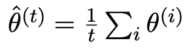
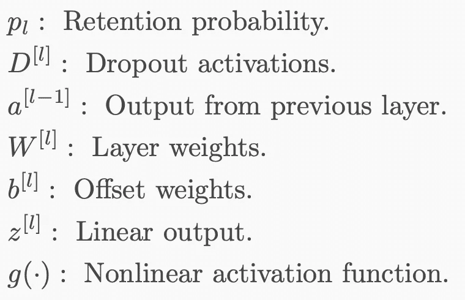

# 神经网络高级主题

> 原文：<https://towardsdatascience.com/advanced-topics-in-neural-networks-f27fbcc638ae?source=collection_archive---------5----------------------->

## 一些高级神经网络主题的介绍，如快照集、丢失、偏差校正和循环学习率。

本文将介绍神经网络中使用的一些更高级的主题，并将涵盖神经网络研究中仍在讨论的几个重要主题。

[Source](https://arxiv.org/abs/1704.00109): Train 1, get M for free.

本文将涉及的主题有:

*   **迁移学习**
*   **调整学习率**
*   **如何解决过度拟合**
*   **辍学**
*   **修剪**

您可以访问下面的前几篇文章。第一个为那些不熟悉的人提供了神经网络主题的简单介绍。第二篇文章涵盖了更多的中间主题，如激活函数、神经结构和损失函数。第三篇文章着眼于更高级的方面，如动量、自适应学习率和批量标准化。第四篇文章是关于神经网络中超参数调整的深入教程。

 [## 神经网络简介

### 神经网络的详细概述，有大量的例子和简单的图像。

towardsdatascience.com](/simple-introduction-to-neural-networks-ac1d7c3d7a2c)  [## 神经网络体系结构综合介绍

### 神经架构、激活函数、损失函数、输出单元的详细概述。

towardsdatascience.com](/comprehensive-introduction-to-neural-network-architecture-c08c6d8e5d98)  [## 神经网络优化

### 涵盖优化器，动量，自适应学习率，批量标准化，等等。

towardsdatascience.com](/neural-network-optimization-7ca72d4db3e0)  [## 神经网络中超参数调整简单指南

### 关于超参数优化的分步 Jupyter 笔记本演练。

towardsdatascience.com](/simple-guide-to-hyperparameter-tuning-in-neural-networks-3fe03dad8594) 

# **迁移学习**

想象一下，你在一家小公司工作，计算资源有限，但被要求开发一种最先进的算法来对不同植物物种的图片进行分类。对于任何试图开发利用计算机视觉(面向视觉的机器学习)的商业解决方案的公司来说，这都是一个相当普遍的问题。

在这种情况下，你(至少)有两个问题。你可以访问的数据量也可能是有限的，计算能力也是有限的。显然，用几十个 GPU 连接一个 150 层的深度神经网络，并训练一个模型几个星期来区分你目前拥有数据的最简单的 1000 种植物物种，以创建你的初创公司的最小可行产品的算法，这是不可行的。

在这种情况下，你能做些什么让生活变得轻松一点呢？

幸运的是，谷歌和微软等几家公司已经发布了针对图像识别进行优化的最先进的神经网络架构。这些公司拥有大量的资源和专业知识，所以你可以相信这些模型比你自己设计的任何内部模型都有更好的性能。

然而，有一个问题是，这些算法训练的数据可能没有(事实上，没有)在你想用算法区分的 1000 种植物物种上训练过。

但是，有一个解决办法:**转移学习**。转移学习就是将学习从一个模型转移到另一个模型，该模型检查的数据与原始模型的数据非常相似。在这种情况下，原始模型用于一般的图像识别(通常在 CIFAR 数据集上)，这非常接近我们正在尝试做的事情。然后，我们可以根据自己的数据重新训练网络的最后几层，以便针对我们的特定应用对模型进行微调。

The weights from a pre-trained model are loaded into the architecture of the new model. Weights from the output layers are trained whilst the other network layers are frozen. The resulting model will be fine-tuned for the required application.

那么这是如何工作的呢？我们首先使用 Keras 构建原始模型的架构，然后加载训练好的网络的模型权重(你需要先下载这些；它们通常以`.h5`格式出现)。

我们需要做的第二件事是通过设置图层的`trainable=False`参数来冻结初始图层的权重。这样做的原因是卷积神经网络(用于处理图像)的初始层包含关于图像的原始信息，如线条、边缘、形状和其他低级特征的解释。随着我们深入网络，对象变得更加复杂和高级，这是网络开始更清楚地区分图像质量的地方。

这里的想法是，我们不试图教网络检查图像，因为它已经被谷歌或微软训练得很好。我们只需要针对我们的用例对它进行微调。

因此，我们可以在输出端将完全连接的网络层(或其子集)设置为可训练的，也许最终的卷积层(如果我们有足够的数据)也是可训练的，然后根据我们的数据训练网络。

这一过程具有需要较少数据来训练模型的额外好处，因为网络可训练参数的数量是网络中参数总数的一小部分。

The input layers (e.g. layers 1–4) have relatively little impact on the output for transfer learning as compared with the later layers of the network (e.g. layers 6 and 7).

迁移学习只有在被分析的两个数据集非常相似时才有效。因此，迁移学习最常用于图像识别或语音识别，其中网络可以被训练用于图像的一般识别或声音或给定语言的一般识别。与从头开始训练整个网络相比，使用迁移学习训练网络所需的数据和计算时间要少得多。

请参见“**进一步阅读”**部分的开源文献文章，以更详细地研究迁移学习。

# **修剪**

模型修剪试图在深度神经网络的各种连接矩阵中引入稀疏性，从而减少模型中非零值参数的数量。

单词*‘修剪’*来自决策树中的使用，在决策树中，树的分支被修剪，作为模型正则化的一种形式。类似地，神经网络中被认为不重要或很少激活的权重可以从网络中移除，而几乎没有任何后果。事实上，大多数神经元对模型性能的影响相对较小，这意味着即使消除大量参数，我们也可以实现高精度。

随着神经架构和数据集变得越来越大，为了获得合理的模型执行时间，减少网络中的参数数量变得越来越重要。

研究论文*[*进行修剪，还是不进行修剪:探索修剪对模型压缩的功效*](https://arxiv.org/pdf/1710.01878.pdf)*研究了神经网络作为稀疏度(实际上是去除神经元的百分比)的函数的性能，并发现即使减少网络中 75%的神经元，模型性能也不会受到显著影响。事实上，参数数量减半只会降低 0.1%的精度。**

********

**修剪通常在卷积神经网络中进行，然而，由于卷积模型中的大多数参数出现在完全连接的(普通的)神经层中，大多数参数从网络的这一部分中被消除。**

**在深度神经网络中有多种执行修剪的方式。最常见的方式是**权重剪枝**。权重修剪根据权重的大小对权重进行排序，因为权重较大的参数更有可能触发，因此更有可能是重要的。**

**另一种方法是**单元修剪**，它将权重矩阵中的所有列设置为零，实际上删除了相应的输出神经元。这里，为了实现稀疏度 *k%* ，我们根据它们的 L2 范数对权重矩阵的列进行排序，并删除最小的 *k%* 。**

**第三种更先进的方法是使用 **Fischer 修剪，**依赖于 Fischer 信息。这产生了一个称为 Fischer-Rao 范数的范数，该范数可用于对参数进行排序。人们怀疑费歇尔信息和参数冗余之间存在联系，这就是为什么这种技术似乎产生良好的结果。你可以在这里阅读更多关于费歇尔修剪:**

** [## 修剪神经网络:最近的两篇论文

### 我想简要强调最近两篇关于修剪神经网络的论文(声明，其中一篇是我们的):克里斯特斯…

www.inference.vc](https://www.inference.vc/pruning-neural-networks-two-recent-papers/) 

要查看在标准 VGG16 网络上修剪的代码实现，我推荐阅读这篇优秀的文章:

 [## 修剪深度神经网络，使其快速而小巧

### 我的 PyTorch 实现[1611.06440 修剪卷积神经网络进行资源有效的推断]…

雅各布吉尔. github.io](https://jacobgil.github.io/deeplearning/pruning-deep-learning)** 

# ****调整学习率****

**正如您可能从自己的神经网络冒险经历以及其他文章和研究文献中认识到的那样，学习率是神经网络训练的一个非常重要的部分。**

**学习速率本质上决定了网络学习的“速度”,它决定了运动的步长。更高的学习速率导致更快的学习，但是收敛更困难并且通常不稳定。较小的学习速率导致较慢的学习，并且尽管收敛是可能的，但它可能仅在过多的时期之后发生，这在计算上是低效的。**

**显然，对于给定的神经架构，在这两者之间有一个最佳点——这是唯一的，并且是神经损失表面的函数。然而，由于我们正在训练网络，神经架构是动态的，并且不断变化，从而导致最佳学习速率的失真。除了这种时间依赖性之外，最佳点还具有空间依赖性，因为损失表面上的某些位置可能具有非常陡或非常浅的梯度，这使得问题更加复杂。**

**那么，我们如何选择一个能给我们带来最佳效果的学习速率呢？显然，我们可以使用一个恒定的学习速率，但是如果我们这样做，当我们达到次优的结果时，我们不能抱怨。**

**获得更好结果的唯一方法是使用动态学习速率，该速率试图利用最佳学习速率的空间和时间变化。这不是一项简单的任务，但是已经开发了几种技术来完成这项任务。**

## **神经网络的循环学习率**

**周期性学习率是不言自明的，它们本质上是振荡的——它们来回振荡。循环学习率的主要用途是避免局部极值点，尤其是尖锐的局部极小值(过拟合)。鞍点在高维度中是丰富的，收敛变得非常慢，如果不是不可能的话。因此，如果我们使用纯粹递减的学习速率，很容易陷入单一位置，尤其是在更高维度。**

**循环学习率周期性地提高学习率。这有短期的负面影响，但有助于实现长期的有益效果。\**

**降低学习速度仍然有助于减少错误。这可以通过使用阻尼循环学习率来实现，该学习率随着时间慢慢衰减到零。**

****

**Examples of cyclical learning rates**

**虽然这是一个很好的想法，但它没有告诉我们应该设置什么样的学习率方案以及这些学习率的大小。**

## **估计学习率**

**怎样才能得到一个好的学习率估计值？这看起来很复杂，但实际上并不太难。**

**首先，我们可以从一个小的学习率开始，然后在每一批中成倍地增加。同时，我们可以计算验证集的损失函数。这也适用于寻找循环学习率的界限。**

**下图显示了作为时期函数的指数增长的学习率。**

****

**Exponentially increasing learning rate across epochs.**

**同时，我们计算每个学习率的损失函数。**

****

**Loss function as a function of learning rate.**

**我们可以看到，在这两个极端之间有一个悬崖区域，在这个区域中，学习在稳定地减少和稳定地发生。这是我们希望在培训过程中确保我们留在的地区。**

## **带热重启的 SGD**

**热重启是一个非常简单的想法:在指定的次数后重启学习。例如，学习率最初从 0.1 开始，随时间呈指数下降。在 30 次迭代之后，学习率调度器将学习率重置为与时段 1 相同的值，然后学习率调度器重复相同的指数衰减。每次在重置学习率之前记录最佳估计值。**

**这个想法类似于循环学习率，除了学习率图通常看起来更像锯齿波，而不是对称和循环的。**

**需要注意的是，重新开始不是从零开始，而是从最后一次估计开始，并且学习率增加。因此，重启提供了与循环学习率相同的大部分好处，例如能够避开极端的局部极小值。**

****

**Warm restarts with cosine annealing done every 50 iterations of Cifar10 dataset.**

## ****快照集:培训 1，免费获得 M****

**快照集是一个很棒的主意，如果你感兴趣，我建议你阅读一下[的研究论文](https://arxiv.org/abs/1704.00109)。**

**集合网络比单个网络更加健壮和精确。它们构成了另一种类型的正则化技术。新颖之处在于训练单个神经网络，但获得 *M* 个不同的模型。想法是收敛到 *M* 不同的局部最优值并保存网络参数。**

****

**Left: Illustration of SGD optimization with a typical learning rate schedule. The model converges to a minimum at the end of training. Right: Illustration of Snapshot Ensembling. The model undergoes several learning rate annealing cycles, converging to and escaping from multiple local minima. [Source](https://arxiv.org/pdf/1704.00109.pdf).**

**对于那些经验丰富的数据科学家来说，您可能还记得，开发用于分类目的的集成或混合模型通常会提供优于任何单个模型的结果，尽管要确保这一点需要几个要求，例如模型之间相对较高的相关性。这在某种程度上只是该技术在神经网络上的延伸。**

**那么它是如何工作的呢？**

**在每个训练周期结束时，模型达到关于训练损失的局部最小值。因此，在提高学习率之前，我们对模型权重进行“快照”。训练完 *M* 个周期后，我们有 *M* 个模特快照， *f₁，f₂,.。。*，每一首都会用在最后的合奏中。在集合模型中，我们取所有快照的平均值，并使用它来获得我们的结果，实现具有平滑参数的神经网络，从而减少总噪声，并因此减少总误差。**

**需要强调的是， *M* 快照的总训练时间与使用标准时间表训练模型的时间相同。这意味着我们有一个简单的方法来获得神经网络的集合**，而不需要任何额外的训练成本**。**

**然而，快照集不是完美的，可以选择不同的初始化点或超参数选择，这可能收敛到不同的局部最小值。尽管这些局部最小值在平均误差方面表现相似，但它们可能不会犯同样的错误。**

**集成方法训练许多神经网络，然后通过多数投票或平均预测输出进行优化-这与平均权重并使用这些权重进行预测相反。最终集合由优化路径的快照组成。**

**下面的结果显示了用于测试神经网络模型的几个公共数据集上的快照集成的结果。**

****

**Error rates (%) on CIFAR-10 and CIFAR-100 datasets. All methods in the same group are trained for the same number of iterations. Results of the ensemble method are colored in blue, and the best result for each network/dataset pair are bolded.**

**从结果可以清楚地看出，快照集合性能优于标准模型，以及循环集合和丢弃模型。**

## **Polyak-Ruppert 平均法**

**鉴于快照集和 Polyak 平均之间的相似性，我认为最好包括这一点。Polyak 平均是解决刺激快照集使用的不稳定学习问题的另一种方法。该消息使用在训练运行接近结束时看到的多个模型的平均重量。**

****

**The motivation behind Polyak averaging — gradient descent with a large learning rate is unable to converge effectively to the global minimum.**

**假设在 *t* 迭代中，你有参数θ，θ等。然后，我们可以对这些参数进行时间平均，以获得真实参数的更平滑的估计值。**

****

**这可以通过几种不同的方式加以利用:**

*   **在接近训练运行结束的几个不同时期使用来自相同模型的权重(如上所述)。**
*   **将来自多个模型的权重用于它们各自的训练运行(整体平均而不是时间平均)。**
*   **使用来自快照的权重，然后平均这些权重用于集合预测(集合和时间平均的混合方法)。**

**Polyak 平均保证在凸环境下强收敛。然而，在非凸曲面中(通常是这种情况),参数空间在不同区域会有很大不同。在这种情况下，平均就没那么有用了。在这种情况下，通常考虑指数衰减平均值:**

****

**根据所选的α值，将额外的权重放在最新的参数值或较旧的参数值上，由此较旧参数的重要性随时间呈指数衰减。**

**希望您清楚 Polyak 平均和快照集之间的区别和相似之处。它们只是平滑明显存在于神经网络的不稳定学习过程中的随机误差的不同方式。**

**在此可以找到应用于神经网络的 Polyak 平均的一个很好的演示:**

** [## 如何在 Keras (Polyak 平均)中计算神经网络模型权重的集合

### 神经网络的训练过程是一个具有挑战性的优化过程，经常无法收敛。这可以…

machinelearningmastery.com](https://machinelearningmastery.com/polyak-neural-network-model-weight-ensemble/)** 

# ****如何解决过度拟合****

**深度神经网络中的过度拟合是如此普遍，以至于你永远无法真正相信你从一个经过训练的网络中获得的结果是最佳结果。鉴于它们的普遍存在，我们将研究一些方法来解决神经网络中的过度拟合问题。**

****估算师****

**点估计是试图对一些感兴趣的量提供单一的“最佳”预测:**

****

**从频率主义者的角度来看，θ是固定的但未知的，数据是随机的。这意味着我们的估计量是一个随机变量。每个随机变量都容易受到偏差和方差的影响。**

*   ****偏差:**预期值与真实值的偏差。**
*   ****方差:**与预期估计值的偏差。**

****

****诊断偏差-方差****

**那么我们如何在神经网络中分析这种偏差-方差权衡呢？**

**在高维空间中，我们不能绘制决策曲线来检验偏差-方差。相反，我们通过计算错误值来推断训练集和验证集的错误来源。为了确定偏差，我们需要一个基线，比如人类水平的表现。**

****

****贝叶斯错误率**是随机结果的任何分类器的最低可能错误率，类似于不可约误差。对于所有的意图和目的，贝叶斯误差是我们从一个完美的模型中剔除所有可避免的偏差和方差后所能获得的最小误差。**

**我们可以分析和比较训练集和验证集上的错误，以推断错误的原因，无论它是由于可避免的偏差还是可避免的方差(我们不太可能获得贝叶斯错误率)。**

****

**正交化是我们可以使用的另一种技术；它旨在分解过程以调整神经网络性能。它假设误差来自不同的来源，并使用系统化的方法来最小化它们。**

**Mc.ai 对这个用来调谐收音机的旋钮有一个奇妙的比喻。收音机的设计者努力确保一个特定的旋钮控制信号的一个特定方面，如音量或频率。如果没有多个参数同时变化，调谐到特定的无线电频率并获得您想要的声音会容易得多。**

**早期停止也是一种流行的正则化机制，但是耦合了偏差和方差误差。**

**减少偏差的其他更明显的方法是训练更大的模型(增加模型的可解释性)，训练更长的时间(达到收敛)，或者调整神经架构或执行广泛的超参数搜索。**

**减少方差的明显方法是获得更多的数据，使用正则化机制(早期停止是一种流行的正则化技术，它结合了偏差和方差误差)。**

****

**能够分析网络结果并确定问题是由偏差还是变化引起的，这对于排除网络故障以及提高网络性能非常有帮助。例如，如果您正在努力解决差异问题，并试图运行网络更多的纪元，这显然不会有所帮助。然而，在这种情况下，添加更多的数据或正则化是更谨慎的方法。**

# ****辍学****

**到目前为止，与我在本文中讨论的其他项目相比，你们中的大多数人可能更熟悉辍学。辍学很容易实现，但更难掌握其背后的哲学。**

**Dropout 是深度神经网络的一种正则化技术。它在训练时使用，随机消除一些单元的输出。这有助于防止网络过于依赖单个神经元，从而有助于防止过度拟合。相反，这些知识被传播到所有的神经元上，以帮助获得一个更健壮的网络。在测试时，所有的神经元都存在，并且它们的触发概率是成比例的，因为在训练时存在比以前更多的神经元。**

**丢弃可以与其他正则化技术(如 L2、批量归一化等)结合使用。).**

****

****目的:**防止特征检测器对一组神经元的共同适应，避免过拟合。**

*   **它迫使神经元在给定的总体群体行为下，独立地发展个体角色。**
*   **训练权重被鼓励分布在神经网络中，因为没有神经元是永久的。**

****解释:**训练示例提供来自不同的、随机采样的架构的梯度。**

**直接实施:**

*   **训练时:随机消除一些单位的输出。**
*   **测试时:所有单元都存在。**

****

## **反向辍学**

**对于测试时的正常退出，你必须通过退出率 *p* 来调整激活，因为你没有退出任何神经元，所以你需要在训练时匹配期望值。**

**对于反向丢失，缩放在训练时应用，但反之亦然。首先，通过丢失因子 *p，*丢失所有激活，其次，通过反向丢失因子 *1/p* 缩放它们。**

**倒辍有一个好处，就是你在测试的时候什么都不用做，这样推理起来更快。**

**由于这种更快的推断，大多数当前的实现使用反向下降:**

*   **在训练期间进行加权。**
*   **测试时不需要重新称重。**

**特别地，对于层 *l* ，**

************

**Inverted dropout — weights are scaled at training time as opposed to testing time, the opposite of traditional dropout.**

# ****初始化策略****

**神经网络的权重初始化已经在我的一些其他文章中讨论过了，但是在这里有必要简单地重申一下。**

**在具有小学习率的凸问题中，无论什么初始化，收敛都是有保证的(尽管可能很慢)。**

**然而，在非凸区域初始化更为重要。一些参数初始化可能不稳定，并且可能不收敛。神经网络没有被很好地理解为具有原则性的、数学上很好的初始化策略，因此经常使用试探法来选择一组合理的起始权重，从这些权重中训练网络。**

**对于具有 *m* 个输入和 *n* 个输出的全连接层，我们可以从以下均匀分布中进行采样，以获得我们的初始权重:**

****

**或者，流行的 **Xavier 初始化**使用以下参数进行均匀分布。**

****

**Xavier 初始化是考虑到网络由没有非线性的矩阵乘法组成而导出的，并且在实践中似乎表现良好。**

**有关权重初始化方案的完整列表，请查看 Keras 文档的初始化器部分[这里](https://keras.io/initializers/)。有一打或两个初始化器，也可以使用你自己的自定义初始化器。请参见**进一步阅读**部分的参考资料。**

# **最终意见**

**感谢您的阅读，我希望您发现这篇文章很有见地。如果你喜欢这篇文章，请留意我将来关于神经网络的文章。**

**其他与全连接神经网络相关的高级主题，我将在未来的文章中涉及，读者可能会感兴趣:**

*   **批次/层/实例/组规范化**
*   **张量处理单元**
*   **下拉连接**
*   **部分池化**
*   **随机深度**
*   **断流器**
*   **混合**
*   **明凯/MSRA 初始化**

## **时事通讯**

**关于新博客文章和额外内容的更新，请注册我的时事通讯。**

** [## 时事通讯订阅

### 丰富您的学术之旅，加入一个由科学家，研究人员和行业专业人士组成的社区，以获得…

mailchi.mp](https://mailchi.mp/6304809e49e7/matthew-stewart) 

# 进一步阅读

**神经网络重要文章**

*   [神经网络中的深度学习:概述](https://www.sciencedirect.com/science/article/pii/S0893608014002135?source=post_page---------------------------)
*   [使用神经网络的持续终身学习:综述——开放存取](https://www.sciencedirect.com/science/article/pii/S0893608019300231?source=post_page---------------------------)
*   [物理储层计算的最新进展:综述—开放存取](https://www.sciencedirect.com/science/article/pii/S0893608019300784?source=post_page---------------------------)
*   [脉冲神经网络中的深度学习](https://www.sciencedirect.com/science/article/pii/S0893608018303332?source=post_page---------------------------)
*   [集成神经网络(ENN):一种无梯度随机方法——开放存取](https://www.sciencedirect.com/science/article/pii/S0893608018303319?source=post_page---------------------------)
*   [多层前馈网络是通用逼近器](https://www.sciencedirect.com/science/article/pii/0893608089900208?source=post_page---------------------------)
*   [深度网络与 ReLU 激活函数和线性样条型方法的比较——开放访问](https://www.sciencedirect.com/science/article/pii/S0893608018303277?source=post_page---------------------------)
*   [脉冲神经元网络:第三代神经网络模型](https://www.sciencedirect.com/science/article/pii/S0893608097000117?source=post_page---------------------------)
*   [多层前馈网络的逼近能力](https://www.sciencedirect.com/science/article/pii/089360809190009T?source=post_page---------------------------)
*   [关于梯度下降学习算法中的动量项](https://www.sciencedirect.com/science/article/pii/S0893608098001166?source=post_page---------------------------)

## **修剪文章**

*   [**运行时神经修剪**](https://papers.nips.cc/paper/6813-runtime-neural-pruning.pdf) 林等，2017。
*   [**深度卷积神经网络的结构化修剪**](https://arxiv.org/abs/1512.08571)Anjar，Hwang and Sung，2015。
*   [**用于卷积神经网络的快速算法**](https://arxiv.org/pdf/1509.09308.pdf)Lavin 和 Gray，2015。
*   [**学习修剪卷积神经网络中的滤波器**](https://arxiv.org/pdf/1801.07365.pdf) 黄等，2018。
*   [**剪枝，还是不剪枝:探索模型压缩中剪枝的功效**](https://arxiv.org/pdf/1710.01878.pdf) 朱、古普塔，2017。
*   [**修剪卷积神经网络进行资源高效推理**](https://arxiv.org/abs/1611.06440) 莫尔查诺夫等人，2017。
*   [**通过 L0 正则化学习稀疏神经网络**](https://arxiv.org/abs/1712.01312) 作者Louizos 等人，2018。
*   [**使用密集网络和 Fisher 剪枝的更快凝视预测**](https://arxiv.org/abs/1801.05787)**Theis 等人，2018。**

****重量初始化****

*   **理解训练深度前馈神经网络的困难。**
*   **Saxe 等人在 2013 年提出的深度线性神经网络中学习的非线性动力学的精确解。**
*   **Sussillo 和 Abbott 2014 年为训练非常深的前馈网络进行随机行走初始化。**
*   **深入研究整流器:在 ImageNet 分类上超越人类水平的性能，何等，2015。**
*   **krhenbüHL 等人，2015 年，卷积神经网络的数据相关初始化。**
*   **你需要的只是一个好的 init，Mishkin 和 Matas，2015。**
*   **修正初始化:无归一化的残差学习，张等，2019。**
*   **彩票假说:寻找稀疏、可训练的神经网络，Frankle 和 Carbin，2019 年。****