# 如何建立一个先进的推荐引擎

> 原文：<https://towardsdatascience.com/advanced-use-cases-for-recommendation-engines-4a420b14ab4e?source=collection_archive---------4----------------------->

## 当快速简单的协同过滤已经不够好的时候该怎么办。

# 知道你的起点

重要的是要记住，你不应该从推荐引擎的高级用例开始。在快速简单地实现版本 1 之后，你的推荐引擎变得非常适合你的业务问题、产品和用户。为了构建这样一个定制的模型，您将需要来自版本 1 的反馈循环和基线来决定您的推荐引擎的改进方向。对于定制的解决方案，敏捷是成功实现这一目标的最佳方法。实际上，这意味着在您开始任何版本 2 的工作之前，您已经构建了版本 1.1、1.2 和 1.3。

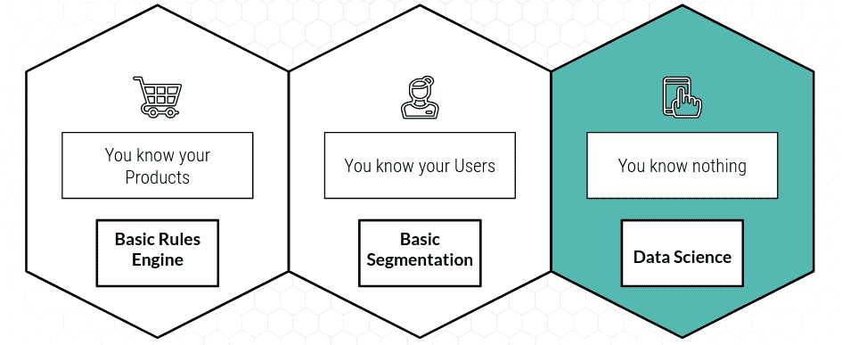

[OC]

对于第 1 版推荐引擎，根据您的起点，您有多种选择:

*   如果您了解您的产品或者您的产品有丰富的元数据，您可以首先构建一个简单的规则引擎来捕获业务逻辑。考虑到敏捷和实用的交付焦点，知道什么时候不需要机器学习是很重要的。
*   如果您碰巧也认识您的用户，那么您甚至可以使用一些基本的用户细分来个性化您的规则引擎，例如 RFM。
*   但是大多数时候你对你的用户和产品不够了解，甚至一无所知。你所拥有的只是来自用户与你的网站或产品互动的行为点击流数据。在这种情况下，您应该考虑使用协同过滤来构建您的第 1 版推荐引擎。此使用案例在中有详细说明:

[](/how-to-build-a-recommendation-engine-quick-and-simple-aec8c71a823e) [## 如何快速简单地构建推荐引擎

### 第 1 部分:简介，如何在一周内投入生产，之后去哪里

towardsdatascience.com](/how-to-build-a-recommendation-engine-quick-and-simple-aec8c71a823e) 

# 您迈向版本 2 的道路

祝贺您，在您部署了推荐引擎的第 1 版之后，是时候庆祝您的成就了！你的第一个推荐引擎已经上线了，它的表现足够好，利益相关者希望你改进它，而不是让它下线。🎉

不幸的是，对于如何从这里改进你的推荐引擎，没有什么灵丹妙药。你将慢慢地构建一个高度定制的解决方案，而现实中的成功之路看起来更像是一场火的洗礼。你将通过大量的实验和从失败中学习来交付解决方案。)，可能是迫于利益相关者、你的老板和愤怒的用户越来越大的压力。

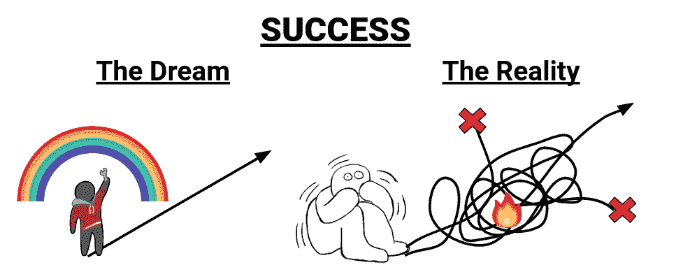

[OC]

您将在版本 1 中面临的问题:

*   新内容和用户的冷启动问题
*   偏向于点击诱饵内容:良好的响应指标，随后在漏斗中急剧下降
*   您的建议在质量和数量之间难以取舍
*   巴特 UX
*   ETL 和 elasticsearch 集群的昂贵费用

让我们看看我们在第 1 部分中实际构建了什么，以及它与更复杂的推荐系统相比如何:

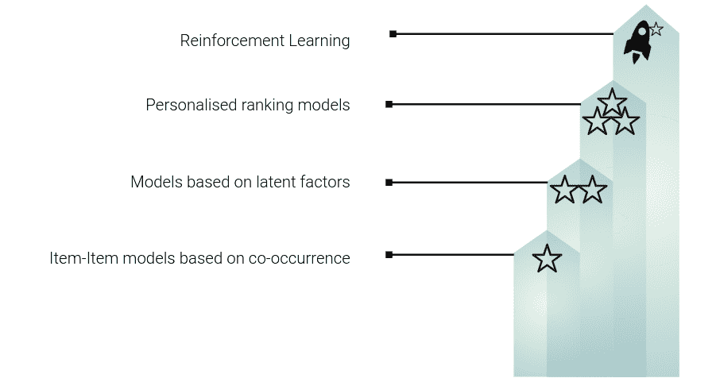

[OC]

我们从最简单的模型开始:基于项目到项目共现的推荐引擎。就如何解释分数而言，这个模型非常类似于一个分类器，我们距离个性化的项目排名还有很长的路要走。这是一个常见的误解，当将推荐整合到产品中时，假设分数反映了个性化的排名或考虑/相关性分数，这可能会损害用户体验。

# 使您的模型有状态，以获得更好的模型评分

如果你按照前面的步骤用 Elasticsearch 构建了一个快速简单的协同过滤推荐系统，那么你的第 1 版模型可能并不完美，但在某种程度上是可行的。在改变整个实现之前，尝试简单地改进当前版本的评分请求可能是值得的。

你在[第 1 部分](/how-to-build-a-recommendation-engine-quick-and-simple-aec8c71a823e)中构建的是一个**无状态模型**。无状态模型不记得也不关心之前的事件。每个用户交互和评分请求都是完全独立的。因此，无状态模型非常容易管理，例如，允许在简单的负载平衡器后面进行水平扩展。

这提供了第一个明显的改进:将一个状态合并到您的模型中。用户与网站上的一系列产品和内容进行互动。向您的模型添加一个**状态内存**允许您使用一个**交互系列**为用户查询 Elasticsearch，这扩展了匹配的可能性。一方面，您可以简单地使用它来扩展前台数据集中潜在的同现数量。另一方面，您可以在更复杂的规则中使用它来过滤相关的推荐，例如删除用户以前已经看过的推荐。

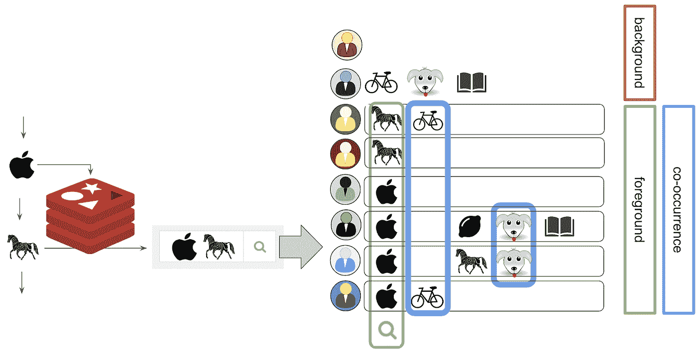

[OC]

但是，您希望避免向模型本身添加状态。理想情况下，您总是将状态管理器从模型的其余部分中分离出来。状态管理器应该是一个独立的微服务，它使用某种形式的缓存来丰富来自网站或应用程序的无状态传入请求。将状态作为独立的微服务来管理是一个很好的设计原则，也是我之前在博客中提到的 Rendezvous 架构设计的一部分(我在那篇博客中称之为模型数据丰富器):

[](/rendezvous-architecture-for-data-science-in-production-79c4d48f12b) [## 生产中数据科学的会合体系结构

### 如何构建一个前沿的数据科学平台来解决数据科学中的真正挑战:生产化。

towardsdatascience.com](/rendezvous-architecture-for-data-science-in-production-79c4d48f12b) 

Redis 是处理推荐系统状态的一个很好的解决方案。它速度快，重量轻，在任何云中都是完全托管的服务，例如 Redis 的 AWS ElasticCache。下面的代码使用一个**滑动窗口 TTL** 来存储用户交互，并自动从缓存中删除旧的交互。请随意根据您的需求进行调整:

[](https://gitlab.com/jan-teichmann/redis_user_interaction_cache) [## 简·泰希曼/ redis_user_interaction_cache

### GitLab.com

gitlab.com](https://gitlab.com/jan-teichmann/redis_user_interaction_cache) 

**这个选项的好处**:你获得了更大数量的同现信号，并且有机会过滤掉用户已经看过的推荐。这可以在不增加额外工作的情况下提高数量和质量。

**这个选项的缺点**:不要期待奇迹:你仍然只是用同样的原始数据工作。回报是递减的，你能从同样的数据中获得的附加值也是有限的。

# 添加越来越多的数据

因为你只能从相同的数据中获得如此多的额外价值，所以我们有另一个明显的方法来改进我们的推荐系统。你的用户可能会以多种不同的方式与你的网站、应用和产品互动:

*   搜索产品
*   查看产品详情
*   购买产品和退货
*   评价和分享产品
*   参与营销，使用折扣代码

你的推荐引擎的第一个版本只使用了一个用户交互，并且基于隐式反馈来最大化推荐质量的信号量。加入额外的数据是值得的，特别是为了提高推荐的质量和获取所需的业务逻辑。

最简单的选择是，按照与第一个指标完全相同的逻辑，向现有的 Elasticsearch 集群**添加一个额外的文档类型。Elasticsearch 中的文档类型类似于 RDBs 中的表。然后，对每种文档类型分别运行两个并行查询，这两个查询可以独立调整，以反映度量的质量。您可以通过调整 Elasticsearch 的 significant_terms 聚合中的“min_doc_count”设置或切换用于定义重要推荐的统计数据来实现这一点。您可以阅读[文档](https://www.elastic.co/guide/en/elasticsearch/reference/current/search-aggregations-bucket-significantterms-aggregation.html#_parameters)中的可用选项，并查看我的另一篇文章中的代码示例:**

[](/how-to-build-a-recommendation-engine-quick-and-simple-aec8c71a823e) [## 如何快速简单地构建推荐引擎

### 第 1 部分:简介，如何在一周内投入生产，之后去哪里

towardsdatascience.com](/how-to-build-a-recommendation-engine-quick-and-simple-aec8c71a823e) 

此选项的优势:易于实施，因为您只需重新利用现有的解决方案和代码，将额外的数据作为独立的文档类型接收。这为在弹性搜索推荐的基础上构建复杂的规则引擎提供了广泛的选择，以纳入所需的业务逻辑，例如，对促销的偏好。

**这个选项的缺点**:增加了弹性搜索集群的成本。

随着您向模型中添加越来越多的指标，您将会注意到，不仅您的 Elasticsearch 集群的成本失控，您的规则引擎中处理信号的时间和 CPU 资源也同样急剧增加。您的规则引擎将信号转换成最终的建议开始变得非常复杂。对规则引擎的回顾可能会得出这样的结论:您正在处理数据之间的复杂关系，对于这些用例有更好的解决方案:可能是时候考虑一个**图形数据库了！**

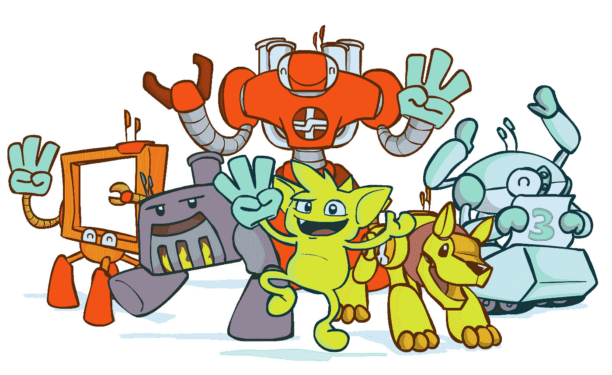

Apache Tinkerpop 3 logo. Fair usage

图形数据库是高度相关数据的完美解决方案，例如大量的关系以及复杂的关系。graph DB 将这些关系具体化为图中的边，从而大大加快了基于数据(节点)之间的关系的查询速度，而不是在每个查询中动态地解决这些关系。graph DBs 有许多供应商，给出任何建议都超出了这篇博客的范围。这可能是一篇即将发表的博文的主题。

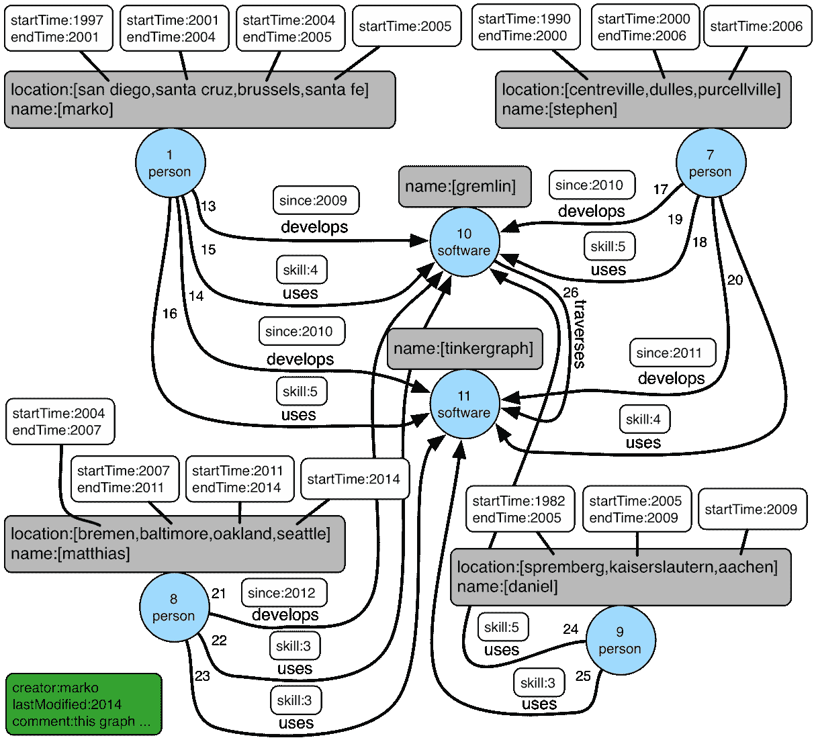

Taken from the Apache Tinkerpop documentation: [https://tinkerpop.apache.org/docs/current/tutorials/the-gremlin-console/](https://tinkerpop.apache.org/docs/current/tutorials/the-gremlin-console/) Fair usage

此选项的优势:可以快速处理复杂的关系，用复杂的业务逻辑打开复杂的用例。

这个选项的缺点是:你必须将你的推荐逻辑转换成图形查询。

# 改善您的用户定义

协同过滤建立在用户交互数据中的共现之上。如果你的企业没有一个强大的单一用户定义，那么就很难创建一个好的记录长期用户交互的历史矩阵。

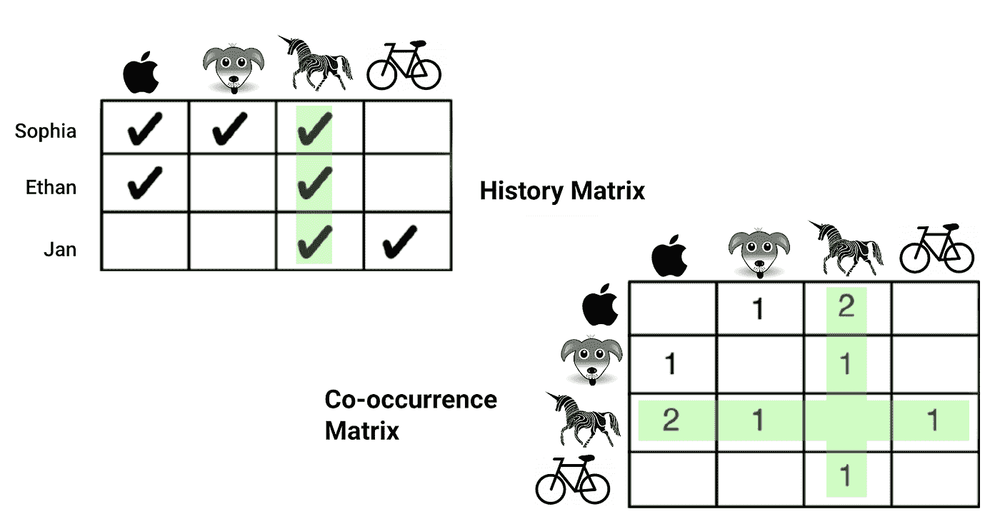

Recreation of illustration in “Practical Machine Learning, Ted Dunning & Ellen Friedman, O’Reilly 2014

结果，在根据用户交互的历史建立的同现矩阵中将有少得多的信号。

当您的用户使用多种设备，并且没有动力创建帐户或登录以使用您的服务时，可能会出现这种情况。如果你的网站上有很大比例的匿名流量，那么看看一个概率模型来识别一段时间内跨设备的单个用户是值得的。


Public domain image, [Pxhere](https://pxhere.com/en/photo/1444327)

Gartner 将跨设备识别(XDID)称为值得关注的新兴技术，数据科学可以提供帮助。识别用户的不同选项有:帐户登录、Cookie 识别、设备指纹识别和 IP 匹配。

**IP 匹配**是较低质量的概率选项，用于识别单个用户。然而，IP 是跨设备可用的。与 4G 网络或公共 Wifi 一样，动态共享 IP 也存在问题。无论如何，IP 是最可行的选择。我写了一整篇关于使用 IP 和时间戳的图表来匹配单个用户和 Spark 的 GraphX 引擎的文章:

[](/single-userid-matching-for-anonymous-users-across-devices-with-graphx-72fe111ac44b) [## 使用 GraphX 跨设备为匿名用户匹配单个用户标识

### 如何实现概率会话相似性来为跨设备和匿名用户创建单个用户 ID…

towardsdatascience.com](/single-userid-matching-for-anonymous-users-across-devices-with-graphx-72fe111ac44b) 

**这个选项的好处**:跨设备匹配单个用户可以显著提高同现信号的质量，并且具有远远超出单独推荐的用例。

**这个选项的缺点**:单用户匹配本身就是一个复杂的话题。这既是一个有趣的数据科学问题，也是一个难以解决的数据工程挑战。

# 批量计算信号

到目前为止，我们一直使用 Elasticsearch 作为后端，实时计算推荐信号。这在建议路线图的早期阶段很有价值，可以进行灵活的实验，例如在数量和质量之间进行权衡。以这种方式使用 Elasticsearch 的缺点是每个查询都有很大的 CPU 开销。如果协同过滤对您的使用情况很有效，那么最好选择一个更好的协同过滤算法，并批量计算推荐信号，而不是匆忙计算。这样，我们只将 Elasticsearch 作为向用户提供推荐的表示层。

我们可以简单地批量计算项目-项目共现信号。这可以通过 CLI 中存在的 Mahout 的 spark-itemsimilarity 实现来完成。这使得调用 Mahout 库中的 spark 程序并为其提供相关数据的路径变得非常简单。你可以在 [Mahout 网站](https://mahout.apache.org/users/algorithms/intro-cooccurrence-spark.html)上找到详细的文档。您还可以看到 Mahout 的解决方案架构与我们的相似之处。我们使用 Elasticsearch 而不是 Solr 和 Redis 作为用户交互的缓存。其余部分遵循完全相同的解决方案架构。

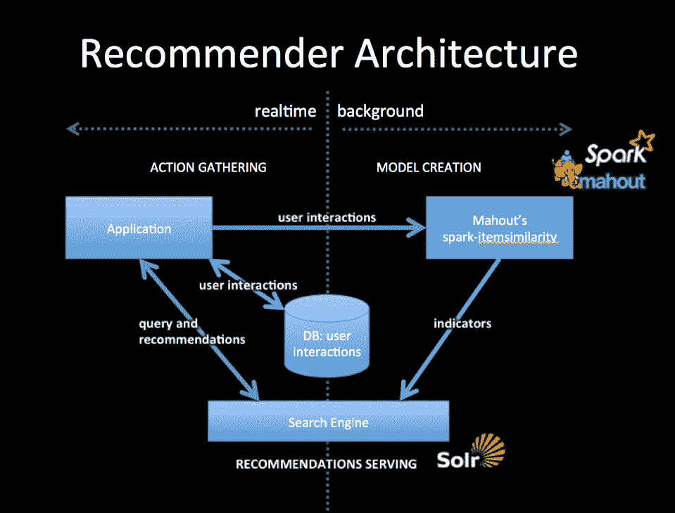

[https://mahout.apache.org/docs/latest/algorithms/recommenders/](https://mahout.apache.org/docs/latest/algorithms/recommenders/)

```
**spark-itemsimilarity Mahout 1.0****Usage: spark-itemsimilarity [options]****Input, output options**-i <value> | --input <value>Input path, may be a filename, directory name, or comma delimited list of HDFS supported URIs (required)-i2 <value> | --input2 <value>Secondary input path for cross-similarity calculation, same restrictions as "--input" (optional). Default: empty.-o <value> | --output <value>Path for output, any local or HDFS supported URI (required)**Algorithm control options:**-mppu <value> | --maxPrefs <value>Max number of preferences to consider per user (optional). Default: 500-m <value> | --maxSimilaritiesPerItem <value>Limit the number of similarities per item to this number (optional). Default: 100Note: Only the Log Likelihood Ratio (LLR) is supported as a similarity measure.**Input text file schema options:**-id <value> | --inDelim <value>Input delimiter character (optional). Default: "[,\t]"-f1 <value> | --filter1 <value>String (or regex) whose presence indicates a datum for the primary item set (optional). Default: no filter, all data is used-f2 <value> | --filter2 <value>String (or regex) whose presence indicates a datum for the secondary item set (optional). If not present no secondary dataset is collected-rc <value> | --rowIDColumn <value>Column number (0 based Int) containing the row ID string (optional). Default: 0-ic <value> | --itemIDColumn <value>Column number (0 based Int) containing the item ID string (optional). Default: 1-fc <value> | --filterColumn <value>Column number (0 based Int) containing the filter string (optional). Default: -1 for no filterUsing all defaults the input is expected of the form: "userID<tab>itemId" or "userID<tab>itemID<tab>any-text..." and all rows will be used**File discovery options:**-r | --recursiveSearched the -i path recursively for files that match --filenamePattern (optional), Default: false-fp <value> | --filenamePattern <value>Regex to match in determining input files (optional). Default: filename in the --input option or "^part-.*" if --input is a directory**Output text file schema options:**-rd <value> | --rowKeyDelim <value>Separates the rowID key from the vector values list (optional). Default: "\t"-cd <value> | --columnIdStrengthDelim <value>Separates column IDs from their values in the vector values list (optional). Default: ":"-td <value> | --elementDelim <value>Separates vector element values in the values list (optional). Default: " "-os | --omitStrengthDo not write the strength to the output files (optional), Default: false.This option is used to output indexable data for creating a search engine recommender.Default delimiters will produce output of the form: "itemID1<tab>itemID2:value2<space>itemID10:value10..."**Spark config options:**-ma <value> | --master <value>Spark Master URL (optional). Default: "local". Note that you can specify the number of cores to get a performance improvement, for example "local[4]"-sem <value> | --sparkExecutorMem <value>Max Java heap available as "executor memory" on each node (optional). Default: 4g-rs <value> | --randomSeed <value>-h | --helpprints this usage text
```

**此选项的优势**:更便宜的批量评分版本，同时仍然易于使用和操作。

这个选项的缺点:没有太多的灵活性和复杂性。这将使您的弹性搜索成本得到控制，但不会提高您的推荐的性能，如果这是您的版本 1 实施的一个问题。

# 使用潜在因素模型改进您的算法选择

在我们决定批量创建我们的推荐之后，我们将模型的训练、评分和服务分离为多个步骤。这也为我们研究更复杂的推荐算法打开了大门，而不仅仅是我们目前使用的基于共现的模型。下一步将是使用矩阵分解的基于潜在因素模型的推荐系统。

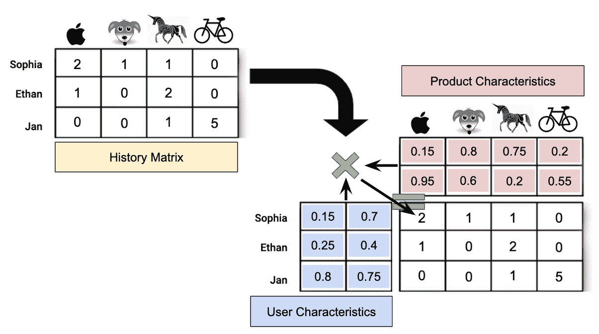

[OC]

潜在因素模型将允许我们创建(1)使用产品因素相似性的项目-项目模型和(2)项目-用户模型。

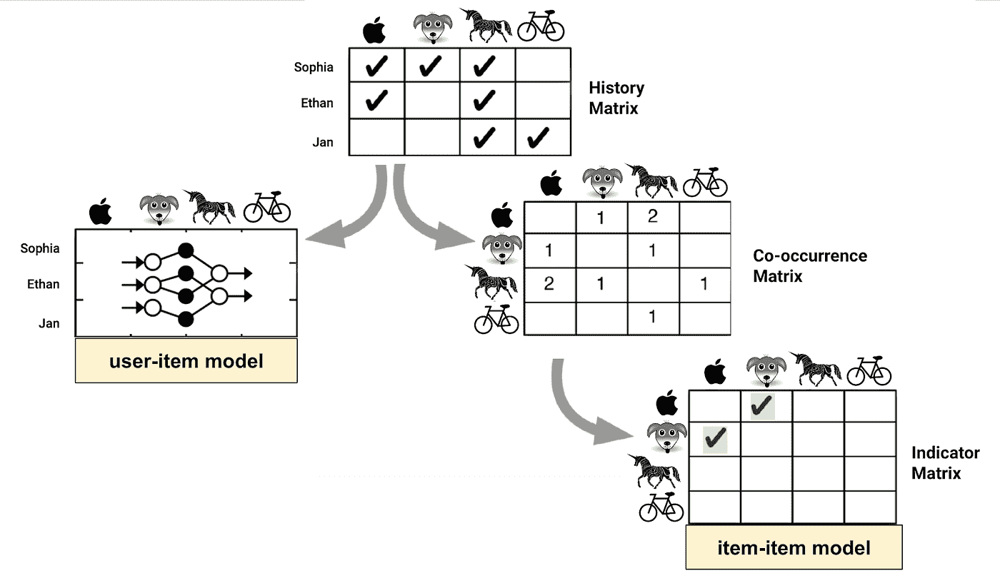

[OC]

批量潜在因素模型的一个好的解决方案是 Spark 中的 ALS(交替最小二乘法)实现，这是一种用于推荐引擎的矩阵分解技术。它被称为交替最小二乘法，因为该算法分别在改善项目和用户因子之间交替:该算法首先固定用户因子，然后对项目因子运行梯度下降。然后，它切换和固定项目因素，以改善用户因素。ALS 算法具有很强的可扩展性，可以以分布式方式并行运行，并使用 Spark ML 非常高效地处理大型数据集。

你可以在[文档](https://spark.apache.org/docs/2.2.0/ml-collaborative-filtering.html)中找到一个用 Spark ML 实现 ALS 的例子。我们仍然使用前面讨论过的相同的解决方案架构，Spark ML 提供了为用户项目模型创建建议的方法。


[OC]

但是，我们必须编写一些自定义代码来计算一个**项目-项目模型**的产品因素的相似性。计算产品之间所有对的相似性不适用于大型产品目录。不断增长的组合数量 **O(n^2)** 很快导致代价过高的洗牌操作和不可行的计算时间。Spark 提供了一个使用**位置敏感散列法** ( [LSH](https://spark.apache.org/docs/latest/ml-features#locality-sensitive-hashing) )的解决方案，这是一个更加有效的识别**近似最近邻居**的方法。LSH 使用一种特殊的**哈希函数**来降低数据的维度，同时数据越相似，哈希冲突的可能性就越大。这意味着相似的数据可能会出现在同一个存储桶中，而不会出现在具有不同数据的存储桶中。LSH 是一种概率近似值，它提供了速度和准确性之间的权衡。对于我们的项目-项目推荐模型的项目潜在因素的聚类问题，我们使用 [**随机投影**](https://en.wikipedia.org/wiki/Locality-sensitive_hashing) 作为我们的散列函数，其近似为**余弦相似度**用于我们的产品向量的分块。

以下代码是一个使用 Spark ML ALS 进行协同过滤和 LSH，根据项目相似性创建项目-项目模型的示例:

```
import pyspark.sql.functions as F
from pyspark.ml.evaluation import RegressionEvaluator
from pyspark.ml.recommendation import ALS
from pyspark.sql import Row# ALS Example from the Spark Documentationlines = spark.read.text("sample_movielens_ratings.txt").rdd
parts = lines.map(lambda row: row.value.split("::"))
ratingsRDD = parts.map(
    lambda p: Row(
        userId=int(p[0]), movieId=int(p[1]),
        rating=float(p[2]), timestamp=int(p[3])
    )
)ratings = spark.createDataFrame(ratingsRDD)
(training, test) = ratings.randomSplit([0.8, 0.2])

# Build the recommendation model using ALS on the training data
# Note we set cold start strategy to 'drop' to ensure we don't get NaN evaluation metricsals = ALS(
    maxIter=5, regParam=0.01, userCol="userId", itemCol="movieId", 
    ratingCol="rating", coldStartStrategy="drop"
)
model = als.fit(training)# Evaluate the model by computing the RMSE on the test data
predictions = model.transform(test)
evaluator = RegressionEvaluator(
    metricName="rmse", labelCol="rating", predictionCol="prediction"
)
rmse = evaluator.evaluate(predictions)
# Root-mean-square error = 1.7866152217057665**####################################################
# User-Item model predictions using latent factors #
####################################################**# Generate top 10 movie recommendations for each user
userRecs = model.recommendForAllUsers(10)
# Generate top 10 user recommendations for each movie
movieRecs = model.recommendForAllItems(10)
userRecs.show(1, False)
“””
+------+---------------------------------------------------------------------------------------------------------------------------------------------------------------------+
|userId|recommendations                                                                                                                                                      |
+------+---------------------------------------------------------------------------------------------------------------------------------------------------------------------+
|28    |[[12, 4.987671], [81, 4.968367], [92, 4.862609], [31, 4.0329857], [49, 4.024806], [2, 3.8403687], [82, 3.7117398], [62, 3.4866638], [61, 3.4003847], [24, 3.1223223]]|
+------+-------------------------------------------------------------
“””**#####################################################
# Item-Item Model based on latent factor similarity #
#####################################################**from pyspark.ml.feature import BucketedRandomProjectionLSH
from pyspark.ml.linalg import Vectors, VectorUDTvector_udf = F.udf(lambda l: Vectors.dense(l), VectorUDT())itemFactors = model.itemFactors.withColumn(
    'itemVector', vector_udf(F.col('features'))
)brp = BucketedRandomProjectionLSH(
    inputCol="itemVector", outputCol="hashes", bucketLength=2.0,
    numHashTables=3
)# Hashes of factors match with a probability proportional to their
# cosine similarity
brp_model = brp.fit(itemFactors)recommendations = (
   brp_model
    .approxSimilarityJoin(itemFactors, itemFactors, 2.0,
         distCol="dist")
    .select(
        F.col("datasetA.id").alias("idA"),
        F.col("datasetB.id").alias("idB"),
        F.col("dist")
    )
    .filter('idA != idB')
    .withColumn('recommendation', F.concat_ws('-',
        F.when(F.col('idA') < F.col('idB'),
        F.col('idA')).otherwise(F.col('idB')),
        F.when(F.col('idA') < F.col('idB'),
        F.col('idB')).otherwise(F.col('idA')))
    )
    .select('recommendation', 'dist').distinct()
    .orderBy(F.col('dist'))
)recommendations.show()
“””
+--------------+------------------+
|recommendation|              dist|
+--------------+------------------+
|         15-99|0.6752175108957209|
|         78-86| 0.766118452902565|
|         17-46|1.1002650472525193|
|         15-97|1.1036687784393326|
|         15-78|1.1089519518538236|
“””
```

完整的代码示例可在此处找到:

[](https://gitlab.com/snippets/1915919) [## Spark ALS 项目-项目相似性(1915919 美元)片段

### GitLab.com

gitlab.com](https://gitlab.com/snippets/1915919) 

**此选项的优势**:更便宜且可扩展的批处理模型，同时提供用户-项目和项目-项目模型。

**这个选项的缺点**:更复杂的模型，有更多的**超参数**来调整 ALS 和 LSH。

# 为您的数据和模型找到更多应用

迄今为止，你的模型产生了一些建议，但这不一定是使用你的行为数据和潜在因素模型的唯一方式。你的公司可能有一个客户关系管理或营销团队，他们会喜欢一些**细分**作为他们的目标。行为数据可以成为产品和用户细分的真正资产。

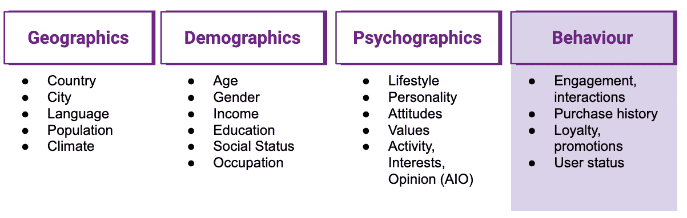

[OC]

你可以在我之前关于这个主题的文章中读到关于使用你当前推荐引擎的数据和算法进行细分的内容:

[](/data-science-powered-segmentation-models-ae89f9bd405f) [## 人工智能符合营销细分模型

### 新的黄金标准:使用机器学习从行为数据中获得用户和产品分类，为一个…

towardsdatascience.com](/data-science-powered-segmentation-models-ae89f9bd405f) 

这个选择的好处:你让更多的利益相关者参与进来，并且用你的模式创造更大的商业影响。这降低了企业搁置项目的可能性。

**这个选项的缺点**:你有更多的涉众参与到他们独特的需求和不断增长的改进压力中。数据科学团队需要能够随着需求的增长而扩展。

# 取代协同过滤作为您的算法

协同过滤一直是一个强大的推荐算法，因为我们不需要了解我们的产品或用户。一方面，我们仅基于显式或隐式反馈来学习推荐。但另一方面，每个推荐都与特定的产品或用户相关联。这有一些缺点:

*   **冷启动**:任何新产品或新用户都需要反馈，我们才能开始推荐。
*   所有项目完全**独立**。红苹果和绿苹果在协同过滤中不共享任何反馈或共现信号，即使它们在产品空间中概念上相似。
*   当产品从目录中删除时，我们也**失去了针对该产品的所有信号**和指标。

为了克服这些问题，我们必须将我们的建议的信号和指标与能够比产品或用户本身寿命更长的功能联系起来，并在更广泛的类似产品和用户中推广。我们需要积累关于我们产品和用户的功能和知识:


[OC]

构建描述产品的特性通常比描述用户更容易:

*   使用计算机视觉对产品图像进行指纹识别
*   使用 NLP 主题建模、单词和文档向量嵌入产品描述
*   地理位置产品的地理区域嵌入(活动、门票、物业列表)
*   产品元数据，如价格、尺寸、重量、类别、关键词、季节、房产列表的卧室数量等。

我之前发表了一篇博文，讲述了使用搜索嵌入创建地理区域嵌入的一个很好的例子:

[](/location-location-location-ec2cc8a223b1) [## 位置位置位置

### Zoopla.co.uk 大学使用机器学习(Skip-Gram)和一点黑魔法进行地理区域嵌入。

towardsdatascience.com](/location-location-location-ec2cc8a223b1) 

在我们创建了广泛的特征来描述产品和潜在用户之后，我们可以使用神经网络来学习我们基于协同过滤的推荐和我们的新产品特征之间的信号。

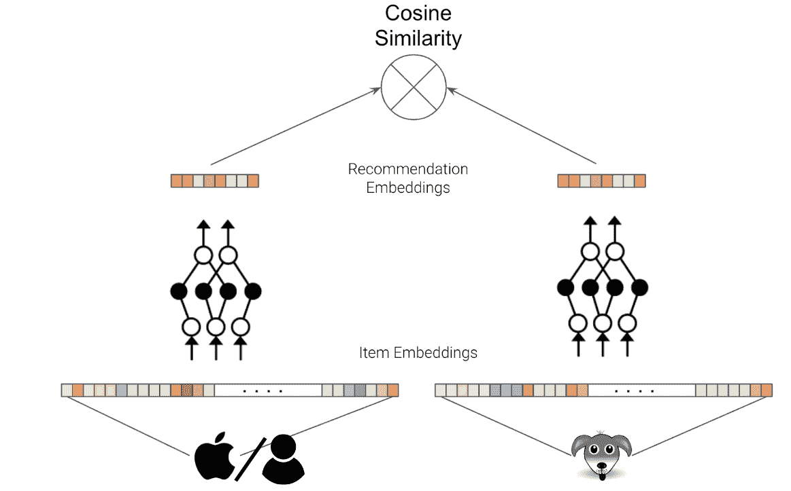

[OC]

我们使用**连体神经网络**来学习产品或用户特征从**项目嵌入空间**到**推荐嵌入空间**的映射。项目或用户的推荐嵌入具有比 NN 输入低得多的维度，并且具有通过推荐嵌入空间中的余弦相似性来测量的相似的期望行为。连体神经网络的特点是两个网络的权重相同，并且两个神经网络的梯度下降耦合在一起。在实践中，这是通过使用单个神经网络并依次对两个输入进行评分来实现的:

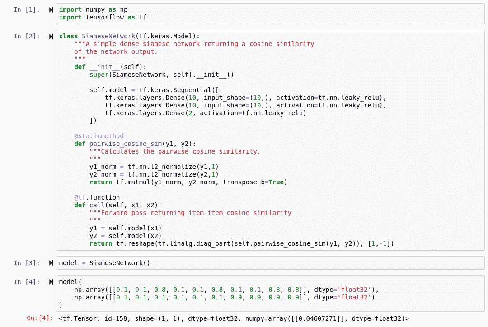

[OC]

我们使用余弦相似性作为我们的连体神经网络模型的输出:

```
[@staticmethod](http://twitter.com/staticmethod)
def pairwise_cosine_sim(y1, y2):
    """Calculates the pairwise cosine similarity.
    """
    y1_norm = tf.nn.l2_normalize(y1,1)        
    y2_norm = tf.nn.l2_normalize(y2,1)
    return tf.matmul(y1_norm, y2_norm, transpose_b=True)
```

除此之外，我们的神经网络和其他任何神经网络都没有太大区别。为了训练我们的暹罗神经网络，我们需要定义一个损失函数:**对比损失**优化一对输入之间的绝对余弦相似性，以最大化正对的余弦相似性，但最小化负对的相似性。

```
def contrastive_loss(cos_similarity, label, margin=1.0):
    """Contrastive loss function
    """
    distance = 1.0 - cos_similarity
    similarity = label * distance                                           
    dissimilarity = (1 - label) * tf.square(tf.maximum((margin - distance), 0))
    return 0.5 * tf.reduce_mean(dissimilarity + similarity)
```

裕度(在 0 和 2 之间)可以用作训练应该在多大程度上集中于改善配对的相似性而不是相异度的权重。

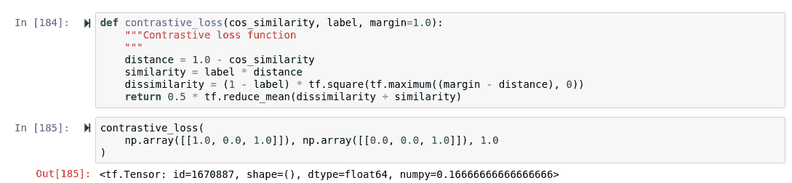

[OC]

我们还需要用于训练的标记数据。我们可以从版本 1 中使用的 Elasticsearch 集群中获取标签。前景中满足我们质量要求的项目是正对，而其他项目可以充当负对。

连体神经网络的训练循环非常简单:

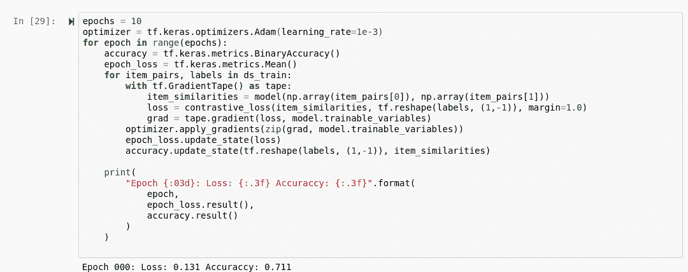

```
epochs = 10
optimizer = tf.keras.optimizers.Adam(learning_rate=1e-3)
for epoch in range(epochs):
    accuracy = tf.keras.metrics.BinaryAccuracy()
    epoch_loss = tf.keras.metrics.Mean()
    for item_pairs, labels in ds_train:
        with tf.GradientTape() as tape:
            item_similarities = model(np.array(item_pairs[0]), np.array(item_pairs[1]))
            loss = contrastive_loss(item_similarities, tf.reshape(labels, (1,-1)), margin=1.0)
            grad = tape.gradient(loss, model.trainable_variables)
        optimizer.apply_gradients(zip(grad, model.trainable_variables))
        epoch_loss.update_state(loss)
        accuracy.update_state(tf.reshape(labels, (1,-1)), item_similarities)

    print(
        "Epoch {:03d}: Loss: {:.3f} Accuraccy: {:.3f}".format(
            epoch,
            epoch_loss.result(),
            accuracy.result()
        )    
    )
```

最终图显示了来自 Spark 示例电影镜头数据集的相似电影的训练 2D 推荐嵌入空间:

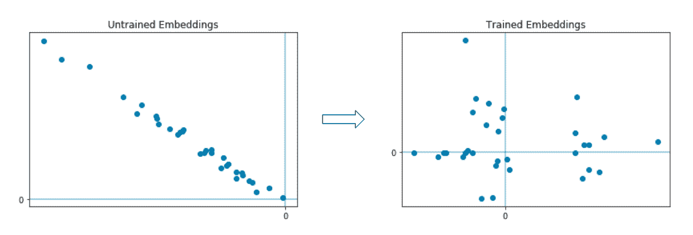

[OC]

此选项的优点:不再有冷启动问题！

这个选项的缺点:你需要广泛的有用的项目嵌入作为你的连体神经网络的输入。定义训练标签需要实验:对于您的业务问题，什么定义了一个好的正面或负面项目对？对比损失函数易于实现，但是正负项目对的不平衡可能需要切换到更复杂的损失函数，例如[三重损失](https://gombru.github.io/2019/04/03/ranking_loss/)。


Jan 是公司数据转型方面的成功思想领袖和顾问，拥有将数据科学大规模应用于商业生产的记录。他最近被 dataIQ 评为英国 100 位最具影响力的数据和分析从业者之一。

**在 LinkedIn 上连接:**[**https://www.linkedin.com/in/janteichmann/**](https://www.linkedin.com/in/janteichmann/)

**阅读其他文章:**[**【https://medium.com/@jan.teichmann】**](https://medium.com/@jan.teichmann)