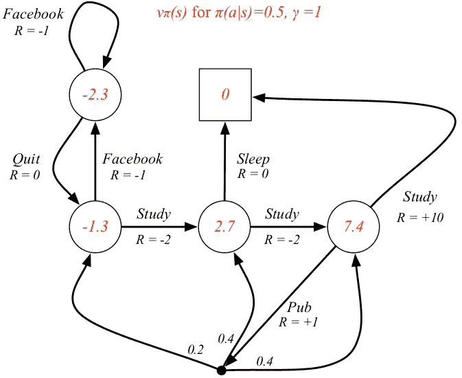

# 无监督数据增强的半监督学习研究进展

> 原文：<https://towardsdatascience.com/advancements-in-semi-supervised-learning-with-unsupervised-data-augmentation-fc1fc0be3182?source=collection_archive---------8----------------------->

Photo by [@bhoogenboom](https://unsplash.com/@bhoogenboom)

## 为什么对人工智能领域很重要？

在这篇文章中，我试图了解半监督学习(SSL)和无监督数据增强(UDA)的进展。首先通过不同的众所周知的机器学习技术。其次，通过阅读最近的一篇博文，以及一篇关于 Google AI 和 UDA 在 SSL 上的文章。

*作为一名作家，我解释谷歌大脑成员的文章和谷歌人工智能的博客帖子，可能看起来像一个少年在评论一个职业运动队。如果你和我都是这种情况，我深表歉意，并恳请你的反馈。对我来说，写作是一个学习的过程。*

从昨天开始，我表达了花三天时间试图理解三个问题的愿望。

[第一天:谷歌如何成为人工智能领域的领跑者？](/google-ai-and-developments-in-semi-supervised-learning-5b1a4ad29d67?source=friends_link&sk=ddc7b1d106980109b8699b187ee39191)(完成)

**第二天:无监督数据增强(UDA)的半监督学习(SSL)取得了哪些进展，为什么它对人工智能领域很重要？**

第三天:SSL 中静悄悄的革命是如何改变行业的？

***今天是第二天，我将重点介绍 UDA 在 SSL 方面取得的进步，但首先我将开始解释机器学习中的三种主要技术。如果你对这个题目有所了解，你可以跳过第一部分，直接进入第二部分。***

# 什么是无监督学习，监督学习，强化学习？

为了理解“半监督”,让我们首先简要地看一下*非监督学习、监督学习*和*强化学习*。请注意，这里的大部分信息是从*维基百科*和其他一些地方编辑的版本，大部分是在*媒体上研究数据科学*的同行作者。这段文字只是为了给术语一个表面的理解。

## 无监督学习

无监督学习是一种有组织的 Hebbian 学习，有助于在没有预先存在的标签的情况下，在数据集中找到以前未知的模式。它也被称为自组织，允许模拟给定输入的概率密度。

如果这确实是一种希伯来人的学习，那意味着什么？

**Hebbian 学习**是最古老的学习算法之一，在很大程度上基于生物系统的*动力学*。当突触两侧的神经元(输入和输出)具有高度相关的输出时，两个神经元之间的突触得到加强。如果你想阅读更多，我建议你看一看 [*什么是赫比安学*](https://medium.com/datadriveninvestor/what-is-hebbian-learning-3a027e8e4bbb) 由 [Prafful Mishra](https://medium.com/u/93de67a60a44?source=post_page-----fc1fc0be3182--------------------------------) 撰写的关于这个话题的文章。

**Hebbian 理论**是一种神经科学理论，声称突触效能的增加源于突触前细胞对突触后细胞的重复和持续刺激。它试图解释突触可塑性，即学习过程中大脑神经元的适应。此外，如果你愿意，你还可以观看有关赫布三大假设的视频:

Thank you to [Veer](https://medium.com/u/620e6a6316d8?source=post_page-----fc1fc0be3182--------------------------------) for sharing this video in the article [Hybrid Model for Unsupervised Learning](https://medium.com/responsiblemachines/hybrid-model-for-unsupervised-learning-61b80d97482d).

这个理论是由唐纳德·赫布在他 1949 年的著作《行为的组织》中提出的。这本书是人工神经网络(ANN)发展的基础的一部分。

在心理学中，它是关于哺乳动物大脑中神经元连接如何加强的*假设；这也是一种在人工神经网络中选择权重的技术*。算法可以更新现代人工神经网络中神经连接的权重。通过改变神经权重和关联，工程师可以从人工神经网络中获得不同的结果。

在赫比学习的[风味中:(1) **无监督**，权重通过对刺激的*实际*反应来加强，(2) **有监督**，权重通过*期望*反应来加强。无监督的 Hebbian 学习(联想)具有权重变得任意大的问题，并且没有减少权重的机制。](https://www.slideshare.net/mentelibre/hebbian-learning)

退一步讲**无监督学习**是机器学习的三个主要类别之一，包括监督学习和强化学习。

无监督学习中使用的两种主要方法是:

1.  主分量
2.  聚类分析

**主成分分析** ( **PCA** )是一种统计程序，它使用正交变换将一组可能相关的变量(每个变量取不同数值的实体)的观察值转换为一组线性不相关的变量值，称为**主成分。**

PCA of a [multivariate Gaussian distribution](https://en.wikipedia.org/wiki/Multivariate_Gaussian_distribution) centered at (1,3) with a standard deviation of 3 in roughly the (0.866, 0.5) direction and of 1 in the orthogonal direction. The vectors shown are the [eigenvectors](https://en.wikipedia.org/wiki/Eigenvalues_and_eigenvectors) of the [covariance matrix](https://en.wikipedia.org/wiki/Covariance_matrix) scaled by the square root of the corresponding eigenvalue, and shifted so their tails are at the mean.

**聚类分析**用于无监督学习，对具有共享属性的数据集进行分组或分段，以推断算法关系。聚类分析是机器学习的一个分支，它将尚未标记、分类或归类的数据分组。该分析识别数据中的**共性，并基于每个新数据段中此类共性的*存在或不存在做出反应。这种方法有助于检测不属于任何一组的异常数据点。***

The result of a cluster analysis shown as the colouring of the squares into three clusters.

*“聚类”的概念无法精确定义，这也是为什么有这么多聚类算法的原因之一。*

无监督学习的一个主要应用是在**密度估计**领域。

Demonstration of density estimation using [kernel smoothing](https://en.wikipedia.org/wiki/Kernel_smoothing): The true density is mixture of two Gaussians centered around 0 and 3, shown with solid blue curve. In each frame, 100 samples are generated from the distribution, shown in red. Centered on each sample, a Gaussian kernel is drawn in gray. Averaging the Gaussians yields the density estimate shown in the dashed black curve.

密度估计的一个非常自然的用途是在 ***非正式调查中对一组给定的数据*** 的性质。密度估计可以给出诸如数据中的*偏斜度*和*多模态*等特征的有价值的指示。在某些情况下，他们会得出可能被认为是不言而喻正确的结论，而在其他情况下，他们所做的只是为进一步的分析和/或数据收集指明道路。

**(1)偏度**概率论与统计学中，偏度是一个实值随机变量的概率分布关于其均值的不对称性的度量。**偏斜度**值可以是正的或负的，也可以是未定义的。许多模型假设正态分布；即数据关于平均值对称。正态分布的偏斜度为零。但实际上，数据点可能不是完全对称的。因此，对数据集偏斜度的理解表明偏离平均值的偏差是正还是负。

法国数学家 benot Mandelbrot 或许可以解读对偏斜度的一个批评。他认为，现代金融和投资理论主体对正态分布的广泛依赖是任何相关模型的一个严重缺陷。他在一本书中解释了他的观点和替代金融理论:*《市场的(错误)行为:风险、破产和回报的分形观》(发表于* 2004)。我们当然可以问，这种批评是否可以扩展到人工智能领域的某些部分或某些机器学习技术。

**(2)多模态**在其最基本的意义上是一种交流和社会符号学理论。多模态从文本、听觉、语言、空间和视觉资源——或模式——的角度描述了用于撰写信息的沟通实践。

> 对于人工智能领域，多模态可能意味着使用机器学习技术一起解释不同的信号，如文本和图片。

科学出版商 IGI 全球对什么叫做 [*进行了概述。什么是多模态？*](http://-IGI Global)

> 模态，或者更明确地说，信息表示的模态，是在某种媒体中表示信息的一种方式[……]**多模态**允许同时综合使用各种形式的交互[……]多种类型的媒体数据，或者数据项的多个方面。它强调的是存在不止一种类型(方面)的数据。例如，一段数字广播新闻视频有多种形式，包括音频、视频帧、隐藏字幕(文本)等。

在统计学中**多模态分布**是具有两个或更多模态的连续概率分布。要获得更全面的解释，请查看 [Purvanshi Mehta](https://medium.com/u/dd804fb2ae16?source=post_page-----fc1fc0be3182--------------------------------) 的文章 [*多模态深度学习*](/multimodal-deep-learning-ce7d1d994f4) 。

A bivariate, multimodal distribution

[Vishal Maini](https://medium.com/u/19a4c39d50a8?source=post_page-----fc1fc0be3182--------------------------------) 在他关于无监督学习的[文章](https://medium.com/machine-learning-for-humans/unsupervised-learning-f45587588294)中解释了无监督学习在*人类机器学习*中的效用(你可以阅读这篇文章以深入了解):

> **无监督学习**经常被**用来**对数据进行预处理。通常，这意味着在将它输入到深度神经网络或另一个受监督的**学习**算法之前，以某种保留意义的方式压缩它，如 PCA 或 SVD。

当然，关于无监督学习的话题还有很多要说的，但是我们将继续讨论有监督学习。

## 监督学习

在**监督学习**中，一个最佳方案将允许算法正确地为看不见的实例确定类别标签。

两个重要的方面一般说是分类和回归。

**分类**是识别一个新观察值属于哪一组类别(子群体)的问题。

Drawing from [Manish Thapliyal](https://medium.com/u/bc29b375dadf?source=post_page-----fc1fc0be3182--------------------------------) article Machine Learning Basics Supervised Learning Theory Part-1

**回归分析**是一组用于估计变量间关系的统计过程。

Picture from Dataaspirant’s article from 2014 on the [difference between classification and regression in machine learning](https://dataaspirant.com/2014/09/27/classification-and-prediction/).

根据 Stuart J. Russell、Peter Norvig (2010)在*人工智能:现代方法:* **监督学习**中的说法，监督学习是学习一个函数的机器学习任务，该函数基于示例输入-输出对将输入映射到输出。

1.  从带有训练示例的带标签的训练数据中获取函数。
2.  每个例子都是一对(输入-输出)输入对象和输出值。
3.  监督学习算法分析训练数据并产生推断函数。
4.  推断的函数可用于映射新的示例。

*还有比这些更经常传播或共享的步骤。*

最佳方案将允许算法正确地确定不可见实例的类别标签。这需要学习算法以一种“合理”的方式从训练数据归纳到看不见的情况。

可能会有一个**归纳偏差**:学习者用来预测输出的一组假设，给定它没有遇到的输入。尽管大多数学习算法都有一个静态偏差，但一些算法被设计为在获取更多数据时改变其偏差。这并不能避免偏差，因为偏差转换过程本身必然存在偏差。偏见？

一些挑战可能是:

*   偏差和方差权衡。几个不同但同样好的训练数据集。你应该让它灵活地适应数据吗？如果它太灵活，它可能不同地适合每个训练数据集。
*   **功能复杂度和训练数据量**。具有高偏差和低方差的简单“不灵活”学习算法能够从少量数据中学习。高度复杂的函数将只能从非常大量的训练数据中学习，并使用具有低偏差和高方差的“灵活”学习算法。
*   **输入空间的维度**。高维空间(100 或 1000)。空间的体积增加太多，数据变得稀疏。例如，计算优化问题中的每个值的组合。如果你想要一个神秘的倾斜，这一点可以被称为[维度诅咒](https://en.m.wikipedia.org/wiki/Curse_of_dimensionality)。
*   **输出值中的噪声**。如果期望的输出值经常不正确(由于人为错误或传感器错误)，那么学习算法不应该试图找到与训练示例完全匹配的函数。可以通过提前停止和*异常检测*来减轻噪声(参见无监督学习)。
*   **数据的异质性**。与同质性(相似性)相对的在特征或内容上多样的输入。
*   **数据中的冗余**。对重复几次的信息给予更大的权重。这可能意味着在一个数据库中有两个不同的字段，或者在多个软件环境或平台中有两个不同的位置。积极的数据冗余可以保护数据并提高一致性
*   **存在相互作用和非线性**。线性函数和距离函数*与*决策树或神经网络的问题。如果每个特征对输出都有独立的贡献，那么第一个可能是(线性/距离)如果特征之间有复杂的相互作用，那么第二个(决策/神经)可能是解决方案。

此外，还有一个普遍的对立问题，即**过拟合或欠拟合**。

The green line represents an overfitted model and the black line represents a regularised model. While the green line best follows the training data, it is too dependent on that data and it is likely to have a higher error rate on new unseen data, compared to the black line.

**统计学中的过度拟合**是指“产生的分析过于紧密或精确地对应于一组特定的数据，因此可能无法拟合额外的数据或可靠地预测未来的观察结果”。

当统计模型不能充分捕捉数据的底层结构时，就会出现欠拟合。**欠拟合模型**是指在正确指定的模型中会出现的一些参数或术语缺失的模型。

**什么是好的契合？**我们可以从一个更有争议的哲学角度来看这个问题。一个社会科学家、政治家和工程师很可能不同意什么是合适的。归根结底，这是关于模型性能的。人、机器等的性能。做一件工作或一项活动。在算法的制作中，当然会涉及到不同的目标。

[威尔·科尔森](https://medium.com/u/e2f299e30cb9?source=post_page-----fc1fc0be3182--------------------------------)写了一篇名为[过度适应与不适应:一个完整的例子](/overfitting-vs-underfitting-a-complete-example-d05dd7e19765)的文章，我推荐你去看看，但是我想在这里提一下这篇文章中的一句话:

> 为了讨论欠拟合和过拟合，我们需要从基础开始:什么是模型？模型只是一个将输入映射到输出的系统。

没有算法可以解决所有问题。在这种情况下，提到搞笑而严肃的**没有免费的午餐定理**总是很有趣的。在优化和计算复杂性中，这是一个结果，表明对于某些类型的数学问题，找到一个解决方案的计算成本*(计算模型使用的资源)*，平均到类中的所有问题，对于任何解决方法都是相同的。从这个意义上说，没有捷径可走。

Cartoon by [xkcd](https://xkcd.com/2173/)

然而，Wolpert 和 Macready 已经证明，在共同进化优化中有免费的午餐。这让我们优雅地进入下一部分。

## 强化学习

强化学习是与监督学习和非监督学习并列的三种基本机器学习范式之一。为什么会这样呢？

它与监督学习的不同之处在于，不需要呈现标记的输入/输出对，并且不需要明确地校正次优动作。相反，重点是在探索(未知领域)和开发(现有知识)之间找到平衡。

**强化学习** ( **RL** )是机器学习的一个领域，它关注的是软件代理应该如何在一个环境中采取行动，以便最大化一些累积回报的概念。

***软件代理*** *:以代理关系为用户或其他程序服务的计算机程序。*

我又参考了 [Vishal Maini](https://medium.com/u/19a4c39d50a8?source=post_page-----fc1fc0be3182--------------------------------) 的一篇文章，这次是关于 [*强化学习*](https://medium.com/machine-learning-for-humans/reinforcement-learning-6eacf258b265) *，*他分享了这个模型:

The agent **observes** the environment, takes an **action** to interact with the environment, and receives positive or negative **reward.** Diagram from Berkeley’s [CS 294: Deep Reinforcement Learning](http://rll.berkeley.edu/deeprlcourse-fa15/) by John Schulman & Pieter Abbeel

然而，该模型也可以以这种方式表示:

The typical framing of a Reinforcement Learning (RL) scenario: an agent takes actions in an environment, which is interpreted into a reward and a representation of the state, which are fed back into the agent.

**马尔科夫决策过程(MDP)** 通常是基本的强化学习经常是如何呈现的另一位作者为*走向数据科学* [Mohammad Ashraf](https://medium.com/u/ac9f58af4e89?source=post_page-----fc1fc0be3182--------------------------------) 在其文章[强化学习去神秘化:马尔科夫决策过程(第一部分)](/reinforcement-learning-demystified-markov-decision-processes-part-1-bf00dda41690)中呈现了这个模型:

默罕默德在他的文章中很好地介绍了 MDP，我将引用他文章中我认为有用的几行:

> 马尔可夫属性声明，“给定现在，未来独立于过去。”一旦知道了当前状态，到目前为止遇到的信息的历史可能会被丢弃，并且该状态是一个足够的统计量，它给了我们对未来的相同描述，就好像我们有所有的历史一样[……]一个*马尔可夫回报过程*或者 MRP 是一个*马尔可夫*过程，具有价值判断，表明通过我们采样的某个特定序列[……]马尔可夫决策过程累积了多少回报。**MDP 是一个有决策的*马尔可夫奖励过程*，它是一个所有状态都*马尔可夫*的环境。**

**他贴出的一个有趣的例子说明了学生马尔可夫决策过程(MDP)。去学习，去睡觉，去酒吧，去 facebook，去辞职——不好回答？这显然是英属 MDP。**

****

**State-value function in student MDP taken from [David Silverman’s lecture at UCL](http://www0.cs.ucl.ac.uk/staff/d.silver/web/Teaching_files/MDP.pdf).**

**如果你是一个喜欢看视频的视觉学习者，你可能想看看这篇关于 Arxiv Insights 的强化学习介绍。**

**我在这里分享一个他在 6:35 展示的模型:**

****

**通过反复试验，有一个以最大化长期回报为目标的尝试性任务，代理人在缺乏训练数据的情况下从经验中学习。**

**前面提到的环境通常被描述为 MDP。这种情况下的许多强化学习算法利用动态编程[动态编程](https://en.wikipedia.org/wiki/Dynamic_programming)技术。**

****动态编程**指的是通过以递归的方式将复杂的问题分解成更简单的子问题，从而将其简化。如果子问题可以递归地嵌套在更大的问题中，使得动态规划方法是适用的，那么在更大的问题的值和子问题的值之间存在关系。**

**当一个事物根据它自身或它的类型被定义时，递归就发生了。递归有时在计算机科学、编程、哲学或数学教科书中被幽默地使用，通常是通过给出一个循环定义或自我引用，其中假定的递归步骤不会更接近基本情况，而是导致无限的回归。这类书的词汇表中包含一个笑话条目是很常见的，比如:递归，*参见递归*。**

****

**强化学习是由于它在许多其他学科中的通用性，包括:博弈论、控制理论、运筹学、信息论、基于模拟的优化、多代理系统、群体智能、统计学和遗传算法。**

**这些不同的机器学习任务:无监督学习、监督学习和强化学习是不同的，但又是互补的。如果你想了解更多，我推荐你阅读 [Vishal Maini](https://medium.com/u/19a4c39d50a8?source=post_page-----fc1fc0be3182--------------------------------) 在他的*人类机器学习*系列中的文章。**

## **半监督学习**

**半监督学习也被描述过，它是监督和非监督技术的混合。**

****半监督学习**是一类机器学习任务和技术，也利用未标记数据进行训练——通常是少量标记数据和大量未标记数据。半监督学习介于无监督学习(没有任何标记的训练数据)和监督学习(有完全标记的训练数据)之间。**

****半结构化**数据是结构化数据的一种形式，它不遵循与关系数据库或其他形式的数据表相关联的数据模型的正式结构，但仍然包含标签或其他标记来分隔语义元素并加强数据内记录和字段的层次结构。**

**当您没有足够的标记数据来生成准确的模型，并且您没有能力或资源来获取更多数据时，您可以使用半监督技术来增加训练数据的大小。**

****出于这个原因，半监督学习对于网页分类、语音识别甚至基因测序等用例来说都是双赢的。在所有这些情况下，数据科学家可以访问大量未标记的数据，但实际上为所有数据分配监管信息的过程将是一项无法完成的任务。****

**半监督分类:标记数据用于帮助识别数据中存在的特定网页类型组以及它们可能是什么。然后，该算法在未标记的数据上进行训练，以定义这些网页类型的边界，甚至可以识别现有人类输入的标签中未指定的新网页类型。**

## **无监督数据扩充**

**7 月 10 日在谷歌人工智能
**【无监督数据增强(UDA)】**的[最近博客文章中提出的方法，采用了高度有针对性的数据增强来产生多样和现实的扰动，并且
强制模型相对于这些扰动保持平滑。](https://ai.googleblog.com/2019/07/advancing-semi-supervised-learning-with.html?m=1)**

*   **使用增强的相似文本或图像的生成示例。用其他相关的例子来充实图片。**
*   **他们还提出了一种称为 TSA 的技术，可以有效地防止 UDA 在有更多未标记数据可用时过度拟合监督数据。**
*   **对于文本，UDA 与表示学习结合得很好，例如 BERT，

    并且在低数据区非常有效，其中在 IMDb 上仅用 20 个例子就实现了最先进的性能。对于视觉，UDA 在大量基准测试的

    半监督学习设置中减少了超过 30%的错误率。**
*   **最后，UDA 可以有效地利用域外未标记数据

    ，并在有大量监督数据的 ImageNet 上实现改进的性能。在博客中，他们说:**

> ****我们的结果支持最近半监督学习的复兴，表明:(1) SSL 可以匹配甚至优于使用数量级更多标记数据的纯监督学习，(2) SSL 在文本和视觉两个领域都工作得很好，以及(3) SSL 与迁移学习结合得很好，例如，当从 BERT 进行微调时。****

**他们展示了两张图片来说明他们的模型:**

****

**An overview of Unsupervised Data Augmentation (UDA). Left: Standard supervised loss is computed when labeled data is available. Right: With unlabeled data, a consistency loss is computed between an example and its augmented version**

****

**Example augmentation operations for text-based (top) or image-based (bottom) training data.**

**明天写完更多内容后，我将重温这最后一节。**

**Arxiv 的在线预印本中有更多内容可供阅读。**

**这对工业有什么影响？**

**明天让我检查一下。**

**这是#500daysofAI 的第 40 天。**

**希望你喜欢这篇文章，如果有机会记得给我反馈。**

> **什么是#500daysofAI？我正在挑战自己，用#500daysofAI 来写下并思考未来 500 天的人工智能话题。一起学习是最大的快乐，所以如果你觉得一篇文章引起了共鸣，请给我反馈。**