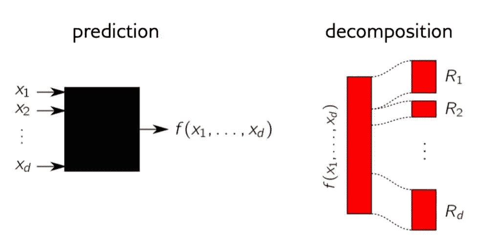
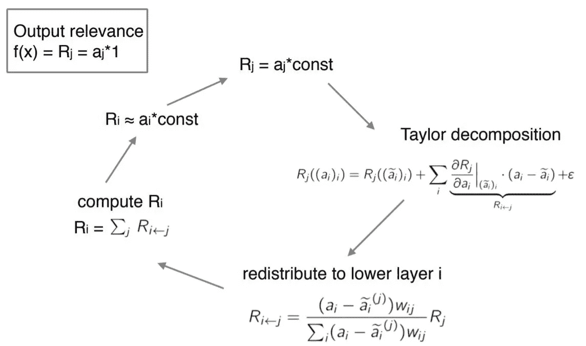
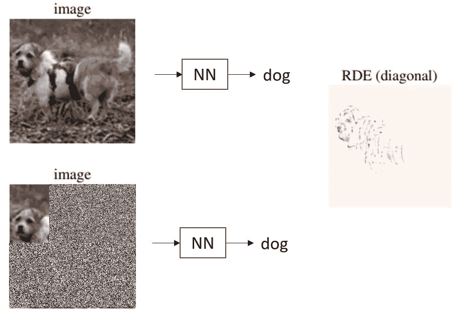

# ICIAM 2019 深度神经网络可解释性研究进展

> 原文：<https://towardsdatascience.com/advances-on-interpretability-of-deep-neural-nets-at-iciam-2019-1972784fc21d?source=collection_archive---------24----------------------->

关于神经网络可解释性的非常有趣的工作在 ICIAM 会议上提出。

I CIAM 是应用数学界最大的会议**，每四年举办一次。今年它位于西班牙的巴伦西亚，有超过 4000 名参与者，35 摄氏度。在大约一百场讲座同时进行的情况下，有许多关于深度学习主题的有意义的讲座。特别介绍了深层神经网络理论基础方面令人兴奋的工作。因此，在这篇文章中，我想分享一个我觉得特别有趣的例子。**

**即使小心对待，深层神经网络也很难掌握。通常，它们被称为“**黑盒**”。没有提供关于是什么使神经网络收敛到某个预测的信息。但是……**那里到底发生了什么？可解释性是对神经网络为什么会达到某种结果的研究。****

**你们中的许多人可能听说过[**tensor flow playground**，](https://playground.tensorflow.org/#activation=tanh&batchSize=10&dataset=circle&regDataset=reg-plane&learningRate=0.03&regularizationRate=0&noise=0&networkShape=4,2&seed=0.08927&showTestData=false&discretize=false&percTrainData=50&x=true&y=true&xTimesY=false&xSquared=false&ySquared=false&cosX=false&sinX=false&cosY=false&sinY=false&collectStats=false&problem=classification&initZero=false&hideText=false)，它用简单的例子展示了关于隐藏层的信息。**

****

**Example of the Tensor Playground!**

> **如果我们想让自治系统为我们做决定，理解 DNN 的解决方案对自治系统的未来至关重要**

**解释复杂 DNN 模型预测的一般技术是**逐层相关性传播(LRP)。****

****

**Heat map obtained used the LRP algorithm (Lapuschkin et al. 2016)**

**考虑一幅你想归类为火车、马或船的图片。LRP 首先检查最后一层中的哪些神经元被激活以获得该解决方案，然后它通过不同层跟踪这些神经元的连接，直到原始像素。令人惊讶的是，神经网络不会检查火车或窗户的形状，但会区分火车，因为它看到了铁轨。网络是作弊吗？不尽然，因为它没有被训练成没有轨道的火车图像，比如玩具火车。**

**所以，也许我们的数据库不够广泛。这是可解释性分析的可能结果之一。**

**关于可解释性的不同方法的介绍可以在这里找到[**。**](https://arxiv.org/abs/1706.07979)**

**在 ICIAM 深度学习理论进展小型研讨会期间，有一些关于可解释性的演讲，可能最有趣的是来自 Wojciech Samek、*Fraunhofer Heinrich Hertz Institute 和* Stephan Waeldchen、*柏林工业大学的演讲。***

****第一个发言**辩论了如何将 [LRP 理解为一个深度泰勒分解的预测。关于这些的更多信息和教程可以在他们的](http://www.heatmapping.org/tutorial/) [**网页**](http://www.heatmapping.org/) 上找到。**

**研究网络可解释性的方法之一是敏感性分析。为此，梯度的变化被用来分解神经网络，然而，梯度是不可靠的。**

> **敏感性分析研究函数的变化，而不是函数本身的值。**

****

**Decomposition of the net f(x) ( W. Samek, 2017).**

**神经网络斜率分解的更好方法是值分解。这样，连续性很容易保持，不像梯度方法。由于神经网络由简单函数组成，深度泰勒分解比简单泰勒分解更合适。因此，可解释性被逐层解释，然后不同的子功能被聚集。然后，LRP 可以被看作是逐层的泰勒分解:**

****

**Deep Taylor decomposition, where f(x) is the function of relevance. And the Taylor decomposition is done by layers ( W. Samek 2019).**

****第二个介绍**是关于 [**率失真方法**](https://arxiv.org/pdf/1905.11092.pdf) ，一个非常不同的方法，他们这个方法的目的是找到一个划分 x∈【0,1]ᵈ(数据)】成子集 s 的相关分量及其互补 Sᶜ.**

**这样，他们同意固定子集 s 并用随机噪声填充 Sᶜ应该产生相同的分类器预测，同时只有 xₛ的信息，如下图所示。**

****

**When adding noise to the complementary of S the result of the predictor must be unchanged. ( J. Macdonald et al, 2019).**

**为此，他们以失真的形式测量分类器预测的变化。我发现这种方法非常有趣，因为它偏离了经典的反向传播或局部线性化方法。然而，在这种方法中发现了一些困难，因为优化是在不同大小的所有可行集合上完成的。寻找相关特征的小集合的计算复杂度，并表明该问题对于 NPᴾᴾ(概率多项式时间)是完全的。因此，通过实现连续的相关分数和集合 s 的某个大小，该问题被放松**

**正如我所说，神经网络的可解释性对于进一步理解我们的神经网络结果是一个真正有用的新工具。这里有一些**的实现，希望能对你自己的结果有所启发。****

****也许你会在数据集中发现一些意想不到的东西。****

****[1] S. Waeldchen，J. Macdonald，S. Hauch 和 G. Kutynion，[一个用于解释深度神经网络决策的率失真框架](https://arxiv.org/abs/1905.11092) (2019)，arXiv:1905.11092****

****[2] G. Montavon，S. Lapuschkin，A. Binder，W. Samek 和 K.-R. Müller，[用深度泰勒分解解释非线性分类决策](https://reader.elsevier.com/reader/sd/pii/S0031320316303582?token=84DDCB11EE2CFDA734DB5E4416B74A123C09D8392AF4F9F9EFD5DA617729D2436C14FB09D19087BFADF03F8F62827E4A)，(2016)，《模式识别杂志》。****