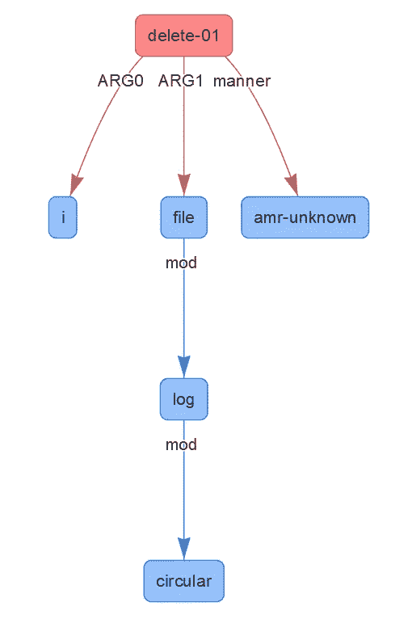

# 推进企业领域的自然语言处理(NLP)

> 原文：<https://towardsdatascience.com/advancing-natural-language-processing-nlp-for-enterprise-domains-1060052294a?source=collection_archive---------17----------------------->

作者:IBM 研究员 Salim Roukos

在公司庞大的文档和知识库中寻找信息来回答用户的问题从来没有想象中那么容易。答案很可能存在，但由于种种原因，它们往往遥不可及。

首先，与 Web 不同，在 Web 上，信息通过一组丰富的链接连接在一起，并经常以多种形式冗余地捕获(使其更容易找到)，企业内容通常存储在筒仓中，关键信息的重复要少得多。此外，搜索企业内容的用户通常会问一些复杂的问题，并期望得到比从 Web 搜索引擎得到的答案更详细的答案。这些问题可能包括产品支持、个人账单、适用于客户合同的最新法规、新闻网站上发现的事件的影响等等。最后，企业通常不愿意依赖“黑盒”人工智能，因为它无法解释其建议，可能需要决策者或最终用户可以解释的技术。

自然语言处理(NLP)通过允许用户更自由地表达他们的信息需求，并为日益复杂的问题提供准确的答案，有望帮助在企业内容中找到如此深刻的信息。然而，企业 NLP 系统经常受到许多因素的挑战，包括理解异构的信息孤岛，处理不完整的数据，从少量数据中训练精确的模型，以及在不断添加新内容、产品、术语和其他信息的变化环境中导航。

IBM Research AI 正在沿着三个不同的主题进行探索，以应对这些挑战并改进企业领域的 NLP。第一个目标是推进人工智能，让系统能够从少量数据中学习，利用外部知识，并使用包括神经符号方法在内的技术来处理结合了神经和符号处理的语言。第二个聚焦于[信任 AI](https://www.research.ibm.com/artificial-intelligence/trusted-ai/) ，其中提供了关于系统如何达成决策的可解释性。第三种方法涉及扩展 AI，以允许系统的持续适应和更好的监控和测试，以支持企业严格期望下的语言系统部署。

在这篇文章中，我将通过强调我们在 ACL 2019 会议上提交的四篇论文来提供 IBM Research 的企业 NLP 工作的一些细节(我们所有 ACL 论文的完整列表在此处)。前两篇论文涉及语义解析:第一篇使用抽象含义表示(AMR)语言来表示句子的含义，第二篇创建语义解析器，将用户的问题转换为程序来查询知识库。我还将简要探讨我们将不完整的知识库与文本相结合的工作，以提高回答问题的覆盖率。第四篇论文描述了一种系统，该系统使得主题专家能够为可解释的基于规则的系统微调规则。

**1。** [**【抽象意义再现】**](https://www.research.ibm.com/artificial-intelligence/publications/paper/?id=Rewarding-Smatch:-Transition-Based-AMR-Parsing-with-Reinforcement-Learning) **:**

AMR 是一种语义表示语言，旨在允许相似的句子具有相同的表示，即使它们的措辞不同。我们展示了 AMR 图，它代表了这样一个问题:“如何删除循环日志文件？”其中概念 *amr-unknown* 代表被请求的内容(在这种情况下，*delete-01*of*arg 1*by*arg 0*)。

在之前的工作中，我们介绍了我们基于栈-LSTM 转换的 AMR 解析器(Ballesteros 和 Al-Onaizan，2017 [1])，其语义准确性，或 **SMATCH，**得分为 65.9%。在这篇[论文](https://www.research.ibm.com/artificial-intelligence/publications/paper/?id=Rewarding-Smatch:-Transition-Based-AMR-Parsing-with-Reinforcement-Learning)中，我们描述了几种将 SMATCH 提高到 75.5%的技术，这比早期的 74.4%要好。贡献 1.9%的一种技术是用强化学习来增加训练，以减轻较小的训练数据量。我们使用可能的 AMR 图的采样，希望找到更好的图来学习更好的参数:特别是，我们希望找到最大化预期 SMATCH 奖励的参数。

对于每个句子，我们使用当前的模型参数生成两个图:一个贪婪的最佳图和一个通过从动作空间采样生成的图。梯度近似为(Rennie 等人，2017 年[2])。

贪婪图的匹配作为基线，可以减少梯度估计的方差(Williams，1992 [3])。本文还介绍了在 AMR 2.0 (LDC2017T10)上实现 75.5%的额外功能，其中大部分是新闻内容。我们目前正在探索迁移学习的方法，以将面向新闻的 AMR 解析器扩展到企业内容。

**2。** [**多知识库统一语义解析**](https://www.research.ibm.com/artificial-intelligence/publications/paper/?id=Unified-Semantic-Parsing-with-Weak-Supervision) **:**

在许多情况下，用户的问题需要通过查询知识库来回答。我们开发了一种方法，该方法统一了跨多个知识库(KBs)的语义解析，并利用跨查询程序的结构相似性来搜索各种知识库。跨 KBs 的共享缓解了用于构建语义解析器的训练数据的缺乏。我们使用弱监督方法，只有一对用户的问题及其答案，这是通过使用第 *k 个* KB 进行训练而获得的。为了克服在所有可能的程序中搜索 KBs 的挑战，我们使用了多策略提取。首先，我们分别为每个领域训练弱监督的解析模型(教师)。第二，我们使用多策略提取将所有的 *k* 解析器提取到统一的(学生)语义解析器中，学生和 *K* 教师注意到我们在训练中知道正确的知识库 id，但是在推理过程中不使用该信息。我们在隔夜数据集上进行实验，这是一个具有 7 个 kb 的公共数据集，并且发现与每个教师都单独训练的情况相比，当使用提取的统一解析器(学生)时，性能在准确性上有所提高。

论文[提供了关于实验和结果的更多细节。](https://www.research.ibm.com/artificial-intelligence/publications/paper/?id=Unified-Semantic-Parsing-with-Weak-Supervision)

**3。** [**不完整 KBs 上的问题回答增加了文本**](https://www.research.ibm.com/artificial-intelligence/publications/paper/?id=Improving-Question-Answering-over-Incomplete-KBs-with-Knowledge-Aware-Reader) **:**

大多数知识库是不完整的，但是可以提供有用的知识来与文本语料库融合，以找到在知识库或文档中没有完全回答的问题的答案。这项工作解决了企业中常见的知识库和语料库的异构内容，我们使用了(1)基于图关注的知识库阅读器(SGREADER)和(2)知识感知文本阅读器(KAREADER)的组合。

SGREADER 组件使用图形关注技术从其链接的邻居( )中积累每个子图形实体(e)的知识。图形注意机制被特别设计为考虑两个重要方面:(1)邻居关系是否与问题相关；以及(2)邻居实体是否是问题提到的主题实体。在传播之后，SGREADER 最终为每个实体输出一个矢量化表示，对特定于问题的知识进行编码，这些知识由其链接的邻居来指示。

KAREADER 使用门控机制，通过自关注问题编码器与问题主题实体表示的门控混合来替换问题表示。对于该段落，导出了类似的表示。阅读理解系统使用这些融合的问题和段落表征来得出答案。

论文提供了更多关于实验和结果的细节。

**4。**[**【HEIDL】:深度学习的人在回路语言表达**](https://www.research.ibm.com/artificial-intelligence/publications/paper/?id=HEIDL:-Learning-Linguistic-Expressions-with-Deep-Learning-and-Human-in-the-Loop) **:**

企业采用 NLP 的最大挑战之一是从更大更复杂的文本中创建人类可解释的模型的能力。这对于企业来说是必要的，这样才能放心地部署解决方案，更重要的是，利用人类领域的专家来理解和进一步改进 NLP 系统的输出。 [HEIDL](https://www.ibm.com/blogs/research/2019/07/heidl-acl2019/) ，是深度学习的人在回路语言表达式的缩写，是 IBM 创建的一个工具，用于根据精确度和召回率对机器生成的表达式进行排名。

为了评估 HEIDL，IBM Research 和密歇根大学进行了一项研究，对现实世界法律合同中的句子进行分类。数据由 IBM 律师标记，他们梳理了近 150 份合同中的 20，000 个句子，以注释与终止、沟通和支付等关键条款相关的短语。

这些规则是通过深度学习在 IBM 采购合同上学习到的；HEIDL 为人类解释系统正在做什么和改进它提供了高级概念。我们与四位使用 HEIDL 修改规则的数据科学家合作；在 28k 句子的训练集上，所有人都取得了 75%以上的 F 值。此外，当我们在新的非 IBM 合同上进行测试时，HEIDL 系统取得了更好的性能(55%)，相比之下，传统的深度学习系统使用 LSTM 网络在相同的 28k 句子上进行训练(44%)。最终，我们的数据科学家可以识别出平均七条规则，在大约 30 分钟内高精度地自动标记近 150 份合同并召回。如果不使用 HEIDL 原型，同样的练习如果手动进行，将需要一周或更长时间。我们计划进行更多的评估，以确认基于 HEIDL 的系统比深度学习系统更强大。

**IBM Research AI 和 ACL 2019**

IBM Research AI 在 ACL 2019 上的出版物涵盖了我们正在为企业 NLP 领域追求的其他主题；这里列出了[和](https://www.ibm.com/blogs/research/2019/07/ibm-research-ai-acl-2019/)。其中包括[的四份出版物](https://www.ibm.com/blogs/research/2019/07/advancing-computational-argumentation-project-debater/)，带你了解 Project Debater 的幕后技术，该项目[于 2019 年 2 月在三藩市与冠军辩手](https://www.ibm.com/blogs/research/2019/02/ai-debate-recap-think-2019/)竞争。您也可以在我们的 2 号展位加入我们，我们将展示一些技术演示，展示我们的一些工作。

**参考文献**

1.米盖尔·巴列斯特罗斯和亚塞尔·奥奈赞。2017.使用 stack-lstms 进行 Amr 解析。《2017 年自然语言处理经验方法会议论文集》，第 1269-1275 页。计算语言学协会。

2.史蒂文·雷尼、艾蒂安·马切雷特、优素福·姆鲁埃、杰雷特·罗斯和瓦伊巴瓦·戈埃尔。2017.图像字幕的自我批判序列训练。IEEE 计算机视觉和模式识别会议论文集，第 7008–7024 页。

3.罗纳德·威廉姆斯。1992.联结主义强化学习的简单统计梯度跟踪算法。机器学习，8(3–4):229–256。