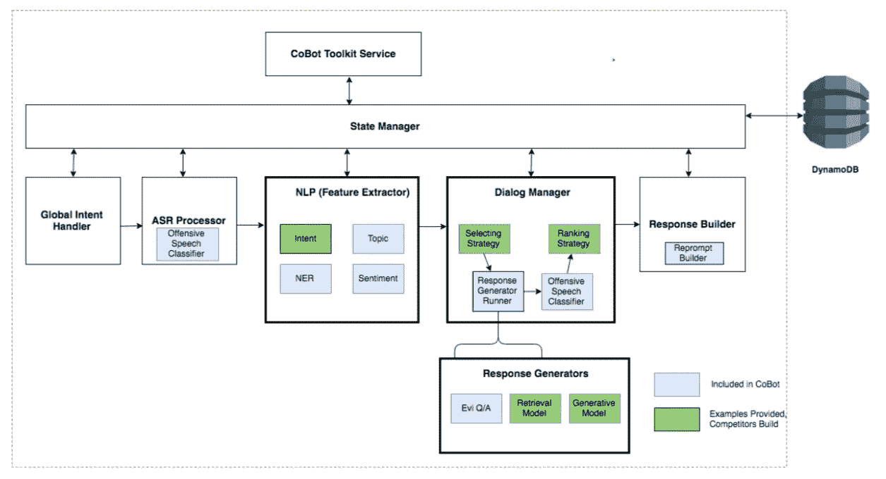
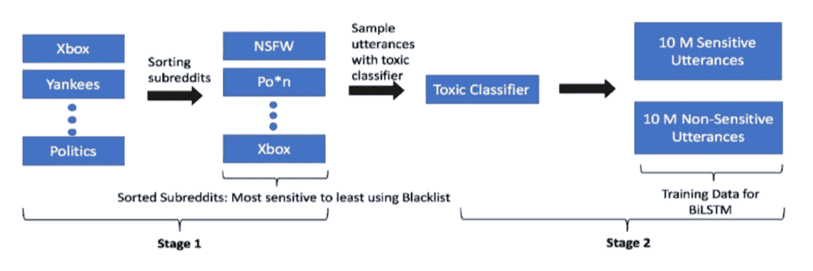
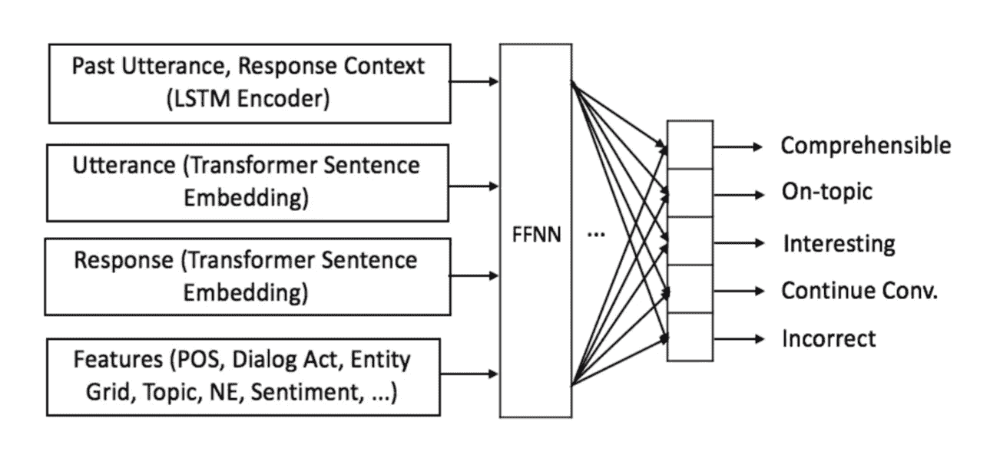

# 通过 Alexa 奖推进开放域对话系统

> 原文：<https://towardsdatascience.com/advancing-open-domain-dialog-systems-through-alexa-prize-6ad2e484535d?source=collection_archive---------18----------------------->

## 对话式人工智能的进步因 Alexa 奖而成为可能

Photo by [Piotr Cichosz](https://unsplash.com/photos/vLpO7F3iAyA?utm_source=unsplash&utm_medium=referral&utm_content=creditCopyText) on [Unsplash](https://unsplash.com/?utm_source=unsplash&utm_medium=referral&utm_content=creditCopyText)

建立一个开放领域的对话系统是最具挑战性的任务之一。几乎所有与开放域对话系统相关的任务都被认为是“人工智能完成的”。换句话说，解决开放域对话系统的问题需要“真正的智能”或“人类智能”。开放领域对话系统需要理解自然语言。缺少预定义的有界解空间和缺少客观的成功矩阵使得响应生成成为非常具有挑战性的建模问题。

为了解决开发这些系统所面临的问题，亚马逊在 2016 年推出了一年一度的竞赛“[**”Alexa prize**](https://developer.amazon.com/alexaprize)。通过这种方式，他们让顶尖的研究人员想出创造性的解决方案。2018 年，比赛的第二次迭代包括提供 CoBot(对话机器人)工具包和各种其他模型，这些模型可以检测敏感内容，评估对话和对话行为检测。

2018 Alexa Prize Finals

# 介绍

开放领域对话系统需要理解自然语言，以便处理用户查询。由于歧义性和不确定性，开放领域环境下的自然语言理解(NLU)是一个非常困难的问题。为了响应用户的查询，对话系统需要检测他们的意图。开放域对话系统应该理解对话行为、用户话语中的命名实体、检测歧义短语、检测主题、分割句子、检测用户的情感。

“Alexa Prize”的目标是建立能够与人类进行连贯和有吸引力的聊天至少 20 分钟并获得 4 分或更多评分(满分 5 分)的代理。还有许多其他类似的挑战，如“对话系统技术挑战”(DSTC)、“对话式人工智能挑战”(ConvAI)，这些都只是基于文本的挑战。

这篇文章概述了 Alexa Prize 团队在构建更好的对话式人工智能方面的进步和新方法。为了进一步理解，用户可以阅读论文“[通过 Alexa 奖推进开放域对话系统的艺术状态](https://arxiv.org/abs/1812.10757)”。

# CoBot(一个机器人开发工具包)

CoBot(一种对话式机器人工具包)的开发是为了最大限度地减少开发人员在基础设施、托管和扩展方面的工作。CoBot 有一些预构建的模型，如主题和对话行为分类器、对话评估器、敏感内容检测。

Figure 1: CoBot Architecture [Source](https://arxiv.org/abs/1812.10757)

CoBot 有助于测试和评估开发人员所做的修改。它提供了强大的日志记录机制，直接存储在 Amazon Cloud Watch 上。它还有一个开发人员友好的 CLI 界面，可以用来模拟对话和转录对话。通过 CoBot，用户可以利用亚马逊的持久存储、数据库和其他服务，如亚马逊 S3、DynamoDB、QuickSight 等，来执行丰富的数据分析和创建可视化。

# 自动语音识别

开放域对话系统使用语音数据作为输入。糟糕的语音识别系统和无法识别的单词发音会极大地降低这些系统的性能。因此，对于这些系统来说，在将 ASR 错误提供给管道进行下游任务(如 NLU 处理)之前，能够处理 ASR 错误是非常重要的。参与团队使用不同的方法来处理 ASR 错误。在所有方法中，只有一种方法使用了独特的方法，即通过使用上下文知识库来捕获同音字。通过使用这种技术，命名实体的错误率降低了 10%到 15%。

# 上下文语言模型适应

NLP 中的传统算法使用统计语言模型来解决歧义。使用上下文信息可以进一步提高当前语言模型的性能。这可以通过两种方式实现。第一种是通过向动态插值框架添加上下文信息，第二种是通过将上下文信息并入神经网络。

在第一种方法中，系统基于上下文信息混合不同的统计语言模型。特别地，通过改变我们的基于 n 元语法的语言模型的内插权重，将各种基于 n 元语法的语言模型混合在一起，以更好地适应和识别用户话语。预测这些插值权重以最大化训练数据的对数似然。

第二种方法包括为递归神经网络(RNN)模型添加上下文信息。会话上下文信息被编码到神经语言模型(NLM)中。使用的模型是 LSTM-RNN。Alexa Prize 团队探索了各种方法来整合上下文信息，以处理社交机器人响应和用户话语之间的差异。

# 语境话题和对话行为模式

为了引导对话的流程，对话行为(如问候、提问、意见、请求等)作为一般意图是有用的。当它与会话的“主题”结合时，它可以帮助自然语言理解。

为了帮助建立更好的开放领域对话系统，Alexa Prize 团队开发了上下文感知主题和对话行为分类模型。去年比赛的 10，000 个对话被标记为 12 个主题和 14 个对话行为。

# 敏感内容检测分类器

开放域对话设置伴随着最困难的任务之一，对敏感或攻击性内容进行分类。由于文化差异、种族主义、宗教、讽刺、不规范的词汇，这个问题变得更加具有挑战性。

Figure 2: Two Stage Semi-Supervision for Sensitive Content Detection [Source](https://arxiv.org/abs/1812.10757)

大多数团队在公开可用的数据源(如 Reddit 和 Twitter)上训练定制模型。Alexa Prize 团队使用两阶段半监督方法生成了常见的论坛对话(该方法如图 2 所示)。

两阶段半监督方法使用攻击性单词黑名单(这是 800 个攻击性单词的手动精选列表)。阶段 1 包括基于出现在所述黑名单中的攻击性词语的总数对论坛对话进行分类。在阶段 2 中，使用弱监督分类器对高度敏感的评论和不敏感的评论进行采样。这个分类器是在有毒的维基百科评论数据集上训练的。采样数据集用于训练 BiLSTM 分类器。对于单词表示，使用了手套嵌入。

# 语境对话评估者

开放域对话系统的评估是另一个具有挑战性的问题。Alexa prize 评估开放域对话系统的质量，要求用户根据他们希望与 Alexa 交谈的可能性，在 1 到 5 的范围内给出一个评级。但这些评级并不能评估开放域对话系统的回合级性能。

Figure 3: Contextual Conversation Evaluators [Source](https://arxiv.org/abs/1812.10757)

为了评估开放域对话系统的回合级性能，Alexa prize 团队定义了以下五个指标。

1.  **可理解的**:这个指标检查对话系统的响应对于用户的查询是否有意义。
2.  **正题或相关**:该指标检查对话系统的回复是否离题。例如，如果用户询问澳大利亚队的一名板球运动员，那么回复应该提到同一队的板球运动员。
3.  **响应不正确**:该指标检查响应是否不相关或不适当。
4.  **有趣的**:这个指标检查响应是否包含新颖和相关的信息。例如，对话系统提供关于板球运动员的答案，并提供一些附加信息。
5.  **继续对话**:该指标检查是否基于对话的当前状态，是否有继续对话的自然方式。

Alexa prize 对话(包含大约 160，000 个话语)根据上述五个指标进行了人工注释。图 3 说明了用于训练上下文对话评估者的模型。该模型使用各种特征，如实体网格、情感和上下文来进行评估。