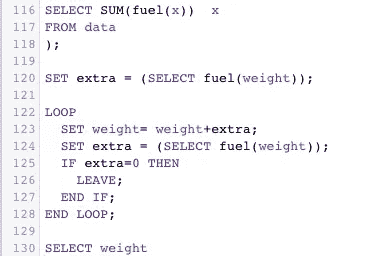
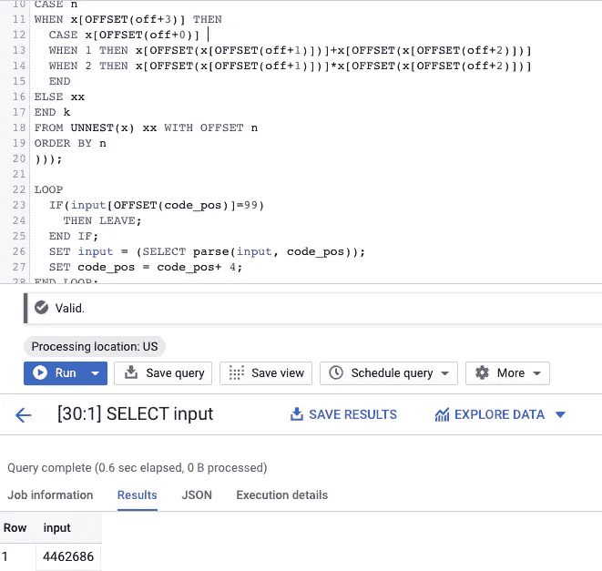
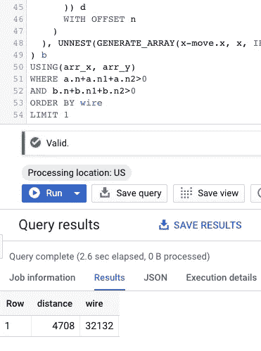

# 代码的出现:SQL + BigQuery

> 原文：<https://towardsdatascience.com/advent-of-code-sql-bigquery-31e6a04964d4?source=collection_archive---------13----------------------->


## [成千上万的程序员正在用他们最喜欢的编程语言解决即将到来的代码挑战。如果我可以利用这个机会来突出 SQL 和最新的 BigQuery 特性的威力，那会怎么样？](https://adventofcode.com/2019/stats)

# 2020 年更新:有雪花

使用 SQL 线程检查我的 [2020 代码:](https://twitter.com/felipehoffa/status/1334666348794839041)

以及 [GitHub 回购](https://github.com/fhoffa/AdventOfCodeSQL/):

[](https://github.com/fhoffa/AdventOfCodeSQL/) [## FH off/AdventOfCodeSQL

### GitHub 是超过 5000 万开发人员的家园，他们一起工作来托管和审查代码、管理项目和构建…

github.com](https://github.com/fhoffa/AdventOfCodeSQL/) 

> [*降临码*](https://adventofcode.com/2019/about) *是一个降临日历的小编程难题，为各种技能集和技能水平。*

如果您可以使用 SQL 和 BigQuery 来编写编译器、交叉路径、递归运行计算和破解密码，会怎么样？#adventofcode2019，开始啦！

# 问题 1:递归迭代

[问题](https://adventofcode.com/2019/day/1)， [BigQuery 解决方案](https://github.com/fhoffa/code_snippets/blob/master/2019_advent_of_code/01_02.sql)



在 BigQuery 中运行递归函数并不容易——但是现在我们可以做[循环和通用脚本](https://cloud.google.com/bigquery/docs/reference/standard-sql/scripting)。这是我用来解决第二部分问题的主要循环:

```
LOOP
  IF (SELECT SUM(x) FROM UNNEST(extra) x)<=0 THEN
    LEAVE;
  END IF;  
  SET weight= weight+(SELECT SUM(x) FROM UNNEST(extra) x);
  SET extra = (SELECT ARRAY_AGG(fuel(x)) x FROM UNNEST(extra) x);
END LOOP;
```

和一个方便的 SQL UDF:

```
CREATE TEMP FUNCTION fuel(x ANY TYPE) AS (
 GREATEST(0,FLOOR(x/3)-2)
);
```

我在这里必须解决的最有趣的问题是:我不能有一个`cursor`来逐行计算每个组件的燃料。所以我必须找出一种并行处理每个 rocket 组件(输入行)的方法——这使得查询方式更加高效。

# 问题 2:数据作为代码

[问题](https://adventofcode.com/2019/day/2)， [BigQuery 解决方案](https://github.com/fhoffa/code_snippets/blob/master/2019_advent_of_code/02_02.sql)

可以用 SQL 和 BigQuery 写编译器吗？我们完成图灵了吗？



同样，使用脚本`LOOP`允许我迭代一个输入数组——它定义了从循环中读取时要执行的代码:

```
LOOP
  IF(input[OFFSET(code_pos)]=99) 
    THEN LEAVE;
  END IF;
  SET input = (SELECT parse(input, code_pos));
  SET code_pos = code_pos+ 4;
END LOOP;
```

最有趣的部分是我如何使用`ARRAY_AGG()`和`CASE`按照指示重写每个数组的内容:

```
SELECT ARRAY_AGG(k) FROM (
SELECT 
CASE n
WHEN x[OFFSET(off+3)] THEN 
  CASE x[OFFSET(off+0)] 
  WHEN 1 THEN x[OFFSET(x[OFFSET(off+1)])]+x[OFFSET(x[OFFSET(off+2)])]
  WHEN 2 THEN x[OFFSET(x[OFFSET(off+1)])]*x[OFFSET(x[OFFSET(off+2)])]
  END
ELSE xx
END k
FROM UNNEST(x) xx WITH OFFSET n
ORDER BY n
```

然后我不得不面对的最困难的问题是——如何做 99*99 次来找到第二部分的答案？这并不漂亮，但它涉及数组的数组，并在(幸运的)线性空间中进行缓慢的搜索。

警告:搜索 200 个可能的解决方案需要 2 分钟以上。但是由于特定的语句是线性的，你可以跳到正确的结果。

# 问题 3:我们会在哪里相遇

[问题](https://adventofcode.com/2019/day/3)， [BigQuery 解决方案](https://github.com/fhoffa/code_snippets/blob/master/2019_advent_of_code/03_02.sql)



这是一个有趣的地图遍历问题——对于这个解决方案，我使用了生成 SQL 数组的能力来详细描述每个步骤:

```
FROM [...], UNNEST(GENERATE_ARRAY(x-move.x, x, IF(move.x>0,1,-1))) arr_x WITH offset n1, UNNEST(GENERATE_ARRAY(y-move.y, y, IF(move.y>0,1,-1))) arr_y WITH OFFSET n2
```

寻找交叉点的路径之间的连接非常优雅:

```
USING(arr_x, arr_y)
```

一个方便的函数解析输入并生成二维运动指令:

```
CREATE TEMP FUNCTION parse(x ANY TYPE) AS (
 CASE REGEXP_EXTRACT(x, '^(.)')
 WHEN 'D' THEN STRUCT(0 AS x,-parse_n(x) AS y)
 WHEN 'R' THEN (parse_n(x),0)
 WHEN 'U' THEN (0,parse_n(x))
 WHEN 'L' THEN (-parse_n(x),0)
 END
);
```

我很自豪能够重新分解路径生成代码，使解决方案易于查看:

```
SELECT ABS(arr_x) + ABS(arr_y) distance, (a.rn + b.rn) wire
FROM (
  SELECT * FROM UNNEST(route('L996,D167,R633,...'))
) a
JOIN (
  SELECT * FROM UNNEST(route('R995,U982,R941,...'))
) b
USING(arr_x, arr_y)
WHERE a.rn>0 AND b.rn>0
ORDER BY wire 
LIMIT 1
```

# 问题 4:密码是…

[问题](https://adventofcode.com/2019/day/4)， [BigQuery 解决方案](https://github.com/fhoffa/code_snippets/blob/master/2019_advent_of_code/04_02.sql)

这里的代码非常短！我希望我编写的手动数组位置更少，但是这样做花费的时间比计算一般情况要少:

```
SELECT * 
FROM (
  SELECT CAST(FORMAT('%i%i%i%i%i%i',n0, n1, n2, n3, n4, n5) AS INT64) number
  FROM (
    SELECT n0, n1, n2, n3, n4, n5
    FROM UNNEST(GENERATE_ARRAY(1, 5)) n0
    , UNNEST(GENERATE_ARRAY(1, 9)) n1
    , UNNEST(GENERATE_ARRAY(1, 9)) n2
    , UNNEST(GENERATE_ARRAY(1, 9)) n3
    , UNNEST(GENERATE_ARRAY(1, 9)) n4
    , UNNEST(GENERATE_ARRAY(1, 9)) n5
    WHERE n1>=n0
    AND n2>=n1
    AND n3>=n2
    AND n4>=n3
    AND n5>=n4
    AND (
    (n1=n0 AND n1!=n2)
    OR (n2=n1 AND n1!=n0 AND n2!=n3)
    OR (n3=n2 AND n2!=n1 AND n3!=n4)
    OR (n4=n3 AND n3!=n2 AND n4!=n5)
    OR (n5=n4 AND n4!=n3)
    )
  )
)
WHERE number BETWEEN 109165 AND 576723
```

如你所见,`GENERATE_ARRAY()`帮助创造了寻找解决方案的空间。

# 第五天

当我写下这些想法时，问题仍然没有被公布…

嗯……现在是了，但是我要回家了。能不能同时解决？

**更新**:问题是第 2 天的延续。建造这台“图灵机”在第二天很有趣，但我不想加倍努力。

# 第六天:图形遍历

[问题](https://adventofcode.com/2019/day/6)， [BigQuery 解决方案](https://github.com/fhoffa/code_snippets/blob/master/2019_advent_of_code/06_02.sql)

浏览图表并不需要花费太多精力来编写脚本——但是它强调了当一个函数必须经历多次迭代时，BigQuery 可能会很慢。在这种情况下，处理 547 条语句需要大约 20 分钟。提醒一下:BigQuery 在处理万亿字节的数据方面令人难以置信，但不一定能解决一般的计算问题。

```
LOOP
  SET steps = steps+1
  ;
  CREATE OR REPLACE TEMP TABLE planets AS
  SELECT DISTINCT planet
  FROM (
    SELECT origin planet FROM t1 WHERE dest IN (SELECT planet FROM planets)
    UNION ALL
    SELECT dest planet FROM t1 WHERE origin IN (SELECT planet FROM planets)
  )
  ;
  IF 'SAN' IN (SELECT * FROM planets )
      THEN LEAVE;
  END IF;
END LOOP
```

现在，如果这个问题不是一次性的，我就不会每次都遍历图，而是预先计算一个更好的结构，用所有路径来立即找到交叉点(因为这是树，不是图)。

# 最后的想法

***我会推荐 SQL 作为通用编程问题工具*？**

不要！

…但对我来说，这是一种尝试 SQL 和 BigQuery 极限的有趣方式。脚本是一个新特性，我还在适应它的语法和局限性。到目前为止，一切顺利。

[以代码挑战赛的到来为例！](https://adventofcode.com/2019/)

## 作为奖励:使用这些技巧来打动你的朋友！

感谢[艾捷拉哈默利](https://medium.com/u/ef484db59f33?source=post_page-----31e6a04964d4--------------------------------)、[马诺马克斯](https://medium.com/u/76966eff5267?source=post_page-----31e6a04964d4--------------------------------)、[本布莱特辛](https://medium.com/u/39304bcc338a?source=post_page-----31e6a04964d4--------------------------------)、……早期的鼓励。

*(可以代码 763369-9f36786d 加入 BigQuery SQL 排行榜)*