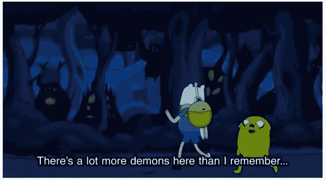
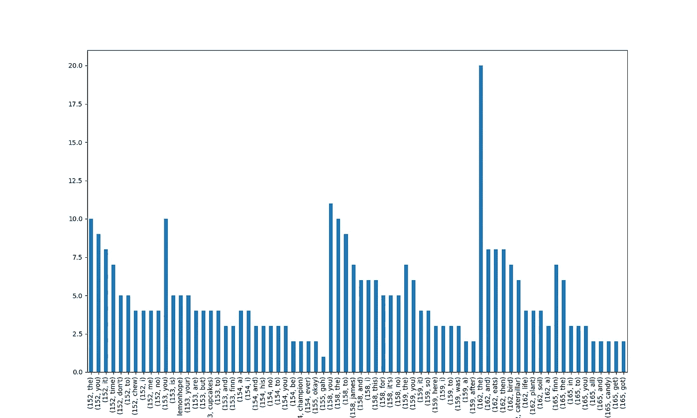
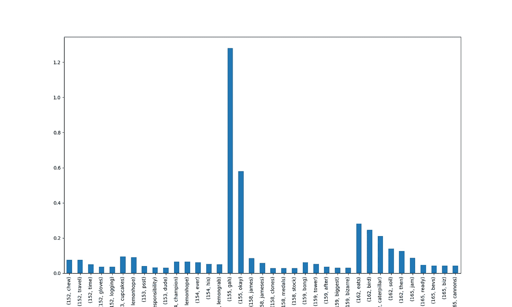
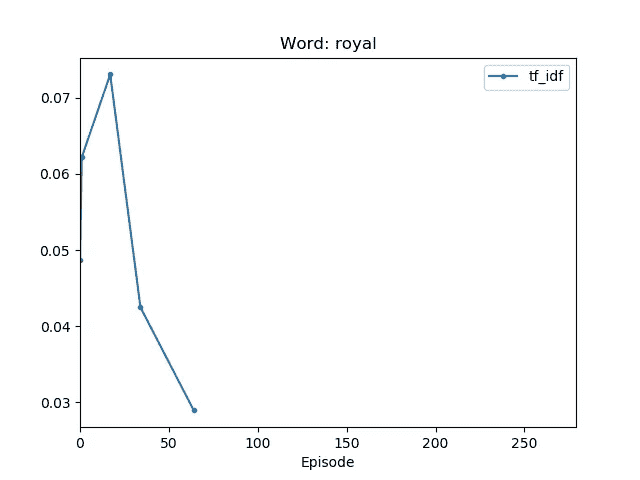
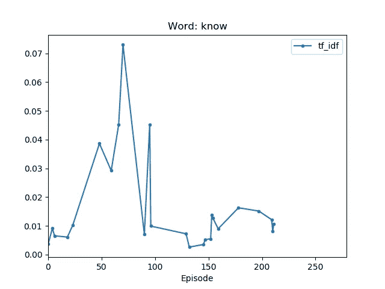
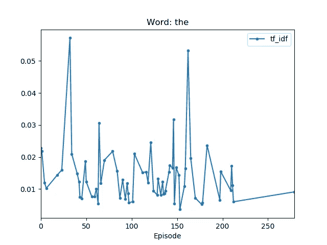
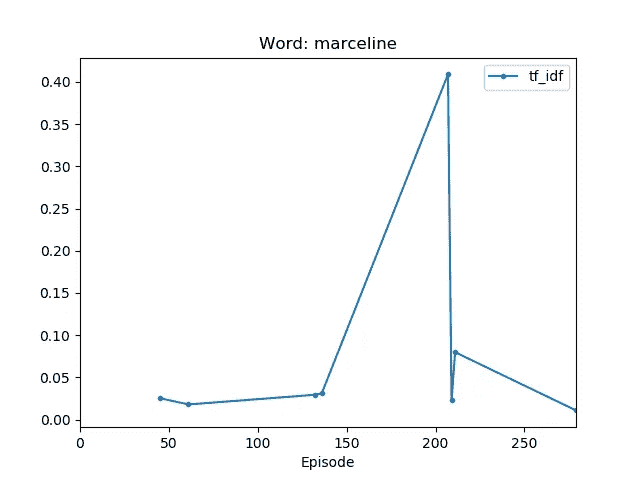
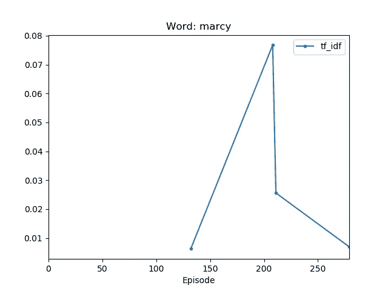

# 冒险刮:冒险时间抄本的文本挖掘

> 原文：<https://towardsdatascience.com/adventure-scrape-text-mining-on-adventure-time-transcripts-8a50d09c2b6d?source=collection_archive---------17----------------------->

当代动画倾向于看似为儿童制作，但对成人有深远影响的卡通…因为它们情节的突然发展，复杂的角色情感，以及太真实的笑话。冒险时间就是这样一个让你说“哦，我的球”的节目！

[冒险时间](https://en.wikipedia.org/wiki/Adventure_Time)是卡通网络上一部长期播放的卡通片，以许多看似不相关的“每周任务”剧集和彩色(我敢说是迷幻)艺术而闻名。前四五季几乎没有什么情节，但最终它对角色的定期轮换有了更一致的情感发展。我非常喜欢节奏的变化，并想知道我是否可以使用数据来跟踪角色的发展。所以，让我们开始数学的东西！

供参考:所有代码都在这个[回购](https://github.com/amrosnik/adventure_scrape)中。

*注意:下面会有一些剧透…但由于该剧于 2018 年 9 月结束，我假设你有足够的时间赶上！*

*其他注意事项:这是我的第一个机器学习项目，因此代码不是为了效率而优化的，而是为了清晰或短期效用。*

What’s more algebraic than Adventure Time? Data analysis of Adventure Time!

# 创建数据集

*网页抓取*

由于《冒险时间》是一部电视剧，我搜索了剧集剧本的抄本。许多收藏有丰富的文本，但没有人物标签，除了组织得非常好的[冒险时间粉丝维基的抄本部分](https://adventuretime.fandom.com/wiki/Category_talk%3ATranscripts)。

我按照这个指南[开发了一个](/how-to-web-scrape-with-python-in-4-minutes-bc49186a8460)[脚本](https://github.com/amrosnik/adventure_scrape/blob/master/adventure_scrape.py)来搜集这些抄本。我从脚本的[登陆页面开始，沿着剧集列表往下看，因为它们是按时间顺序排列的(信不信由你，大多数粉丝维基按剧集标题的字母顺序排列脚本)。我是这样做的，并将文本保存到 HTML 文件中:](https://adventuretime.fandom.com/wiki/Category_talk:Transcripts)

```
import requests
import urllib.request
import time
from bs4 import BeautifulSoupurl = ‘[https://adventuretime.fandom.com/wiki/Category_talk:Transcripts'](https://adventuretime.fandom.com/wiki/Category_talk:Transcripts')
response = requests.get(url)soup = BeautifulSoup(response.text, “html.parser”)anchors = [a for a in (td.find(‘a’) for td in soup.findAll(‘td’)) if a]for i in range(0,len(anchors)):
    if anchors[i].has_attr('href'):
        link = anchors[i]['href']
        actual_link = '[https://adventuretime.fandom.com'+link](https://adventuretime.fandom.com'+link) 
        file_name = './transcripts/adventure_time_ep'+str(i)+'.html'
        urllib.request.urlretrieve(actual_link,file_name)
        file = open(file_name,'r')
        new_file = [n.replace('<dl><dd>','') for n in file.readlines() if n.startswith('<dl')]
        file.close()
        new_name = open('./transcripts/adventure_time_ep'+str(i)+'_redacted.html','w')
        for k in range(len(new_file)):
            new_name.write(new_file[k]+'\n')
        new_name.close() 
    time.sleep(1)
```

虽然这部剧有 283 集，但我只找到了 213 份抄本。其中一些不完整。我预计会有不完整的，混乱的数据，因为所有这些文字记录都是粉丝在志愿者的基础上生成的。

*数据清理+数据帧创建*

接下来，我必须清理这些数据并为其创建一个数据结构。我选择的结构受到了大卫·罗宾逊在[他对《真爱至上》人物网络](http://varianceexplained.org/r/love-actually-network/)的分析中的结构的启发:一个熊猫数据框架，其中每一行都是脚本中的一行，我表示剧集编号、行号、演讲者和相关内容。为了进一步分解内容，我把内容分成对话或动作；在绝大多数抄本中，动作用括号[]表示，或者在角色的台词中，或者作为一种舞台指示。下面是一个原始数据的例子，来自[这一集](https://adventuretime.fandom.com/wiki/Ricardio_the_Heart_Guy/Transcript):

> 泡泡糖公主:多棒的一击。谢谢你们再次挽救了局面，孩子们。
> 
> 芬恩:不客气，公主。她拥抱了他。嗯…[*他脸红了，杰克扬起眉毛，觉得很有趣。* ]
> 
> 泡泡糖公主:我要给你们两个办一个派对。今晚在糖果王国见面！
> 
> 三人欢呼。“派对时间”标志弹出，气球填满屏幕，切换到下一个场景。芬恩和杰克正穿过 [*棉花糖森林*](https://adventuretime.fandom.com/wiki/Cotton_Candy_Forest) *向* [*糖果城堡*](https://adventuretime.fandom.com/wiki/Princess_Bubblegum%27s_castle) *走去。* ]

我把对话和动作分开，不仅仅是因为它们被括号清晰地分开了，我还假设这两者会不同地定义一个角色的个性。这里值得注意的是，在实际的 HTML 文件中，我已经去掉了 HTML 的所有文本格式。

当然，即使有了这些格式化原则，数据也不像我希望的那样干净…



The ultimate saying for data cleaning.

下面的代码块演示了我如何将 DataFrame 字段从原始 HTML 文件中分离出来。获取情节和行号很简单，但区分对话和动作可能很有挑战性。一个角色的“台词”可以包含多段对话和动作，因此我创建了一系列条件来捕捉它们。虽然它不是最干净的代码，但它完成了工作。

```
import requests
import urllib.request
import time
import os.path 
from bs4 import BeautifulSoup
import pandas as pd 
from lxml import html
import numpy as np
import relen_anchors = 280
size = len_anchors*2000
eps = [“” for x in range(size)]
lines = [“” for x in range(size)]
names = [“” for x in range(size)]
dialogue = [“” for x in range(size)]
actions = [“” for x in range(size)]end_of_last_k = 0 
for i in range(len_anchors):
   if os.path.exists(‘./transcripts/adventure_time_ep’+str(i)+’_redacted.html’):
      html = open(‘./transcripts/adventure_time_ep’+str(i)+’_redacted.html’,’r’)
      soup = BeautifulSoup(html, “lxml”)
      for script in soup([“script”, “style”]): *# remove all script and style elements*
         script.extract() 
      text = soup.get_text()
      text_by_line = text.split(‘\n’)
      text_no_breaks = [l for l in text_by_line if len(l) > 0]
      num_lines = len(text_no_breaks)
      line_count = 0
      for k in range(num_lines):
         eps[k + end_of_last_k] = i *#track episode number*
         lines[k + end_of_last_k] = k *#line number in given episode*
         if len(text_no_breaks[k]) > 1: *#sometimes a "line" is just a space...*
            line_count = line_count + 1
            split_up = text_no_breaks[k].split(‘:’,maxsplit=1) *#speaker name separated from main text by colon*
            this_lines_actions = []
            words = []
         if re.match(r’^\W’,text_no_breaks[k]): *#if no colon, it's the narrator/stage directions*
            person = ‘Narrator’
            words.append(text_no_breaks[k])
            this_lines_actions.append(words) 
         elif len(split_up) == 2:
            person = split_up[0] *#text before colon*
         else:
            print(“Error in split!”,i,k,text_no_breaks[k])
         names[line_count + end_of_last_k] = person 
         more_words = []
         if not ‘Narrator’ in person:
            split_by_italics = split_up[1].split(‘[‘)
            if len(split_by_italics) > 1:
               for w in range(len(split_by_italics)): *#len > 1 indicates actions are present*
                  if ‘]’ in split_by_italics[w]: *## the rest of this code catches multiple action and dialogue segments in one line*
                     an_action = split_by_italics[w].split(‘]’) 
                     if len(an_action[0]) > 0:
                        thing = []
                        thing.append(an_action[0])
                        this_lines_actions.append(thing)
                     if len(an_action[1]) > 0:
                        thing = []
                        thing.append(an_action[1])
                        more_words.append(thing)
                  else: 
                     if len(split_by_italics[w]) > 1:
                        this_thing = []
                        this_thing.append(split_by_italics[w])
                        more_words.append(this_thing)
            elif len(split_by_italics) == 1:
               more_words.append(split_by_italics)
         if len(more_words) == 1:
            dialogue[line_count + end_of_last_k] = more_words[0]
         elif len(more_words) > 1:
             no_spaces = []
             for y in range(len(more_words)):
                if len(more_words[y][0]) > 2:
                   no_spaces.append(more_words[y])
             dialogue[line_count + end_of_last_k] = no_spaces
         if len(this_lines_actions) == 1:
            actions[line_count + end_of_last_k] = this_lines_actions[0]
         elif len(this_lines_actions) > 1:
            actions[line_count + end_of_last_k] = this_lines_actions
end_of_last_k = k + end_of_last_k
```

数据帧编译的其余部分是[这里是](https://github.com/amrosnik/adventure_scrape/blob/master/adventure_dataframe.py)。当然，清洁工作并没有就此结束…

*数据清理，第二部分*

《冒险时间》的一个显著特点是里面出现了大量的角色。当然，他们中的绝大多数最多出现几次，但是创作者非常小心地给他们所有人以不同的声音和外观。然而，这个特性也有不好的一面——在创建我的 DataFrame 之后，我发现了大约 1700 个“独特的”字符！

他们是谁？事实上，许多人是“临时演员”——市民、糖果人等等。其他人是出现过一两次的独特个体，像比利或和平大师。当然，有些名字拼错了，长名字的字符用缩写表示(例如，团块公主变成了 LSP 泡泡糖公主成了 PB)。然而，最令人不安的是，我发现舞台指示已经悄悄出现在角色名和冒号之间！


不用说，我需要将许多不同的名字组合成它们所代表的一个人，这很快使我决定只集中分析几个重要的人物。下面是我使用的函数:

```
def combine_names_in_list(list_of_grps,which_name):
    list_of_dfs = [df.loc[df[‘Character’] == x] for x in list_of_grps]
    new_df = pd.concat(list_of_dfs)
    limit_which_name = len(list_of_grps)
    if which_name <= limit_which_name: 
       for i in range(limit_which_name):
          new_df.loc[new_df[‘Character’] == list_of_grps[i], ‘Character’] = list_of_grps[which_name]
    else:
       print(“Improper which_name value!”)
    return new_df
```

以下是我必须清理的一些例子:

```
bmo_list = [‘bmo’,’beemo’,’bmo (flashback)’,’bmo (os)’,’bmo (vo)’,’bmo [as bebe]’,’bmo [as lorraine]’,’bmo [as officer davis]’,’bmo [as ronnie, deeper voice]’,’bmo [as ronnie]’,’bmo [flashback]’,’bmo [in its thoughts]’,’bmo [narrating]’,’bmo & bubble’]
bmo_df = combine_names_in_list(bmo_list,0)marceline_list = ['marceline','marc','marcelince','marceline and ghosts','marcy','teenage marceline','young marceline' ]
marceline_df = combine_names_in_list(marceline_list,0)
```

一些清理工作需要关于演出的知识:

```
hunson_list = [‘hunson’,’hunson abadeer’,’lord of evil’]
hunson_df = combine_names_in_list(hunson_list,1)
```

重要的是，我发现芬恩+杰克比剧中的其他角色有更多的台词，所以我认为芬恩+杰克是我的数据框架中他们自己的“角色”。下面是一个结构示例，为了便于查看，各列之间用“||”隔开:

```
Index || Episode || Line || Character || Dialogue || Action
__________________________________________________________________
434 || 2 || 17 || ice king || what?! , who dares enter the ice kingdom?! || approaches the crater 
436 || 2 || 19 || ice king || you know why i’m here? do you know what ice king means?! 
439 || 2 || 22 || ice king || it means i’m king of ice! this is my domain! and you are violating ice world law — trespassing! 
446 || 2 || 29 || ice king || i don’t care! this is my kingdom. you guys can’t just scoot about on my land willy-nilly. i’ve got rules here. || annoyed 
449 || 2 || 32 || ice king || what?! iam the king! i am the king of c-cool c-co ca… that’s it! rise, monsters of snow, and go beat up finn and jake! || flips out, uses magic to bring out snow monsters
```

将所有这些迷你数据帧连接成一个大数据帧的代码在这里。终于可以发掘一些数据了！

# *数据探索，文本挖掘风格*

为了逐字分析，我首先按照[指南](https://sigdelta.com/blog/text-analysis-in-pandas/)将数据符号化。这里的“标记化”意味着一个字一个字地分离文本数据，创建一个数据帧，对于每个抄本行，该数据帧具有对应于对话和/或动作的每个字的列。我把对话和动作分开符号化了。在我忘记之前，这里是[探索性分析代码](https://github.com/amrosnik/adventure_scrape/blob/master/adventure_analysis.py)。

有了标记化的数据，我们可以很容易地计算出哪些词在语料库中出现得最频繁。我看了一下给定角色的整体和每集。结果可能不会让你惊讶…



Most prevalent words in Princess Bubblegum speech for several episodes.

也就是说，最常见的单词是冠词(例如，“the”、“an”)和代词。由于这些词在言语中占据了很大的空间，它们只在更罕见、更独特的词的上下文中提供意义。我们如何找到这些词，我们如何衡量它们的影响？

文本挖掘中经常使用的一种方法是计算 [TF-IDF 统计量](https://en.wikipedia.org/wiki/Tf%E2%80%93idf)。这种统计允许我们对一个文档中的单词相对于同一语料库中的其他文档的唯一性进行加权，从而确定哪些单词最能定义每个文档。在[诺瓦克的博客文章](https://sigdelta.com/blog/text-analysis-in-pandas/)之后，我计算了这个统计数据和 TF-IDF 计算所需的其他数据。现在让我们来看看 TF-IDF 是如何定义泡泡糖公主的演讲的！



TF-IDF for some Princess Bubblegum speech.

这些数据看起来很不一样。第一个值得注意的特点是第 155 集[的两个峰值——因为泡泡糖公主在那一集只说了两个词，这些词有着不相称的重要性。“gah”的权重更大，因为在她说话的其他剧集中，“okay”是一个更常见的词。我们还看到，这两个图的 x 轴显示了非常不同的单词；TF-IDF 几乎没有展示任何填充词。从这些数据来看，这几集的主角是莱蒙霍普(第](https://adventuretime.fandom.com/wiki/Billy%27s_Bucket_List/Transcript) [153 集](https://adventuretime.fandom.com/wiki/Lemonhope_Part_1/Transcript)和第 [154 集](https://adventuretime.fandom.com/wiki/Lemonhope_Part_2/Transcript))或詹姆斯和詹姆塞夫妇(第 [158 集](https://adventuretime.fandom.com/wiki/James_II/Transcript))。通过 Fandom Wiki 检查，这似乎是正确的！因此，对于这个数据集，TF-IDF 可能是了解一集关键特征的好方法，而不一定是角色的情绪或对它的贡献。

因为 TF-IDF 看起来很强大，一些不同的单词应该在多集中出现，我想知道某些单词的重要性如何随着时间的推移而变化(即随着集数的增加)，这是否可以代表人物的发展。下面的代码显示了我如何将 TF-IDF 数据作为时间的函数来构建。请注意，我是从包含 TF-IDF 数据的多索引数据帧开始的，其中我按单词和剧集进行索引。

```
words = tf_idf.index.get_level_values(level=1).unique().tolist() *## get all unique words in character's speech*
get_more = tf_idf.swaplevel(i=0, j=1, axis=0) ## remove hierarchical indexing, level by level
get_more.unstack()
get_more.reset_index(level=1, inplace=True)
get_more.reset_index(level=0, inplace=True) ## word and Episode are both columns now, rather than indices

for word in words:
  collection = get_more.loc[get_more[‘dialogue word’] == word]
  if len(collection) > 1:
   collection.plot(kind=’line’,y=’tf_idf’,x=’Episode’,title=’Word: ‘+word,marker=’.’,xlim=(0,279))
  plt.show()
  plt.close()
```

泡泡糖公主的一些著名例子如下。我发现有趣的是，她只在节目的最开始使用了“皇家”这个词，而当时她是一个相当古板、控制欲强的君主。



“知道”的重要性的演变很有趣，因为她变得更有自我意识，而不是无所不知，她对这个词的使用时好时坏。



为了对比这些，我们来看一个非常常见的词“the”，它的 TF-IDF 变化很大，但幅度始终很小:



最后一次看泡泡糖公主的数据，我不得不看到她对“玛西琳”的使用是如何随着时间的推移而改变重要性的。我们可以看到《玛瑟琳》的 TF-IDF 在 200 集左右达到峰值。我知道 Fandom Wiki 关于围绕玛瑟琳背景故事的迷你系列的[赌注数据非常不完整，所以我知道这不是飙升的原因。然后我想起“](https://adventuretime.fandom.com/wiki/Stakes)[恶棍](https://adventuretime.fandom.com/wiki/Varmints/Transcript)”发生在赌注前不久，虽然这份记录也不完整，但一切都更有意义了。(对于外行人来说:这一事件是泡泡糖公主和玛瑟琳关系的转折点。)



在这种背景下，我不得不看看“marcy”数据是什么样子的。



事实上，我们看到“marcy”在“Varmints”中成为一个相对重要的术语，并在大约 100 集之后出现，表明他们之间的互动发生了变化。这么少的数据点，我认识到我真的在字里行间，但很高兴在这个简单的统计中看到性格增长的签名！

从这里开始，自然的下一步将是情感分析，或者针对每个角色，或者作为区分剧中角色的一种手段。然而，我只有大约 1000 句台词给泡泡糖公主，可能还有大约 1200 句台词给剧中的两个主要角色，我认为这是一个冒险的尝试。然而，关于 Finn 和 Jake 的数据要多得多，他们每个人大约有 7000 和 5000 行…

# *infinerator:完全不同的东西*

虽然总体上我对机器学习还很陌生，但我已经意识到深度学习仍然是趋势。我对机器学习新闻的细读表明，深度学习越来越多地应用于通常保留给 NLP 的领域。因此，我没有进行情绪分析，而是直接进入了深度学习。

我决定为芬恩制作一个语音生成器…芬恩生成器。(“InFINNerator”是一个三重双关语，所以要记住。)


Behold.

除了“对话”，我没有给演讲贴上任何标签；通常，情感分析寻找好的和坏的，并且它需要标记的数据。在对这个数据集进行了所有的初始清理之后，我需要从数据集构造和变更中休息一下。也许有一天我会用近似情绪来标记对话，但目前手工标记这些数据的时间成本太高了。

内嵌器是一个用 PyTorch 编写的字符级递归神经网络(RNN ),运行在 Google Colab 上。我跟随这个[伟大的 PyTorch 教程](https://pytorch.org/tutorials/intermediate/char_rnn_generation_tutorial.html)去了解 PyTorch 中 RNNs 的基础知识。我很快发现，在后启示录时代，用来生成名字的简单架构无法为一个热情的人生成语音。

*(我不会在这里展示 RNN 的代码，因为它与 RNN 的其他代码非常相似。有兴趣的请看 Colab 笔记本！)*

在深入研究 RNN 变更之前，我首先应该说，我必须为这个任务进一步修改我的数据结构。我注意到对话行中有一些 Unicode 字符；我把所有东西都改成了 ASCII。此外，直接从抄本的行是高度可变的长度，这将在数据中产生不必要的复杂性。我打乱了这些行，然后在用一个行尾字符将它们分开后，我将所有的行连接在一起。为了创建序列，我将语料库分成 64 个字符的新行。

我对 RNN 的第一个改进是小批量训练。最初，我一次训练一个热字符，每个梯度步骤在一个 64 字符的行被处理后完成。对于小批量，一个渐变步骤在一个 64 字符的行经过一批行的处理*后结束(我使用 32 行的批量)。这导致了一些小的改进。这种单层香草 RNN 产生了很多感叹号的胡言乱语。然而，公平地说，这是第一次尝试，芬恩通常对任何事情都非常兴奋，所以这确实抓住了他外在表现的本质。下面是输出的一个例子:*

> 他回家了，是吗？int n！！！！！！！！！！！！！！！！！！！！！！！！！！！！！！！！！！！！！！！！！！！！！！！！！！！！！！！！！！！！！！！！！

所以，我不得不把它提高几个档次。我把香草 RNN 换成了 LSTM 的网络。这个 LSTM 有 1-2 层和一个线性解码器，最后我返回了 LogSoftmax 分布的输出。LSTM 的灵感大致来源于 RNN 这个角色。

我尝试了几种架构:

*   1 层，hidden_layer_size=256，学习率=4e-4，1e-3
*   2 层，隐藏层大小=256，学习率=1e-4，4e-4
*   1 层，hidden_layer_size=512，学习率=1e-4，4e-4，1e-3
*   1 层，hidden_layer_size=1024，学习率=1e-4，4e-4

不幸的是，这些增强的 LSTM 的性能并不比小批量的香草 RNN 好多少…如果我真的改进了 InFINNerator，我会更新这个帖子！现在，享受甜蜜的芬兰尖叫声吧。


You can hear this image, can’t you?

与此同时…我有一些想法，为什么这没有我希望的那样好:

*   Google Colab 偶尔会忘记它正在运行的代码的状态，这可能会导致训练中的不一致
*   数据集很小，而《冒险时间》是一部主题变化很多的电视剧，所以数据可能太不稳定了。老实说，由于我总共只有大约 300，000 个字符，我预计会超出数据…但似乎更多的训练时间或更大的网络会有所帮助。
*   PyTorch 有些秘密我还没有发现。

如果您对 InFINNerator 或这里的任何其他内容有任何反馈，请告诉我！我在这个项目中学到了很多，关于机器学习、文本挖掘和深度学习，我还有很多要学。感谢阅读！