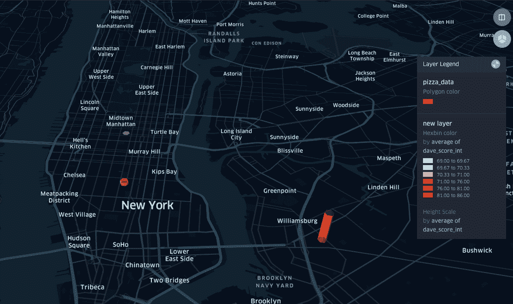
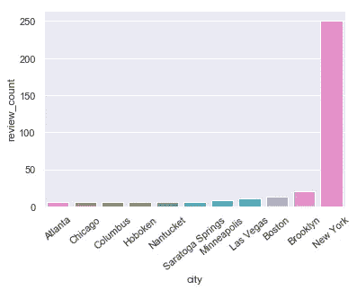
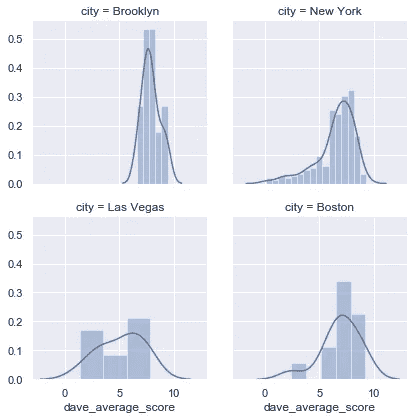
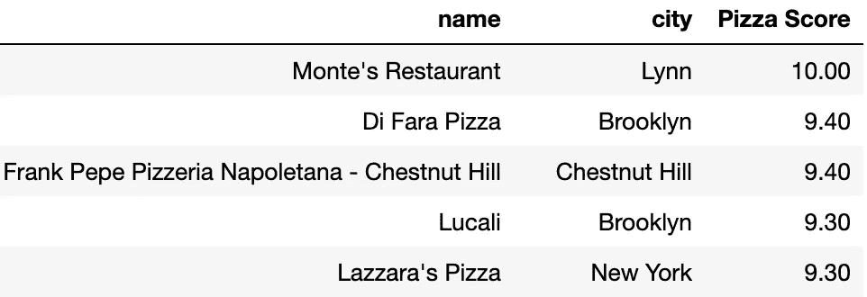
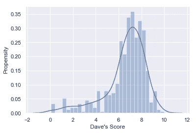
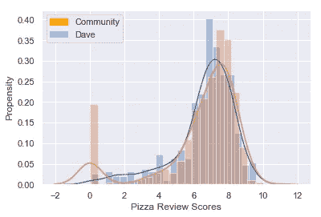

# 酒吧凳子的比萨饼数据中的冒险

> 原文：<https://towardsdatascience.com/adventures-in-barstools-pizza-data-9b8ae6bb6cd1?source=collection_archive---------6----------------------->

【想看更多数据科学项目？查看我的网站或我的 T2 推特

New York Pizza Reviews

今年 1 月，我搬到纽约，花了 6 个月时间从事非盈利性数据科学工作，但从未涉足 5 个行政区中的任何一个。这里的人们非常重视他们的比萨饼，所以我想在我被更高的租金和更差的比萨饼困住之前吃最好的。

这篇文章的其余部分是对纽约披萨数据的统计分析(从一个名为 Barstool 的网站上搜集来的)，其中包括逆向工程 API、有趣的地图和统计技术，我之前没有充分的理由去尝试这些技术。(如果您只想查看图表或玩玩地图，请向下滚动，直到看到另一张地图)。因为我在纽约的时间有限，所以我需要积极地进行优先排序。但当你在谷歌上搜索“纽约最好的披萨”，你要么会得到数千份由不同人评论的名单，要么你会在 Yelp 或 OpenTable 等网站上得到聚合的伪匿名评论。

但是这些选项没有一个能真正为高质量的评估工作。有没有更好的方法来思考这个问题？Yelp/OpenTable 的数据并不好，因为这些消费者只评论他们已经去过的餐厅，而平台本身[过滤掉了评论](https://marketingland.com/yelp-more-likely-to-filter-extreme-reviews-new-accounts-study-53622)。更不用说一个人的 4/5 星级很可能与另一个人的不一样，严重偏向聚合。没机会了。我可以汇总整理过的名单并寻找趋势，但在 Eataly 的名单上排名第四比在“纽约游客的冒险”博客上排名第一更重要吗？这并不清楚(如果可以的话，我宁愿不去搜索一百个不同的网站，老实说，大部分都是这样)。

最好的情况是，一个人不得不随机去一家比萨饼店，用足够精细的尺度来查看它，以获得概率密度。这样做足够多的次数会让我们明白一个 8.2/10 ***真正的*** 意味着什么。如果平均评论是 9.7/10，8.2 可能是垃圾，或者如果平均评论是 5/10，这可能是惊人的。

## 搜索

带着这个想法，我去寻找一个好的披萨评论数据集。我无意中发现了一个看似金矿的地方，酒吧凳子的戴夫·波特诺伊。戴夫每天都会评论纽约的一家披萨店，并将这些评论发布在 Instagram 和他们的移动应用 One Bite 上(如果你有时间，可以看看他们的一些评论，他们很热闹，但他们对披萨很认真)。我兴奋地给他们发电子邮件，要求查看他们的数据。但是，不出所料，他们不想让一个随机的数据科学家读取他们的数据库。我独自一人。

## 逆向工程

他们的披萨数据存放在两个地方，一个是在[的 Instagram](https://www.instagram.com/p/Bwc_r_Wh0JY7_o6E6bLBRcEVrpvSWG2An7hT8o0/) 上，另一个是他们的移动应用 One Bite(如下图所示)。

对于 Instagram 抓取，我可以雇佣土耳其机械工人来听每一条评论，并将其输入数据库，或者自己动手。鉴于有数百条评论，以及随之而来的明显的[伦理问题](https://www.theatlantic.com/business/archive/2018/01/amazon-mechanical-turk/551192/)，机械土耳其人不是一个选项。

如果我可以记录通过应用程序的 web 流量，并对他们的 API 进行逆向工程，会怎么样？我发现了一个名为 [charles](https://www.charlesproxy.com/) 的应用程序，它将 web 流量推送到 iPhone 上，以帮助应用程序开发人员更有效地调试。如果我可以将它用于稍微不同的目的，并在我使用该应用程序时通过查尔斯虹吸我的 iPhone 的网络流量，我可以尝试逆向工程他们的 API。事实证明，这非常有效(我们坐在制作互联网教程的巨人的肩膀上)。他们有一个[场馆端点](https://one-bite-api.barstoolsports.com/venue)，当点击它时，会返回惊人数量的数据，包括场馆的名称和位置，以及来自社区的分数，基本上可以读取他们的数据库。

端点的安全性极低，在服务器或设备端没有验证过程，并且可以基于位置、存储类型和数据中的任何其他特征进行查询。唯一的问题是端点最多返回 50 个位置，但我通过在美国随机生成 10，000 个位置并将其用作查询字符串的输入，成功获得了 463 条披萨评论，从而解决了这个问题。

## 数据

这些数据包罗万象。戴夫给这个地点的评论分数，社区的分数，披萨店的名字。甚至到应用程序中使用的缩略图的链接，以及到保存所有媒体的 AWS s3 存储桶的链接(仅供参考:这样做不是最好的主意)。最后。我在地理制图中需要的唯一缺失的字段是经度和纬度，所以我使用了 [Google maps 反向地理编码器](https://developers.google.com/maps/documentation/geocoding/start)来获取这些信息。我已经把所有的数据放在[这个 GitHub repo](https://github.com/tylerjrichards/Barstool_Pizza) 里，任何人都可以随意摆弄。

首先，我想弄清楚最好的披萨都聚集在哪里。纽约的某些地区比其他地区更擅长做披萨吗？我使用开普勒(优步的开源地理可视化框架)来获得得分最高的点评披萨店的聚类，并在这里托管了互动地图作为沙盒供任何人分析。在 NYU 和索霍区，以及布鲁克林的威廉斯堡，有一些非常棒的披萨店。

请随意在开普勒(或任何其他地方)内使用这些数据，可视化披萨数据真的很棒。

## 数据探索

在讨论数据分布的问题之前，我们的样本是从哪里生成的？假设评论大多来自口头推荐，单个人评论的绝对规模将有助于对披萨评论进行更细致的分析。

大量的披萨评论发生在纽约，仅在曼哈顿就有大约 250 条评论(另有 20 条左右来自布鲁克林，还有拉斯维加斯、迈阿密等地的少量评论)。其他城市甚至没有 20 个评论。如果我们通过评论数来看排名前几的城市，我们就会明白为什么大量的评论是判断质量的必要条件。

对于纽约，评论的数量足够高，开始接近比其他城市更容易识别的分布(这是较大样本的预期)。我猜想，每个城市都有自己的比萨饼质量的真实分布，一个小样本更可能有精选的例子，告诉我们实际质量很少。所有数据的中值审查得分为 7.1，标准偏差为 1.78。数据集中排名前五的披萨店中有三家在纽约，几周前，我去了最好的披萨店(Di Fara ),尽管要花两个小时才能吃到一片，但很值得。请参见下面的前 5 名。

## 8.1 有多好？

我的下一个问题有点技术性。披萨分数的潜在密度是多少？8.1 比 9.5 好多少？仅仅知道中间值是远远不够的。同样，我认为单个数据分数是真实质量感知分布的样本。然后，我用一个核密度估计器来估计这个概率密度函数。通俗地说，KDE 是一种不用做很多假设就能理解全部数据的方法。在这个数据中，我不想假设数据以任何一点为中心(比如说，假设大多数评论都在 5 左右)，或者它是均匀分布的。在 KDE 的博客上有一篇[优秀的博文](https://mathisonian.github.io/kde/)，它可能会给出比大多数大学课程更好的直觉，[的论文](https://arxiv.org/pdf/1704.03924.pdf)描述了这种方法。Scipy 有一个很好的方法来计算 KDE，并从中取样。

Fitting the Gaussian KDE

一旦我适应了这个密度，我就从中取样以获得一个更健壮的数据集。密度直方图如下。有了这个，我可以估计一个比萨饼店是否在纽约市的前 x%的位置，这比简单地从应用程序的数据中计数要重要得多。

Histogram of Pizza Reviews with KDE

该数据集还包括应用程序用户的比萨饼评级。我用和以前一样的方法来估计社区的密度，并把两者都画在下面。

该应用程序的用户倾向于遵循与 Portnoy 相同的密度，0 左右的评论明显更多(一堆苛刻的评论)，但也更多地高于中位数。这通常遵循我之前的假设，即评论者在他们的评论中更加两极分化。

## 鳍状物

这些数据同样很难获得，玩起来也很有趣，如果你对以上所做的任何事情有任何问题，请联系我，在 tylerjrichards@gmail.com 或者在[这里](http://www.tylerjrichards.com/)！

其他尚未完成但可能很有趣的项目是根据位置和价格预测披萨评论，为类似的披萨店创建推荐算法，以及根据地铁站绘制最近的披萨店地图。