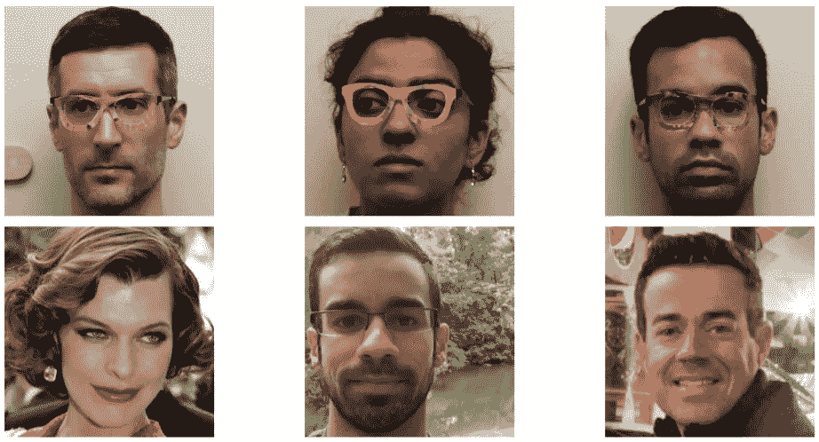

# 机器学习中的对抗性攻击及其防御

> 原文：<https://towardsdatascience.com/adversarial-attacks-in-machine-learning-and-how-to-defend-against-them-a2beed95f49c?source=collection_archive---------2----------------------->

## 刘玲教授在 2019 年 IEEE 大数据大会上的主题演讲笔记

ig 数据驱动的机器学习和深度学习已经在许多领域取得了令人印象深刻的进展。一个例子是 ImageNet 的发布，它由 22，000 个类别的 1，500 多万张带标签的高分辨率图像组成，彻底改变了计算机视觉领域。[最先进的模型](https://paperswithcode.com/sota/image-classification-on-imagenet)已经在 ImageNet 数据集上实现了 98%的前五名准确率，所以看起来这些模型是万无一失的，不会出错。

然而，对抗训练的最新进展发现，这是一种错觉。当面对对立的例子时，一个好的模型经常会出错。下图说明了这个问题:

Image taken from [https://towardsdatascience.com/breaking-neural-networks-with-adversarial-attacks-f4290a9a45aa](/breaking-neural-networks-with-adversarial-attacks-f4290a9a45aa)

该模型最初对熊猫图片进行了正确的分类，但当一些人类察觉不到的噪声注入到图片中时，模型的最终预测变为另一种动物长臂猿，即使有如此高的置信度。对我们来说，似乎最初的和改变的图像是相同的，尽管它与模型完全不同。这说明了这些对抗性攻击造成的威胁—我们可能没有察觉到差异，因此我们无法判断对抗性攻击是否发生。因此，尽管模型的输出可能会改变，但我们无法判断输出是正确还是不正确。

这形成了刘玲教授在 2019 年 IEEE 大数据大会上的主题演讲背后的动机，她在演讲中谈到了对抗性攻击的类型，对抗性例子是如何产生的，以及如何对抗这些攻击。事不宜迟，我将进入她的演讲的内容。

# 敌对攻击的类型

对抗性攻击分为两类——有针对性的攻击和无针对性的攻击。

目标攻击有一个目标类别 Y，它希望目标模型 M 将类别 X 的图像 I 分类为。因此，目标攻击的目标是通过预测敌对示例 I，使 M 误分类为预期的目标类别 Y 而不是真实的类别 x。另一方面，无目标攻击不具有它想要模型将图像分类为的目标类别。相反，目标仅仅是通过预测对立的例子 I 作为一个类，而不是原始类 x，来使目标模型错误分类。

研究人员发现，一般来说，虽然无针对性的攻击不如有针对性的攻击，但耗时要少得多。尽管有针对性的攻击在改变模型预测方面更成功，但这是有代价的(时间)。

# 对立的例子是如何产生的？

了解了有目标攻击和无目标攻击之间的区别后，我们现在来看看这些敌对攻击是如何进行的。在良性的机器学习系统中，训练过程寻求最小化目标标签和预测标签之间的损失，数学公式如下:

Image credits to Professor Lise Getoor taken from [https://users.soe.ucsc.edu/~getoor/Talks/IEEE-Big-Data-Keynote-2019.pdf](https://users.soe.ucsc.edu/~getoor/Talks/IEEE-Big-Data-Keynote-2019.pdf)

在测试阶段，对学习的模型进行测试，以确定它能够多好地预测预测的标签。然后，通过目标标签和预测标签之间的损失之和来计算误差，数学公式如下:

Image credits to Professor Lise Getoor taken from [https://users.soe.ucsc.edu/~getoor/Talks/IEEE-Big-Data-Keynote-2019.pdf](https://users.soe.ucsc.edu/~getoor/Talks/IEEE-Big-Data-Keynote-2019.pdf)

在对抗性攻击中，采取以下两个步骤:

1.  查询输入从良性输入 x 变为 x’。
2.  设定攻击目标，使得预测结果 H(x)不再是 y。损失从 *l* (H(x ᵢ)，y ᵢ)变为 *l* (H(x ᵢ)，y' ᵢ)其中 y' ᵢ ≠ y ᵢ.

## 对抗性干扰

将查询输入从 x 改变到 x’的一种方式是通过称为“对抗扰动”的方法，其中计算扰动，使得预测将与原始标签不同。对于图像，这可能以像素噪声的形式出现，正如我们在上面的熊猫例子中看到的那样。无目标攻击的单一目标是最大化 H(x)和 H(x’)之间的损失，直到预测结果不是 y(真实标签)。定向攻击还有一个额外的目标，即不仅最大化 H(x)和 H(x’)之间的损耗，而且最小化 H(x’)和 y’之间的损耗，直到 H(x’)= y’而不是 y。

对抗性扰动可以分为一步扰动和多步扰动。顾名思义，一步扰动只涉及一个阶段——添加一次噪声，仅此而已。另一方面，多步扰动是一种迭代攻击，每次都对输入进行小的修改。因此，单步攻击很快，但可能会添加过多的噪声，从而使人类更容易检测到这些变化。此外，它更重视 H(x)和 H(x’)之间损耗最大化的目标，而不太重视扰动量最小化。相反，多步攻击更具战略性，因为它每次都会引入少量扰动。然而，这也意味着这种攻击在计算上更加昂贵。

# 黑盒攻击与白盒攻击

现在我们已经了解了对抗性攻击是如何产生的，一些敏锐的读者可能会意识到这些攻击的一个基本假设，即攻击目标预测模型 H 是对手已知的。只有当目标模型已知时，才可以通过改变输入来折衷产生对立的例子。然而，攻击者并不总是知道或者能够访问目标模型。这听起来像是抵御这些敌对攻击者的万全之策，但事实是黑盒攻击也非常有效。

黑盒攻击基于对立示例的可转移性概念，即对立示例虽然是为了攻击代理模型 G 而生成的，但在攻击另一个模型 h 时可以取得令人印象深刻的结果。采取的步骤如下:

1.  攻击目标预测模型 H 是私人训练的，对手不知道。
2.  一个模仿 H 的代理模型 G 被用来产生对立的例子。
3.  利用对抗性例子的可转移性，可以发起黑盒攻击来攻击 h。

这种攻击可以在训练数据集已知或未知的情况下发起。在对手已知数据集的情况下，可以在与模型 H 相同的数据集上训练模型 G 来模仿 H。

然而，当训练数据集未知时，对手可以利用[成员推理攻击](https://www.cs.cornell.edu/~shmat/shmat_oak17.pdf)，从而训练一个攻击模型，其目的是将目标模型在训练输入上的行为与其在训练期间没有遇到的输入上的行为区分开。本质上，这变成了一个分类问题，以识别目标模型对其训练的输入和未训练的输入的预测之间的差异。这使得对手能够更好地了解训练模型 H 的训练数据集 D，使得攻击者能够基于真实的训练数据集生成影子数据集 S，以便训练替代模型 G。在 S 上训练 G，其中 G 模仿 H，S 模仿 D，然后可以对 H 发起黑盒攻击

# 黑盒攻击的例子

现在我们已经看到了黑盒攻击与白盒攻击的不同之处，因为目标模型 H 对于对手来说是未知的，我们将讨论黑盒攻击中使用的各种策略。

## 身体攻击

将查询输入从 x 改变为 x’的一种简单方法是简单地添加一些物理上的东西(例如亮色)来扰乱模型。一个例子是 CMU 的[研究人员如何在对面部识别模型的攻击中给一个人戴上眼镜。下图说明了这次攻击:](https://www.cs.cmu.edu/~sbhagava/papers/face-rec-ccs16.pdf)

Image taken from [https://www.cs.cmu.edu/~sbhagava/papers/face-rec-ccs16.pdf](https://www.cs.cmu.edu/~sbhagava/papers/face-rec-ccs16.pdf)

第一行图像对应于通过添加眼镜而修改的原始图像，第二行图像对应于作为预期的错误分类目标的模仿目标。仅仅通过在原始图像上添加眼镜，面部识别模型就被欺骗，将顶行的图像分类为底行的图像。

另一个例子来自谷歌的[研究人员，他们在输入图像中添加贴纸来改变图像的分类，如下图所示:](https://arxiv.org/pdf/1712.09665.pdf)

Image taken from [https://arxiv.org/pdf/1712.09665.pdf](https://arxiv.org/pdf/1712.09665.pdf)

这些例子显示了这种物理攻击是多么有效。

## 分发外(OOD)攻击

实施黑盒攻击的另一种方式是通过分发外(OOD)攻击。机器学习中的传统假设是，所有的训练和测试样本都是从**相同的**分布中独立抽取的。在 OOD 攻击中，通过向模型提供来自训练数据集的不同分布的图像来利用这种假设，例如，将 TinyImageNet 数据馈送到 CIFAR-10 分类器，这将导致具有高置信度的不正确预测。

# 如何才能信任机器学习？

既然我们已经看了各种类型的对抗性攻击，那么一个自然的问题就来了——如果我们的机器学习模型如此容易受到对抗性攻击，我们怎么能信任它们呢？

Chow 等人在 2019 年题为“[抗黑盒对抗性攻击的去噪和验证跨层集成](https://arxiv.org/pdf/1908.07667.pdf)”的论文中提出了一种可能的方法。该方法的核心是使机器学习系统能够自动检测敌对攻击，然后通过使用去噪和验证集成来自动修复它们。

## 去噪集成

首先，输入图像必须经过去噪集合，去噪集合尝试不同的方法来去除图像中的任何添加的噪声，例如添加高斯噪声。由于防御者不知道由对手添加到图像中的特定噪声，因此每次尝试去除每种类型的噪声时，都需要一组去噪器。

下图显示了去噪自动编码器的训练过程-原始图像被注入了攻击者可能注入的一些噪声，自动编码器尝试重建原始未损坏的图像。在训练过程中，目标是减少重建图像和原始图像之间的重建误差。

Image taken from [https://arxiv.org/pdf/1908.07667.pdf](https://arxiv.org/pdf/1908.07667.pdf)

通过开发这些自动编码器的集合，每个自动编码器被训练以去除特定类型的噪声，希望被破坏的图像将被充分去噪，使得它接近原始未被破坏的图像，以允许图像分类。

## 验证集成

在图像被去噪之后，它们然后经过验证集合，该验证集合检查由每个去噪器产生的每个去噪图像，然后对去噪图像进行分类。验证集成中的每个分类器对每个去噪图像进行分类，然后集成进行投票以确定图像所属的最终类别。这意味着尽管一些图像可能没有在去噪步骤中以正确的方式去噪，但是验证集合对所有去噪的图像进行投票，从而增加了做出更准确预测的可能性。

## 多样性

发现去噪器和验证器的多样性是非常重要的，因为首先，敌对攻击者将更善于改变图像，因此需要能够处理各种破坏图像的去噪器的多样性组。接下来，还需要验证器多样化，以便它们可以生成多种分类，这样敌对攻击者就很难操纵它们，就像他们如何设法操纵我们信任并在机器学习中频繁使用的普通分类器一样。

这仍然是一个悬而未决的问题，因为在各种验证者做出所有这些决定之后，仍然有一个最终决策者需要决定听取谁的意见。最终的决策者需要保持群体中的多样性，这并不是一件容易的事情。

# 结论

我们已经研究了各种类型的对抗性攻击，以及防御这些攻击的有希望的方法。当我们实现机器学习模型时，这绝对是要记住的事情。我们不应该盲目地相信模型会产生正确的结果，而是需要防范这些对抗性的攻击，并在接受这些模型做出的决定之前总是三思而行。

非常感谢刘教授就机器学习中的这个紧迫问题发表了富有启发性的主旨演讲！